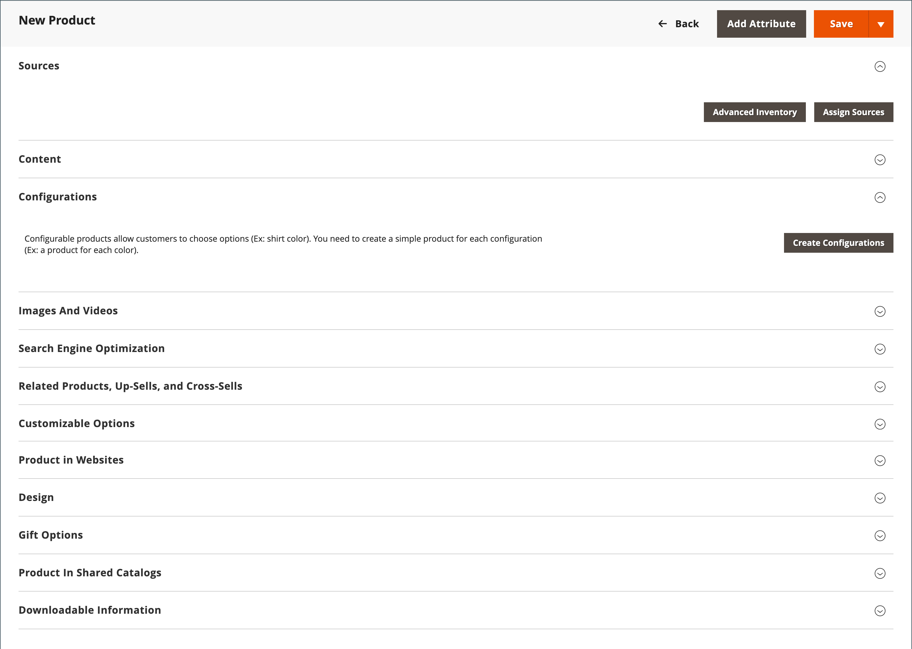

# 製品の作成

商品タイプを選択することは、商品を作成するために最初にしなければならないことのひとつです。 商品カタログを作成する前に、いくつかのサンプル商品を作成して、各商品タイプを試すことができます。 基本的な製品タイプに加えて、_複雑な製品_&#x200B;という用語は、様々な色やサイズで利用できる設定可能な製品など、複数のオプションを持つ製品を指す場合があります。

>[!NOTE]
>
>詳細については、カタログ [&#x200B; ナビゲーション &#x200B;](navigation.md)、設定方法[&#x200B; カテゴリ &#x200B;](categories.md)および[属性](product-attributes.md)、利用可能なカタログ [URL オプション &#x200B;](catalog-urls.md)を参照してください。 これらの概念を理解すると、カタログに多くの商品を追加する最も効率的な方法は、CSV ファイルから[&#x200B; インポート &#x200B;](../systems/data-import.md)することです。

{width="700" zoomable="yes"}

## 製品タイプ

**[シンプルな商品](product-create-simple.md)** – シンプルな商品は、単一のSKUを持つ物理的な商品です。 シンプルな商品には様々な価格設定と入力制御があり、商品のバリエーションを販売することが可能です。 シンプルな製品は、グループ化、バンドル、設定可能な製品と関連付けて使用できます。

**[設定可能な製品](product-create-configurable.md)** – 設定可能な製品は、各バリエーションのオプションのリストを含む単一の製品であるように見えます。 ただし、各オプションは個別のシンプルな商品と明確なSKUを表しているため、バリエーションごとに在庫を追跡することができます。

**[グループ化された製品](product-create-grouped.md)** - グループ化された製品は、複数のスタンドアロン製品をグループとして表示します。 単一の製品のバリエーションを提供したり、プロモーションのためにグループ化したりできます。 商品は個別またはグループで購入できます。

**[バーチャル製品](product-create-virtual.md)** – 仮想製品は有形製品ではなく、通常、サービス、メンバーシップ、保証、サブスクリプションなどの製品に使用されます。 バーチャル製品は、グループ化された製品やバンドル製品と関連付けて使用できます。

**[バンドル製品](product-create-bundle.md)** - バンドル製品を使用すると、お客様は一連のオプションから「独自の製品を作成」できます。 バンドルは、ギフトバスケット、コンピューター、またはカスタマイズ可能なその他の何でもかまいません。 バンドル内の各項目は、独立したスタンドアロン製品です。

**[ダウンロード可能な製品](product-create-downloadable.md)** - デジタル ダウンロード可能な製品は、ダウンロードされた1つ以上のファイルで構成されます。 ファイルはサーバー上に存在するか、他のサーバーへのURLとして提供できます。

**[ギフトカード](product-gift-card-create.md)** - （[Adobe Commerce](../landing/home.md#product-editions)のみ） 3種類のギフトカードがあります。 _バーチャル_ ギフトカードは電子メールで送信されます。 _物理_&#x200B;のギフトカードが受信者に発送されます。 _仮想ギフトカードと物理ギフトカードを組み合わせた_ ギフトカード。 それぞれに固有のコードがあり、チェックアウト時に利用できます。 ギフトカードは、グループ化された商品に含めることもできます。

## 製品設定

最も頻繁に使用される製品設定と属性は、ページの上部に表示され、続いてカスタム属性が表示されます。 その他の製品設定は、ページの下部にある拡張可能なセクションに記載されています。

{width="600" zoomable="yes"}

| 設定 | 説明 |
|--- |--- |
| [[!UICONTROL Sources]](../inventory-management/sources-assign-per-product.md) | （[[!DNL Inventory Management]](../inventory-management/introduction.md)が有効な場合）製品を配布できるソースを一覧表示します。 |
| [[!UICONTROL Content]](product-content.md) | ストアフロント製品ページに表示されるメイン製品の説明を入力および編集するために使用します。 |
| [[!UICONTROL Configurations]](product-configurations.md) | 製品の既存のバリエーションを一覧表示し、設定可能な製品タイプで使用するバリエーションを生成するために使用できます。 |
| [[!UICONTROL Product Reviews]](settings-advanced-product-reviews.md) | 顧客が製品に対して送信したすべてのレビューを一覧表示します。 |
| [[!UICONTROL Search Engine Optimization]](product-search-engine-optimization.md) | 検索エンジンが製品のインデックス作成に使用するURL キーとメタデータフィールドを指定します。 |
| [[!UICONTROL Related Products, Up-Sells, and Cross-Sells]](related-products-up-sells-cross-sells.md) | ストアフロントで、顧客が興味を持つ可能性のある追加商品を提示するシンプルなプロモーションブロックを設定するために使用されます。 |
| [[!UICONTROL Customizable Options]](settings-advanced-custom-options.md) | 製品にカスタマイズ可能なオプションを追加します。 |
| [[!UICONTROL Product in Websites]](settings-basic-websites.md) | ストア階層に従って、製品が使用可能な各web サイトを識別します。 |
| [[!UICONTROL Design]](settings-advanced-design.md) | 製品ページへの別のテーマの適用、列レイアウトの変更、製品オプションの表示場所の決定、カスタム XML コードの入力に使用します。 |
| [[!UICONTROL Gift options]](product-gift-options.md) | 商品レベルでのチェックアウト時に、ギフトメッセージオプションを有効または無効にするために使用します。 |
| [[!UICONTROL Product In Shared Catalogs]](../b2b/catalog-shared.md) |  （[Adobe Commerce B2B](../b2b/introduction.md)でのみ利用可能）異なる企業向けのカスタム価格設定を使用して、共有カタログを管理できます。 |
| [[!UICONTROL Downloadable Information]](product-create-downloadable.md#step-5-complete-the-downloadable-information) | 製品のダウンロード用のパラメーターを定義するために使用します。 |

{style="table-layout:auto"}

## 高度な価格設定と在庫管理

価格と在庫の詳細な設定にアクセスするには、**[!UICONTROL Price]**&#x200B;と&#x200B;**[!UICONTROL Quantity]**&#x200B;の下にあるリンクをクリックします。 詳しくは、[価格の管理](pricing-advanced.md)および[Inventory management](../inventory-management/introduction.md)を参照してください。
