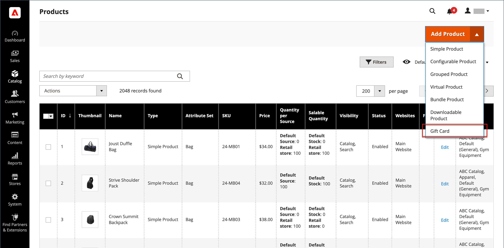

# ギフトカード製品

{{ee-feature}}

各ギフトカードには一意のコードがあり、チェックアウト時に 1 人のお客様のみが利用できます。 ギフト カードを販売するには、[ コード プール ](../stores-purchase/product-gift-card-accounts.md#step-3-establish-the-gift-card-code-pool) を確立する必要があります。 買い物かご内でのギフトカードの引き換え方法については、[ ギフトカードワークフロー ](../stores-purchase/product-gift-card-workflow.md) を参照してください。

{width="700" zoomable="yes"}

ギフトカード製品には次の 3 種類があります。

- **仮想** – 仮想ギフトカードが受信者のメールアドレスに送信されます。このアドレスは、ギフトカードの購入時に必要になります。 配送先住所は必須ではありません。

- **物理的** – 物理的なギフトカードは、受取人の住所に発送されます。これは、ギフトカードの購入時に必要になります。

- **組み合わせ** – 組み合わせギフトカードが出荷され、受信者にメールで送信されます。 ギフトカードの購入時には、受取人のメールアドレスと配送先住所が必要です。

## ギフトカード製品の作成

次の手順は、[ 製品テンプレート ](attribute-sets.md)、必須フィールド、基本設定を使用してギフトカードを作成するプロセスを示しています。 各必須フィールドには、赤いアスタリスク（`*`）が付いています。 基本を完了したら、必要に応じて他の製品設定を完了できます。

### 手順 1：製品タイプの選択

1. _管理者_ サイドバーで、**[!UICONTROL Catalog]**/**[!UICONTROL Products]** に移動します。

1. _[!UICONTROL Add Product]_ージの右上隅（{width="25"}  ） メニューから、「**[!UICONTROL Gift Card]**」を選択します。

   {width="700" zoomable="yes"}

### 手順 2：属性セットの選択

デフォルトの `Gift Card` 属性セットを使用するか、別の属性セットを選択できます。 製品のテンプレートとして使用する属性セットを選択するには、次のいずれかの操作を行います。

- 「**[!UICONTROL Attribute Set]**」フィールドをクリックし、属性セット名の全部または一部を入力します。

- 表示されたリストで、使用する属性セットを選択します。

{width="600" zoomable="yes"}

### 手順 3：必要な設定を完了する

1. ギフト カードの **[!UICONTROL Product Name]** を入力します。

   また、名前にギフトカードのタイプを指定することもできます。 例えば、_Luma 仮想ギフトカード_ です。

1. 商品の **[!UICONTROL SKU]** を入力します。

   デフォルトでは、製品名がデフォルトの SKU として使用されます。

1. **[!UICONTROL Card Type]** を次のいずれかに設定します。

   - `Virtual` – 仮想ギフトカードは、メールで受信者に配信されます。
   - `Physical` – 物理的なギフトカードは事前に大量生産され、一意のコードでエンボス加工することができます。
   - `Combined` – 組み合わせギフトカードは、仮想と物理の両方のギフトカードの特性を持っています。

   {width="600" zoomable="yes"}

1. 顧客に固定金額の選択を提供するには、「**[!UICONTROL Add Amount]**」をクリックし、カードの最初の固定値を小数として入力します。

   固定金額の選択を入力するには、それぞれについて、この手順を繰り返します。

1. お客様がギフトカードの値を設定できるようにするには、次の手順を実行します。

   - **[!UICONTROL Open Amount]** を `Yes` に設定します。

   - 許容される最小値と最大値の範囲を定義するには、**[!UICONTROL Open Amount From]** 値と **[!UICONTROL To]** 値を入力します。

   固定価格、オープン金額価格、またはその両方でギフト カードを作成できます。

   >[!NOTE]
   >
   >ギフトカード製品は、カタログに独自の価格がありません。 ギフトカード価格は、購入中に選択されたギフトカード金額から導出される。

   {width="600" zoomable="yes"}

### 手順 4：基本設定を完了する

1. 物理的または組み合わせギフトカードの場合は、在庫の **[!UICONTROL Quantity]** を入力します。

1. 出荷するギフト カードの場合は、パッケージの **[!UICONTROL Weight]** を入力します。

1. 「**[!UICONTROL Categories]**」フィールドで「`Gift Card`」を選択します。

製品を説明する追加の個人属性が存在する場合があります。 選択によってアトリビュート セットが異なり、後で完成させることができます。

### 手順 5: ギフト カード情報を入力する

製品設定の _[!UICONTROL Gift Card Information]_セクションは、カードの管理方法を決定する [ ギフトカード設定 ](../configuration-reference/sales/gift-cards.md) 設定を上書きするために使用できます。

1. _[!UICONTROL Gift Card Information]_セクションまで下にスクロールします。

   このセクションのデフォルト設定は、システム設定によって決まります。

   {width="600" zoomable="yes"}

1. ギフトカードの機能に応じて、追加のフィールドを変更します。

   - **[!UICONTROL Treat Balance as Store Credit]** – 残高を店舗クレジットとしてギフトカード所有者が引き換えることができるかどうかを決定します。

   - **[!UICONTROL Lifetime (days)]** - ギフトカードの有効期限が切れるまでの購入後の日数を指定します。 カードの有効期限を設定しない場合は、このフィールドを空白のままにします。

   - **[!UICONTROL Allow Message]** - ギフトカードの購入者が受信者へのメッセージを入力できるかどうかを決定します。 ギフトメッセージは、仮想（電子メール）と物理（出荷済み）の両方のギフトカードに含めることができます。

   - **[!UICONTROL Email Template]** - ギフトカードの受信者に送信される通知に使用するメールテンプレートを決定します。

### 手順 6：製品情報の入力

必要に応じて、以下の節の情報を入力します。

- [コンテンツ](product-content.md)
- [画像とビデオ](product-images-and-video.md)
- [関連製品、アップセルおよびクロスセル](related-products-up-sells-cross-sells.md)
- [検索エンジンの最適化](product-search-engine-optimization.md)
- [カスタマイズ可能なオプション](settings-advanced-custom-options.md)
- [Web サイトの製品](settings-basic-websites.md)
- [デザイン](settings-advanced-design.md)
- [ギフトオプション](product-gift-options.md)

### 手順 7：商品のPublish

1. カタログに製品を公開する準備が整ったら、「**製品を有効にする** スイッチを `Yes` に設定します。

1. 次のいずれかの操作を行います。

   **方法 1:** 保存とプレビュー

   - 右上隅の「**[!UICONTROL Save]**」をクリックします。

   - ストアで製品を表示するには、_管理者_ （） メニューの **[!UICONTROL Customer View]** を選択します。

   {width="600" zoomable="yes"}

   **方法 2:** 保存して閉じる

   _[!UICONTROL Save]_（メニュー矢印 {width="25"} 「**[!UICONTROL Save & Close]**」を選択します。

## 注意事項

- ギフトカードを販売する前に、一意の番号の _コードプール_ を生成する必要があります。

- ギフト カードは `Redeemable` または `Non-Redeemable` に設定できます。

- ギフトカードの購入中は、ギフトカードに税金は **_適用されません_**。 税金は、購入したギフトカードが製品の購入に使用された場合にのみ適用されます。

- ギフト カードの有効期間は、無制限にすることも、指定した日数に設定することもできます。

- ギフトカードの値は、固定金額に設定することも、最小値と最大値を持つオープン金額に設定することもできます。

- ギフトカード製品は、カタログに独自の価格がありません。 ギフトカード価格は、購入中に選択されたギフトカード金額から導出される。

- 顧客のギフト カード アカウントは、注文時または請求書の時点で作成できます。
