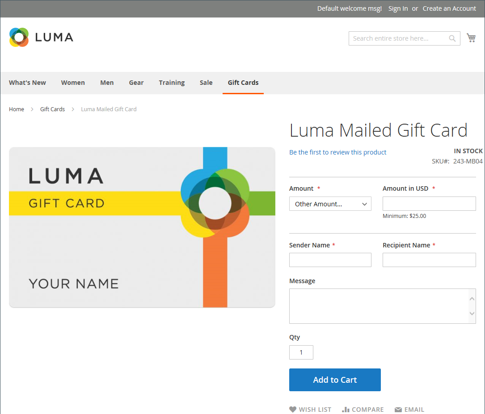
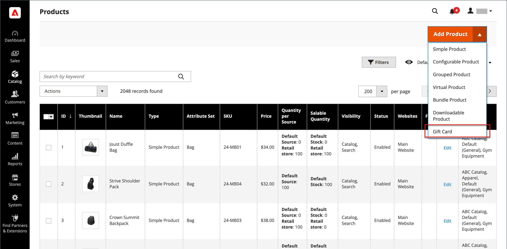
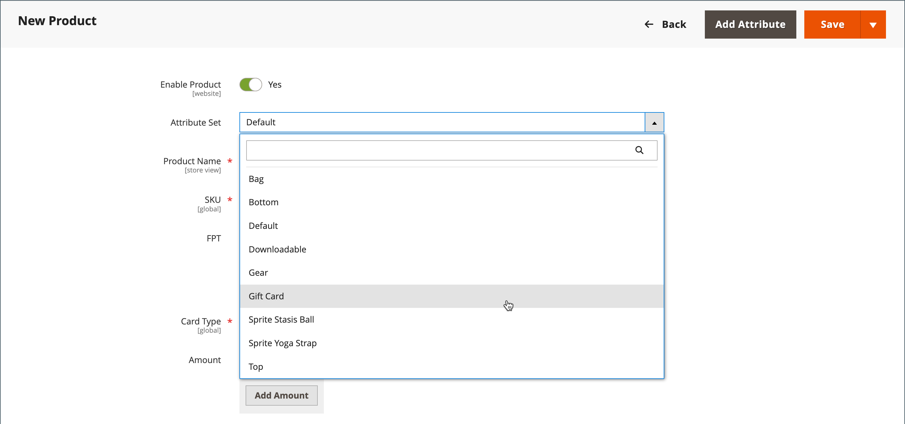
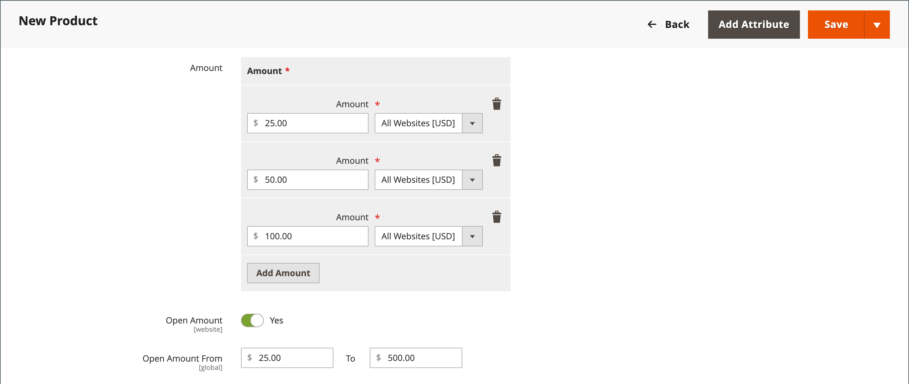

# ギフトカード商品

{{ee-feature}}

各ギフトカードには一意のコードがあり、チェックアウト時に1人のお客様のみが利用できます。 ギフトカードを販売するには、[&#x200B; コードプール &#x200B;](../stores-purchase/product-gift-card-accounts.md#step-3-establish-the-gift-card-code-pool)を設定する必要があります。 ショッピングカートでのギフトカードの利用方法について詳しくは、[&#x200B; ギフトカードワークフロー](../stores-purchase/product-gift-card-workflow.md)を参照してください。

{width="700" zoomable="yes"}

ギフトカード商品には3種類あります。

- **仮想** – 仮想ギフトカードは、ギフトカードの購入時に必要な受信者の電子メールアドレスに送信されます。 配送先住所は不要です。

- **物理** – 物理的なギフトカードは、ギフトカードの購入時に必要な受信者の住所に配送されます。

- **組み合わせ** – 組み合わせギフトカードが発送され、受信者に電子メールで送信されます。 ギフトカードの購入時には、受信者のメールアドレスと配送先住所が必要です。

## ギフトカード商品の作成

次の手順では、[製品テンプレート &#x200B;](attribute-sets.md)、必須フィールド、および基本設定を使用してギフトカードを作成するプロセスを説明します。 各必須フィールドには、赤いアスタリスク （`*`）が付いています。 基本的な設定が完了したら、必要に応じて他の製品設定を完了できます。

### 手順1：商品タイプの選択

1. _管理者_ サイドバーで、**[!UICONTROL Catalog]** > **[!UICONTROL Products]**&#x200B;に移動します。

1. _[!UICONTROL Add Product]_（{width="25"}）メニューの右上隅にある「**[!UICONTROL Gift Card]**」を選択します。

   {width="700" zoomable="yes"}

### 手順2：属性セットの選択

デフォルトの`Gift Card`属性セットを使用するか、別の属性を選択できます。 製品のテンプレートとして使用される属性セットを選択するには、次のいずれかの操作を行います。

- **[!UICONTROL Attribute Set]** フィールドをクリックし、属性セットの名前の全部または一部を入力します。

- 表示されるリストで、使用する属性セットを選択します。

{width="600" zoomable="yes"}

### 手順3：必要な設定を完了する

1. ギフトカードの&#x200B;**[!UICONTROL Product Name]**&#x200B;を入力します。

   また、名前にギフトカードの種類を記載することもできます。 例えば、_Luma Virtual Gift Card_&#x200B;とします。

1. 製品の&#x200B;**[!UICONTROL SKU]**&#x200B;を入力してください。

   デフォルトでは、製品名がデフォルトのSKUとして使用されます。

1. **[!UICONTROL Card Type]**&#x200B;を次のいずれかに設定します：

   - `Virtual` – 仮想ギフトカードは電子メールで受信者に配信されます。
   - `Physical` – 物理的なギフトカードは、事前に大量生産し、独自のコードでエンボス加工することができます。
   - `Combined` – 組み合わせたギフトカードには、仮想ギフトカードと物理的なギフトカードの両方の特徴があります。

   {width="600" zoomable="yes"}

1. お客様に固定金額の選択肢を提供するには、**[!UICONTROL Add Amount]**&#x200B;をクリックし、カードの最初の固定値を10進数として入力します。

   固定金額の選択を入力するには、各金額に対してこの手順を繰り返します。

1. 顧客がギフトカードの値を設定できるようにするには、次の操作を行います。

   - **[!UICONTROL Open Amount]**&#x200B;を`Yes`に設定します。

   - 最小値と最大値の範囲を定義するには、**[!UICONTROL Open Amount From]**&#x200B;と&#x200B;**[!UICONTROL To]**&#x200B;の値を入力します。

   固定価格、オープン金額価格、またはその両方のギフトカードを作成できます。

   >[!NOTE]
   >
   >ギフトカード商品は、カタログに独自の価格はありません。 ギフトカードの価格は、購入時に選択したギフトカードの金額から算出されます。

   {width="600" zoomable="yes"}

### 手順4：基本設定を完了する

1. 物理的または複合ギフトカードの場合は、在庫のある&#x200B;**[!UICONTROL Quantity]**&#x200B;を入力します。

1. 発送するギフトカードがある場合は、パッケージの&#x200B;**[!UICONTROL Weight]**&#x200B;を入力します。

1. **[!UICONTROL Categories]** フィールドで、`Gift Card`を選択します。

商品を表す個々の属性が追加されている場合があります。 選択範囲は属性セットによって異なり、後で完了できます。

### ステップ 5：ギフトカード情報を完了する

製品設定の&#x200B;_[!UICONTROL Gift Card Information]_&#x200B;セクションを使用して、カードの管理方法を決定する[&#x200B; ギフトカード設定](../configuration-reference/sales/gift-cards.md)設定を上書きできます。

1. _[!UICONTROL Gift Card Information]_&#x200B;セクションまでスクロールします。

   このセクションのデフォルト設定は、システム設定によって決まります。

   {width="600" zoomable="yes"}

1. ギフトカードを機能させる方法に応じて、追加のフィールドを変更します。

   - **[!UICONTROL Treat Balance as Store Credit]** - ギフトカード所有者が残高をストアクレジットとして引き換えることができるかどうかを指定します。

   - **[!UICONTROL Lifetime (days)]** - ギフトカードが期限切れになるまでの購入後の日数を指定します。 カードの有効期間の制限を設定しない場合は、このフィールドを空白のままにします。

   - **[!UICONTROL Allow Message]** - ギフトカードの購入者が受信者にメッセージを入力できるかどうかを指定します。 ギフトメッセージは、バーチャルギフトカード（電子メール）と物理的な（発送）ギフトカードの両方に含めることができます。

   - **[!UICONTROL Email Template]** - ギフトカードの受信者に送信される通知に使用される電子メールテンプレートを決定します。

### 手順6：製品情報の入力

必要に応じて、次の節の情報を入力します。

- [コンテンツ](product-content.md)
- [画像とビデオ](product-images-and-video.md)
- [関連商品、アップセル、クロスセル](related-products-up-sells-cross-sells.md)
- [検索エンジン最適化](product-search-engine-optimization.md)
- [カスタマイズ可能なオプション](settings-advanced-custom-options.md)
- [Web サイト内の商品](settings-basic-websites.md)
- [デザイン](settings-advanced-design.md)
- [ギフトオプション](product-gift-options.md)

### 手順7：製品の公開

1. カタログで製品を公開する準備ができたら、**製品を有効にする** スイッチを`Yes`に設定します。

1. 次のいずれかの操作を行います。

   **方法1:**&#x200B;保存とプレビュー

   - 右上隅の「**[!UICONTROL Save]**」をクリックします。

   - ストア内の商品を表示するには、_管理者_ （）メニューで&#x200B;**[!UICONTROL Customer View]**&#x200B;を選択します。

   {width="600" zoomable="yes"}

   **方法2:**&#x200B;保存して閉じる

   _[!UICONTROL Save]_（{width="25"}）メニューで、**[!UICONTROL Save & Close]**&#x200B;を選択します。

## 覚えておくべきこと

- ギフトカードを販売する前に、一意の番号の&#x200B;_コードプール_&#x200B;を生成する必要があります。

- ギフトカードは`Redeemable`または`Non-Redeemable`に設定できます。

- ギフトカード購入時にギフトカードに税金が&#x200B;**_適用されません_**。 税金は、購入したギフトカードが製品を購入するために使用される場合にのみ、製品に適用されます。

- ギフトカードの有効期間は、無制限にすることも、指定された日数に設定することもできます。

- ギフトカードの価値は、固定額に設定することも、最小値と最大値で開封額に設定することもできます。

- ギフトカード商品は、カタログに独自の価格はありません。 ギフトカードの価格は、購入時に選択したギフトカードの金額から算出されます。

- お客様のギフトカードのアカウントは、注文が行われた場合、または請求書の作成時に作成できます。
