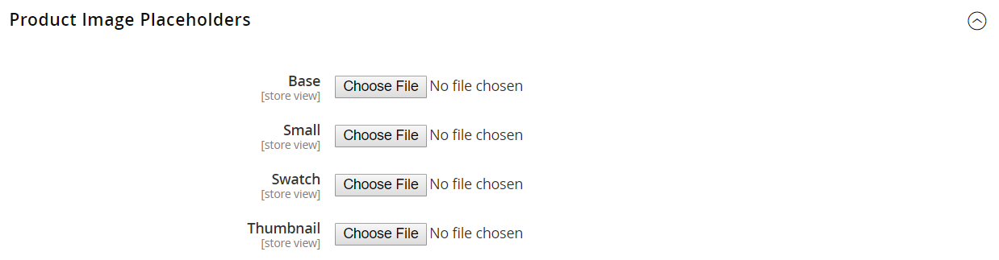

# 製品画像設定

_[!UICONTROL Product Details]_&#x200B;ページで表示するために大きな画像をアップロードする場合は、最大ピクセルサイズ（幅と高さ）を設定し、アップロード時にファイルのサイズを自動的に変更することをお勧めします。 この種類の製品画像のアップロードをサポートするには、アップロード時に大きな画像ファイルのサイズを自動的に変更するオプションがあります。 カタログに追加する製品で、表示する画像アセットがまだない場合は、プレースホルダー画像を設定できます。

## 製品画像のサイズ変更

製品画像をアップロードする際に、様々なサイズの大きな画像を追加して、_[!UICONTROL Product Details]_&#x200B;ページで詳細で高品質なズームを提供することができます。 すべての画像のサイズと外観が同じであることを確認するには、すべての画像が特定のピクセルサイズに一致するように、画像リサイズオプションを使用します。 このオプションを使用すると、すべての製品画像のサイズが自動的に変更されます。これは、ズームのパフォーマンス、画像の読み込みの高速化、製品画像の統一感の維持に役立ちます。

>[!NOTE]
>
>最適な互換性を得るには、`sRGB` カラープロファイルを持つすべての製品画像をアップロードすることをお勧めします。 他のすべてのカラープロファイルは、製品画像のアップロード中に自動的に`sRGB` カラープロファイルに変換されます。これにより、アップロードされた画像で色の一貫性が失われる可能性があります。

最大ピクセル幅と高さを設定すると、画像のサイズがピクセル単位で物理サイズに変更されます。 Commerceでは、縦横比を維持しながら、幅または高さの高さに応じて画像のサイズを変更します。 JPG画像の画質を下げると、ファイルサイズが小さくなります。

例えば、100%の3000 x 2100 ピクセルのJPGは、5 mb以上の画像ファイルにすることができます。 この画像のサイズを変更すると、幅が1920 ピクセルに縮小され、縦横比が維持され、画質が80%に縮小され、ファイルサイズが大幅に小さくなり、高品質になります。

### 画像のサイズ変更を有効にする

1. _管理者_ サイドバーで、**[!UICONTROL Stores]** > _[!UICONTROL Settings]_>**[!UICONTROL Configuration]**&#x200B;に移動します。

1. 左側のパネルで、**[!UICONTROL Advanced]**&#x200B;を展開し、**[!UICONTROL System]**&#x200B;を選択します。

1. _画像のアップロード設定_ セクションのを展開します。

   デフォルト設定を変更するには、必要に応じて&#x200B;**[!UICONTROL Use system value]** チェックボックスの選択を解除します。

   {width="600" zoomable="yes"}

   これらの設定設定の詳細なリストについては、_設定リファレンス_&#x200B;の&#x200B;[_画像アップロード設定_](../configuration-reference/advanced/system.md#image-upload-configuration)&#x200B;を参照してください。

1. 有効にするには、**[!UICONTROL Enable Frontend Resize]**&#x200B;が`Yes`に設定されていることを確認してください。

1. **[!UICONTROL Quality]**&#x200B;の設定を`1`から`100`%の間で入力してください。

   ファイルサイズを小さくして高品質にするには、80 ～ 90%の設定をお勧めします。

1. 画像の&#x200B;**[!UICONTROL Maximum Width]**&#x200B;をピクセル単位で設定します。

   画像のサイズを変更しても、この幅を超えず、縦横比が保持されます。

1. 画像の&#x200B;**[!UICONTROL Maximum Height]**&#x200B;をピクセル単位で設定します。

   画像のサイズを変更しても、この高さを超えず、縦横比が保持されます。

1. 完了したら、**[!UICONTROL Save Config]**&#x200B;をクリックします。

### フィールドの説明

| フィールド | [範囲](../getting-started/websites-stores-views.md#scope-settings) | 説明 |
|--- |--- |--- |
| [!UICONTROL Quality] | グローバル | サイズ変更された画像のJPG画質を指定します。 画質を下げると、ファイルサイズが小さくなります。 高品質でファイルサイズを縮小するには、80 ～ 90%をお勧めします。 デフォルト：80 |
| [!UICONTROL Enable Frontend Resize] | グローバル | Commerceで、_[!UICONTROL Product Details]_&#x200B;ページ用にアップロードできる大きくて大きすぎる画像のサイズを変更できます。 Commerceでは、ファイルをアップロードする際に、JavaScriptを使用して画像ファイルのサイズを変更します。 画像のサイズを変更すると、最大幅または最大高さに対して最大サイズを超えないように、正確な比率が維持されます。 既定：`Yes` |
| [!UICONTROL Maximum Width] | グローバル | 画像の最大ピクセル幅を指定します。 画像のサイズを変更しても、この幅を超えることはありません。 既定：`1920` |
| [!UICONTROL Maximum Height] | グローバル | 画像の最大ピクセル高さを指定します。 画像のサイズを変更しても、この高さを超えることはありません。 既定：`1200` |

{style="table-layout:auto"}

## 画像プレースホルダー

Adobe CommerceとMagento Open Sourceは、永続的な商品画像が利用可能になるまで、一時的な画像をプレースホルダーとして使用します。 役割ごとに異なるプレースホルダーをアップロードできます。 最初のプレースホルダー画像はサンプルロゴで、任意の画像に置き換えることができます。

{width="600" zoomable="yes"}

**_プレースホルダー画像をアップロードするには:_**

1. _管理者_ サイドバーで、**[!UICONTROL Stores]** > _[!UICONTROL Settings]_>**[!UICONTROL Configuration]**&#x200B;に移動します。

1. 左側のパネルで「**[!UICONTROL Catalog]**」を展開し、下の「**[!UICONTROL Catalog]**」を選択します。

1. **[!UICONTROL Product Image Placeholders]** セクションのを展開します。

   {width="600" zoomable="yes"}

   これらの設定設定の詳細なリストについては、_設定リファレンス_&#x200B;の&#x200B;[_製品の画像プレースホルダー_](../configuration-reference/catalog/catalog.md#product-image-placeholders)&#x200B;を参照してください。

1. 画像の役割ごとに、**[!UICONTROL Choose File]**&#x200B;をクリックし、コンピューター上の画像を見つけて、ファイルをアップロードします。

   3つの役割すべてに同じ画像を使用することも、役割ごとに異なるプレースホルダー画像をアップロードすることもできます。

1. 完了したら、**[!UICONTROL Save]**&#x200B;をクリックします。

画像の役割と推奨サイズについて詳しくは、[画像のアップロード &#x200B;](product-image.md#upload-an-image)を参照してください。
