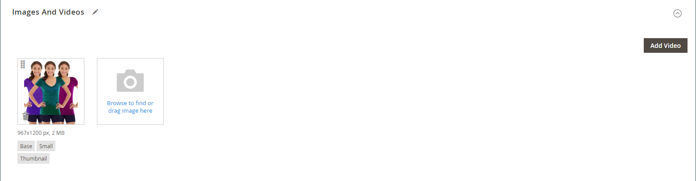

# 製品画像およびビデオの管理

各製品について、複数の画像やビデオをアップロードし、順序を並べ替えて、それぞれの使用方法を制御できます。 管理する画像が大量にある場合は、個別にアップロードするのではなく、1 つのバッチとして読み込んだ方がよいでしょう。 詳しくは、[ 製品画像の読み込み ](../systems/data-import-product-images.md) を参照してください。

_[!UICONTROL Product Details]_ページに表示する大きな画像をアップロードする場合は、最大ピクセルサイズ（幅と高さ）を設定し、アップロード時にファイルのサイズを自動的に変更することを検討してください。 アップロード時に、大きな画像ファイルの自動サイズ変更を有効にするオプションがあります。 詳しくは、[ 製品画像のサイズ変更 ](product-image-config.md#product-image-resizing) を参照してください。

## 製品画像の更新

1. 製品を編集モードで開きます。

1. 特定のストア表示を操作するには、左上隅の **[!UICONTROL Store View]** 選択を該当するビューに設定します。

   >[!NOTE]
   >
   >新しい製品画像は **_常に_** アップロードされ、`All Store Views` の範囲がアップロードに使用されない場合でも **_すべて_** ストアビューに表示されます。    特定のストア表示で製品画像を非表示にするには、そのストア表示に切り替え、画像の「**[!UICONTROL Hide from Product Page]**」チェックボックスをオンにして、「**[!UICONTROL Save]**」をクリックする必要があります。

1. 下にスクロールして、「_[!UICONTROL Images and Videos]_」セクションを展開します。

### 画像をアップロード

最高の互換性を得るには、`sRGB` のカラープロファイルを使用してすべての製品画像をアップロードすることをお勧めします。 その他のすべてのカラープロファイルは、製品画像のアップロード中に `sRGB` カラープロファイルに自動的に変換されるので、アップロードされた画像のカラーが一貫しない場合があります。

画像ファイル名の長さは、拡張子を含めて 90 文字以下にする必要があります。

画像をアップロードするには、次のいずれかの操作を行います。

- デスクトップから画像をドラッグし、_[!UICONTROL Images And Videos]_ールボックスの_ カメラ _（）タイルにドロップします。

- _[!UICONTROL Images And Videos]_ボックスで、_ カメラ _（） タイルをクリックし、コンピューター上の画像ファイルを選択して、「**[!UICONTROL Open]**」をクリックします。

  {width="600" zoomable="yes"}

### 画像の並べ替え

ギャラリー内の画像の順序を変更するには、画像タイルの下部にある _[!UICONTROL Sort]_（並べ替えアイコン  画像を画像ボックス内の別の位置にドラ_[!UICONTROL Images And Videos]_ グします。

{width="600" zoomable="yes"}

### 画像の削除

ギャラリーから画像を削除するには、画像タイルの右上隅にある **[!UICONTROL Delete]** （ごみ箱アイコン ](../assets/icon-delete-trashcan.png) ![ アイコンをクリックし、「**[!UICONTROL Save]**」をクリックします。

### 画像の詳細を設定

詳細表示で開くイメージをクリックし、次のいずれかの操作を行います。

{width="600" zoomable="yes"}

詳細ビューを閉じるには、右上隅にある _閉じる_ （）アイコンをクリックします。

完了したら、「**[!UICONTROL Save]**」をクリックします。

#### 代替テキストを入力

画像の代替テキストは、Web アクセシビリティを向上させるためにスクリーンリーダーによって参照され、サイトのインデックス作成時には検索エンジンによって参照されます。 一部のブラウザーでは、マウスポインターを置くと代替テキストが表示されます。 代替テキストは複数の単語に対応しており、選択したキーワードが含まれます。

「_[!UICONTROL Alt Text]_」ボックスに、画像の簡単な説明を入力します。

#### 役割の割り当て

デフォルトでは、製品にアップロードされた最初の画像にすべての役割が割り当てられます。 別の画像に役割を再割り当てするには、次の手順を実行します。

_[!UICONTROL Role]_ボックスで、画像に割り当てる役割を選択します。

「_画像とビデオ_」セクションに戻ると、現在割り当てられている役割が各画像の下に表示されます。

{width="600" zoomable="yes"}

#### 画像を非表示

サムネールギャラリーから画像を除外するには、「**[!UICONTROL Hidden]**」チェックボックスをオンにして「**[!UICONTROL Save]**」をクリックします。

{width="600" zoomable="yes"}

## 画像の役割

| 画像の役割 | 説明 |
|--- |--- |
| [!UICONTROL Thumbnail] | サムネール画像は、サムネールギャラリー、買い物かごおよび関連項目などの一部のブロックに表示されます。 サンプルサイズ：50 x 50 ピクセル |
| [!UICONTROL Small Image] | この小さな画像は、カテゴリページや検索結果ページのリストの製品画像に使用され、アップセル、クロスセル、新製品リストなどのセクションに必要な製品画像を表示します。 サンプルサイズ：470 x 470 ピクセル |
| [!UICONTROL Base Image] | ベース画像は、製品の詳細ページのメイン画像です。 画像コンテナよりも大きい画像をアップロードすると、画像ズームがアクティブになります。 達成するズームレベルに応じて、基本画像はコンテナのサイズの 2 倍または 3 倍にする必要があります。 サンプルサイズ：470 x 470 ピクセル（ズームなし）、1100 x 1100 ピクセル（ズーム付き） |
| [!UICONTROL Swatch] | [ スウォッチ ](swatches.md) を使用して、カラー、パターンまたはテクスチャを示すことができます。 サンプルサイズ：50 x 50 ピクセル |

{style="table-layout:auto"}

## 透かし

あなたが自分のオリジナル製品イメージを作成する費用に行くなら、悪質な競合他社がマウスをクリックしてそれらを盗むのを防ぐためにあなたができることはあまりありません。 ただし、各画像に透かしを配置してプロパティとして識別することで、画像の魅力を低下させることができます。 透かしファイルは、JPG（JPEG）、GIF、PNG 画像のいずれかになります。 GIFと PNG ファイルタイプはどちらも透明レイヤーをサポートしており、透かしに透明な背景を与えるために使用できます。

次の例の _small_ 画像に使用される透かしは、背景が透明な黒いロゴで、次の設定で PNG ファイルとして保存されています。

- サイズ：50x50
- 不透明度：5
- 位置：タイル

{width="700" zoomable="yes"}

### 製品画像への透かしの追加

1. _管理者_ サイドバーで、**[!UICONTROL Content]**/_[!UICONTROL Design]_/**[!UICONTROL Configuration]**に移動します。

   デザイン設定について詳しくは、「[ デザイン設定 ](../content-design/configuration.md)」を参照してください。

1. 設定するストア表示を見つけ、_[!UICONTROL Action]_列の&#x200B;**[!UICONTROL Edit]**をクリックします。

1. 「_[!UICONTROL Other Settings]_」の下の「展開セレクター ![ 「**[!UICONTROL Product Image Watermarks]**」セクション ](../assets/icon-display-expand.png) を展開します。

   {width="600" zoomable="yes"}

   **[!UICONTROL Base]**、**[!UICONTROL Thumbnail]**、**[!UICONTROL Small]**、**[!UICONTROL Swatch Image]** の画像設定は同じです。

1. 次のいずれかの方法を使用して、透かし画像アセットを追加します。

   - 「**[!UICONTROL Upload]**」をクリックし、透かしとして使用するためにアップロードする、システム上の画像ファイルを選択します。
   - 「**[!UICONTROL Select from Gallery]**」をクリックし、「[ メディアギャラリー ](../content-design/media-gallery.md) から画像アセットを選択します。

1. 透かし表示の設定を行います。

   - **[!UICONTROL Image Opacity]** をパーセンテージで入力します。 例：`40`

   - **[!UICONTROL Image Size]** をピクセル単位で入力します。 例：`200 x 200`

   - 透かしの表示場所を決定するには、**[!UICONTROL Image Position]** を設定します。

1. 完了したら、「**[!UICONTROL Save Config]**」をクリックします。

1. キャッシュを更新するように求められたら、システムメッセージの **[!UICONTROL Cache Management]** をクリックして、無効なキャッシュを更新します。

   {width="600" zoomable="yes"}

>[!TIP]
>
>デフォルト値 **[!UICONTROL Use Default Value]** 戻すには、「 をクリックします。

### 透かしの削除

1. 画像の左下隅の「**[!UICONTROL Delete]** い物」（）アイコンをクリックします。

   {width="300"}

1. 「**[!UICONTROL Save Config]**」をクリックします。

1. キャッシュを更新するように求められたら、システムメッセージの **[!UICONTROL Cache Management]** をクリックして、無効なキャッシュを更新します。

   透かし画像がストアフロントに残る場合は、キャッシュ管理に戻り、「**[!UICONTROL Flush Magento Cache]**」をクリックします。
