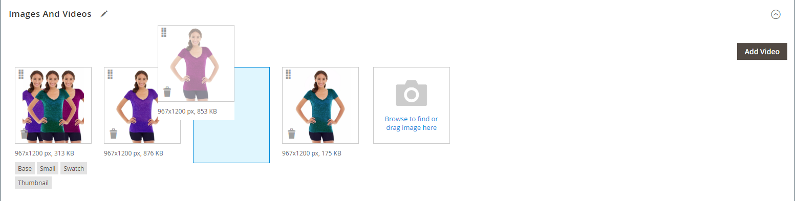
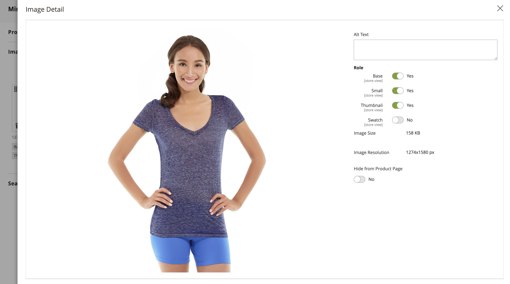
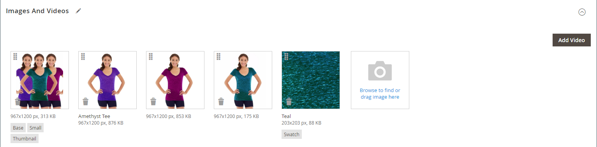
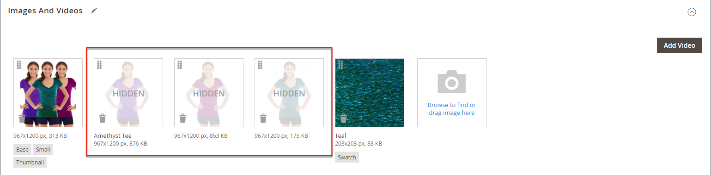
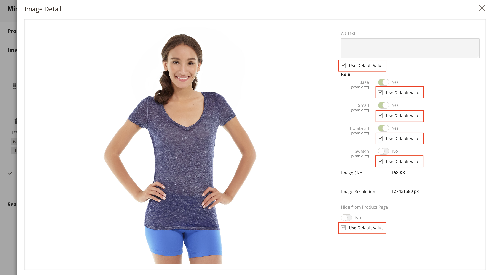
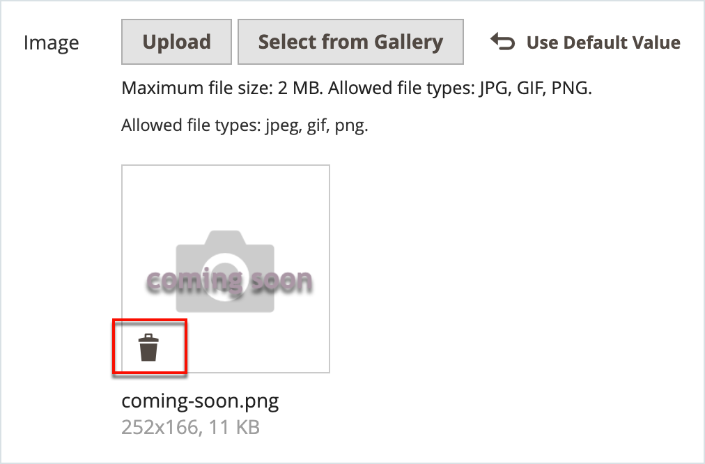

# 製品画像とビデオの管理

商品ごとに、複数の画像や動画をアップロードし、順序を並べ替え、それぞれの使用方法を制御できます。 大量の画像を管理する場合、それぞれを個別にアップロードするのではなく、バッチとしてインポートすることをお勧めします。 詳しくは、[製品画像の読み込み](../systems/data-import-product-images.md)を参照してください。

_[!UICONTROL Product Details]_&#x200B;ページで表示するために大きな画像をアップロードする場合は、最大ピクセルサイズ（幅と高さ）を設定し、アップロード時にファイルのサイズを自動的に変更することをお勧めします。 アップロード時に大きな画像ファイルのサイズ変更を自動的に有効にするオプションがあります。 詳しくは、[製品画像のサイズ変更](product-image-config.md#product-image-resizing)を参照してください。

## 製品画像の更新

1. 製品を編集モードで開きます。

1. 特定のストアビューで作業するには、左上隅の&#x200B;**[!UICONTROL Store View]** セレクターを該当するビューに設定します。

   >[!NOTE]
   >
   >`All Store Views` スコープがアップロードに使用されていない場合でも、新しい製品画像は&#x200B;**_常に_** アップロードされ、**_すべて_**&#x200B;のストアビューに表示されます。   特定のストアビューから製品画像を非表示にするには、そのストアビューに切り替え、画像の「**[!UICONTROL Hide from Product Page]**」チェックボックスを選択して「**[!UICONTROL Save]**」をクリックする必要があります。

1. 下にスクロールして、_[!UICONTROL Images and Videos]_&#x200B;セクションを展開します。

### 画像をアップロード

最適な互換性を得るには、`sRGB` カラープロファイルを持つすべての製品画像をアップロードすることをお勧めします。 他のすべてのカラープロファイルは、製品画像のアップロード中に自動的に`sRGB` カラープロファイルに変換されます。これにより、アップロードされた画像で色の一貫性が失われる可能性があります。

画像ファイル名の長さは、拡張子を含めて90文字を超えることはできません。

画像をアップロードするには、次のいずれかの操作を行います。

- 画像をデスクトップからドラッグし、_[!UICONTROL Images And Videos]_&#x200B;ボックスの_ カメラ _（）タイルにドロップします。

- _[!UICONTROL Images And Videos]_&#x200B;ボックスで、_ カメラ _（）タイルをクリックし、コンピューター上の画像ファイルを選択して、**[!UICONTROL Open]**&#x200B;をクリックします。

  {width="600" zoomable="yes"}

### 画像の配置を変更

ギャラリー内の画像の順序を変更するには、画像タイルの下部にある&#x200B;_[!UICONTROL Sort]_（）アイコンをクリックし、画像を&#x200B;_[!UICONTROL Images And Videos]_ ボックス内の別の位置にドラッグします。

{width="600" zoomable="yes"}

### 画像の削除

ギャラリーから画像を削除するには、画像タイルの右上隅にある&#x200B;**[!UICONTROL Delete]** （）アイコンをクリックし、**[!UICONTROL Save]**&#x200B;をクリックします。

### 画像の詳細を設定

詳細表示で開く画像をクリックし、次のいずれかの操作を行います。

{width="600" zoomable="yes"}

詳細ビューを閉じるには、右上隅の&#x200B;_閉じる_ （）アイコンをクリックします。

完了したら、**[!UICONTROL Save]**&#x200B;をクリックします。

#### 代替テキストを入力

画像の代替テキストは、スクリーンリーダーによって参照され、web アクセシビリティを向上させ、サイトのインデックス作成時に検索エンジンによって参照されます。 一部のブラウザーでは、マウスオーバーにAlt テキストが表示されます。 代替テキストには、複数単語の長さや、厳選したキーワードを含めることができます。

「_[!UICONTROL Alt Text]_」ボックスに、画像の簡単な説明を入力します。

#### 役割の割り当て

デフォルトでは、すべての役割は、製品にアップロードされる最初の画像に割り当てられます。 役割を別の画像に再割り当てするには、次の操作を行います。

_[!UICONTROL Role]_&#x200B;ボックスで、画像に割り当てる役割を選択します。

_画像とビデオ_ セクションに戻ると、現在割り当てられている役割が各画像の下に表示されます。

{width="600" zoomable="yes"}

#### 画像を非表示

サムネールギャラリーから画像を除外するには、**[!UICONTROL Hidden]** チェックボックスを選択し、**[!UICONTROL Save]**&#x200B;をクリックします。

{width="600" zoomable="yes"}

## ストアビューレベルでの画像とビデオの管理

**[!UICONTROL Store View]** セレクターを特定のストアビュー（**[!UICONTROL All Store Views]**&#x200B;ではなく）に切り替えると、_[!UICONTROL Images and Videos]_&#x200B;セクションには、デフォルトの範囲に影響を与えることなく、そのストアビューに対する画像の表示方法を管理するための追加コントロールが用意されています。

### ストアビューの画像の並べ替え

ストアビュースコープで作業する場合、_[!UICONTROL Images and Videos]_&#x200B;ボックスの下に&#x200B;**[!UICONTROL Use Default Order]**&#x200B;チェックボックスが表示されます。 このチェックボックスをオンにすると、画像の表示順序がデフォルトの範囲で定義された順序に戻ります。

{width="600" zoomable="yes"}

### ストアビューの画像の詳細の設定

ストアビュースコープで画像詳細ビューを開くと、各フィールド（**[!UICONTROL Alt Text]**、画像&#x200B;**[!UICONTROL Role]**&#x200B;の割り当て（Base、Small、Thumbnail、Swatch）、および&#x200B;**[!UICONTROL Hide from Product Page]**&#x200B;を含む）に&#x200B;**[!UICONTROL Use Default Value]**&#x200B;のチェックボックスが表示されます。 このチェックボックスを選択すると、そのフィールドのデフォルトスコープで設定された値を継承します。

{width="600" zoomable="yes"}

## 画像の役割

| イメージロール | 説明 |
|--- |--- |
| [!UICONTROL Thumbnail] | サムネール画像は、サムネールギャラリー、ショッピングカート、および関連項目などの一部のブロックに表示されます。 例サイズ：50 x 50 ピクセル |
| [!UICONTROL Small Image] | 小さい画像は、カテゴリおよび検索結果ページのリストの製品画像に使用され、アップセル、クロスセル、新製品リストなどのセクションに必要な製品画像を表示します。 例サイズ：470 x 470 ピクセル |
| [!UICONTROL Base Image] | ベース画像は、商品詳細ページのメイン画像です。 画像コンテナよりも大きい画像をアップロードすると、画像ズームがアクティブになります。 取得するズームレベルに応じて、ベース画像はコンテナの2～3倍のサイズにする必要があります。 例サイズ：470 x 470 ピクセル（ズームなし）、1100 x 1100 ピクセル（ズームあり） |
| [!UICONTROL Swatch] | [&#x200B; スウォッチ &#x200B;](swatches.md)を使用して、カラー、パターン、テクスチャを示すことができます。 例サイズ：50 x 50 ピクセル |

{style="table-layout:auto"}

## 透かし

あなたが独自のオリジナル製品画像を作成することを犠牲にした場合、マウスをクリックするだけで悪質な競合他社がそれらを盗むのを防ぐためにできることはほとんどありません。 ただし、各画像に透かしを配置して、プロパティとして識別することで、ターゲットの魅力を低下させることができます。 透かしファイルには、JPG（JPEG）、GIF、またはPNG画像を使用できます。 GIFとPNGの両方のファイル形式で透明レイヤーがサポートされており、透かしを透明な背景に適用できます。

次の例の&#x200B;_small_&#x200B;画像に使用される透かしは、透明な背景を持つ黒いロゴで、次の設定を持つPNG ファイルとして保存されます。

- サイズ：50x50
- 不透明度：5
- 位置：タイル

{width="700" zoomable="yes"}

### 商品画像への透かしの追加

1. _管理者_ サイドバーで、**[!UICONTROL Content]** > _[!UICONTROL Design]_>**[!UICONTROL Configuration]**&#x200B;に移動します。

   デザイン設定について詳しくは、[&#x200B; デザイン設定](../content-design/configuration.md)を参照してください。

1. 設定するストアビューを見つけ、_[!UICONTROL Action]_&#x200B;列の&#x200B;**[!UICONTROL Edit]**&#x200B;をクリックします。

1. _[!UICONTROL Other Settings]_&#x200B;で、**[!UICONTROL Product Image Watermarks]**&#x200B;セクションのを展開します。

   {width="600" zoomable="yes"}

   **[!UICONTROL Base]**、**[!UICONTROL Thumbnail]**、**[!UICONTROL Small]**&#x200B;および&#x200B;**[!UICONTROL Swatch Image]**&#x200B;の画像設定は同じです。

1. 次のいずれかの方法を使用して、透かし画像アセットを追加します。

   - **[!UICONTROL Upload]**&#x200B;をクリックし、透かしとして使用するためにアップロードするシステム上の画像ファイルを選択します。
   - **[!UICONTROL Select from Gallery]**&#x200B;をクリックし、[&#x200B; メディアギャラリー](../content-design/media-gallery.md)から画像アセットを選択します。

1. 透かし表示の設定を完了します。

   - **[!UICONTROL Image Opacity]**&#x200B;をパーセンテージで入力します。 例：`40`

   - **[!UICONTROL Image Size]**&#x200B;をピクセル単位で入力します。 例：`200 x 200`

   - **[!UICONTROL Image Position]**&#x200B;を設定して、透かしを表示する場所を指定します。

1. 完了したら、**[!UICONTROL Save Config]**&#x200B;をクリックします。

1. キャッシュの更新を求めるメッセージが表示されたら、システムメッセージの「**[!UICONTROL Cache Management]**」をクリックし、無効なキャッシュを更新します。

   {width="600" zoomable="yes"}

>[!TIP]
>
>**[!UICONTROL Use Default Value]** をクリックして、デフォルト値を復元できます。

### 透かしを削除

1. 画像の左下隅で、**[!UICONTROL Delete]** （）アイコンをクリックします。

   {width="300"}

1. **[!UICONTROL Save Config]**&#x200B;をクリックします。

1. キャッシュの更新を求めるメッセージが表示されたら、システムメッセージの「**[!UICONTROL Cache Management]**」をクリックし、無効なキャッシュを更新します。

   透かし画像がストアフロントに残っている場合は、キャッシュ管理に戻り、**[!UICONTROL Flush Magento Cache]**&#x200B;をクリックします。
