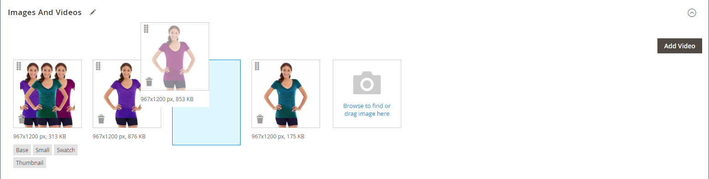

# 製品画像およびビデオの管理

各製品について、複数の画像やビデオをアップロードし、順序を並べ替えて、それぞれの使用方法を制御できます。 管理する画像が大量にある場合は、個別にアップロードするのではなく、1 つのバッチとして読み込んだ方がよいでしょう。 詳しくは、を参照してください [製品画像の読み込み](../systems/data-import-product-images.md).

表示するために大きな画像をアップロードする予定がある場合 _[!UICONTROL Product Details]_ページの場合、最大ピクセルサイズ（幅と高さ）を設定し、アップロード時にファイルのサイズを自動的に変更することを検討してください。 アップロード時に、大きな画像ファイルの自動サイズ変更を有効にするオプションがあります。 詳しくは、を参照してください [製品画像のサイズ変更](product-image-config.md#product-image-resizing).

## 製品画像の更新

1. 製品を編集モードで開きます。

1. 特定のストア表示を使用するには、 **[!UICONTROL Store View]** 左上隅の該当するビューを選択します。

   >[!NOTE]
   >
   >新しい製品画像は次のとおりです **_常に_** アップロードしてに表示 **_all_** ビューの保存（例： `All Store Views` 範囲は、アップロードには使用されません。   特定のストア表示で商品画像を非表示にするには、そのストア表示に切り替えて、次のオプションを選択する必要があります **[!UICONTROL Hide from Product Page]** 画像のチェックボックスで、 **[!UICONTROL Save]**.

1. 下にスクロールして、 _[!UICONTROL Images and Videos]_セクション。

### 画像をアップロード

最高の互換性を得るには、以下のパラメーターを使用して、すべての製品画像をアップロードすることをお勧めします `sRGB` カラープロファイル。 その他のカラープロファイルはすべて、 `sRGB` 製品画像のアップロード中にカラープロファイルが正しく設定されず、アップロードされた画像のカラーに一貫性がなくなる場合がありました。

画像ファイル名の長さは、拡張子を含めて 90 文字以下にする必要があります。

画像をアップロードするには、次のいずれかの操作を行います。

- デスクトップから画像をドラッグし、 _カメラ_ （  ）タイル内に _[!UICONTROL Images And Videos]_ボックス。

- が含まれる _[!UICONTROL Images And Videos]_ボックスで、_&#x200B;カメラ&#x200B;_（  ）タイルに表示されたら、コンピュータ上の画像ファイルを選択し、**[!UICONTROL Open]**.

  {width="600" zoomable="yes"}

### 画像の並べ替え

ギャラリー内の画像の順序を変更するには、 _[!UICONTROL Sort]_（  ）アイコンをクリックし、画像をの別の位置にドラッグします。_[!UICONTROL Images And Videos]_ ボックス。

{width="600" zoomable="yes"}

### 画像の削除

ギャラリーから画像を削除するには、 **[!UICONTROL Delete]** （  ）アイコンをクリックし、 **[!UICONTROL Save]**.

### 画像の詳細を設定

詳細表示で開くイメージをクリックし、次のいずれかの操作を行います。

{width="600" zoomable="yes"}

詳細ビューを閉じるには、 _閉じる_ （  ） アイコンをクリックします。

完了したら、 **[!UICONTROL Save]**.

#### 代替テキストを入力

画像の代替テキストは、Web アクセシビリティを向上させるためにスクリーンリーダーによって参照され、サイトのインデックス作成時には検索エンジンによって参照されます。 一部のブラウザーでは、マウスポインターを置くと代替テキストが表示されます。 代替テキストは複数の単語に対応しており、選択したキーワードが含まれます。

が含まれる _[!UICONTROL Alt Text]_ボックスに、画像の簡単な説明を入力します。

#### 役割の割り当て

デフォルトでは、製品にアップロードされた最初の画像にすべての役割が割り当てられます。 別の画像に役割を再割り当てするには、次の手順を実行します。

が含まれる _[!UICONTROL Role]_ボックスで、画像に割り当てる役割を選択します。

に戻った場合 _画像とビデオ_ セクションには、現在割り当てられている役割が各画像の下に表示されます。

{width="600" zoomable="yes"}

#### 画像を非表示

サムネールギャラリーから画像を除外するには、 **[!UICONTROL Hidden]** チェックボックスをオンにして、 **[!UICONTROL Save]**.

{width="600" zoomable="yes"}

## 画像の役割

| 画像の役割 | 説明 |
|--- |--- |
| [!UICONTROL Thumbnail] | サムネール画像は、サムネールギャラリー、買い物かごおよび関連項目などの一部のブロックに表示されます。 サンプルサイズ：50 x 50 ピクセル |
| [!UICONTROL Small Image] | この小さな画像は、カテゴリページや検索結果ページのリストの製品画像に使用され、アップセル、クロスセル、新製品リストなどのセクションに必要な製品画像を表示します。 サンプルサイズ：470 x 470 ピクセル |
| [!UICONTROL Base Image] | ベース画像は、製品の詳細ページのメイン画像です。 画像コンテナよりも大きい画像をアップロードすると、画像ズームがアクティブになります。 達成するズームレベルに応じて、基本画像はコンテナのサイズの 2 倍または 3 倍にする必要があります。 サンプルサイズ：470 x 470 ピクセル（ズームなし）、1100 x 1100 ピクセル（ズーム付き） |
| [!UICONTROL Swatch] | A [スウォッチ](swatches.md) 色、パターン、またはテクスチャを示すために使用できます。 サンプルサイズ：50 x 50 ピクセル |

{style="table-layout:auto"}

## 透かし

あなたが自分のオリジナル製品イメージを作成する費用に行くなら、悪質な競合他社がマウスをクリックしてそれらを盗むのを防ぐためにあなたができることはあまりありません。 ただし、各画像に透かしを配置してプロパティとして識別することで、画像の魅力を低下させることができます。 透かしファイルは、JPG（JPEG）、GIF、PNG 画像のいずれかになります。 GIFと PNG ファイルタイプはどちらも透明レイヤーをサポートしており、透かしに透明な背景を与えるために使用できます。

に使用される透かし _小_ 次の例の画像は、背景が透明な黒いロゴで、次の設定を持つ PNG ファイルとして保存されています。

- サイズ：50x50
- 不透明度：5
- 位置：タイル

{width="700" zoomable="yes"}

### 製品画像への透かしの追加

1. 日 _Admin_ サイドバー、に移動 **[!UICONTROL Content]** > _[!UICONTROL Design]_>**[!UICONTROL Configuration]**.

   デザイン設定の詳細については、を参照してください [デザイン設定](../content-design/configuration.md).

1. 設定するストア表示を見つけて、クリックします **[!UICONTROL Edit]** が含まれる _[!UICONTROL Action]_列。

1. 次の下 _[!UICONTROL Other Settings]_、を展開  この&#x200B;**[!UICONTROL Product Image Watermarks]**セクション。

   {width="600" zoomable="yes"}

   この **[!UICONTROL Base]**, **[!UICONTROL Thumbnail]**, **[!UICONTROL Small]**、および **[!UICONTROL Swatch Image]** 画像設定は同じです。

1. 次のいずれかの方法を使用して、透かし画像アセットを追加します。

   - クリック **[!UICONTROL Upload]** 次に、透かしとして使用するためにアップロードする、システム上の画像ファイルを選択します。
   - クリック **[!UICONTROL Select from Gallery]** から画像アセットを選択 [メディアギャラリー](../content-design/media-gallery.md).

1. 透かし表示の設定を行います。

   - を入力 **[!UICONTROL Image Opacity]** 割合で指定します。 例： `40`

   - を入力 **[!UICONTROL Image Size]** ピクセル単位。 例： `200 x 200`

   - を設定 **[!UICONTROL Image Position]** 透かしの表示場所を指定します。

1. 完了したら、 **[!UICONTROL Save Config]**.

1. キャッシュを更新するように求められたら、 **[!UICONTROL Cache Management]** システムメッセージでをクリックし、無効なキャッシュを更新します。

   {width="600" zoomable="yes"}

>[!TIP]
>
>次のいずれかをクリックできます。 **[!UICONTROL Use Default Value]**  をデフォルト値に戻します。

### 透かしの削除

1. 画像の左下隅にあるをクリックします **[!UICONTROL Delete]** （  ） アイコンをクリックします。

   {width="300"}

1. クリック **[!UICONTROL Save Config]**.

1. キャッシュを更新するように求められたら、 **[!UICONTROL Cache Management]** システムメッセージでをクリックし、無効なキャッシュを更新します。

   透かし画像がストアフロントに保持される場合は、キャッシュ管理に戻り、をクリックします **[!UICONTROL Flush Magento Cache]**.
