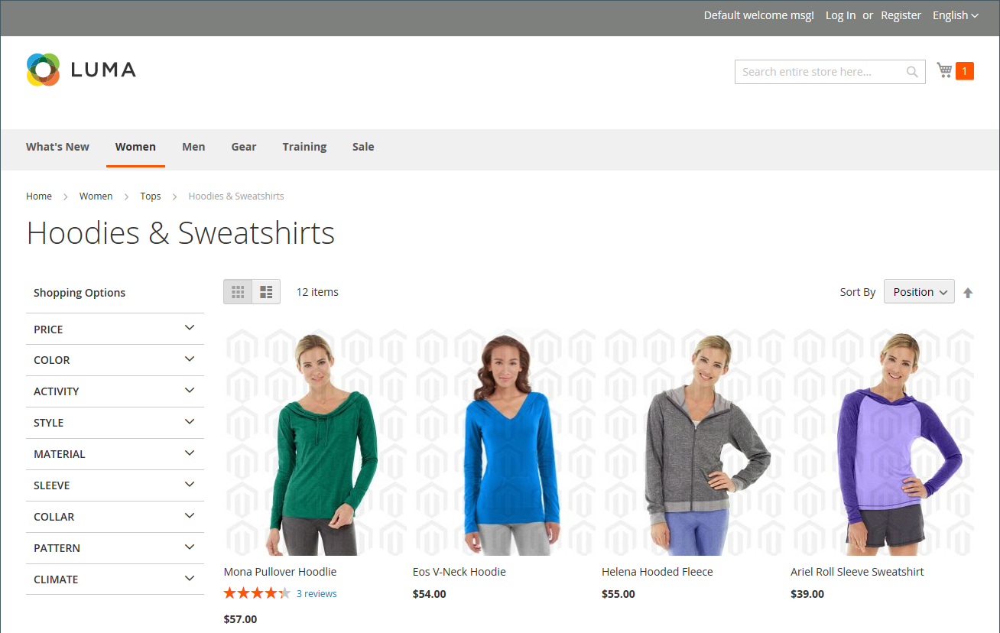

# 製品の画像とビデオの管理

各製品について、複数の画像やビデオをアップロードしたり、順序を並べ替えたり、各画像の使用方法を制御したりできます。 管理する画像が大量にある場合は、それぞれを個別にアップロードするのではなく、バッチとして読み込むことをお勧めします。 詳しくは、 [製品画像の読み込み](../systems/data-import-product-images.md).

大きな画像をアップロードして、 _[!UICONTROL Product Details]_ページの場合は、最大ピクセルサイズ（幅と高さ）の設定と、アップロード時にファイルのサイズを自動的に変更することを検討してください。 アップロード時に大きい画像ファイルのサイズを自動的に変更できるオプションがあります。 詳しくは、 [製品画像のサイズ変更](product-image-config.md#product-image-resizing).

## 製品画像を更新

1. 製品を編集モードで開きます。

1. 特定のストア表示を操作するには、 **[!UICONTROL Store View]** を選択します。

   >[!NOTE]
   >
   >新しい製品画像は、 **_常に_** アップロードされて表示される **_すべて_** ビューを保存 ( `All Store Views` 範囲はアップロードに使用されません。   特定のストア表示から製品画像を非表示にするには、そのストア表示に切り替える必要があります。その場合は、 **[!UICONTROL Hide from Product Page]** 画像のチェックボックスをオンにし、 **[!UICONTROL Save]**.

1. 下にスクロールして、 _[!UICONTROL Images and Videos]_」セクションに入力します。

### 画像をアップロード

互換性を最善にするために、すべての製品画像を `sRGB` カラープロファイル。 その他のすべてのカラープロファイルは、 `sRGB` 製品画像のアップロード中にカラープロファイルが生成され、アップロードされた画像の色に不整合が生じる可能性がありました。

画像ファイル名の長さ（拡張子を含む）は 90 文字以下にする必要があります。

画像をアップロードするには、次のいずれかの操作を行います。

- デスクトップから画像をドラッグし、 _カメラ_ (  ) タイルを _[!UICONTROL Images And Videos]_ボックス。

- Adobe Analytics の _[!UICONTROL Images And Videos]_ボックスで、_&#x200B;カメラ&#x200B;_(  ) タイルで、コンピューター上の画像ファイルを選択し、**[!UICONTROL Open]**.

  {width="600" zoomable="yes"}

### 画像の並べ替え

ギャラリー内の画像の順序を変更するには、 _[!UICONTROL Sort]_(  ) アイコンをクリックし、画像を_[!UICONTROL Images And Videos]_ ボックス。

{width="600" zoomable="yes"}

### 画像の削除

ギャラリーから画像を削除するには、 **[!UICONTROL Delete]** (  ) アイコンをクリックし、 **[!UICONTROL Save]**.

### 画像の詳細を設定

詳細ビューで開く画像をクリックし、次のいずれかの操作を行います。

{width="600" zoomable="yes"}

詳細ビューを閉じるには、 _閉じる_ (  ) アイコンを使用して貼り付けることができます。

完了したら、「 **[!UICONTROL Save]**.

#### 代替テキストを入力

画像代替テキストは、Web のアクセシビリティを向上させるために、またサイトのインデックスを作成する際に検索エンジンで参照されます。 一部のブラウザーでは、マウスオーバー時に Alt テキストが表示されます。 代替テキストは、複数の単語を長く指定でき、キーワードを慎重に選択して含めます。

Adobe Analytics の _[!UICONTROL Alt Text]_ボックスに、画像の簡単な説明を入力します。

#### 役割の割り当て

デフォルトでは、すべての役割が製品にアップロードされる最初の画像に割り当てられます。 ロールを別のイメージに再割り当てするには、次の手順を実行します。

Adobe Analytics の _[!UICONTROL Role]_ボックスで、画像に割り当てる役割を選択します。

次の場合に、 _画像とビデオ_ 」セクションの各画像の下に、現在割り当てられている役割が表示されます。

{width="600" zoomable="yes"}

#### 画像を非表示にする

サムネールギャラリーから画像を除外するには、 **[!UICONTROL Hidden]** チェックボックスをオンにして「 」をクリックします。 **[!UICONTROL Save]**.

{width="600" zoomable="yes"}

## 画像の役割

| 画像ロール | 説明 |
|--- |--- |
| [!UICONTROL Thumbnail] | サムネール画像は、サムネールギャラリー、買い物かごおよび関連アイテムなどの一部のブロックに表示されます。 サイズ例：50 x 50 ピクセル |
| [!UICONTROL Small Image] | 小さい画像は、カテゴリおよび検索結果ページの製品画像のリストに使用され、アップセル、クロスセル、新しい製品リストなどのセクションに必要な製品画像を表示します。 例：サイズ 470 x 470 ピクセル |
| [!UICONTROL Base Image] | ベース画像は、製品の詳細ページのメイン画像です。 画像コンテナより大きい画像をアップロードすると、画像ズームがアクティブになります。 達成するズームのレベルに応じて、ベース画像はコンテナの 2 倍または 3 倍のサイズにする必要があります。 例：470 x 470 ピクセル（ズームなし）、1100 x 1100 ピクセル（ズームあり） |
| [!UICONTROL Swatch] | A [スウォッチ](swatches.md) を使用して、色、パターン、テクスチャを描くことができます。 サイズ例：50 x 50 ピクセル |

{style="table-layout:auto"}

## 透かし

オリジナルの製品画像を作成する費用がかかる場合は、悪質な競合他社がマウスをクリックして盗むのを防ぐためにできることは多くありません。 ただし、各画像に透かしを配置してプロパティとして識別することで、ターゲットの魅力を損なうことができます。 透かしファイルには、JPG(JPEG)、GIF、PNG 画像のいずれかを指定できます。 GIFと PNG の両方のファイルタイプが透明なレイヤーをサポートしています。透かしを透明な背景にするのに使用できます。

に使用する透かし _小_ 次の例の画像は、透明な背景を持つ黒いロゴで、次の設定を持つ PNG ファイルとして保存されています。

- サイズ： 50 x 50
- 不透明度： 5
- 位置：タイル

{width="700" zoomable="yes"}

### 製品画像に透かしを追加する

1. 次の日： _管理者_ サイドバー、移動 **[!UICONTROL Content]** > _[!UICONTROL Design]_>**[!UICONTROL Configuration]**.

   デザイン設定について詳しくは、 [デザイン設定](../content-design/configuration.md).

1. 設定するストア表示を見つけ、 **[!UICONTROL Edit]** （内） _[!UICONTROL Action]_列。

1. の下 _[!UICONTROL Other Settings]_、展開  の&#x200B;**[!UICONTROL Product Image Watermarks]**」セクションに入力します。

   {width="600" zoomable="yes"}

   The **[!UICONTROL Base]**, **[!UICONTROL Thumbnail]**, **[!UICONTROL Small]**、および **[!UICONTROL Swatch Image]** 画像設定は同じです。

1. 透かし画像アセットを追加するには、次のいずれかの方法を使用します。

   - クリック **[!UICONTROL Upload]** をクリックし、透かしとして使用する画像ファイルをシステム上で選択します。
   - クリック **[!UICONTROL Select from Gallery]** をクリックし、 [メディアギャラリー](../content-design/media-gallery.md).

1. 透かし表示の設定を入力します。

   - 次を入力します。 **[!UICONTROL Image Opacity]** 割合 (%) で示します。 例： `40`

   - 次を入力します。 **[!UICONTROL Image Size]** ピクセル単位で指定します。 例： `200 x 200`

   - 設定 **[!UICONTROL Image Position]** 透かしを表示する場所を指定します。

1. 完了したら、「 **[!UICONTROL Save Config]**.

1. キャッシュを更新するよう求められたら、 **[!UICONTROL Cache Management]** を選択し、無効なキャッシュを更新します。

   {width="600" zoomable="yes"}

>[!TIP]
>
>次をクリックできます。 **[!UICONTROL Use Default Value]**  をクリックしてデフォルト値に戻します。

### 透かしの削除

1. 画像の左下隅で、 **[!UICONTROL Delete]** (  ) アイコンをクリックします。

   {width="300"}

1. クリック **[!UICONTROL Save Config]**.

1. キャッシュを更新するよう求められたら、 **[!UICONTROL Cache Management]** を選択し、無効なキャッシュを更新します。

   透かし画像がストアフロント内に残る場合は、キャッシュ管理に戻って、「 **[!UICONTROL Flush Magento Cache]**.
