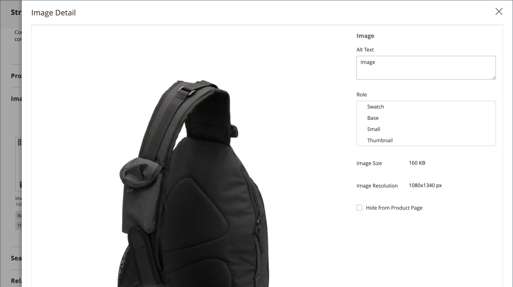

# 製品設定 – [!UICONTROL Images and Videos]

「_[!UICONTROL Images and Videos]_」セクションでは、複数の画像のアップロード、画像の並べ替え、各画像の使用の制御など、基本的な画像管理タスクを実行できます。 個々の画像をさらに細かく制御するには、各画像を_ 詳細表示 _で開きます。 詳しくは、[ カタログ画像とビデオ ](catalog-images-video.md) を参照してください。

## 新しい画像をアップロード

1. 製品を編集モードで開きます。

1. 下にスクロールして、「_[!UICONTROL Images and Videos]_」セクションの  を展開します。

   {width="600" zoomable="yes"}

1. 製品画像を追加する準備ができている場合は、次のいずれかの操作を行います。

   - デスクトップから画像をドラッグし、_カメラ_ （）タイルにドロップします。

   - _カメラ_ （）タイルをクリックし、画像ファイルを選択して「**[!UICONTROL Open]**」をクリックします。

商品画像が利用可能になるまで、カタログに [ プレースホルダー ](product-image-config.md#image-placeholders) 画像が表示されます。

## 画像の詳細

製品画像を追加する際に、_[!UICONTROL Image Detail]_ウィンドウの画像表示をカスタマイズできます。

{width="600" zoomable="yes"}

商品の画像表示オプションを設定するには：

1. 製品画像をクリックします。

1. **[!UICONTROL Alt text]** を入力します。

1. 画像を表示する **[!UICONTROL Role]** ールを選択します（1 つの画像に対してすべてのロールを選択できます）。

   - `Swatch`
   - `Base`
   - `Small`
   - `Thumbnail`

   デフォルトでは、最初に追加された画像に対してこれらの役割がすべて選択されます。

   {width="600" zoomable="yes"}

製品ページで製品画像を非表示にするには、「**[!UICONTROL Hide from Product Page]**」チェックボックスを選択します。
