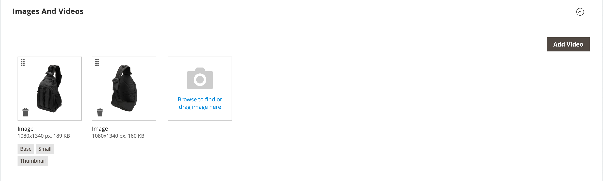

# 製品設定 –  [!UICONTROL Images and Videos]

から _[!UICONTROL Images and Videos]_セクションでは、複数の画像のアップロード、画像の並べ替え、各画像の使用方法の制御など、基本的な画像管理タスクを実行できます。 個々の画像をさらに制御するには、で各画像を開きます_&#x200B;詳細ビュー&#x200B;_. 詳しくは、を参照してください [カタログの画像とビデオ](catalog-images-video.md).

## 新しい画像をアップロード

1. 製品を編集モードで開きます。

1. 下にスクロールして展開  この _[!UICONTROL Images and Videos]_セクション。

   {width="600" zoomable="yes"}

1. 製品画像を追加する準備ができている場合は、次のいずれかの操作を行います。

   - デスクトップから画像をドラッグし、 _カメラ_ （） タイル。

   - 「」をクリックします _カメラ_ （）タイルに表示されます。画像ファイルを選択して、 **[!UICONTROL Open]**.

A [プレースホルダー](product-image-config.md#image-placeholders) 商品画像が利用可能になるまで、画像がカタログに表示されます。

## 画像の詳細

製品画像を追加する際に、での画像表示をカスタマイズできます _[!UICONTROL Image Detail]_ウィンドウ。

{width="600" zoomable="yes"}

商品の画像表示オプションを設定するには：

1. 製品画像をクリックします。

1. を入力 **[!UICONTROL Alt text]**.

1. を選択 **[!UICONTROL Role]** 画像を表示する場合（1 つの画像にすべてのロールを選択できます）:

   - `Swatch`
   - `Base`
   - `Small`
   - `Thumbnail`

   デフォルトでは、最初に追加された画像に対してこれらの役割がすべて選択されます。

   {width="600" zoomable="yes"}

製品ページで製品画像を非表示にするには、次を選択します **[!UICONTROL Hide from Product Page]** チェックボックス。
