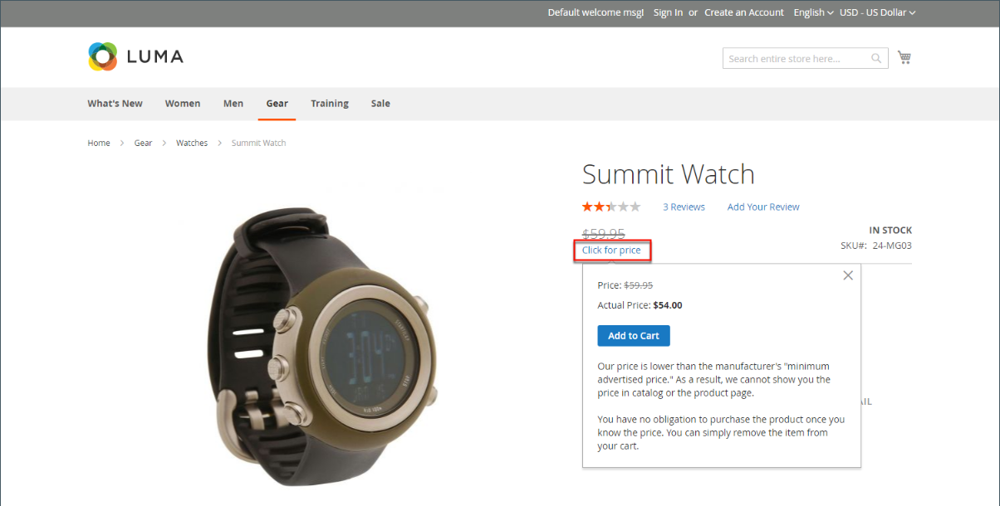

# 広告の最低価格

販売者は、メーカーの推奨小売価格（MSRP）よりも低い価格の表示を禁止される場合があります。 Minimum Advertised Price （MAP）は、メーカーの要件を遵守しながら、お客様により良い価格を提供する機能を提供します。 要件は製造元によって異なるので、ストアが許可されていないページに実際の価格が表示されないようにストアを設定できます。

MAP 機能は、通常の製品価格ではなく、専用の _クリックして価格を設定_ リンクを追加します。 店舗の価格が商品の最低設定価格を下回っている場合、店舗側で価格情報を処理する方法は 2 つあります。 1 つ目の方法は、価格が表示されないことです。 購入者が _価格をクリック_ ボタンをクリックした場合にのみ、製品を販売している実際の価格が表示されます。 2 つ目の方法は、リスト/市場価格が取り消し線で表示され、価格が低いことを強調することです。

また、MAP 機能を使用すると、いくつかの改善点を提案できます。 例えば、顧客がそのような製品を買い物かごに追加した場合、その顧客は買い物かごにリダイレクトされず、代わりに、購入者が次の操作を実行できるオファーが表示されます。

- 買い物かごから商品を削除します（購入者が価格を明確にしたいだけで、まだ購入の決定を行っていない場合に実行できます）

- 買い物かごに入れたままにして、買い物を続ける

- チェックアウトに進む

## マップ ロジック

一部の製品には、カスタムオプションや、独自の SKU と在庫管理を持つシンプルな製品など、選択したオプションに依存する価格があります）。 これらの製品には、製品タイプと価格設定に応じて、次のロジックが適用されます。 実際の価格は、注文管理、顧客管理ツール、レポートで使用されます。

## 製品タイプでの MAP の使用

| 製品タイプ | 説明 |
|--- |--- |
| [ シンプル ](product-create-simple.md)、[ 仮想 ](product-create-virtual.md) | 実際の価格は、カタログリストや製品ページに自動的に表示されるのではなく、[!UICONTROL Display Actual Price] の設定に従ってのみ含まれます。 カスタムオプションの価格は通常どおり表示されます。 |
| [ グループ化 ](product-create-grouped.md) | 関連付けられているシンプルな製品の価格は、カタログリストや製品ページに自動的には表示されませんが、[!UICONTROL Display Actual Price] の設定によってのみ含まれます。 |
| [ 設定可能 ](product-create-configurable.md) | 実際の価格は、カタログリストや製品ページに自動的に表示されるのではなく、[!UICONTROL Display Actual Price] の設定に従ってのみ含まれます。 オプション価格は通常どおりに表示されます。 |
| [ バンドル ](product-create-bundle.md) （固定価格） | 実際の価格は、カタログページに自動的には表示されませんが、[!UICONTROL Display Actual Price] の設定にのみ含まれます。 バンドル品目の価格は通常どおり表示されます。 動的価格設定のバンドル製品には、MAP は使用できません。 |
| [ ダウンロード可能 ](product-create-downloadable.md) | 実際の価格は、カタログリストや製品ページに自動的に表示されるのではなく、[!UICONTROL Display Actual Price] の設定に従ってのみ含まれます。 各ダウンロードリンクに関連付けられている価格は、通常どおりに表示されます。 |

{style="table-layout:auto"}

## 価格設定での MAP の使用

| 価格設定 | 説明 |
|--- |--- |
| 主要価格 | MAP をメイン価格に適用すると、オプション、バンドル品目、および関連製品（メイン価格に加算または減算）の価格が通常どおり表示されます。 |
| 関連する製品価格 | 製品に主要価格がなく、その価格が関連する製品価格（グループ化された製品など）から派生している場合、関連する製品の MAP 設定が適用されます。 |
| [MSRP](product-price-minimum-advertised.md) | カート内の商品にメーカーの推奨小売価格（MSRP）が指定されている場合、その価格はクロスアウトされません。 |
| [ 階層価格 ](product-price-tier.md) | 階層価格が設定されている場合、階層価格メッセージはカタログに表示されません。 商品ページには、特定の数量を超える注文の場合は価格が低くなる可能性があることを示す通知が表示されますが、割引はパーセンテージでのみ表示されます。 グループ化された製品の関連製品の場合、割引は製品ページに表示されません。 階層価格は、「実際の価格を表示」設定に従って表示されます。 |
| [ 特別価格 ](product-price-special.md) | 特別価格が指定されている場合、特別価格は「実際の価格を表示」の設定に従って表示されます。 |

## マップ設定

Minimum Advertised Price （MAP）機能は、デフォルトでは有効になっていません。 この機能をストアに追加する場合は、この機能を有効にして、製品のマップ設定を指定する必要があります。 マップ設定は、カタログ内のすべての製品に適用することも、特定の製品用に設定することもできます。 MAP がグローバルに有効化されている場合、ストアフロントのすべての製品価格は非表示になります。 メーカーとの契約の条件を遵守しながら、お客様により良い価格を提供するために使用できる設定オプションは様々です。

{width="700" zoomable="yes"}

グローバルレベルでは、MAP を有効または無効にしたり、すべての製品に適用したり、実際の価格の表示方法を定義したりできます。 ストアに表示される関連メッセージおよび情報ヒントのテキストを編集することもできます。

MAP が有効な場合、製品レベルの MAP 設定が使用可能になります。 MSRP を入力し、実際の価格を店舗に表示する方法を選択することで、個々の製品に MAP を適用できます。 製品レベルの MAP 設定は、グローバル MAP 設定よりも優先されます。

{width="700" zoomable="yes"}

### 手順 1：ストアビューのマップを有効にする

1. _管理者_ サイドバーで、**[!UICONTROL Stores]**/_[!UICONTROL Settings]_/**[!UICONTROL Configuration]**&#x200B;に移動します。

1. 該当する場合は、設定が適用されるビューの右上隅の **[!UICONTROL Store View]** を設定します。

1. 左側のパネルで「**[!UICONTROL Sales]**」を展開し、その下の「**[!UICONTROL Sales]**」を選択します。

1. 「」を展開し、「_[!UICONTROL Minimum Advertised Price]_」セクションを展開します。

1. 必要に応じて、**Enable MAP** を `Yes` に設定します。

   {width="600" zoomable="yes"}

   これらの設定オプションの詳細なリストについては、[_設定リファレンス_](../configuration-reference/sales/sales.md#minimum-advertised-price) の _Minimum Advertised Price_ を参照してください。

### 手順 2：マップ設定の指定

次のいずれかの方法を使用して、MAP 設定を構成します。

#### 方法 1：すべての製品の MAP の設定

1. 実際の価格を顧客に表示するタイミングと場所を決定するには、次の操作を行います。

   - デフォルト値を変更するには、「**[!UICONTROL Use system value]**」チェックボックスの選択を解除します。

   - **実際の価格を表示** を次のいずれかに設定します。
      - `In Cart`
      - `Before Order Confirmation`
      - `On Gesture (on click)`

1. **[!UICONTROL Default Popup Text Message]** に表示するテキストを入力します。

1. **[!UICONTROL Default "What's This" Text Message]** に表示する追加の説明を入力します。

1. 完了したら、「**[!UICONTROL Save Config]**」をクリックします。

#### 方法 2：単一の製品の MAP の設定

1. _管理者_ サイドバーで、**[!UICONTROL Catalog]**/**[!UICONTROL Inventory]**/**[!UICONTROL Products]** に移動します。

1. 製品を **[!UICONTROL Edit]** モードで開きます。

1. 左側のパネルで「**[!UICONTROL Advanced Settings]**」を展開し、「**[!UICONTROL Advanced Pricing]**」を選択します。

   >[!NOTE]
   >
   >「[!UICONTROL Manufacturer's Suggested Retail Price]」フィールドと「[!UICONTROL Display Actual Price]」フィールドは、設定で [Minimum Advertised Price](../configuration-reference/sales/sales.md#minimum-advertised-price) が有効になっている場合にのみ表示されます。

1. **[!UICONTROL Manufacturer's Suggested Retail Price]** （MSRP）を入力します。

   この例では、製品価格は$54.00 で、MSRP は 59.95 です。

   {width="600" zoomable="yes"}

1. **[!UICONTROL Display Actual Price]** を次のいずれかに設定します。

   - `Use config` - （デフォルト）ストアに対して表示設定を [ 設定 ](../configuration-reference/sales/sales.md#minimum-advertised-price) として適用します。 |
   - `On Gesture` – 顧客が _価格のクリック_ または _これは何ですか？_ リンク。
   - `In Cart` - ショッピングカートの実際の製品価格を表示します。
   - `Before Order Confirmation` – 注文が確認される直前の、チェックアウトプロセスの最後に実際の製品価格を表示します。

1. 完了したら、「**[!UICONTROL Done]**」をクリックし、次に「**[!UICONTROL Save]**」をクリックします。
