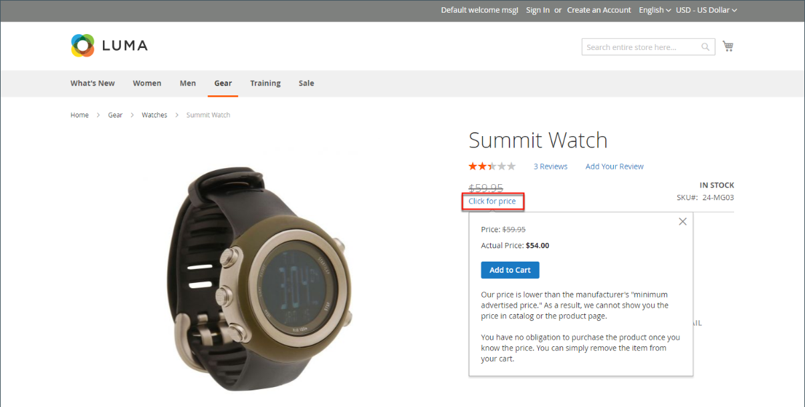
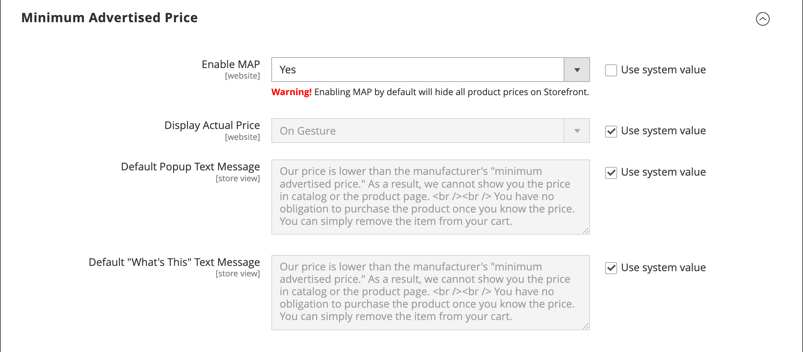

# 最低広告価格

販売者は、製造業者の希望小売価格（MSRP）よりも低い価格を表示することを禁止されることがあります。 最低広告価格（MAP）は、メーカーの要件を遵守しながら、顧客により良い価格を提供することができます。 要件はメーカーによって異なるため、ストアを設定して、許可されていないページに実際の価格が表示されないようにすることができます。

MAP機能では、通常の製品価格の代わりに、専用の&#x200B;_クリック価格_ リンクが追加されます。 ストアの価格がその商品の最低設定価格を下回っている場合、ストアフロントで価格情報を処理するには2つの方法があります。 最初の方法は、価格が表示されないということです。 購入者が「_価格をクリック_」ボタンをクリックした場合にのみ、商品を販売している実際の価格が表示されます。 2つ目の方法は、リスト/市場価格がストライクスルーで表示され、価格が低いことを強調することです。

また、MAP機能を使用すると、いくつかの改善点を提案できます。 例えば、お客様が商品をカートに追加した場合、その商品はカートにリダイレクトされず、代わりに購入者が以下を実行できるオファーが表示されます。

- カートから商品を削除する（購入者が価格を明確化したいだけで、まだ購入を決定していない場合に実行できます）

- ショッピングカートに入れて買い物を続ける

- チェックアウトに進む

## マッピングロジック

カスタムオプションや、独自のSKUと在庫管理を備えたシンプルな製品など、選択したオプションに応じて価格が決定されている製品もあります。 これらの製品については、製品の種類と価格設定に応じて、次のロジックが適用されます。 実際の価格は、注文管理、顧客管理ツール、レポートで使用されます。

## 製品タイプでのMAPの使用

| 製品タイプ | 説明 |
|--- |--- |
| [&#x200B; シンプル &#x200B;](product-create-simple.md)、[&#x200B; バーチャル &#x200B;](product-create-virtual.md) | 実際の価格は、カタログリストと商品ページには自動的に表示されませんが、[!UICONTROL Display Actual Price]の設定に従ってのみ含まれます。 カスタムオプションの価格は通常どおり表示されます。 |
| [&#x200B; グループ化](product-create-grouped.md) | 関連付けられたシンプルな製品の価格は、カタログ リストと製品ページには自動的に表示されませんが、[!UICONTROL Display Actual Price]設定に従ってのみ含まれます。 |
| [構成可能](product-create-configurable.md) | 実際の価格は、カタログリストと商品ページには自動的に表示されませんが、[!UICONTROL Display Actual Price]の設定に従ってのみ含まれます。 オプション価格は通常どおり表示されます。 |
| [&#x200B; バンドル &#x200B;](product-create-bundle.md) （固定価格） | 実際の価格は、カタログページには自動的に表示されませんが、[!UICONTROL Display Actual Price]設定に従ってのみ含まれます。 バンドルアイテムの価格は通常どおり表示されます。 MAPは、動的な価格設定のバンドル製品では使用できません。 |
| [&#x200B; ダウンロード可能](product-create-downloadable.md) | 実際の価格は、カタログリストと商品ページには自動的に表示されませんが、[!UICONTROL Display Actual Price]の設定に従ってのみ含まれます。 各ダウンロードリンクに関連付けられている価格は、通常どおり表示されます。 |

{style="table-layout:auto"}

## 価格設定でのMAPの使用

| 価格設定 | 説明 |
|--- |--- |
| 主な価格 | MAPをメインプライスに適用すると、オプション、バンドルアイテム、および関連製品（メインプライスから加算または減算）の価格が通常どおりに表示されます。 |
| 関連製品価格 | 製品にメイン価格がなく、その価格が関連する製品価格（グループ化された製品など）から派生する場合、関連する製品のMAP設定が適用されます。 |
| [MSRP](product-price-minimum-advertised.md) | カート内の商品に製造業者の希望小売価格（MSRP）が指定されている場合、価格は引き落とされません。 |
| [階層の価格](product-price-tier.md) | 階層価格が設定されている場合、階層価格メッセージはカタログに表示されません。 商品ページには、一定量を超えて注文した場合に価格が下がることを示す通知が表示されますが、割引はパーセンテージでのみ表示されます。 グループ化された製品の関連製品の場合、割引は製品ページに表示されません。 階層価格は、「実際の価格を表示」設定に従って表示されます。 |
| [特別価格](product-price-special.md) | 特別価格が指定されている場合は、「実際の価格を表示」設定に従って特別価格が表示されます。 |

## MAP設定

最低広告価格（MAP）機能は、デフォルトでは有効になっていません。 この機能をストアに追加する場合は、ストアを有効にし、製品のMAP設定を設定する必要があります。 MAP設定は、カタログ内のすべての製品に適用することも、特定の製品に設定することもできます。 MAPがグローバルで有効になっている場合、ストアフロント内のすべての製品価格は表示されません。 メーカーとの契約条件を遵守しながら、顧客により良い価格を提供するために、さまざまな設定オプションを使用できます。

{width="700" zoomable="yes"}

グローバルレベルでは、MAPを有効または無効にし、すべての製品に適用し、実際の価格の表示方法を定義できます。 また、ストアに表示される関連メッセージと情報ヒントのテキストを編集することもできます。

MAPが有効になっている場合、製品レベルのMAP設定が使用可能になります。 MSRPを入力し、実際の価格をストアに表示する方法を選択することで、個々の製品にMAPを適用できます。 製品レベルのMAP設定は、グローバル MAP設定を上書きします。

{width="700" zoomable="yes"}

### 手順1：ストアビューのMAPを有効にする

1. _管理者_ サイドバーで、**[!UICONTROL Stores]** > _[!UICONTROL Settings]_>**[!UICONTROL Configuration]**&#x200B;に移動します。

1. 該当する場合は、設定が適用されるビューの右上隅に&#x200B;**[!UICONTROL Store View]**&#x200B;を設定します。

1. 左側のパネルで「**[!UICONTROL Sales]**」を展開し、下の「**[!UICONTROL Sales]**」を選択します。

1. _[!UICONTROL Minimum Advertised Price]_&#x200B;セクションのを展開します。

1. 必要に応じて、**マップを有効にする**&#x200B;を`Yes`に設定します。

   {width="600" zoomable="yes"}

   これらの設定オプションの詳細なリストについては、_設定リファレンス_&#x200B;の「[_最低広告価格_](../configuration-reference/sales/sales.md#minimum-advertised-price)」を参照してください。

### 手順2:MAP設定の設定

MAP設定を設定するには、次のいずれかの方法を使用します。

#### 方法1：すべての製品のMAPを設定する

1. 実際の価格を顧客に表示するタイミングと場所を決定するには、次の操作を行います。

   - デフォルト値を変更するには、**[!UICONTROL Use system value]** チェックボックスの選択を解除します。

   - **実際の価格の表示**&#x200B;を次のいずれかに設定します。
      - `In Cart`
      - `Before Order Confirmation`
      - `On Gesture (on click)`

1. **[!UICONTROL Default Popup Text Message]**&#x200B;に表示するテキストを入力します。

1. **[!UICONTROL Default "What's This" Text Message]**&#x200B;に表示する追加の説明を入力します。

1. 完了したら、**[!UICONTROL Save Config]**&#x200B;をクリックします。

#### 方法2：単一の製品のMAPを設定する

1. _管理者_ サイドバーで、**[!UICONTROL Catalog]** > **[!UICONTROL Inventory]** > **[!UICONTROL Products]**&#x200B;に移動します。

1. 製品を&#x200B;**[!UICONTROL Edit]** モードで開きます。

1. 左側のパネルで、**[!UICONTROL Advanced Settings]**&#x200B;を展開し、**[!UICONTROL Advanced Pricing]**&#x200B;を選択します。

   >[!NOTE]
   >
   >[!UICONTROL Manufacturer's Suggested Retail Price]および[!UICONTROL Display Actual Price] フィールドは、[最小広告価格](../configuration-reference/sales/sales.md#minimum-advertised-price)が設定で有効になっている場合にのみ表示されます。

1. **[!UICONTROL Manufacturer's Suggested Retail Price]** （MSRP）を入力します。

   この例では、製品価格は54.00 ドル、MSRPは59.95です。

   {width="600" zoomable="yes"}

1. **[!UICONTROL Display Actual Price]**&#x200B;を次のいずれかに設定します：

   - `Use config` - （デフォルト）表示設定をストアの[設定](../configuration-reference/sales/sales.md#minimum-advertised-price)として適用します。 |
   - `On Gesture` – 顧客が&#x200B;_価格をクリック_&#x200B;または&#x200B;_何ですか？_&#x200B;をクリックすると、実際の商品価格がポップアップに表示されます リンク：
   - `In Cart` - ショッピングカートに実際の商品価格を表示します。
   - `Before Order Confirmation` – 注文が確認される直前に、チェックアウトプロセスの最後に実際の商品価格を表示します。

1. 完了したら、**[!UICONTROL Done]**&#x200B;をクリックし、**[!UICONTROL Save]**&#x200B;をクリックします。
