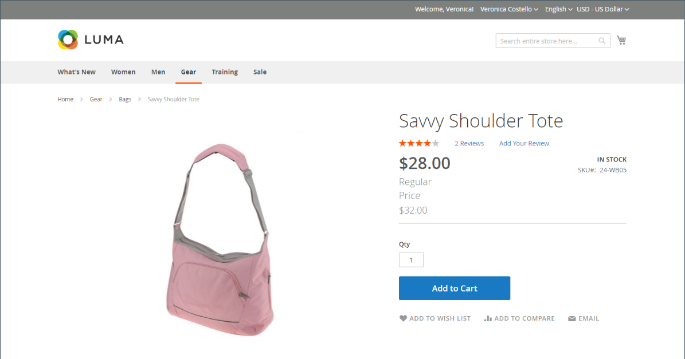
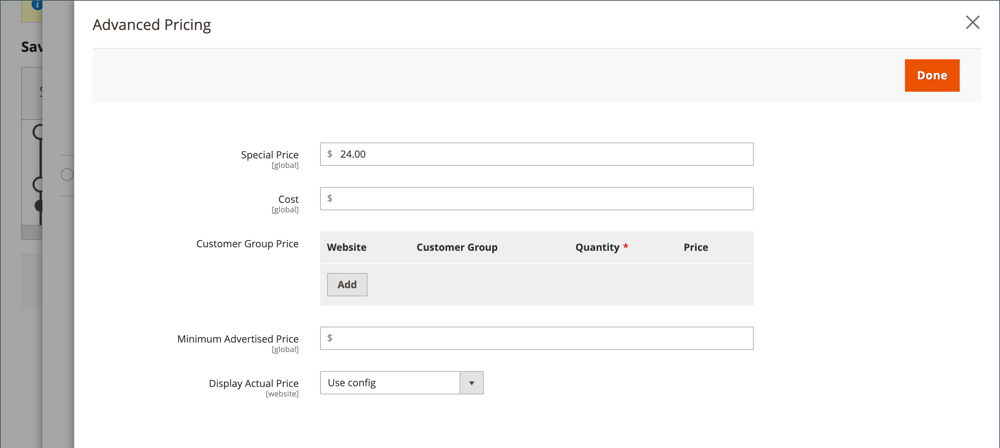
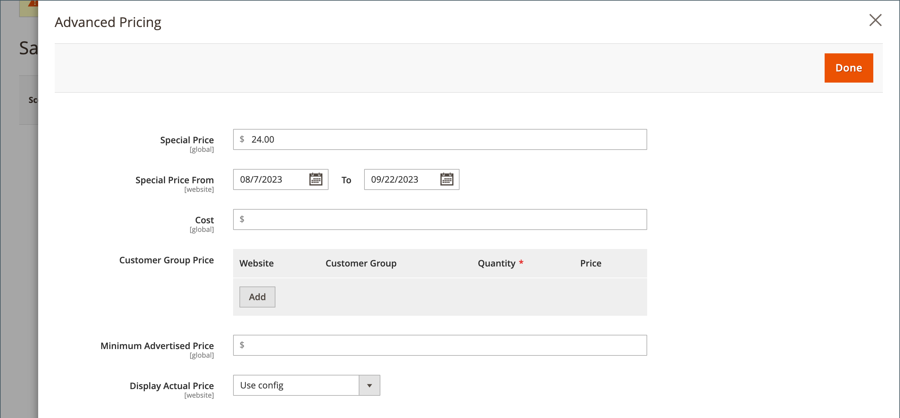
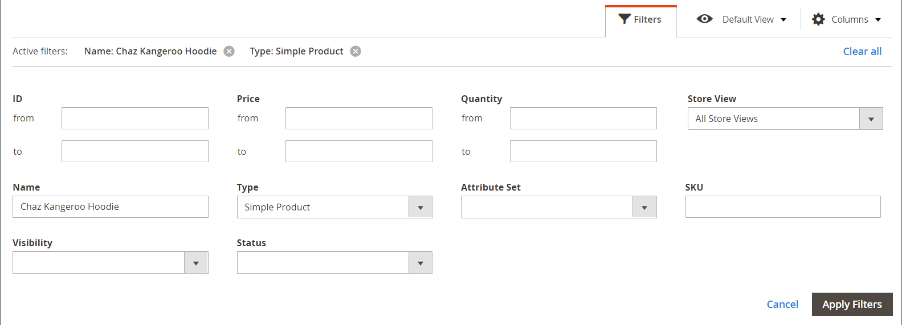

# 特別価格

指定された期間に特別な価格を提供することができます。 指定された期間の間、特別価格が通常価格の代わりに表示され、その後に正規価格を示す表記法が表示されます。

{width="700" zoomable="yes"}

## 個別商品に特別価格を適用する

カタログ内で1つの商品に特別価格を簡単に設定できます。

### スケジュールされた更新の使用

{{ee-feature}}

Adobe Commerceでは、[&#x200B; スケジュール済み更新](../content-design/content-staging-scheduled-update.md)のサポートが含まれています。 これらのプロモーションツールを使用して、特定の期間の特定の製品に特別な価格を適用します。

1. 製品を編集モードで開きます。

1. **[!UICONTROL Scheduled Update]**&#x200B;をクリックします。

   {width="600" zoomable="yes"}のスケジュールされた更新プログラムを追加

1. **更新名**&#x200B;に、特別価格プロモーションの名前を入力します。

1. 概要&#x200B;**[!UICONTROL Description]**&#x200B;を入力します。

1. _カレンダー_ （）アイコンを使用して、特別価格のプロモーション用に&#x200B;**[!UICONTROL Start Date]**&#x200B;と&#x200B;**[!UICONTROL End Date]**&#x200B;を選択します。

   **[!UICONTROL Hour]**&#x200B;と&#x200B;**[!UICONTROL Minute]**&#x200B;のスライダーを使用して、開始時間と終了時間も選択できます。 開始と終了が設定されたら、**[!UICONTROL Close]**&#x200B;をクリックします。

   {width="600" zoomable="yes"}

1. _価格_ フィールドまで下にスクロールし、**[!UICONTROL Advanced Pricing]**&#x200B;をクリックし、スケジュールされた更新に従って適用される&#x200B;**[!UICONTROL Special Price]**&#x200B;の金額を入力します。

   {width="600" zoomable="yes"}

1. 完了したら、**[!UICONTROL Done]**&#x200B;をクリックし、**[!DNL Save]**&#x200B;をクリックします。

   ストアフロントでは、特別価格がカタログリストと商品ページの両方に表示されます。

   _[!UICONTROL Scheduled Change]_&#x200B;がページの上部に表示されます。

   {width="600" zoomable="yes"}

### シンプルな開始日と終了日を使用する

{{ce-feature}}

Magento Open Sourceには、詳細な価格設定オプションにシンプルな開始日と終了日オプションが含まれています。

1. 製品を編集モードで開きます。

1. _[!UICONTROL Price]_&#x200B;フィールドまで下にスクロールし、**[!UICONTROL Advanced Pricing]**&#x200B;をクリックして、**[!UICONTROL Special Price]**&#x200B;の金額を入力します。

1. _カレンダー_ （）アイコンを使用して、特別価格のプロモーション用に&#x200B;**[!UICONTROL Start Date]**&#x200B;と&#x200B;**[!UICONTROL End Date]**&#x200B;を選択します。

   特別価格は、開始日（00:01）の午前0時の直後から有効になり、終了日の前日の午前0時（23:59）直前まで続きます。

   {width="600" zoomable="yes"}

1. 完了したら、**[!UICONTROL Done]**&#x200B;をクリックし、**[!UICONTROL Save]**&#x200B;をクリックします。

   ストアフロントでは、特別価格がカタログリストと商品ページの両方に表示されます。

## 複数の商品に特別価格を適用する

また、[設定可能な製品](product-create-configurable.md)の複数のバリエーションなど、複数の製品に特別価格を割り当てることもできます。

### 選択した商品に特別価格を設定する

{{ee-feature}}

次の例は、Adobe Commerceで設定可能な商品の複数の商品バリエーションに同じ特別価格を割り当てる方法を示しています。

1. _[!UICONTROL Products]_&#x200B;ページで、**[!UICONTROL Filters]**&#x200B;をクリックし、設定可能な製品の&#x200B;**[!UICONTROL Name]**&#x200B;を入力します。

1. **[!UICONTROL Type]**&#x200B;を`Configurable Product`に設定し、**[!UICONTROL Apply Filters]**&#x200B;をクリックします。

1. すべての商品に同じ特別価格を割り当てる場合は、最初の列のヘッダーのコントロールを`Select All`に設定します。

   別の方法として、含める各製品のチェックボックスを選択できます。

1. **[!UICONTROL Actions]** コントロールを`Update attributes`に設定します。

1. _[!UICONTROL Special Price]_&#x200B;フィールドまで下にスクロールし、_[!UICONTROL Special Price]_ フィールドの下にある&#x200B;**[!UICONTROL Change]** チェックボックスを選択し、提供する特別価格を入力します。

   {width="600" zoomable="yes"}

1. 完了したら、**[!UICONTROL Save]**&#x200B;をクリックします。

ストアで利用可能な特別価格は、カタログリストと商品ページに表示されます。 設定可能な製品の場合、オプションが選択されると、製品ページに通常価格も表示されます。

### 選択した商品に特別価格と日付範囲を設定する

{{ce-feature}}

次の例は、Magento Open Sourceで設定可能な商品の複数の商品バリエーションに同じ特別価格を割り当てる方法を示しています。

1. _管理者_ サイドバーで、**[!UICONTROL Catalog]** > **[!UICONTROL Products]**&#x200B;に移動します。

1. **[!UICONTROL Filters]**&#x200B;をクリックします。

1. 設定可能な製品の&#x200B;**[!UICONTROL Name]**&#x200B;を入力します。

1. **[!UICONTROL Type]**&#x200B;を`Simple Product`に設定します。

   {width="600" zoomable="yes"}

1. **[!UICONTROL Apply Filters]**&#x200B;をクリックします。

   グリッドには、設定可能な製品のバリエーションとして関連付けられているすべての単純な製品が一覧表示されます。

1. すべての商品に同じ特別価格を割り当てる場合は、最初の列のヘッダーのコントロールを`Select All`に設定します。

   別の方法として、含める各製品のチェックボックスを選択できます。

1. **[!UICONTROL Actions]** コントロールを`Update attributes`に設定します。

   {width="600" zoomable="yes"}

1. 「_[!UICONTROL Special Price]**」フィールドまで下にスクロールし、次の操作を行います。

   - 「_[!UICONTROL Special Price]&#x200B;**」フィールドの下にある「**&#x200B;[!UICONTROL Change]**」チェックボックスを選択し、提供する特別価格を入力します。

   - 「_特別価格開始日_」フィールドの下にある「**[!UICONTROL Change]**」チェックボックスを選択し、_カレンダー_ （）をクリックして、特別価格プロモーションの最初の日付を選択します。

     特別価格は、開始日（00:01）の午前0時の直後から有効になり、終了日の前日の午前0時（23:59）直前まで続きます。

   - 「_特別価格から日付_」フィールドの下にある「**[!UICONTROL Change]**」チェックボックスを選択し、_カレンダー_ （）をクリックして、特別価格プロモーションの最終日を選択します。

   {width="600" zoomable="yes"}

1. 完了したら、**[!UICONTROL Save]**&#x200B;をクリックします。

   特別価格で更新されたレコードの数を示すメッセージが表示されます。

   特別価格は、指定された日付に店舗で利用可能になり、カタログリストと商品ページに表示されます。 設定可能な製品の場合、オプションが選択されると、製品ページに通常価格も表示されます。

   {width="600" zoomable="yes"}

## テスト

カタログリストと商品ページの両方で、ストアフロントに特別価格が正しく表示されない場合は、ブラウザーのキャッシュをクリアします。

1. _管理者_ サイドバーで、**[!UICONTROL System]** > **[!UICONTROL Cache Management]**&#x200B;に移動します。

1. **[!UICONTROL Flush Magento Cache]**&#x200B;をクリックします。

>[!NOTE]
>
>**_final_**&#x200B;の製品価格は、次の式を使用して&#x200B;**_minimum_**&#x200B;の関連価格として計算されます： `Final Price=Min(Regular(Base) Price, Group(Tier) Price, Special Price, Catalog Price Rule) + Sum(Min Price per each required custom option)`

>[!NOTE]
>
>**_固定価格_**&#x200B;製品のカスタマイズ可能なオプションは、グループ価格、階層価格、特別価格、カタログ価格のルールの影響を受ける&#x200B;_not_&#x200B;です。
