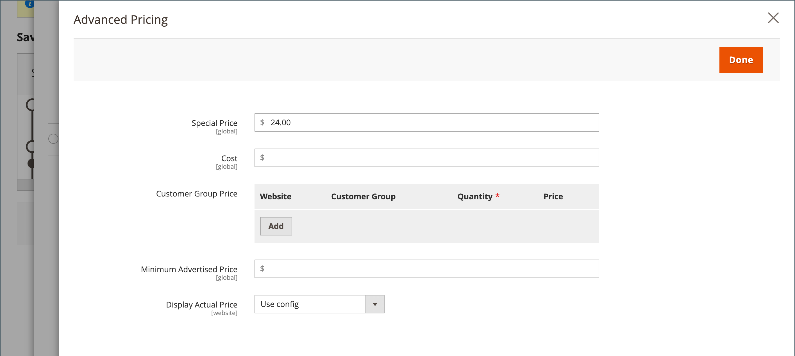

# 特別価格

指定した期間に特別料金を提供することができます。 指定した期間には、通常の価格の代わりに特別な価格が表示され、その後に通常の価格を示す表記が表示されます。

{width="700" zoomable="yes"}

## 個々の製品に特別価格を適用

カタログ内の 1 つの商品に対して、簡単に特別な価格を設定できます。

### スケジュールされた更新を使用

{{ee-feature}}

Adobe Commerceは [予定されている更新](../content-design/content-staging-scheduled-update.md). これらのプロモーションツールを使用して、特定の期間に特定の製品に特別な価格を適用します。

1. 製品を編集モードで開きます。

1. クリック **[!UICONTROL Scheduled Update]**.

   {width="600" zoomable="yes"}

1. の場合 **名前を更新**」に、特別な価格プロモーションの名前を入力します。

1. 概要を入力 **[!UICONTROL Description]**.

1. 以下を使用します。 _カレンダー_ (  ) アイコンをクリックして、 **[!UICONTROL Start Date]** および **[!UICONTROL End Date]** 特別な値上げのために。

   以下を使用すると、 **[!UICONTROL Hour]** および **[!UICONTROL Minute]** スライダを使用して、開始時刻と終了時刻も選択します。 クリック **[!UICONTROL Close]** 開始および終了が設定されたとき。

   {width="600" zoomable="yes"}

1. 下にスクロールして、 _価格_ 「 」フィールドで、「 **[!UICONTROL Advanced Pricing]**&#x200B;をクリックし、 **[!UICONTROL Special Price]** スケジュールされた更新に従って適用される

   {width="600" zoomable="yes"}

1. 完了したら、「 **[!UICONTROL Done]** その後 **[!DNL Save]**.

   ストアフロントでは、特別な価格がカタログリストと製品ページの両方に表示されます。

   The _[!UICONTROL Scheduled Change]_がページの上部に表示されます。

   {width="600" zoomable="yes"}

### 単純な開始日と終了日を使用

{{ce-feature}}

Magento Open Sourceには、「Advanced Pricing」オプションに単純な開始日と終了日のオプションが含まれています。

1. 製品を編集モードで開きます。

1. 下にスクロールして、 _[!UICONTROL Price]_「 」フィールドで、「**[!UICONTROL Advanced Pricing]**をクリックし、**[!UICONTROL Special Price]**金額。

1. 以下を使用します。 _カレンダー_ (  ) アイコンをクリックして、 **[!UICONTROL Start Date]** および **[!UICONTROL End Date]** 特別な値上げのために。

   特別価格は、開始日の初めの深夜 0 時直後に適用さ(00:01)、終了日の前日の午前 0 時(23:59)直前まで続きます。

   {width="600" zoomable="yes"}

1. 完了したら、「 **[!UICONTROL Done]** その後 **[!UICONTROL Save]**.

   ストアフロントでは、特別な価格がカタログリストと製品ページの両方に表示されます。

## 複数の製品に特別な価格を適用

また、複数の製品に特別な価格を割り当てることもできます ( 例： [設定可能な製品](product-create-configurable.md).

### 選択した製品の特別な価格を設定

{{ee-feature}}

次の例は、Adobe Commerceで設定可能な製品の複数の製品バリエーションに同じ特別価格を割り当てる方法を示しています。

1. 次の日： _[!UICONTROL Products]_ページ、クリック&#x200B;**[!UICONTROL Filters]**をクリックし、**[!UICONTROL Name]**設定可能な製品の。

1. 設定 **[!UICONTROL Type]** から `Configurable Product` をクリックします。 **[!UICONTROL Apply Filters]**.

1. すべての製品に同じ特別価格を割り当てる場合は、最初の列のヘッダーにあるコントロールをに設定します。 `Select All`.

   別の方法として、含める各製品のチェックボックスを選択できます。

1. を設定します。 **[!UICONTROL Actions]** ～を制御する `Update attributes`.

1. 下にスクロールして、 _[!UICONTROL Special Price]_フィールドに値を入力し、**[!UICONTROL Change]**の下のチェックボックス_[!UICONTROL Special Price]_ フィールドに値を入力し、オファーする特別価格を入力します。

   {width="600" zoomable="yes"}

1. 完了したら、「 **[!UICONTROL Save]**.

ストアで利用できる特別な価格は、カタログリストおよび製品ページに表示されます。 設定可能な製品の場合、オプションを選択すると、通常の価格も製品ページに表示されます。

### 選択した製品の特別な価格と日付範囲を設定します

{{ce-feature}}

次の例は、Magento Open Sourceで設定可能な製品の複数の製品バリエーションに同じ特別価格を割り当てる方法を示しています。

1. 次の日： _管理者_ サイドバー、移動 **[!UICONTROL Catalog]** > **[!UICONTROL Products]**.

1. クリック **[!UICONTROL Filters]**.

1. 次を入力します。 **[!UICONTROL Name]** 設定可能な製品の。

1. 設定 **[!UICONTROL Type]** から `Simple Product`.

   {width="600" zoomable="yes"}

1. クリック **[!UICONTROL Apply Filters]**.

   グリッドには、設定可能なプロダクトのバリエーションとして関連付けられているすべてのシンプルなプロダクトが一覧表示されます。

1. すべての製品に同じ特別価格を割り当てる場合は、最初の列のヘッダーにあるコントロールをに設定します。 `Select All`.

   別の方法として、含める各製品のチェックボックスを選択できます。

1. を設定します。 **[!UICONTROL Actions]** ～を制御する `Update attributes`.

   {width="600" zoomable="yes"}

1. 下にスクロールして_[!UICONTROL Special Price]**フィールドに値を入力し、次の操作を行います。

   - を選択します。 **[!UICONTROL Change]** _の下のチェックボックス[!UICONTROL Special Price]**フィールドに値を入力し、オファーする特別価格を入力します。

   - を選択します。 **[!UICONTROL Change]** の下のチェックボックス _開始日の特別価格_ フィールドで、 _カレンダー_ (  ) をクリックし、特別価格プロモーションの最初の日付を選択します。

     特別価格は、開始日の初めの深夜 0 時直後に適用さ(00:01)、終了日の前日の午前 0 時(23:59)直前まで続きます。

   - を選択します。 **[!UICONTROL Change]** の下のチェックボックス _今までの特別価格_ フィールドで、 _カレンダー_ (  ) をクリックし、特別価格振り替えの最終日を選択します。

   {width="600" zoomable="yes"}

1. 完了したら、「 **[!UICONTROL Save]**.

   特別価格で更新されたレコードの数を示すメッセージが表示されます。

   指定した日付に特別価格がストア内で利用可能になり、カタログリストや商品ページに表示されます。 設定可能な製品の場合、オプションを選択すると、通常の価格も製品ページに表示されます。

   {width="600" zoomable="yes"}

## テスト

カタログリストと製品ページの両方のストアフロントに特別な価格が正しく表示されない場合は、ブラウザーのキャッシュをクリアします。

1. 次の日： _管理者_ サイドバー、移動 **[!UICONTROL System]** > **[!UICONTROL Cache Management]**.

1. クリック **[!UICONTROL Flush Magento Cache]**.

>[!NOTE]
>
>The **_最終_** 製品価格は **_最小_** 関連する価格。次の式を使用します。  `Final Price=Min(Regular(Base) Price, Group(Tier) Price, Special Price, Catalog Price Rule) + Sum(Min Price per each required custom option)`

>[!NOTE]
>
>**_固定価格_** 製品のカスタマイズ可能なオプションは次のとおりです。 _not_ グループ価格、Tier Price、特別価格、またはカタログ価格のルールの影響を受けます。
