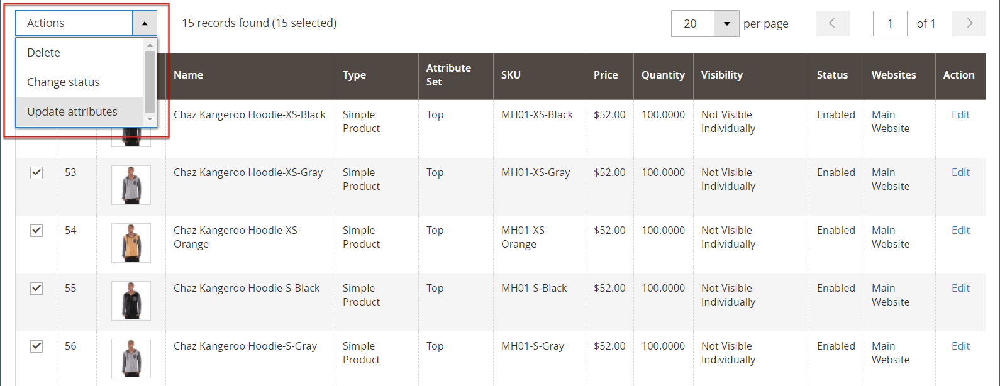

# 特別価格

指定された期間に特別価格を提供することができます。 指定された期間に、通常価格の代わりに特別価格が表示され、その後に通常価格を示す表記が続きます。

{width="700" zoomable="yes"}

## 個々の製品に特別価格を適用する

カタログに掲載されている商品の中から特別価格を簡単に設定できます。

### スケジュールされた更新を使用

{{ee-feature}}

Adobe Commerceでは、[ スケジュールされた更新 ](../content-design/content-staging-scheduled-update.md) がサポートされています。 これらのプロモーションツールを使用して、指定した期間、特定の製品に特別価格を適用します。

1. 製品を編集モードで開きます。

1. 「**[!UICONTROL Scheduled Update]**」をクリックします。

   {width="600" zoomable="yes"}

1. **更新名** には、特別価格昇格の名前を入力します。

1. 簡単な **[!UICONTROL Description]** を入力します。

1. _カレンダー_ （）アイコンを使用して、特別価格昇格の **[!UICONTROL Start Date]** と **[!UICONTROL End Date]** を選択します。

   **[!UICONTROL Hour]** と **[!UICONTROL Minute]** のスライダを使用して、開始時間と終了時間も選択できます。 開始と終了が設定されたら、**[!UICONTROL Close]** をクリックします。

   {width="600" zoomable="yes"}

1. 「_価格_」フィールドまでスクロールし、「**[!UICONTROL Advanced Pricing]**」をクリックして、スケジュールされている更新に従って適用する **[!UICONTROL Special Price]** の金額を入力します。

   {width="600" zoomable="yes"}

1. 完了したら、「**[!UICONTROL Done]**」をクリックし、次に「**[!DNL Save]**」をクリックします。

   ストアフロントでは、カタログリストと商品ページの両方に特別価格が表示されます。

   _[!UICONTROL Scheduled Change]_がページの上部に表示されます。

   {width="600" zoomable="yes"}

### 開始日と終了日を指定します

{{ce-feature}}

Magento Open Sourceには、詳細価格オプションのシンプルな開始日オプションと終了日オプションが含まれています。

1. 製品を編集モードで開きます。

1. 「_[!UICONTROL Price]_」フィールドまでスクロールし、「**[!UICONTROL Advanced Pricing]**」をクリックして&#x200B;**[!UICONTROL Special Price]**の値を入力します。

1. _カレンダー_ （）アイコンを使用して、特別価格昇格の **[!UICONTROL Start Date]** と **[!UICONTROL End Date]** を選択します。

   特別価格は、開始日の午前 0 時（00:01）の直後に発効し、終了日の前日の午前 0 時（23:59）の直前まで継続されます。

   {width="600" zoomable="yes"}

1. 完了したら、「**[!UICONTROL Done]**」をクリックし、次に「**[!UICONTROL Save]**」をクリックします。

   ストアフロントでは、カタログリストと商品ページの両方に特別価格が表示されます。

## 複数の製品に特別価格を適用する

また、複数の製品（複数のバリエーションの [ 設定可能な製品 ](product-create-configurable.md) など）に特別価格を割り当てることもできます。

### 選択した製品に特別価格を設定します

{{ee-feature}}

次の例では、Adobe Commerceで設定可能な商品の複数の商品バリエーションに同じ特別価格を割り当てる方法を示しています。

1. _[!UICONTROL Products]_のページで「**[!UICONTROL Filters]**」をクリックし、設定可能な製品の&#x200B;**[!UICONTROL Name]**を入力します。

1. **[!UICONTROL Type]** を `Configurable Product` に設定し、「**[!UICONTROL Apply Filters]**」をクリックします。

1. すべての製品に同じ特別価格を割り当てる場合は、最初の列のヘッダーにあるコントロールを `Select All` に設定します。

   別の方法として、組み込む各製品のチェックボックスを選択することもできます。

1. **[!UICONTROL Actions]** コントロールを `Update attributes` に設定します。

1. 「_[!UICONTROL Special Price]_」フィールドまでスクロールし、「_[!UICONTROL Special Price]_」フィールドの下にある「**[!UICONTROL Change]**」チェックボックスを選択して、提供する特別価格を入力します。

   {width="600" zoomable="yes"}

1. 完了したら、「**[!UICONTROL Save]**」をクリックします。

ストアで利用可能な特別価格は、カタログリストおよび製品ページに表示されます。 設定可能な製品の場合は、オプションを選択すると、製品ページに通常の価格も表示されます。

### 選択した製品の特別価格と日付範囲の設定

{{ce-feature}}

次の例では、Magento Open Source内の設定可能な商品の複数の商品バリエーションに同じ特別価格を割り当てる方法を示しています。

1. _管理者_ サイドバーで、**[!UICONTROL Catalog]**/**[!UICONTROL Products]** に移動します。

1. 「**[!UICONTROL Filters]**」をクリックします。

1. 設定可能な商品の **[!UICONTROL Name]** を入力します。

1. **[!UICONTROL Type]** を `Simple Product` に設定します。

   {width="600" zoomable="yes"}

1. 「**[!UICONTROL Apply Filters]**」をクリックします。

   グリッドには、設定可能な商品のバリエーションとして関連付けられているシンプルな商品がすべて一覧表示されます。

1. すべての製品に同じ特別価格を割り当てる場合は、最初の列のヘッダーにあるコントロールを `Select All` に設定します。

   別の方法として、組み込む各製品のチェックボックスを選択することもできます。

1. **[!UICONTROL Actions]** コントロールを `Update attributes` に設定します。

   {width="600" zoomable="yes"}

1. [_[!UICONTROL Special Price]**] フィールドまでスクロールし、次の操作を行います。

   - 「_[!UICONTROL Special Price]**」フィールドの下にある「**[!UICONTROL Change]**」チェックボックスをオンにして、提供する特別価格を入力します。

   - 「_特別価格開始日_」フィールドの下にある「**[!UICONTROL Change]**」チェックボックスを選択し、_カレンダー_ （）をクリックして、特別価格昇格の最初の日付を選択します。

     特別価格は、開始日の午前 0 時（00:01）の直後に発効し、終了日の前日の午前 0 時（23:59）の直前まで継続されます。

   - 「_特別価格終了日_」フィールドの下にある「**[!UICONTROL Change]**」チェックボックスを選択し、_カレンダー_ （）をクリックして、特別価格昇格の最終日を選択します。

   {width="600" zoomable="yes"}

1. 完了したら、「**[!UICONTROL Save]**」をクリックします。

   メッセージは、特別価格で更新されたレコードの数を示します。

   特別価格は、指定された日付にストアで利用可能になり、カタログリストおよび製品ページに表示されます。 設定可能な製品の場合は、オプションを選択すると、製品ページに通常の価格も表示されます。

   {width="600" zoomable="yes"}

## テスト

カタログリストと製品ページのストアフロントに特別価格が正しく表示されない場合は、ブラウザーのキャッシュをクリアします。

1. _管理者_ サイドバーで、**[!UICONTROL System]**/**[!UICONTROL Cache Management]** に移動します。

1. 「**[!UICONTROL Flush Magento Cache]**」をクリックします。

>[!NOTE]
>
>**_最終_** 製品価格は、次の式を使用して **_最小_** 関連価格として計算されます。 `Final Price=Min(Regular(Base) Price, Group(Tier) Price, Special Price, Catalog Price Rule) + Sum(Min Price per each required custom option)`

>[!NOTE]
>
>**_固定価格_** 製品カスタマイズ可能なオプションは、グループ価格、階層価格、特別価格、カタログ価格ルールの影響を _受けません_。
