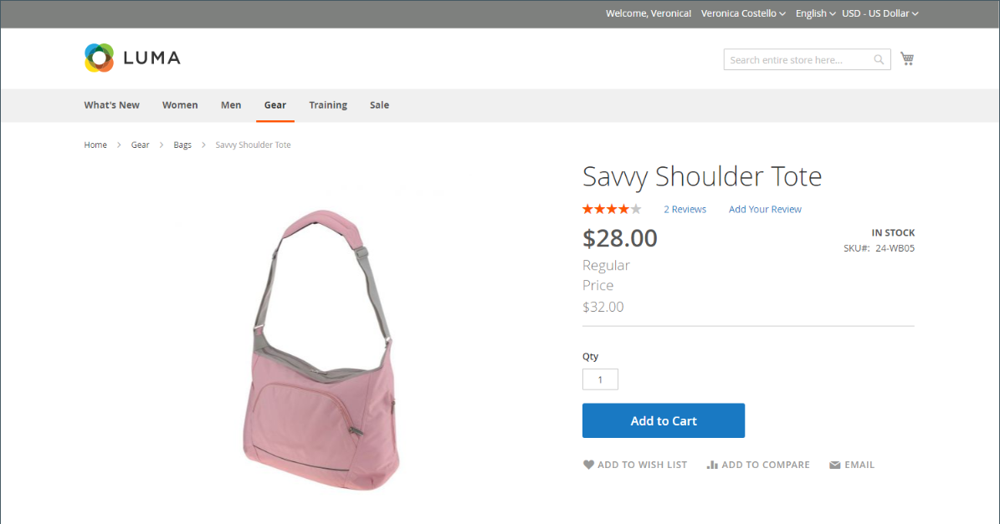

# 特別価格

指定された期間に特別価格を提供することができます。 指定された期間に、通常価格の代わりに特別価格が表示され、その後に通常価格を示す表記が続きます。

{width="700" zoomable="yes"}

## 個々の製品に特別価格を適用する

カタログに掲載されている商品の中から特別価格を簡単に設定できます。

### スケジュールされた更新を使用

{{ee-feature}}

Adobe Commerceはをサポートしています。 [スケジュールされた更新](../content-design/content-staging-scheduled-update.md). これらのプロモーションツールを使用して、指定した期間、特定の製品に特別価格を適用します。

1. 製品を編集モードで開きます。

1. クリック **[!UICONTROL Scheduled Update]**.

   {width="600" zoomable="yes"}

1. の場合 **名前を更新**、特別価格プロモーションの名前を入力します。

1. 概要を入力 **[!UICONTROL Description]**.

1. の使用 _カレンダー_ （  ）アイコンで選択できます **[!UICONTROL Start Date]** および **[!UICONTROL End Date]** 特別価格プロモーションの場合。

   を使用できます **[!UICONTROL Hour]** および **[!UICONTROL Minute]** スライダを使用して、開始時間と終了時間も選択できます。 クリック **[!UICONTROL Close]** 開始と終了が設定されている場合。

   {width="600" zoomable="yes"}

1. にスクロール ダウンします。 _価格_ フィールド、クリック **[!UICONTROL Advanced Pricing]**&#x200B;を入力し、 **[!UICONTROL Special Price]** スケジュールされている更新に従って適用されます。

   {width="600" zoomable="yes"}

1. 完了したら、 **[!UICONTROL Done]** その後 **[!DNL Save]**.

   ストアフロントでは、カタログリストと商品ページの両方に特別価格が表示されます。

   この _[!UICONTROL Scheduled Change]_ページの上部に表示されます。

   {width="600" zoomable="yes"}

### 開始日と終了日を指定します

{{ce-feature}}

Magento Open Sourceには、詳細価格オプションのシンプルな開始日オプションと終了日オプションが含まれています。

1. 製品を編集モードで開きます。

1. にスクロール ダウンします。 _[!UICONTROL Price]_フィールド、クリック&#x200B;**[!UICONTROL Advanced Pricing]**を選択し、を入力します&#x200B;**[!UICONTROL Special Price]**量。

1. の使用 _カレンダー_ （  ）アイコンで選択できます **[!UICONTROL Start Date]** および **[!UICONTROL End Date]** 特別価格プロモーションの場合。

   特別価格は、開始日の午前 0 時（00:01）の直後に発効し、終了日の前日の午前 0 時（23:59）の直前まで継続されます。

   {width="600" zoomable="yes"}

1. 完了したら、 **[!UICONTROL Done]** その後 **[!UICONTROL Save]**.

   ストアフロントでは、カタログリストと商品ページの両方に特別価格が表示されます。

## 複数の製品に特別価格を適用する

また、の複数のバリエーションなど、複数の製品に特別価格を割り当てることもできます [設定可能な製品](product-create-configurable.md).

### 選択した製品に特別価格を設定します

{{ee-feature}}

次の例では、Adobe Commerceで設定可能な商品の複数の商品バリエーションに同じ特別価格を割り当てる方法を示しています。

1. 日 _[!UICONTROL Products]_ページ、クリック&#x200B;**[!UICONTROL Filters]**を入力し、**[!UICONTROL Name]**設定可能な商品の。

1. を設定 **[!UICONTROL Type]** 対象： `Configurable Product` をクリックして、 **[!UICONTROL Apply Filters]**.

1. すべての製品に同じ特別価格を割り当てる場合は、最初の列のヘッダーで、 `Select All`.

   別の方法として、組み込む各製品のチェックボックスを選択することもできます。

1. を **[!UICONTROL Actions]** コントロール先 `Update attributes`.

1. にスクロール ダウンします。 _[!UICONTROL Special Price]_フィールドに移動し、**[!UICONTROL Change]**の下にあるチェックボックス_[!UICONTROL Special Price]_ をフィールドに入力し、提供する特別価格を入力します。

   {width="600" zoomable="yes"}

1. 完了したら、 **[!UICONTROL Save]**.

ストアで利用可能な特別価格は、カタログリストおよび製品ページに表示されます。 設定可能な製品の場合は、オプションを選択すると、製品ページに通常の価格も表示されます。

### 選択した製品の特別価格と日付範囲の設定

{{ce-feature}}

次の例では、Magento Open Source内の設定可能な商品の複数の商品バリエーションに同じ特別価格を割り当てる方法を示しています。

1. 日 _Admin_ サイドバー、に移動 **[!UICONTROL Catalog]** > **[!UICONTROL Products]**.

1. クリック **[!UICONTROL Filters]**.

1. を入力 **[!UICONTROL Name]** 設定可能な商品の。

1. を設定 **[!UICONTROL Type]** 対象： `Simple Product`.

   {width="600" zoomable="yes"}

1. クリック **[!UICONTROL Apply Filters]**.

   グリッドには、設定可能な商品のバリエーションとして関連付けられているシンプルな商品がすべて一覧表示されます。

1. すべての製品に同じ特別価格を割り当てる場合は、最初の列のヘッダーで、 `Select All`.

   別の方法として、組み込む各製品のチェックボックスを選択することもできます。

1. を **[!UICONTROL Actions]** コントロール先 `Update attributes`.

   {width="600" zoomable="yes"}

1. 「_」までスクロールします[!UICONTROL Special Price]** フィールドを使用して、次の操作を実行します。

   - 「」を選択します **[!UICONTROL Change]** _の下のチェックボックス[!UICONTROL Special Price]フィ**ルドに、提供する特別価格を入力します。

   - 「」を選択します **[!UICONTROL Change]** の下にあるチェックボックス _特別価格：開始日_ フィールドで、 _カレンダー_ （  ）を選択し、特別価格プロモーションの最初の日付を選択します。

     特別価格は、開始日の午前 0 時（00:01）の直後に発効し、終了日の前日の午前 0 時（23:59）の直前まで継続されます。

   - 「」を選択します **[!UICONTROL Change]** の下にあるチェックボックス _これまでの特別価格_ フィールドで、 _カレンダー_ （  ）を選択し、特別価格プロモーションの最終日を選択します。

   {width="600" zoomable="yes"}

1. 完了したら、 **[!UICONTROL Save]**.

   メッセージは、特別価格で更新されたレコードの数を示します。

   特別価格は、指定された日付にストアで利用可能になり、カタログリストおよび製品ページに表示されます。 設定可能な製品の場合は、オプションを選択すると、製品ページに通常の価格も表示されます。

   {width="600" zoomable="yes"}

## テスト

カタログリストと製品ページのストアフロントに特別価格が正しく表示されない場合は、ブラウザーのキャッシュをクリアします。

1. 日 _Admin_ サイドバー、に移動 **[!UICONTROL System]** > **[!UICONTROL Cache Management]**.

1. クリック **[!UICONTROL Flush Magento Cache]**.

>[!NOTE]
>
>この **_final_** 製品価格は次のように計算されます **_minimum_** 次の算式を使用した関連価格  `Final Price=Min(Regular(Base) Price, Group(Tier) Price, Special Price, Catalog Price Rule) + Sum(Min Price per each required custom option)`

>[!NOTE]
>
>**_固定価格_** 製品のカスタマイズ可能なオプション _ではない_ グループ価格、階層価格、特別価格、カタログ価格ルールの影響を受けます。
