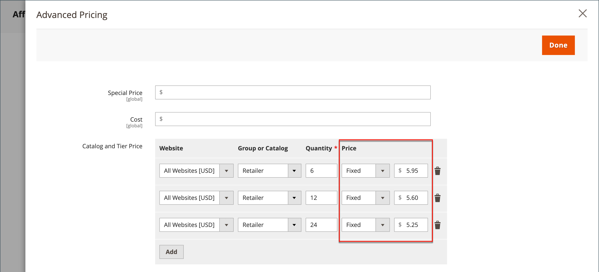

# 階層の価格

階層制では、ストアフロントの商品リストや商品ページで、数量割引を提供することができます。 割引は、特定のストアビュー、顧客グループ、共有カタログに適用できます。

更新する製品が多い場合は、価格変更を個別に入力するのではなく、価格変更を読み込むのが最も効率的です。 詳しくは、[階層の価格の読み込み](../systems/data-import-price-tier.md)を参照してください。

{width="700" zoomable="yes"}

製品ページでは、数量の割引が計算され、次のようなメッセージが表示されます。

`Buy 6 for $5.95 each and save 15%`

ストアフロントの価格は、最も高い数量から最も低い数量までの価格が優先されます。 数量`5`と`10`の階層の価格があり、顧客がショッピングカートに5、6、7、8、または9個の商品を追加した場合、顧客は数量`5`の階層の割引価格を受け取ります。 お客様が10番目の項目を追加すると、数量`10`階層に指定された割引価格が、数量`5`の階層に優先され、`10`の割引価格が適用されます。

## 商品の価格帯を追加

1. 製品を編集モードで開きます。

1. _[!UICONTROL Price]_&#x200B;フィールドの下にある「**[!UICONTROL Advanced Pricing]**」をクリックします。

1. _[!UICONTROL Tier Price]_&#x200B;セクションで、**[!UICONTROL Add]**&#x200B;をクリックします。

   複数の価格の階層を作成する場合は、追加レベルごとに&#x200B;**[!UICONTROL Add]**&#x200B;をクリックして、すべての階層を同時に操作できます。 グループの各層には、同じweb サイトと顧客グループまたは共有カタログの割り当てがありますが、数量と価格は異なります。

## 価格帯の設定

1. ストアに複数のweb サイトがある場合は、階層の価格が適用される&#x200B;**[!UICONTROL Website]**&#x200B;を選択します。

1. 必要に応じて、**[!UICONTROL Customer Group]**&#x200B;または&#x200B;**[!UICONTROL Shared Catalog]** （ Available with [Adobe Commerce B2B](./b2b/../introduction.md) only）を選択して、価格帯の利用可能性を制限します。

1. **[!UICONTROL Qty]**&#x200B;の場合、割引を受けるために注文する必要がある数量を入力します。

   - **方法1:**&#x200B;固定金額として価格を入力します

     **[!UICONTROL Price]**&#x200B;を`Fixed`に設定し、その層の1単位の調整済み価格を入力します。

     {width="600" zoomable="yes"}

   - **方法2:** パーセンテージで価格を入力する

     **[!UICONTROL Price]**&#x200B;を`Discount`に設定し、製品の基本価格に対する割合として割引価格を入力します。

     例えば、15%の割引の場合は、数値`15`を入力します。 （価格は、`15.00`など、2つの小数点以下桁で保存されます。）

     >[!NOTE]
     >
     >割引価格を取得するには、_[!UICONTROL Special Price]_&#x200B;フィールドではなく、_[!UICONTROL Price]_ フィールドで定義された値に対して、定義された割合が計算されます。

     {width="600" zoomable="yes"}

## 価格設定の完了

1. 別のweb サイトまたは顧客グループに別の価格設定を追加するには、前の手順を繰り返します。

1. 完了したら、**[!UICONTROL Done]**&#x200B;をクリックし、**[!UICONTROL Save]**&#x200B;をクリックします。

>[!NOTE]
>
>**_final_**&#x200B;の製品価格は、次の式を使用して&#x200B;**_minimum_**&#x200B;の関連価格として計算されます： `Final Price=Min(Regular(Base) Price, Group(Tier) Price, Special Price, Catalog Price Rule) + Sum(Min Price per each required custom option)`

>[!NOTE]
>
>**_固定価格_**&#x200B;製品のカスタマイズ可能なオプションは、グループ価格、階層価格、特別価格、カタログ価格のルールの影響を受ける&#x200B;_not_&#x200B;です。

## カタログ価格ルールの階層価格を有効にする

[!BADGE SaaSのみ]{type=Positive url="https://experienceleague.adobe.com/en/docs/commerce/user-guides/product-solutions" tooltip="Adobe Commerce as a Cloud Service プロジェクト（Adobeで管理されるSaaS インフラストラクチャ）にのみ適用されます。"}

以前のバージョンのCommerceでは、カタログ価格規則と組み合わせて階層価格設定を使用できませんでした。 カタログルールでは、階層価格の設定は無視され、計算された割引は元の基本価格からのみ適用されます。 Adobe Commerce as a Cloud Serviceを使用して、カタログ価格規則の計算に階層価格を含めることができるようになりました。

この機能を有効にするには：

1. **[!UICONTROL Stores]** > *[!UICONTROL Settings]* > **[!UICONTROL Configuration]** > **[!UICONTROL Sales]** > **[!UICONTROL Sales]** > **[!UICONTROL Promotions]**&#x200B;に移動し、**[!UICONTROL Apply Catalog Price Rule on Grouped Price]** フィールドを&#x200B;**[!UICONTROL Yes]**&#x200B;に設定します。

   {width="700" zoomable="yes"}

1. カタログ価格ルールでターゲットにする特定の顧客グループまたは共有カタログ（`Wholesale`、`Retail`、マーチャント定義グループなど）ごとに数量`1`の階層価格を定義します。 この目的では、`ALL GROUPS`顧客グループと`Default`共有カタログを使用できません。 数量`1`で定義された階層価格を持たないグループでは、階層価格は有効になっていません。

1. 必要に応じて、数量が`1`を超える追加の階層の価格を定義します。 顧客がショッピングカートに商品の追加数量を追加すると、これらの追加価格は通常どおり適用されます。 カタログ価格ルールは、これらの追加価格には適用されません。

1つの製品を購入する際のカタログ価格ルールでの階層価格設定の仕組みを説明するには、次の例を考えてみましょう。

- 商品の基準価格は100米ドルです。
- `Wholesale`のお客様グループに対して、数量`1`および固定価格90 USDの階層価格が定義されます。
- カタログ価格ルールでは、`Wholesale`のお客様グループに対して10%の割引が提供されます。

カタログ価格ルールに対して階層価格が有効になっている場合、システムは次のフローを使用して最終価格を計算します。

1. お客様がログインする前は、製品価格は100 USD （標準標準価格）と表示されます。

1. お客様が`Wholesale` グループのメンバーとしてログインすると、製品価格は90 USD （`Wholesale` グループの階層価格）に調整されます。

1. カタログ価格ルールが適用され、90 USDの階層価格が10%割引され、最終的な価格は81 USDになります。

次の表は、カタログ価格ルールに対して階層価格が有効であり、カタログ価格ルールがすべての顧客グループに対して10%の割引を提供する場合の価格計算をまとめたものです。

商品：標準価格$100 （単品購入）

| 顧客グループ | 階層の価格（数量=1） | 新しい基本価格 | 最終価格 |
|---|---|---|---|
| すべてのグループ | 未設定 | $100 | $100 - 10% = $90 |
| 卸売 | 修正済み：85 ドル | $85 | $85 - 10% = $76.50 |
| Retailer | 20%割引 | $80 | $80 - 10% = $72.00 |
| VIP | 15%割引 | $85 | $85 - 10% = $76.50 |
