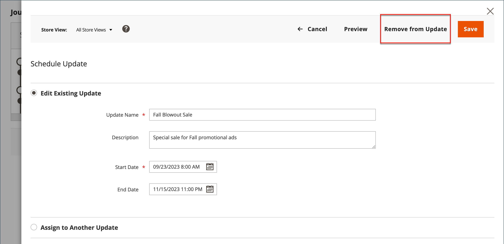

# 製品アップデートのスケジュール

{{ee-feature}}

製品の更新はスケジュールどおりに適用でき、他のコンテンツの変更とグループ化することも可能です。 [ コンテンツステージング ](../content-design/content-staging.md)を使用して、製品に予定されている変更に基づいてキャンペーンを作成したり、既存のキャンペーンに変更を適用したりできます。

製品アップデートおよびキャンペーンの編集スケジュールを設定する際は、次の点に注意してください。

- スケジュールされた更新はすべて連続して適用されます。つまり、どのエンティティも一度に1つのスケジュールされた更新のみを持つことができます。 スケジュールされた更新は、その時間枠内のすべてのストアビューに適用されます。 その結果、エンティティは、異なるストアビューに対して異なるスケジュールされた更新を同時に行うことはできません。 現在のスケジュールされた更新の影響を受けない、すべてのストアビュー内のすべてのエンティティ属性値は、以前のスケジュールされた更新の値ではなく、デフォルト値から取得されます。

- スケジュールされた更新のステージング プレビューは、常に&#x200B;**default** ストアビューから開始され、ステージング更新キャンペーンをナビゲートする顧客のエクスペリエンスをエミュレートします。

- キャンペーンが複数の製品にリンクされている場合、キャンペーンは[ コンテンツステージングダッシュボード ](../content-design/content-staging-dashboard.md)からのみ編集できます。

- アクティブなキャンペーンが最初に終了日なしで作成された場合、そのキャンペーンを後で編集して終了日を含めることはできません。 この場合、重複する施策を作成し、必要な終了日を入力する必要があります。

>[!NOTE]
>
>[!UICONTROL Set Product as New From]および[!UICONTROL To] フィールドと[!UICONTROL Schedule Design Update] タブは Adobe Commerceで削除されました。直接製品で変更することはできません。 これらのアクティベーションのスケジュールされた更新を作成する必要があります。

## スケジュールされた更新の作成

1. _管理者_ サイドバーで、**[!UICONTROL Catalog]** > **[!UICONTROL Products]**&#x200B;に移動します。

1. 既存の製品を選択し、**[!UICONTROL Edit]**&#x200B;をクリックします。

1. **[!UICONTROL Schedule New Update]**&#x200B;をクリックします。

1. **[!UICONTROL Save as a New Update]**&#x200B;を選択します。

1. **[!UICONTROL Update Name]**&#x200B;に、新しいコンテンツステージングキャンペーンの名前を入力します。

1. 更新プログラムの概要&#x200B;**[!UICONTROL Description]**&#x200B;とその使用方法を入力します。

1. カレンダー（）ツールを使用して、キャンペーンの&#x200B;**[!UICONTROL Start Date]**&#x200B;と&#x200B;**[!UICONTROL End Date]**&#x200B;を選択します。

   >[!NOTE]
   >
   >キャンペーン **[!UICONTROL Start Date]**&#x200B;と&#x200B;**[!UICONTROL End Date]**&#x200B;は、各web サイトのローカルタイムゾーンから変換される&#x200B;**_default_**&#x200B;管理者タイムゾーンを使用して定義する必要があります。 たとえば、米国のタイムゾーンにもとづいて施策を開始する複数のタイムゾーンのweb サイトがある場合、ローカルタイムゾーンごとに個別の更新をスケジュールする必要があります。 それぞれに&#x200B;**[!UICONTROL Start Date]**&#x200B;と&#x200B;**[!UICONTROL End Date]**&#x200B;を設定すると、ローカル web サイトのタイムゾーンからデフォルトの管理者タイムゾーンに変換されます。

   {width="600" zoomable="yes"}

1. _[!UICONTROL Price]_までスクロールして、**[!UICONTROL Advanced Pricing]**をクリックします。

1. スケジュールされたキャンペーン中に製品の&#x200B;**[!UICONTROL Special Price]**&#x200B;を入力し、**[!UICONTROL Done]**&#x200B;をクリックします。

1. 完了したら、**[!UICONTROL Save]**&#x200B;をクリックします。

## 既存の更新に割り当てる

1. _管理者_ サイドバーで、**[!UICONTROL Catalog]** > **[!UICONTROL Products]**&#x200B;に移動します。

1. 既存の製品を選択し、**[!UICONTROL Edit]**&#x200B;をクリックします。

1. **[!UICONTROL Schedule New Update]**&#x200B;をクリックします。

1. **[!UICONTROL Assign to Existing Campaign]**&#x200B;を選択します。

1. リストで、変更するキャンペーンを選択します。

   {width="600" zoomable="yes"}

1.  **[!UICONTROL Content]**&#x200B;を展開します。

1. 完了したら、**[!UICONTROL Save]**&#x200B;をクリックします。

## スケジュールされた変更の表示

予定された変更は、製品ページの上部に表示され、キャンペーンの開始日と終了日が表示されます。

{width="600" zoomable="yes"}

## スケジュールされた変更の編集

1. ページ上部の&#x200B;_[!UICONTROL Scheduled Changes]_ボックスで、**[!UICONTROL View/Edit]**をクリックします。

1. スケジュールされた更新に必要な変更を加えます。

1. **[!UICONTROL Save]**&#x200B;をクリックします。

## スケジュールされた変更の削除

1. ページ上部の&#x200B;_[!UICONTROL Scheduled Changes]_ボックスで、**[!UICONTROL View/Edit]**をクリックします。

1. 上部のバーで、**[!UICONTROL Remove from Update]**&#x200B;をクリックします。

   {width="600" zoomable="yes"}

1. ダイアログで、**[!UICONTROL Delete the Update]**&#x200B;を選択し、**[!UICONTROL Done]**&#x200B;をクリックします。

   製品が更新から削除され、スケジュールされたすべての変更が失われます。

## デザインの更新をスケジュール

{{ce-feature}}

_[!UICONTROL Schedule Design Update]_セクションでは、製品ページの外観を一時的に変更することができます。 デザインの変更は、シーズンやプロモーションだけでなく、新鮮なコンテンツを制作するためにも利用できます。 デザインの変更は事前にスケジュールできるので、定義済みのスケジュールに従って有効または_ ドリップ _になります。

{width="600" zoomable="yes"}

| フィールド | 説明 |
|--- |--- |
| [!UICONTROL Schedule Update From/To] | カスタムレイアウトが製品に適用される日付の範囲を指定します。 |
| [!UICONTROL New Theme] | 製品にカスタムテーマを適用します。 |
| [!UICONTROL New Layout] | 製品ページに別のレイアウトを適用します。 オプション： **[!UICONTROL No layout updates]**- デフォルトでは、製品ページのレイアウト更新は利用できません。 **[!UICONTROL Empty]** - 4列ページなど、独自のレイアウトを定義できます。 （XMLの理解が必要です）  **[!UICONTROL 1 column]**– 製品ページに1列のレイアウトを適用します。 **[!UICONTROL 2 columns with left bar]** – 左側のサイドバーを持つ2列レイアウトを製品ページに適用します。 **[!UICONTROL 2 columns with right bar]**– 右側のサイドバーを持つ2列レイアウトを製品ページに適用します。 **[!UICONTROL 3 columns]** - 3列レイアウトを製品ページに適用します。 |

{style="table-layout:auto"}
