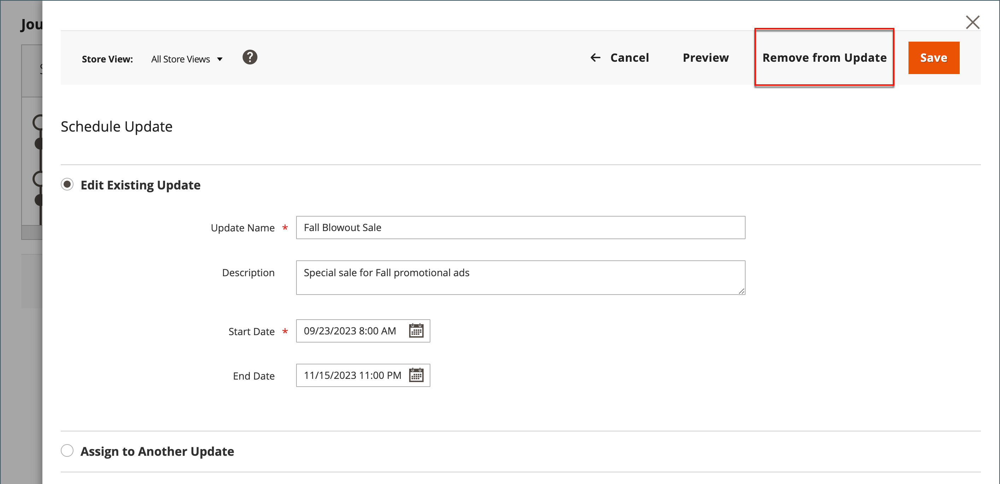
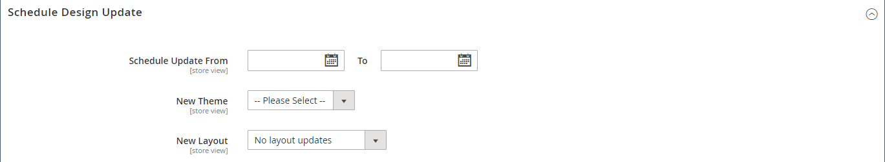

# 製品のアップデートのスケジュール設定

{{ee-feature}}

製品のアップデートは、スケジュールに従って適用し、他のコンテンツの変更と共にグループ化できます。 以下を使用できます。 [コンテンツステージング](../content-design/content-staging.md) ：製品に対する予定された変更に基づいてキャンペーンを作成するか、変更を既存のキャンペーンに適用します。

>[!NOTE]
>
>スケジュールされたすべての更新は連続して適用されます。つまり、どのエンティティも一度に 1 つのスケジュールされた更新のみを持つことができます。 スケジュールされた更新は、その期間内のすべてのストアビューに適用されます。 その結果、異なるストア表示に対して、エンティティが異なるスケジュール済み更新を同時に持つことはできません。 現在のスケジュール済み更新の影響を受けない、すべてのストア表示内のすべてのエンティティ属性値は、以前のスケジュール済み更新の値ではなく、デフォルト値から取得されます。

>[!NOTE]
>
>スケジュールされた更新のステージングプレビューは、常に **デフォルト** ストア表示：ステージング用の更新キャンペーンを使用して移動する顧客のエクスペリエンスをエミュレートします。

## スケジュールされた更新の作成

1. 次の日： _管理者_ サイドバー、移動 **[!UICONTROL Catalog]** > **[!UICONTROL Products]**.

1. 既存の製品を選択し、 **[!UICONTROL Edit]**.

1. クリック **[!UICONTROL Schedule New Update]**.

1. 選択 **[!UICONTROL Save as a New Update]**.

1. の場合 **[!UICONTROL Update Name]**」に、新しいコンテンツステージングキャンペーンの名前を入力します。

1. 概要を入力 **[!UICONTROL Description]** を更新し、その使用方法を示します。

1. カレンダー () ツールを使用して **[!UICONTROL Start Date]** および **[!UICONTROL End Date]** キャンペーンの。

   >[!NOTE]
   >
   >Campaign **[!UICONTROL Start Date]** および **[!UICONTROL End Date]** は、 **_デフォルト_** 管理者タイムゾーン。各 Web サイトのローカルタイムゾーンから変換されます。 例えば、異なるタイムゾーンの複数の Web サイトで、米国のタイムゾーンに基づいてキャンペーンを開始する場合、ローカルタイムゾーンごとに個別の更新をスケジュールする必要があります。 設定 **[!UICONTROL Start Date]** および **[!UICONTROL End Date]** それぞれに対して、およびがローカル web サイトのタイムゾーンからデフォルトの管理タイムゾーンに変換されます。

   {width="600" zoomable="yes"}

1. 下にスクロールして _[!UICONTROL Price]_をクリックします。**[!UICONTROL Advanced Pricing]**.

1. を入力します。 **[!UICONTROL Special Price]** スケジュールされたキャンペーン中の製品の **[!UICONTROL Done]**.

1. 完了したら、「 **[!UICONTROL Save]**.

## 既存の更新に割り当て

1. 次の日： _管理者_ サイドバー、移動 **[!UICONTROL Catalog]** > **[!UICONTROL Products]**.

1. 既存の製品を選択し、 **[!UICONTROL Edit]**.

1. クリック **[!UICONTROL Schedule New Update]**.

1. 選択 **[!UICONTROL Assign to Existing Campaign]**.

1. リストで、変更するキャンペーンを選択します。

   {width="600" zoomable="yes"}

1. 展開  **[!UICONTROL Content]**.

1. 完了したら、「 **[!UICONTROL Save]**.

## 予定されている変更を表示

スケジュールされた変更は、キャンペーンの開始日と終了日と共に、製品ページの上部に表示されます。

{width="600" zoomable="yes"}

## 予定されている変更の編集

1. Adobe Analytics の _[!UICONTROL Scheduled Changes]_」ボックスをクリックします。**[!UICONTROL View/Edit]**.

1. スケジュールされた更新に必要な変更を加えます。

1. クリック **[!UICONTROL Save]**.

## スケジュールされた変更を削除

1. Adobe Analytics の _[!UICONTROL Scheduled Changes]_」ボックスをクリックします。**[!UICONTROL View/Edit]**.

1. 上部のバーで、 **[!UICONTROL Remove from Update]**.

   {width="600" zoomable="yes"}

1. ダイアログで、「 」を選択します。 **[!UICONTROL Delete the Update]** をクリックします。 **[!UICONTROL Done]**.

   >[!NOTE]
   >
   >製品が更新から削除され、スケジュールされた変更はすべて失われます。

## デザインの更新をスケジュールする

{{ce-feature}}

The _[!UICONTROL Schedule Design Update]_「 」セクションでは、製品ページの外観を一時的に変更できます。 季節やプロモーションに合わせてデザインの変更をスケジュールしたり、単に新しいものにしたりできます。 デザインの変更を事前にスケジュールして、有効にすることもできます。_&#x200B;点滴&#x200B;_：定義したスケジュールに従います。

{width="600" zoomable="yes"}

| フィールド | 説明 |
|--- |--- |
| [!UICONTROL Schedule Update From/To] | 製品にカスタムレイアウトを適用する際の日付範囲を決定します。 |
| [!UICONTROL New Theme] | カスタムテーマを製品に適用します。 |
| [!UICONTROL New Layout] | 製品ページに別のレイアウトを適用します。 オプション：  **[!UICONTROL No layout updates]**— デフォルトでは、製品ページのレイアウトの更新は使用できません。 **[!UICONTROL Empty]** - 4 列のページなど、独自のレイアウトを定義できます。 （XML に関する理解が必要です）。  **[!UICONTROL 1 column]**- 1 列のレイアウトを製品ページに適用します。 **[!UICONTROL 2 columns with left bar]**  — 製品ページに左にサイドバーがある 2 列のレイアウトを適用します。  **[!UICONTROL 2 columns with right bar]**— 製品ページに右側のサイドバーを持つ 2 列のレイアウトを適用します。 **[!UICONTROL 3 columns]** - 3 列のレイアウトを製品ページに適用します。 |

{style="table-layout:auto"}
