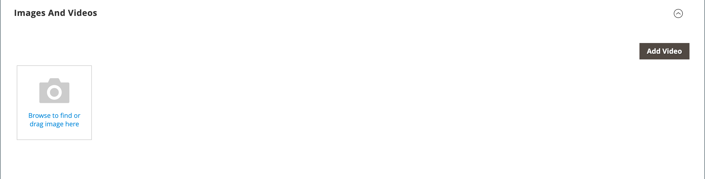

# 製品ビデオの追加

製品ビデオを追加するには、まずGoogleアカウントから API キーを取得し、ストアの設定で入力する必要があります。 次に、製品からビデオにリンクできます。

## 手順 1:YouTube API キーの取得

1. Googleアカウントにログインし、 [Google Developers Console][1].

1. 上部の検索フィールドに、「 `YouTube Data API v3` 検索アイコンをクリックします。

1. API ページが表示されたら、ページが有効になっていることを確認します。

1. 左側のパネルで、を選択します。 **[!UICONTROL Credentials]**.

1. 資格情報を持っているかどうかに応じて、次のいずれかの操作を行います。

   - 必要な資格情報が既にある場合は、 _API キー_ 表。

   - この API の資格情報をまだ持っていない場合は、 **[!UICONTROL Create Credentials]**  上部に表示され、画面の指示に従って必要な資格情報を作成します。 の下 _資格情報の取得_、API キーをコピーして、 **[!UICONTROL Done]**.

1. API キーをクリップボードにコピーします。

1. 右側の編集アイコンをクリックし、API キーが正しいリファラーに制限されていることを確認する制限を設定します。

1. キーが生成されるまでしばらく待ってから、キーをクリップボードにコピーします。

   次の手順では、ストアの設定にキーを貼り付けます。

## 手順 2：コマースでのキーの設定

1. 次の日： _管理者_ サイドバー、移動 **[!UICONTROL Stores]** > _[!UICONTROL Settings]_>**[!UICONTROL Configuration]**.

1. 左側のパネルで、を展開します。 **[!UICONTROL Catalog]** を選択します。 **[!UICONTROL Catalog]** の下に

1. 展開  の _[!UICONTROL Product Video]_」セクションに&#x200B;**[!UICONTROL YouTube API key]**.

   {width="600" zoomable="yes"}

1. 完了したら、「 **[!UICONTROL Save Config]**.

1. プロンプトが表示されたら、キャッシュを更新します。

## 手順 3：ビデオへのリンク

1. 製品を編集モードで開きます。

1. にスクロールし、を展開します。 _[!UICONTROL Images and Videos]_」セクションに入力します。

   {width="600" zoomable="yes"}

1. click **[!UICONTROL Add Video]**.

   YouTube API キーをまだ設定していない場合は、「 **[!UICONTROL OK]** をクリックして続行します。 YouTubeビデオにリンクすることはできませんが、プロセスを実行することはできます。

1. の場合 **[!UICONTROL Url]**、YouTubeまたは Vimeo ビデオの URL を入力します。

   {width="600" zoomable="yes"}

1. 「 」フィールドの外側をクリックし、API キーやビデオに関するフィードバックを待ちます。

   すべてがチェックアウトされた場合、YouTubeはビデオの基本情報を提供します

1. 次を入力します。 **[!UICONTROL Title]** および **[!UICONTROL Description]** ビデオの。

1. をアップロードするには、以下を実行します。 **[!UICONTROL Preview Image]**、画像を参照し、ファイルを選択します。

   >[!NOTE]
   >
   >アップロード後、表示されるプレビュー画像は、外部のビデオサービスプロバイダーによって自動的に生成されます。 Adobe Commerce Admin からは画像を編集できません。

1. ビデオのメタデータを使用する場合は、 **[!UICONTROL Get Video Information]**.

1. ビデオをストアでどのように使用するかを指定するには、各 **[!UICONTROL Role]** 該当する場合：

   - `Base Image`
   - `Small Image`
   - `Swatch Image`
   - `Thumbnail`
   - `Hide from Product Page`

1. 完了したら、「 **[!UICONTROL Save]**.

   >[!NOTE]
   >
   >次の場合、 _[!UICONTROL Autostart base video]_設定オプションは次のように設定されます。 `Yes` ただし、ビデオの自動再生が開始されないのは、ブラウザーによって適用され、Adobe Commerceで制御できない自動再生ポリシーが原因である可能性があります。 サポートされる各ブラウザーには、時間の経過と共に変化する独自の自動再生ポリシーがあり、ビデオは将来自動再生されない可能性があります。 推奨ベストプラクティスとしては、ビジネスクリティカルな機能の自動再生を利用せず、サポートされる各ブラウザーでストア内のビデオ自動再生動作をテストする必要があります。

## API アクセスの管理

Google開発者によると [利用条件]90 日以上非アクティブになっているアカウントの API アクセスは、 YouTubeによって無効化される場合があります。 この場合、ビデオが表示されなくなる可能性があります。 API へのアクセスを最新の状態に保つには、cron ジョブを使用して、API に一定の間隔で ping を送信します。

```code
30 10 1 * * curl -i -G -e https://yourdomain.com/ -d "part=snippet&maxResults=1&q=test&key=YOUTUBEAPIKEY" https://www.googleapis.com/youtube/v3/search >/dev/null 2>&1
```

## フィールド参照

| フィールド | 説明 |
|--- |--- |
| [!UICONTROL URL] | 関連するビデオの URL。 |
| [!UICONTROL Title] | ビデオタイトル。 |
| [!UICONTROL Description] | ビデオの説明。 |
| [!UICONTROL Preview Image] | ストア内のビデオのプレビューとして使用される、アップロードされた画像です。 |
| [!UICONTROL Get Video Information] | ホストサーバーに保存されているビデオメタデータを取得します。 必要に応じて、元のデータを使用したり、更新したりできます。 |
| [!UICONTROL Role] | ストアでのプレビュー画像の使用方法を指定します。 次のオプションの組み合わせを選択できます。 `Base Image`, `Small Image`, `Thumbnail`, `Swatch Image`, `Hide from Product Page` |

{style="table-layout:auto"}

[1]: https://console.developers.google.com/
[利用条件]: https://developers.google.com/youtube/terms/developer-policies#d.-accessing-youtube-api-services
