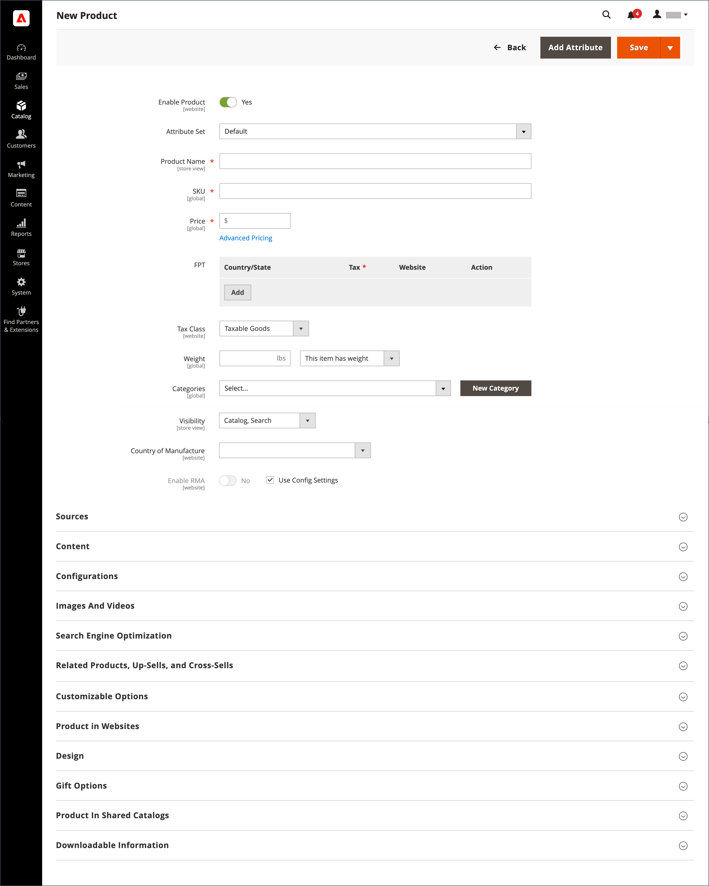

# 製品ワークスペース

製品ワークスペースは、すべての製品タイプで基本的に同じですが、フィールドの選択は、使用する属性セットによって変わります。 製品属性はフォームの上部に表示され、その後に商品情報の展開可能なセクションが続きます。 新しい製品を初めて保存すると、フォームの左上に _[!UICONTROL Store View]_&#x200B;選択が表示されます。

{width="700" zoomable="yes"}

## [!UICONTROL Enable Product] 設定

製品のオンラインステータスは、フォーム上部のスイッチで示されます。 オンラインステータスを変更するには、**[!UICONTROL Enable Product]** スイッチを `Yes` または `No` に設定します。

| 制御 | 説明 |
|-------- | ----------- |
|  | 製品がオンラインであることを示します。 |
|  | 製品がオフラインであることを示します。 |

{style="table-layout:auto"}

## 属性セット

[&#x200B; 属性セット &#x200B;](attribute-sets.md) の名前が左上隅に表示され、製品レコードに表示されるフィールドを決定します。 別の属性セットを選択するには、デフォルトの属性セット名の横にある下向き矢印をクリックします。

{width="600" zoomable="yes"}

## 展開/折りたたむ

セクションを展開または折りたたむには、展開  または折りたたむ  アイコンをクリックします。

## [!UICONTROL Save] メニュー

_[!UICONTROL Save]_&#x200B;のメニューには、保存して続行、保存して作成、保存して複製、保存して閉じるなどのいくつかのオプションが含まれています。

{width="600" zoomable="yes"}

| コマンド | 説明 |
|--- |--- |
| [!UICONTROL Save] | 現在の製品を保存して、作業を続行します。 |
| [!UICONTROL Save & New] | 現在の製品を保存して閉じ、同じ製品タイプとテンプレートに基づいて新しい製品を開始します。 |
| [!UICONTROL Save & Duplicate] | 現在の製品を保存して閉じ、新しい複製コピーを開きます。 |
| [!UICONTROL Save & Close] | 現在の製品を保存し、_[!UICONTROL Products]_&#x200B;ワークスペースに戻ります。 |

{style="table-layout:auto"}

## デフォルトのフィールド値

製品の作成時に時間を節約するために、複数の製品フィールドのデフォルト値は別のフィールドの値を参照します。 デフォルト値をそのまま使用するか、別の値を入力します。 次のフィールドには、デフォルト値が自動的に生成されています。

| フィールド | デフォルト |
|----- |------- |
| [!UICONTROL SKU] | 製品名に基づいています。 |
| [!UICONTROL Meta Title] | 製品名に基づいています。 |
| [!UICONTROL Meta Keywords] | 製品名に基づいています。 |
| [!UICONTROL Meta Description] | 製品名と説明に基づいています。 |

{style="table-layout:auto"}

別のフィールドの値を表すプレースホルダーは、二重中括弧で囲まれています。 製品 [&#x200B; 属性セット &#x200B;](attribute-sets.md) に含まれる属性コードは、プレースホルダーとして使用できます。

{width="600" zoomable="yes"}

これらの設定の詳細なリストについては、[&#x200B; 設定リファレンス &#x200B;](../configuration-reference/catalog/catalog.md#product-fields-auto-generation) の _製品フィールドの自動生成_ を参照してください。

### プレースホルダー値の編集

1. _管理者_ サイドバーで、**[!UICONTROL Stores]**/_[!UICONTROL Settings]_/**[!UICONTROL Configuration]**&#x200B;に移動します。

1. 左側のパネルで「**[!UICONTROL Catalog]**」を展開し、その下の「**[!UICONTROL Catalog]**」を選択します。

1. 「 「**[!UICONTROL Product Fields Auto-Generation]**」セクションを展開し、プレースホルダーの値に必要な変更を加えます。

   例えば、すべてのメタ説明に含めるすべての製品またはフレーズに含める特定のキーワードがある場合は、適切なフィールドに直接値を入力します。

   >[!NOTE]
   >
   >既存のプレースホルダー値を保持する場合は、各マークアップタグを囲む二重中括弧を保持します。

1. 完了したら、「**[!UICONTROL Save Config]**」をクリックします。

### 共通のプレースホルダー

- `{{color}}`
- `{{country_of_manufacture}}`
- `{{description}}`
- `{{gender}}`
- `{{material}}`
- `{{name}}`
- `{{short_description}}`
- `{{size}}`
- `{{sku}}`
