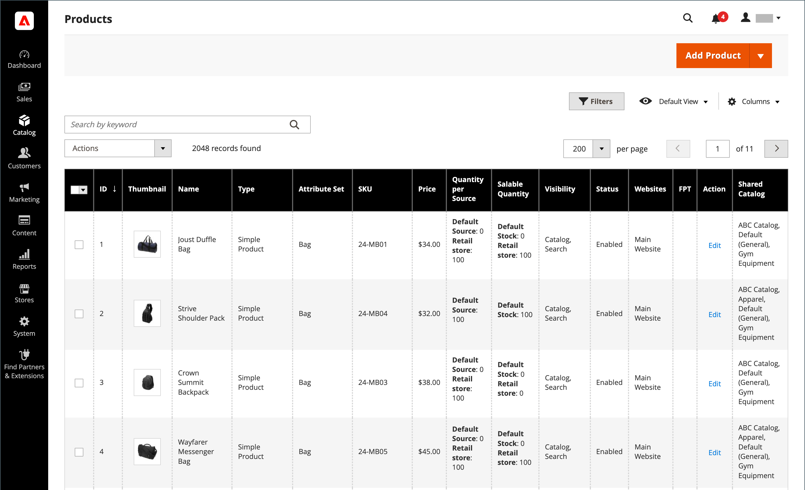

# 製品リスト

カタログ内のすべての製品は、 _[!UICONTROL Products]_」ページを開きます。このページでは、製品を作成して既存の製品を編集できます。 マルチサイトインストールの場合、各 Web サイトで同じカタログから異なる製品を選択して販売できます。

The _[!UICONTROL Products]_リストには、カタログ内のすべての製品が含まれ、それらの製品が使用可能な Web サイトと、それらが現在販売可能かどうかが示されます。 B2B( を使用したAdobe Commerceインストール ) [共有カタログ](../b2b/catalog-shared.md) 有効にすると、共有カタログ内で代替割引価格が設定されている製品を示す列がグリッドに含まれます。

リストのページをページごとに参照したり、特定の製品を検索したりできます。 標準の [controls](../getting-started/admin-grid-controls.md) リストの並べ替えとフィルターを行うには、次の手順を実行します。 [アクション](../getting-started/admin-actions-control.md) を選択した製品に追加します。

{width="700" zoomable="yes"}

## 製品の表示を制限

大きなカタログのパフォーマンスを向上させるには、グリッドに表示する製品の数を制限することをお勧めします。 次の項目に対して、表示される製品グリッドを制限できます。

- 製品ページ
- 関連/アップセル/クロスセル製品の追加
- 製品をバンドル製品に追加
- 製品をグループ製品に追加
- 注文を作成（管理者）

製品の表示制限に対するこの設定は、デフォルトで無効になっています。 有効にすると、グリッド内の商品の数を特定の値に制限できます。 有効にしており、グリッド表示で一致する製品の数がレコードの制限を超える場合、レコードの限られたコレクションが返されます。 この制限に達すると、見つかった合計レコード数、選択したレコード数およびページネーション要素はグリッドヘッダーに表示されません。

>[!NOTE]
>
>商品グリッドを制限しない場合は、フィルターをより正確に使用して、 _[!UICONTROL Records Limit]_フィールドに入力します。

**_製品の表示制限を設定するには：_**

1. 次の日： _管理者_ サイドバー、移動 **[!UICONTROL Stores]** > _[!UICONTROL Settings]_>**[!UICONTROL Configuration]**.

1. 展開 **[!UICONTROL Advanced]** を選択します。 **[!UICONTROL Admin]**.

1. 展開  の **[!UICONTROL Admin Grids]** 」セクションで次の操作を実行します。

   - 設定 **[!UICONTROL Limit Number of Products in Grid]** から `Yes`.

   - （オプション） **[!UICONTROL Records Limit]** フィールドを使用して、グリッド内の製品の数を特定の値に制限できます。 デフォルトの最小値は次のとおりです。 `20000`.

   {width="600" zoomable="yes"}

1. 完了したら、「 **[!UICONTROL Save Config]**.

## ページコントロール

| 制御 | 説明 |
|--- |--- |
| [!UICONTROL Add Product] | 新しいシンプルな製品を作成するプロセスを開始します。 特定の製品タイプを選択するには、下向き矢印をクリックします。 オプション： [[!UICONTROL Simple Product]](product-create-simple.md) / [[!UICONTROL Configurable Product]](product-create-configurable.md) / [[!UICONTROL Grouped Product]](product-create-grouped.md) / [[!UICONTROL Virtual Product]](product-create-virtual.md) / [[!UICONTROL Bundle Product]](product-create-bundle.md) / [[!UICONTROL Downloadable Product]](product-create-downloadable.md) / [[!UICONTROL Gift Card]](product-gift-card-create.md) |
| [!UICONTROL Actions] | リスト内の選択した製品に適用できるすべてのアクションをリストします。 製品または製品のグループにアクションを適用するには、各製品の最初の列にあるチェックボックスを選択します。 オプション： `Delete` / `Change Status` / `Update Attributes` / `Assign Inventory Source` / `Unassign Inventory Source` / `Transfer Inventory To Source` |
| [!UICONTROL Filters] | 現在のフィルターに基づいてカタログ検索を開始します。 |
| [!UICONTROL Default View] | 現在のグリッド列のレイアウトを示します。 保存されているグリッド列ビューがある場合は、別のビューを選択できます。 |
| [!UICONTROL Columns] | リスト内の選択した製品に適用できるすべてのアクションをリストします。 製品または製品のグループにアクションを適用するには、各製品の最初の列にあるチェックボックスを選択します。 |
| [!UICONTROL Search by keyword] | 左上隅の検索ボックスは、キーワードで商品を検索するために使用されます。 |
| [!UICONTROL Edit] | 製品を編集モードで開きます。 行の任意の場所をクリックすることで、同じことを実行できます。 |

{style="table-layout:auto"}

## デフォルトの列

| 列 | 説明 |
|--- |--- |
| （チェックボックス） | 1 つのアクションの対象となる複数のレコードを選択します。 選択した各レコードの最初の列のチェックボックスがオンになっています。 オプション：  **[!UICONTROL Select All]**— 現在のフィルター設定に一致する、見つかったすべてのレコードを選択します。 **[!UICONTROL Select All on This Page]**  — 現在のページで、フィルター設定に一致するレコードのみを選択します。 |
| [!UICONTROL ID] | 新しい製品が初めて保存される際に割り当てられる一意の順番。 |
| [!UICONTROL Thumbnail] | メイン製品画像のサムネールを表示します。 |
| [!UICONTROL Name] | 製品名。 |
| [!UICONTROL Type] | 製品タイプ。 |
| [!UICONTROL Attribute Set] | 製品のテンプレートとして使用される属性セットの名前。 |
| [!UICONTROL SKU] | 製品に割り当てられる一意の在庫管理単位。 |
| [!UICONTROL Price] | 製品の単価。 |
| [!UICONTROL Quantity] | 在庫数。 |
| [!UICONTROL Salable Quantity] | この製品の使用可能なすべての単位の合計。 |
| [!UICONTROL Visibility] | カタログ内で商品が表示される場所を示します。 オプション： `Not Visible Individually` / `Catalog` / `Search` / `Catalog, Search` |
| [!UICONTROL Status] | 製品のステータスを示します。 オプション： `Enabled` および `Disabled` |
| [!UICONTROL Websites] | 製品が使用可能な Web サイトを示します。 |
| [!UICONTROL Action] | 製品を編集モードで開きます。 |
| [!UICONTROL Shared Catalog] |  （で使用可能） [Adobe Commerce用 B2B](./b2b/../introduction.md) （のみ）製品のカスタム価格が含まれる共有カタログを示します。 |

{style="table-layout:auto"}

## その他の列

| 列 | 説明 |
|--- |--- |
| [!UICONTROL Short Description] | 製品の簡単な説明。 |
| [!UICONTROL Special Price From Date] | 特別価格振興の最初の日。 |
| [!UICONTROL Special Price To Date] | 特別価格振り向けの最終日。 |
| [!UICONTROL Cost] | 品目の実際のコスト。 |
| [!UICONTROL Manufacturer] | 製品の製造元。 |
| [!UICONTROL Meta Keywords] | 製品のメタキーワード。 |
| [!UICONTROL Color] | 商品の色。 |
| [!UICONTROL Set Product as New from Date] | 新しいプロモーションとしてのセット製品の最初の日付。 |
| [!UICONTROL Set Product as New to Date] | 新しいプロモーションとしてのセット製品の最終日。 |
| [!UICONTROL Active From / To] | 製品の開始日と終了日。 |
| [!UICONTROL Layout] | 商品のレイアウト。 |
| [!UICONTROL Minimum Advertised Price] | 商品の最低広告価格。 |
| [!UICONTROL Allow Gift Message] | ギフトカードを購入した顧客へのギフトメッセージ。 |
| [!UICONTROL Special Price] | 商品の特別価格。 |
| [!UICONTROL Weight] | 製品の重み付け。 |
| [!UICONTROL Meta Title] | 製品のメタタイトル。 |
| [!UICONTROL Meta Description] | 製品メタデータの説明。 |
| [!UICONTROL Country of Manufacture] | 製造国。 |
| [!UICONTROL New Theme] | カスタムテーマを製品に適用しました。 |
| [!UICONTROL URL Key] | 製品の URL キー。 |
| [!UICONTROL Tax Class] | 製品税区分。 |
| [!UICONTROL Allow Gift Message] | 商品のギフトメッセージオプションの有効性を表示します。 |

{style="table-layout:auto"}
