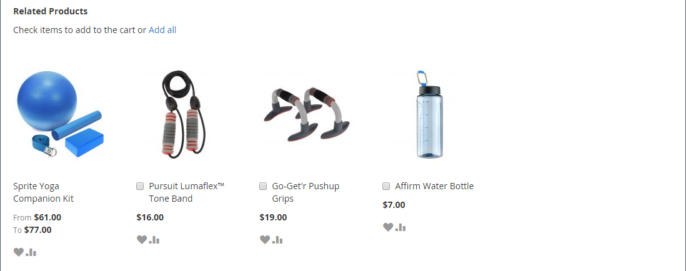
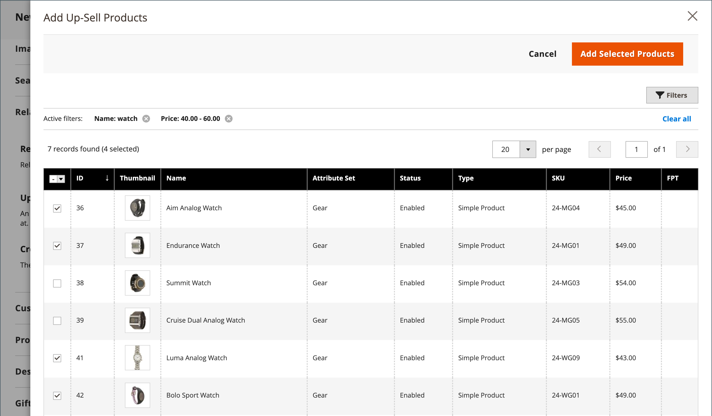

# 製品設定 – [!UICONTROL Related Products, Up-Sells, and Cross-Sells]

_[!UICONTROL Related Products, Up-Sells, and Cross-Sells]_の節では、顧客が興味を持つ可能性のある追加製品のセレクションを提示する簡単なプロモーションブロックを設定します。 詳しくは、[ 製品の関係 ](../merchandising-promotions/product-relationships.md) を参照してください。

{width="600" zoomable="yes"}

各ブロックは、特定のオプションに属する製品のリストで構成されます。

| フィールド | 説明 |
|--- |--- |
| [!UICONTROL ID] | 製品エンティティに割り当てられる一意の数値 ID。 |
| [!UICONTROL Thumbnail] | 製品のサムネール画像。 |
| [!UICONTROL Name] | 商品の名前。 |
| [!UICONTROL Status] | 製品のステータスを示します。 オプション：`Enabled`/`Disabled`。 無効になった製品は、フロントエンドのブロックには表示されません。 |
| [!UICONTROL Attribute Set] | 製品のテンプレートとして使用される属性セットの名前。 |
| [!UICONTROL SKU] | 商品に割り当てられる一意の最小在庫管理単位。 |
| [!UICONTROL Price] | 商品の単価。 |
| [!UICONTROL Action] | オプション：`Remove`。 ブロックから商品を削除します。 |

{style="table-layout:auto"}

>[!TIP]
>
> （Adobe Commerceのみ） **Adobe AI を活用した Product Recommendations** は、人工知能と機械学習アルゴリズムを使用して集計された訪問者データの詳細な分析を実行することで、商品関係を定義するプロセスを簡素化します。 このデータをAdobe Commerce カタログと組み合わせると、買い物客にとって非常に魅力的で関連性が高く、パーソナライズされたエクスペリエンスが得られます。
> 
>手動で設定した Product Recommendations やアップセルの代わりに、このAdobeが開発した拡張機能を使用する方法について詳しくは、『 _[Product Recommendations ガイド ](https://experienceleague.adobe.com/docs/commerce/product-recommendations/guide-overview.html)_ 』を参照してください。

## 関連製品

関連製品は、お客様が閲覧している品目に加えて購入する必要があります。 顧客はチェックボックスをクリックするだけで、買い物かごに項目を配置できます。 _関連製品_ ブロックの配置は、定義されたテーマとページレイアウトに応じて異なります。 次の例では、_製品表示_ ページの下部に _関連製品_ ブロックが表示されます。 2 列のレイアウトの場合、右側のサイドバーに _関連製品_ ブロックが表示されることがよくあります。

{width="600" zoomable="yes"}

関連製品を設定する手順は、次のとおりです。

1. 製品を編集モードで開きます。

1. 下にスクロールして、「 展開セレクター **[!UICONTROL Related Products, Up-Sells, and Cross-Sells]** を展開します。

1. 「**[!UICONTROL Add Related Products]**」をクリックします。

1. [ フィルターコントロール ](../getting-started/admin-grid-controls.md) を使用して、必要な商品を検索します。

1. リストで、関連製品として機能させる製品のチェックボックスをオンにします。

   {width="600" zoomable="yes"}

1. 完了したら、「**[!UICONTROL Add Selected Products]**」をクリックします。

## アップセル

アップセル製品は、現在考慮されている製品ではなく、顧客が好む可能性のある項目です。 アップセルとして提供される商品は、より高品質の、より人気のある、またはより良い利益率を持つ可能性があります。 アップセルされた製品は、製品ページの見出し _次の製品にも興味がある場合があります_ の下に表示されます。

{width="600" zoomable="yes"}

アップセル製品を選択する手順は、次のとおりです。

1. 製品を編集モードで開きます。

1. 下にスクロールして、「 展開セレクター **[!UICONTROL Related Products, Up-Sells, and Cross-Sells]** を展開します。

1. 「**[!UICONTROL Add Up-Sell Products]**」をクリックします。

1. [ フィルターコントロール ](../getting-started/admin-grid-controls.md) を使用して、必要な商品を検索します。

1. リストで、アップセル製品として機能させる製品のチェックボックスをオンにします。

   {width="600" zoomable="yes"}

1. 完了したら、「**[!UICONTROL Add Selected Products]**」をクリックします。

>[!NOTE]
>
>親バンドル製品は、そのすべての子製品のアップセル製品として常に自動的に表示されます。

## クロスセル

クロスセルアイテムは、チェックアウトラインのレジの隣に配置されたインパルス購入に似ています。 クロスセルとして提供された製品は、顧客がチェックアウトプロセスを開始する直前に、買い物かごページに表示されます。

>[!NOTE]
>
>店舗表示ごとにクロスセル項目を表示または非表示にするには、買い物かごで [ チェックアウト/買い物かご ](../configuration-reference/sales/checkout.md) オプションを _[!UICONTROL Show Cross-sell Items]_認します。 特定の販売中や、ストア表示での A/B テストのために、クロスセルを非表示にすることができます。

{width="600" zoomable="yes"}

**_クロスセル製品を選択するには、:_** の手順に従います。

1. 製品を編集モードで開きます。

1. 下にスクロールして、「 展開セレクター **[!UICONTROL Related Products, Up-Sells, and Cross-Sells]** を展開します。

1. 「**[!UICONTROL Add Cross-Sell Products]**」をクリックします。

1. [ フィルターコントロール ](../getting-started/admin-grid-controls.md) を使用して、必要な商品を検索します。

1. リストで、クロスセル製品として機能させる製品のチェックボックスをオンにします。

   {width="600" zoomable="yes"}

1. 完了したら、「**[!UICONTROL Add Selected Products]**」をクリックします。
