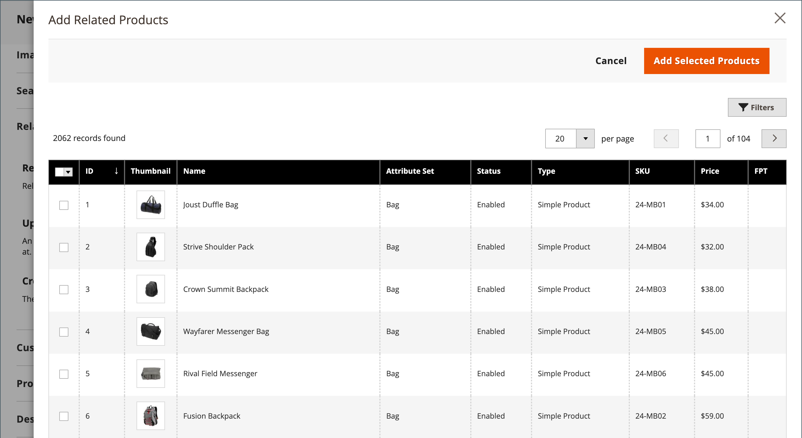

# 製品設定 –  [!UICONTROL Related Products, Up-Sells, and Cross-Sells]

の使用 _[!UICONTROL Related Products, Up-Sells, and Cross-Sells]_顧客が興味を持つ可能性のある追加製品の選択を提示する簡単なプロモーションブロックを設定する節です。 詳しくは、を参照してください [製品の関係](../merchandising-promotions/product-relationships.md).

{width="600" zoomable="yes"}

各ブロックは、特定のオプションに属する製品のリストで構成されます。

| フィールド | 説明 |
|--- |--- |
| [!UICONTROL ID] | 製品エンティティに割り当てられる一意の数値 ID。 |
| [!UICONTROL Thumbnail] | 製品のサムネール画像。 |
| [!UICONTROL Name] | 商品の名前。 |
| [!UICONTROL Status] | 製品のステータスを示します。 オプション： `Enabled` / `Disabled`. 無効になった製品は、フロントエンドのブロックには表示されません。 |
| [!UICONTROL Attribute Set] | 製品のテンプレートとして使用される属性セットの名前。 |
| [!UICONTROL SKU] | 商品に割り当てられる一意の最小在庫管理単位。 |
| [!UICONTROL Price] | 商品の単価。 |
| [!UICONTROL Action] | オプション： `Remove`. ブロックから商品を削除します。 |

{style="table-layout:auto"}

>[!TIP]
>
> （Adobe Commerceのみ） **Adobe Senseiによる製品Recommendations** 人工知能と機械学習アルゴリズムを使用して、集計された訪問者データの深い分析を実行することで、製品関係を定義するプロセスを簡素化します。 このデータをAdobe Commerce カタログと組み合わせると、買い物客にとって非常に魅力的で関連性が高く、パーソナライズされたエクスペリエンスが得られます。
> 
>手動で設定した Product Recommendations やアップセルの代わりに、このAdobeが開発した拡張機能を使用する方法について詳しくは、 _[製品Recommendationsガイド](https://experienceleague.adobe.com/docs/commerce-merchant-services/product-recommendations/guide-overview.html)_.

## 関連製品

関連製品は、お客様が閲覧している品目に加えて購入する必要があります。 顧客はチェックボックスをクリックするだけで、買い物かごに項目を配置できます。 の配置 _関連製品_ ブロックは、定義されたテーマとページレイアウトに応じて異なります。 以下の例では、 _関連製品_ ブロックが下に表示されます _製品表示_ ページ。 2 列のレイアウトを使用すると、 _関連製品_ ブロックは、多くの場合、右側のサイドバーに表示されます。

{width="600" zoomable="yes"}

関連製品を設定する手順は、次のとおりです。

1. 製品を編集モードで開きます。

1. 下にスクロールして展開  この **[!UICONTROL Related Products, Up-Sells, and Cross-Sells]** セクション。

1. クリック **[!UICONTROL Add Related Products]**.

1. の使用 [フィルターコントロール](../getting-started/admin-grid-controls.md) 目的の商品を検索します。

1. リストで、関連製品として機能させる製品のチェックボックスをオンにします。

   {width="600" zoomable="yes"}

1. 完了したら、 **[!UICONTROL Add Selected Products]**.

## アップセル

アップセル製品は、現在考慮されている製品ではなく、顧客が好む可能性のある項目です。 アップセルとして提供される商品は、より高品質の、より人気のある、またはより良い利益率を持つ可能性があります。 アップセル商品は、商品ページの次のような見出しの下に表示されます _また、次の製品にも関心があるかもしれません_.

{width="600" zoomable="yes"}

アップセル製品を選択する手順は、次のとおりです。

1. 製品を編集モードで開きます。

1. 下にスクロールして展開  この **[!UICONTROL Related Products, Up-Sells, and Cross-Sells]** セクション。

1. クリック **[!UICONTROL Add Up-Sell Products]**.

1. の使用 [フィルターコントロール](../getting-started/admin-grid-controls.md) 目的の商品を検索します。

1. リストで、アップセル製品として機能させる製品のチェックボックスをオンにします。

   {width="600" zoomable="yes"}

1. 完了したら、 **[!UICONTROL Add Selected Products]**.

>[!NOTE]
>
>親バンドル製品は、そのすべての子製品のアップセル製品として常に自動的に表示されます。

## クロスセル

クロスセルアイテムは、チェックアウトラインのレジの隣に配置されたインパルス購入に似ています。 クロスセルとして提供された製品は、顧客がチェックアウトプロセスを開始する直前に、買い物かごページに表示されます。

>[!NOTE]
>
>ストア表示ごとにクロスセル項目を表示または非表示にするには、を参照してください。 [チェックアウト > ショッピング カート](../configuration-reference/sales/checkout.md) というオプション _[!UICONTROL Show Cross-sell Items]_買い物かごに入れます。 特定の販売中や、ストア表示での A/B テストのために、クロスセルを非表示にすることができます。

{width="600" zoomable="yes"}

**_クロスセル製品を選択する手順は、次のとおりです。_**

1. 製品を編集モードで開きます。

1. 下にスクロールして展開  この **[!UICONTROL Related Products, Up-Sells, and Cross-Sells]** セクション。

1. クリック **[!UICONTROL Add Cross-Sell Products]**.

1. の使用 [フィルターコントロール](../getting-started/admin-grid-controls.md) 目的の商品を検索します。

1. リストで、クロスセル製品として機能させる製品のチェックボックスをオンにします。

   {width="600" zoomable="yes"}

1. 完了したら、 **[!UICONTROL Add Selected Products]**.
