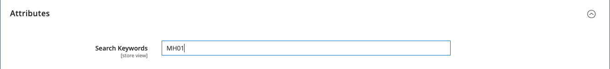

# 検索結果

>[!NOTE]
>
>このページでは、 [ライブ検索](https://experienceleague.adobe.com/docs/commerce-merchant-services/live-search/overview.html).

The _検索結果_ リストには、「クイック検索」ボックスまたは「詳細検索」フォームに入力した検索条件に一致するすべての製品が含まれます。 カタログ内のすべての製品リストには、基本的に同じコントロールがあります。 唯一の違いは、一方が検索クエリの結果、もう一方が [ナビゲーション](navigation.md).

結果は、グリッドまたはリストの形式に設定し、属性の選択で並べ替えることができます。 ページに収まらない製品がある場合は、ページネーションコントロールが表示されます。 これらのコントロールを使用して、あるページから次のページに移動します。 1 ページあたりのレコード数は、カタログフロントエンドの設定によって決まります。 詳しくは、 [製品リスト](navigation-product-listings.md).

を使用 **Elasticsearch**:

- サフィックスによる検索は、標準ではサポートされていません。 例えば、キーワードに SKU の最後の部分のみが含まれている場合、SKU で検索しても期待した結果が返されないことがあります。
- 次の用のプレフィックス（部分キーワード検索）による検索は、標準でサポートされています。 `name` および `sku` 製品属性のみ。 その他のすべての製品属性は、完全に一致するキーワード全体で検索されます。
- 次の検索結果： `name` および `sku` 製品属性は、完全に一致するのではなく、関連度に基づいています。 最も関連性の高い一致 ( 完全に一致する _製品名_ または _SKU_&#x200B;が最初に表示されます。 完全一致を検索するには、検索クエリで二重引用符を使用します。 例えば、 `WSH12-32-Red` 検索クエリは、複数の製品を関連度順に並べ替えて返す場合があります。 しかし、 `"WSH12-32-Red"` 検索クエリで返される製品の数は、 **_正確に_** 一致 `sku`.

{width="700" zoomable="yes"}

>[!IMPORTANT]
>
>2023 年 8 月のElasticsearch7 のサポート終了のお知らせにより、すべてのAdobe Commerceのお客様は OpenSearch 2.x 検索エンジンに移行することをお勧めします。 製品のアップグレード中に検索エンジンを移行する方法については、 [OpenSearch への移行](https://experienceleague.adobe.com/docs/commerce-operations/upgrade-guide/prepare/opensearch-migration.html) （内） _アップグレードガイド_.

## 検索結果を拡張するためのキーワードマッピング

この方法では、属性を使用して 2 つの製品間のキーワードベースの関連付けを作成し、いずれかの製品を検索すると、両方の製品の結果が返されるようにします。 キーワードマッピングを使用すると、製品が表示されない場所で検索結果に商品をプロモーションすることができます。

{width="700" zoomable="yes"}

次の例では、SKU に基づくキーワードマッピングを使用しています。 いずれかの SKU が検索ボックスに入力されると、両方の製品が結果に表示されます。 次の設定可能な製品の SKU は、製品バリエーションの SKU ではなく、マッピングされます。

- モンタナウインドジャケット (MJ03)
- チャズカンガルーホーディ (MH01)

### 手順 1：属性の作成

1. Adobe Analytics の _[!UICONTROL Products]_リストを開き、 `Montana Wind Jacket` (MJ03) 編集モード。
1. 右上隅で、 **[!UICONTROL Add Attribute]**.
1. 次の日： _属性を選択_ ページ、クリック **[!UICONTROL Create New Attribute]**.
1. 次のように、属性プロパティを設定します。

   **[!UICONTROL Attribute Properties]**

   - [!UICONTROL Attribute Label]  - `Search Keywords`
   - [!UICONTROL Catalog Input Type for Store Owner] - `Text Field`

   **[!UICONTROL Advanced Attribute Properties]**

   - [!UICONTROL Add to Column Options] - `Yes` （デフォルト）
   - [!UICONTROL Use in Filter Options] - `Yes` （デフォルト）

   **[!UICONTROL Storefront Properties]**

   - [!UICONTROL Use in Search] - `Yes`
   - [!UICONTROL Visible on Catalog Pages in the Storefront] - `No`
   - [!UICONTROL Used in Product Listings] - `No`

1. 完了したら、「 **[!UICONTROL Save Attribute]**.

   属性が製品の属性セットに追加されます。

### 手順 2：最初の製品をマッピングする

1. 製品設定ページで、下にスクロールして「 _[!UICONTROL Attributes]_」セクションに入力します。
1. Adobe Analytics の **[!UICONTROL Search Keywords]** フィールドに、SKU を入力します。 `MH01` この製品にマッピングされる

   複数の SKU をスペースで区切って「検索キーワード」フィールドに入力できます。 この例では、1 つだけを入力します。

   {width="600" zoomable="yes"}

1. 完了したら、「 **[!UICONTROL Save]**.
1. に移動します。 **[!UICONTROL System]** > _[!UICONTROL Tools]_>**[!UICONTROL Cache Management]**をクリックし、**[!UICONTROL Page Cache]**.

### 手順 3:2 つ目の製品をマッピングする

1. Adobe Analytics の _[!UICONTROL Products]_リストを開き、 `Chaz Kangaroo Hoodie` (MH01) 編集モード。
1. 下にスクロールして、 **[!UICONTROL Attributes]** 」セクションに入力します。
1. Adobe Analytics の **[!UICONTROL Search Keywords]** 」フィールドに、他の製品の SKU を入力します。 `MJ03`.
1. クリック **[!UICONTROL Save]**.
1. に移動します。 **[!UICONTROL System]** > _[!UICONTROL Tools]_>**[!UICONTROL Cache Management]**をクリックし、**[!UICONTROL Page Cache]**.

### 手順 4：ストアフロントでテストする

1. ストアフロントに移動し、「 `MJ03` （内） _クイック検索_ ボックス。
1. 両方の製品が検索結果リストに返されることを確認します。

## 重み付け検索

カタログ検索が有効な製品属性に重み付けを割り当てて、検索結果の値を大きくすることができます。 重みが大きい属性は、重みが小さい属性の前に返されます。 たとえば、システムに 2 つの属性がある場合、 _カラー_ 検索の重み付けが 3 で、 _説明_ 検索の重み付けは 1 です。 単語の検索 _赤_ は、色属性値がの製品のリストを返します。 `red` が検索結果の最上部に表示され、「 _赤_ をクリックします。 この例では、 `color` 属性の重み付けが `description` 属性。

**_属性の検索の重み付けプロパティを設定するには、次の手順に従います。_**

1. 次の日： _管理者_ サイドバー、移動 **[!UICONTROL Stores]** > _[!UICONTROL Attributes]_>**[!UICONTROL Product]**.

1. リストで属性を探し、編集モードで開きます。

1. 左側のパネルで、を選択します。 **[!UICONTROL Storefront Properties]** 次の操作を実行します。

   - 属性を検索クエリに含めるには、 **[!UICONTROL Use in Search]** から `Yes`.

   - 属性の検索値を設定するには、 **[!UICONTROL Search Weight]** を 1 ～ 10 の数値に設定します。ここで、 `10` が最も高い優先度を持ちます。 値を入力しない場合、すべての属性はデフォルトで検索の重み付け ( `1`.

   {width="600" zoomable="yes"}

1. 完了したら、「 **[!UICONTROL Save Attribute]**.
