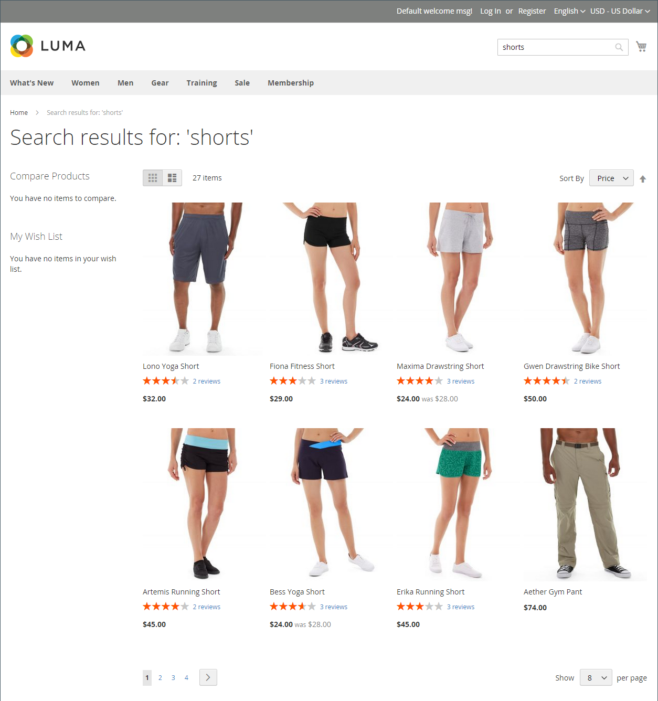
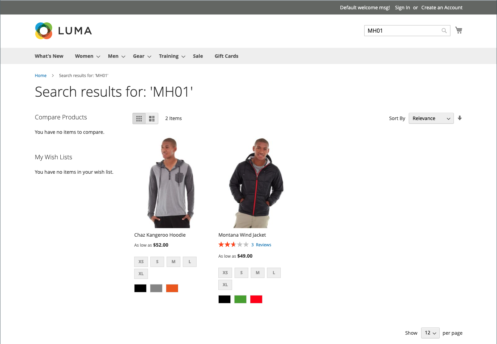
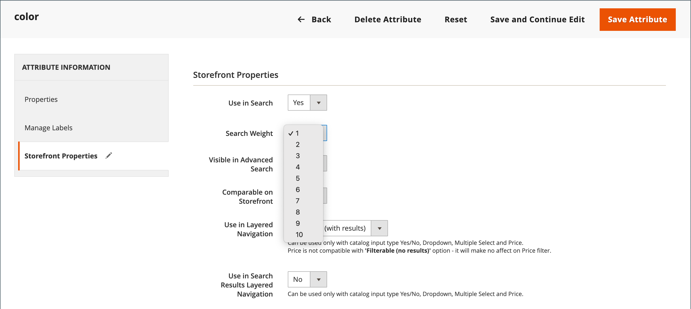

# 検索結果

>[!NOTE]
>
>このページでは、[ ライブサーチ ](https://experienceleague.adobe.com/docs/commerce/live-search/overview.html)とは異なる可能性のある標準検索機能について説明します。

_検索結果_ リストには、クイック検索ボックスまたは高度な検索フォームに入力された検索条件に一致するすべての製品が含まれます。 カタログ内のあらゆる商品リストは、基本的に同じコントロールを備えています。 唯一の違いは、一方が検索クエリの結果であり、もう一方の違いは[ ナビゲーション ](navigation.md)の結果であることです。

結果は、グリッドまたはリストとしてフォーマットされ、属性の選択で並べ替えることができます。 ページに収まりきらない商品が存在する場合は、ページネーションのコントロールが表示されます。 これらのコントロールを使用して、あるページから次のページに移動します。 ページあたりのレコード数は、カタログフロントエンド設定によって決まります。 詳しくは、[製品リスト ](navigation-product-listings.md)を参照してください。

**Elasticsearch**&#x200B;の場合：

- サフィックスによる検索の標準サポートはありません。 例えば、キーワードにSKUの最後の部分のみが含まれている場合、SKUによる検索で期待される結果が返されない場合があります。
- `name`および`sku`個の製品属性に対してのみ、接頭辞による検索（部分的なキーワード検索）を標準でサポートしています。 その他のすべての製品属性は、キーワード全体で検索され、完全に一致します。
- `name`と`sku`個の製品属性の検索結果は、完全一致ではなく、関連性に基づいています。 正確に一致する&#x200B;_製品名_&#x200B;または&#x200B;_SKU_&#x200B;など、最も関連性の高い一致が最初にリストされます。 完全一致を検索するには、顧客は検索クエリで二重引用符を使用できます。 例えば、`WSH12-32-Red`検索クエリでは、関連性で並べ替えられた複数の商品が返される場合があります。 しかし、`"WSH12-32-Red"`検索クエリでは、**_個が`sku`と正確に_**&#x200B;が一致する商品は1つしか返されません。

{width="700" zoomable="yes"}

>[!IMPORTANT]
>
>2023年8月のElasticsearch 7のサポート終了のお知らせにより、すべてのAdobe Commerceのお客様はOpenSearch 2.x検索エンジンに移行することをお勧めします。 製品のアップグレード中に検索エンジンを移行する方法について詳しくは、_アップグレードガイド_&#x200B;の「[OpenSearchへの移行](https://experienceleague.adobe.com/docs/commerce-operations/upgrade-guide/prepare/opensearch-migration.html)」を参照してください。

## 検索結果を拡張するためのキーワードマッピング

この手法では、属性を使用して2つの製品間のキーワードベースの関連付けを作成し、いずれかの製品を検索すると両方の製品の結果が返されるようにします。 キーワードマッピングを使用すると、検索結果で商品が表示されない場合に商品を宣伝できます。

{width="700" zoomable="yes"}

次の例では、SKUに基づいたキーワードマッピングを使用しています。 いずれかのSKUを検索ボックスに入力すると、両方の製品が結果に表示されます。 製品バリエーションのSKUではなく、次の設定可能な製品のSKUがマッピングされます。

- モンタナウインドジャケット（MJ03）
- チャズ・カンガルーパーカー（MH01）

### 手順1：属性の作成

1. _[!UICONTROL Products]_リストで、`Montana Wind Jacket` （MJ03）を編集モードで開きます。
1. 右上隅の「**[!UICONTROL Add Attribute]**」をクリックします。
1. _属性を選択_ ページで、**[!UICONTROL Create New Attribute]**&#x200B;をクリックします。
1. 属性のプロパティを次のように入力します。

   **[!UICONTROL Attribute Properties]**

   - [!UICONTROL Attribute Label]  - `Search Keywords`
   - [!UICONTROL Catalog Input Type for Store Owner] - `Text Field`

   **[!UICONTROL Advanced Attribute Properties]**

   - [!UICONTROL Add to Column Options] - `Yes` （既定値）
   - [!UICONTROL Use in Filter Options] - `Yes` （既定値）

   **[!UICONTROL Storefront Properties]**

   - [!UICONTROL Use in Search] - `Yes`
   - [!UICONTROL Visible on Catalog Pages in the Storefront] - `No`
   - [!UICONTROL Used in Product Listings] - `No`

1. 完了したら、**[!UICONTROL Save Attribute]**&#x200B;をクリックします。

   属性は、製品の属性セットに追加されます。

### ステップ 2：最初の製品をマップ化する

1. 製品設定ページで、下にスクロールして「_[!UICONTROL Attributes]_」セクションを展開します。
1. **[!UICONTROL Search Keywords]** フィールドに、この製品にマッピングするSKU `MH01`を入力します。

   検索キーワード フィールドに、複数のSKUをスペースで区切って入力できます。 この例では、1つしか入力されていません。

   検索キーワード ](./assets/search-keywords-attribute.png){width="600" zoomable="yes"}を含む![属性セクション

1. 完了したら、**[!UICONTROL Save]**&#x200B;をクリックします。
1. **[!UICONTROL System]** > _[!UICONTROL Tools]_>**[!UICONTROL Cache Management]**に移動し、**[!UICONTROL Page Cache]**を更新します。

### 手順3:2つ目の商品のマッピング

1. _[!UICONTROL Products]_リストで、`Chaz Kangaroo Hoodie` （MH01）を編集モードで開きます。
1. 下にスクロールして、**[!UICONTROL Attributes]** セクションを展開します。
1. **[!UICONTROL Search Keywords]** フィールドに、他の製品のSKU `MJ03`を入力します。
1. **[!UICONTROL Save]**&#x200B;をクリックします。
1. **[!UICONTROL System]** > _[!UICONTROL Tools]_>**[!UICONTROL Cache Management]**に移動し、**[!UICONTROL Page Cache]**を更新します。

### ステップ 4：ストアフロントでテストする

1. ストアフロントに移動し、_クイック検索_ ボックスに`MJ03`と入力します。
1. 両方の製品が検索結果リストに返されることを確認します。

## 重み付け検索

カタログ検索で有効になっている製品属性に重みを割り当てることで、検索結果で高い値を割り当てることができます。 重みが大きい属性は、重みが小さい属性よりも前に返されます。 例えば、システムに2つの属性がある場合、検索の重みが3の&#x200B;_color_&#x200B;と検索の重みが1の&#x200B;_description_。 _red_&#x200B;という単語を検索すると、検索結果の上部にカラー属性値`red`を持つ商品のリストが返され、検索結果の下部に&#x200B;_red_&#x200B;という単語を含む説明が返されます。 この例では、`color`属性の重みが`description`属性よりも大きく定義されています。

>[!IMPORTANT]
>
>関連性による並べ替えは、**_multiple_**&#x200B;の条件と、それらの間の関係&#x200B;**_が同時に_**&#x200B;影響を受けます。 [!UICONTROL Search Weight]は、これらの条件の1つにすぎません。 そのため、検索重みが小さい属性の方が、検索重みが大きい属性よりも関連性が高い場合があります。 その他の基準には、任意の属性の一致数、見つかった検索語句の位置、検索語句の前後の全体的なテキスト構造が含まれます。

**_属性:_**&#x200B;の検索重みプロパティを設定するには

1. _管理者_ サイドバーで、**[!UICONTROL Stores]** > _[!UICONTROL Attributes]_>**[!UICONTROL Product]**に移動します。

1. リストで属性を検索し、編集モードで開きます。

1. 左側のパネルで、**[!UICONTROL Storefront Properties]**&#x200B;を選択し、次の操作を行います。

   - 検索クエリに属性を含めるには、**[!UICONTROL Use in Search]**&#x200B;を`Yes`に設定します。

   - 属性の検索値を確立するには、**[!UICONTROL Search Weight]**&#x200B;を1 ～ 10の数値に設定します。ここで、`10`は最も優先度が高くなります。 値が入力されない場合、すべての属性のデフォルトの検索重みは`1`です。

   {width="600" zoomable="yes"}を検索

1. 完了したら、**[!UICONTROL Save Attribute]**&#x200B;をクリックします。
