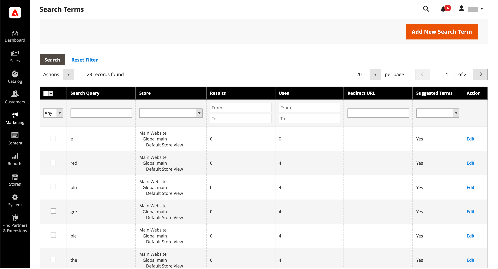
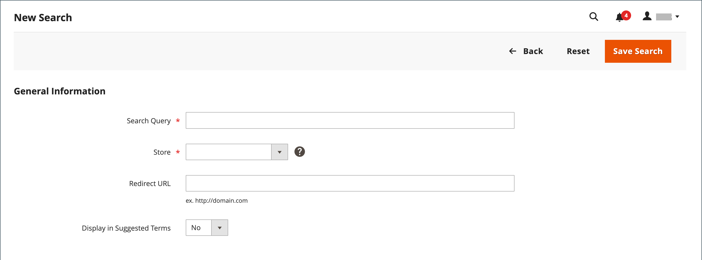
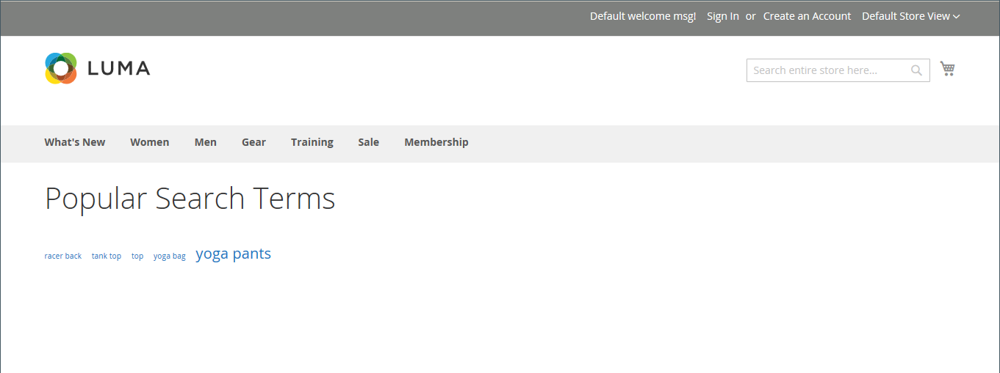
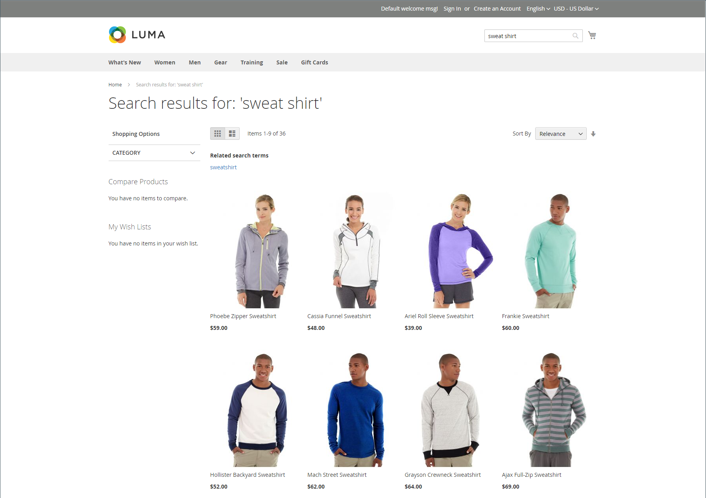
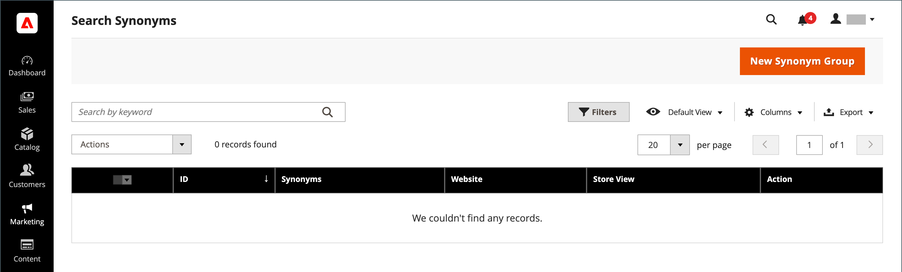
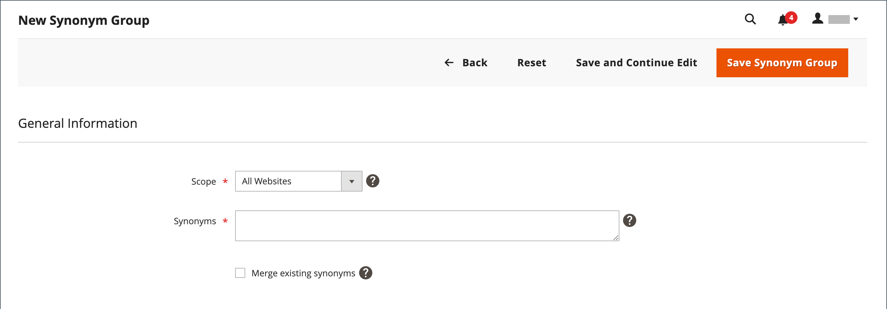
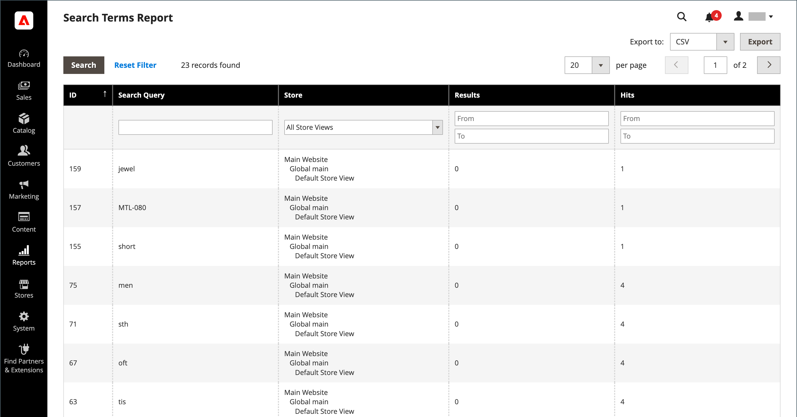

# 検索語を管理

検索語句の[&#x200B; ランディングページ &#x200B;](../content-design/pages.md)は、コンテンツページ、カテゴリーページ、製品詳細ページ、または別のサイトのページにすることができます。

検索語を使用して一般的な誤字をキャプチャし、適切なページにリダイレクトします。 例えば、鍛鉄製のパティオ家具を販売している場合、多くの人がその用語を&#x200B;_ロッドアイアン_&#x200B;や&#x200B;_ロットアイアン_&#x200B;と誤って入力していることに気づきます。 スペルが間違っている各単語を検索語句として入力し、_錬鉄_&#x200B;の類義語にすることができます。 スペルが間違っていても、検索はWrought Ironのページに向けられます。

また、店舗で商品を検索するために使用される検索語を調べることで、顧客が何を求めているのかを把握することもできます。 カタログに掲載されていない商品を探す人が十分であれば、セールスオポチュニティを示している可能性があります。 一方、顧客に手元に置いたままにするのではなく、カタログ内の別の商品にリダイレクトできます。

## 検索語を追加

ストアで検索に使用する新しい単語を見つけたら、それらの単語を検索語リストに追加して、カタログ内で最も一致する商品にオーディエンスを誘導できます。

{width="700" zoomable="yes"}

| 列 | 説明 |
|--- |--- |
| [!UICONTROL Search Query] | 検索を実行するために使用されるクエリ。 |
| [!UICONTROL Store] | 検索クエリが適用されたストア。 |
| [!UICONTROL Results] | クエリで見つかった結果の数。 |
| [!UICONTROL Uses] | 使用回数。 |
| [!UICONTROL Redirect URL] | 検索を実行した後にユーザーがリダイレクトされたターゲットページのURL。 |
| [!UICONTROL Suggested Terms] | クエリ結果に推奨用語が表示されるかどうかを指定します。 |
| [!UICONTROL Actions] | 製品を編集モードで開きます。 |

{style="table-layout:auto"}

>[!NOTE]
>
>この検索クエリを使用して買い物客が検索を実行するたびに、結果の数が更新されます。 製品のいずれかが変更または削除された場合は、更新されません。

### 検索語を追加

1. _管理者_ サイドバーで、**[!UICONTROL Marketing]** > _[!UICONTROL SEO & Search]_>**[!UICONTROL Search Terms]**&#x200B;に移動します。

1. **[!UICONTROL Add New Search Term]**&#x200B;をクリックします。

   {width="600" zoomable="yes"}

1. **[!UICONTROL Search Query]** ボックスの「_[!UICONTROL General Information]_」に、新しい検索語句として追加する単語または語句を入力します。

1. ストアが複数の言語で利用可能な場合は、該当する&#x200B;**[!UICONTROL Store]** ビューを選択します。

1. 検索結果をストア内の別のページまたは別のweb サイトにリダイレクトするには、**[!UICONTROL Redirect URL]** フィールドにターゲットページの完全なURLを入力します。

1. 検索結果が返されない場合にいつでも、この用語を候補として使用できるようにするには、**[!UICONTROL Display in Suggested Terms]**&#x200B;を`Yes`に設定します。

1. 完了したら、**[!UICONTROL Save Search]**&#x200B;をクリックします。

## 検索語を編集

1. _[!UICONTROL Search Terms]_&#x200B;グリッドで、任意のレコードの行をクリックして、検索キーワードを編集モードで開きます。

1. 必要な変更を加えます。

1. 完了したら、**[!UICONTROL Save Search]**&#x200B;をクリックします。

## 検索語を削除

検索語を削除するには、グリッドと編集ページの2つの方法があります。

**方法1:** _[!UICONTROL Search Terms]_&#x200B;グリッド内

1. リストで、削除する用語のチェックボックスを選択します。

1. リストの左上隅で、**[!UICONTROL Actions]**&#x200B;を`Delete`に設定します。

1. 完了したら、**[!UICONTROL Submit]**&#x200B;をクリックします。

**方法2:** _[!UICONTROL Edit a Search Term]_&#x200B;ページ

1. _管理者_ サイドバーで、**[!UICONTROL Marketing]** > _[!UICONTROL SEO & Search]_>**[!UICONTROL Search Terms]**&#x200B;に移動します。

1. 削除する検索語句を見つけ、編集モードで開きます。

1. **[!UICONTROL Delete Search]**&#x200B;をクリックします。

1. アクションを確認するには、**[!UICONTROL OK]**&#x200B;をクリックします。

## 人気の検索語

ストアのフッターの&#x200B;_検索語_ リンクには、ストアの訪問者が使用した検索語が人気ごとにランク付けされて表示されます。 検索語句は&#x200B;_タグクラウド_&#x200B;形式で表示されます。テキストのサイズは、語句の人気度を示します。

デフォルトでは、Popular Search Termsは検索エンジン最適化ツールとして有効になっていますが、カタログ検索プロセスに直接接続されていません。 検索語ページは検索エンジンによってインデックス作成されるので、ページ上の任意の用語は、検索エンジンのランキングとストアの可視性を向上させるのに役立ちます。 人気の検索語ページのURLは次のとおりです：`mystore.com/search/term/popular/`

{width="600" zoomable="yes"}

**_人気の検索語句を設定するには:_**

1. _管理者_ サイドバーで、**[!UICONTROL Stores]** > _[!UICONTROL Settings]_>**[!UICONTROL Configuration]**&#x200B;に移動します。

1. 左側のパネルで「**[!UICONTROL Catalog]**」を展開し、下の「**[!UICONTROL Catalog]**」を選択します。

1. **[!UICONTROL Search Engine Optimization]** セクションのを展開します。

   {width="600" zoomable="yes"}

   これらのオプションの詳細なリストについては、_設定リファレンス_&#x200B;の[検索エンジン最適化](../configuration-reference/catalog/catalog.md#search-engine-optimization)を参照してください。

1. 必要に応じて&#x200B;**[!UICONTROL Popular Search Terms]**&#x200B;を設定します。

   必要に応じて、**[!UICONTROL Use system value]** チェックボックスをオフにして、この設定を変更します。

1. 完了したら、**[!UICONTROL Save Config]**&#x200B;をクリックします。

>[!NOTE]
>
>人気のある[&#x200B; カタログ検索](search-configuration.md)のキャッシュをさらに設定できます。

## 類義語を検索

[&#x200B; カタログ検索](search-configuration.md)の有効性を向上させる方法の1つは、同じ項目を説明するために使用できる様々な用語を含めることです。 誰かが&#x200B;_ソファ_&#x200B;を探しており、製品が&#x200B;_ソファ_&#x200B;として表示されているという理由だけで、販売を失いたくはありません。 _couch_&#x200B;の類義語として&#x200B;_sofa_、_davenport_、_loveseat_&#x200B;を入力して、より幅広い検索語を取得し、同じランディングページに誘導できます。

Adobe Commerceでは、次の2つの異なる類義語管理ソリューションをサポートしています。

- ライブサーチ [同義語](https://experienceleague.adobe.com/docs/commerce/live-search/live-search-admin/synonyms/synonyms.html?lang=ja)機能は、ライブサーチがインストールされたAdobe Commerce インストールで使用できます。
- 標準の同義語検索機能（このページで説明）は、すべてのAdobe Commerce インストールで標準で使用できます。

>[!NOTE]
>
>標準の検索同義語機能は、標準装備の`name`および`sku`個の製品属性&#x200B;**_のみ_**&#x200B;をサポートしています。

>[!IMPORTANT]
>
>検索類義語機能では、フルテキスト一致の検索方法のみを使用します。

{width="700" zoomable="yes"}

### 同義語グループの作成

1. _管理者_ サイドバーで、**[!UICONTROL Marketing]** > _[!UICONTROL SEO & Search]_>**[!UICONTROL Search Synonyms]**&#x200B;に移動します。

   _[!UICONTROL Search Synonyms]_&#x200B;グリッドが表示されます。 検索の類義語を初めて使用する場合、グリッドは空になります。

   {width="700" zoomable="yes"}

1. **[!UICONTROL New Synonym Group]**&#x200B;をクリックします。

   {width="700" zoomable="yes"}

1. 類義語が適用されるストアビューに&#x200B;**[!UICONTROL Scope]**&#x200B;を設定します。

1. グループ内の各同義語をコンマで区切って入力します。 検索条件として使用される可能性のある単語を選択します。 例：

   - `sweatshirt, sweat shirt, hoodie, fleece`
   - `cell phone, mobile phone, smart phone`
   - `couch, sofa, davenport`
   - `wrought iron, rot iron, rod iron`

1. これらの類義語を同じスコープを持つ他のグループと結合するには、**[!UICONTROL Merge existing synonyms]** チェックボックスを選択します。

1. 完了したら、**[!UICONTROL Save Synonym Group]**&#x200B;をクリックします。

### 同義語グループの編集

1. _[!UICONTROL Search Synonyms]_&#x200B;グリッドで、任意のレコードの行をクリックして、同義語グループを編集モードで開きます。

1. 必要な変更を加えます。

1. 完了したら、**[!UICONTROL Save Synonym Group]**&#x200B;をクリックします。

### 同義語グループの削除

同義語グループを削除するには、グリッドと編集ページの2つの方法があります。

**メソッド 1:**&#x200B;を検索の類義語グリッドに表示

1. _[!UICONTROL Search Synonyms]_&#x200B;グリッドで、削除するグループのチェックボックスを選択します。

1. リストの左上隅で、**[!UICONTROL Actions]**&#x200B;を`Delete`に設定します。

1. 完了したら、**[!UICONTROL Submit]**&#x200B;をクリックします。

**同義語グループの編集ページの方法2:**

1. 「同義語を検索」グリッドで、任意のレコードの行をクリックして、同義語グループを編集モードで開きます。

1. **[!UICONTROL Delete Synonym Group]**&#x200B;をクリックします。

1. メッセージが表示されたら、グループの削除を確認します。

## 検索語レポート

検索語句レポートには、各語句の結果数と、その語句が使用された回数（ヒット数）が表示されます。 レポートデータは、用語、保存、結果、ヒットごとにフィルタリングされ、さらに分析するために書き出すことができます。

### レポートを読む

1. _管理者_ サイドバーで、**[!UICONTROL Reports]** > _[!UICONTROL Marketing]_>**[!UICONTROL Search Terms]**&#x200B;に移動します。

1. 必要に応じて、コントロールを使用してレポートをフィルタリングします。

   {width="700" zoomable="yes"}

## レポートの書き出し

1. **[!UICONTROL Export to]**&#x200B;の場合、書き出し形式を選択します。

   - `CSV` – プレーンテキストデータを含むコンマ区切りの値ファイル
   - `Excel XML` - XML ベースのスプレッドシート データ形式

1. **[!UICONTROL Export]**&#x200B;をクリックします。

   生成されたファイルは、指定したフォルダーに自動的に保存され、ダウンロードされます。

### レポート列

| 列 | 説明 |
|--- |--- |
| [!UICONTROL ID] | 検索語句エントリ用に生成された一意の数値ID |
| [!UICONTROL Search Query] | 検索を実行するために使用されるクエリ |
| [!UICONTROL Store] | 検索クエリが適用されたストア |
| [!UICONTROL Results] | 結果の数 |
| [!UICONTROL Hits] | 使用回数 |

{style="table-layout:auto"}
