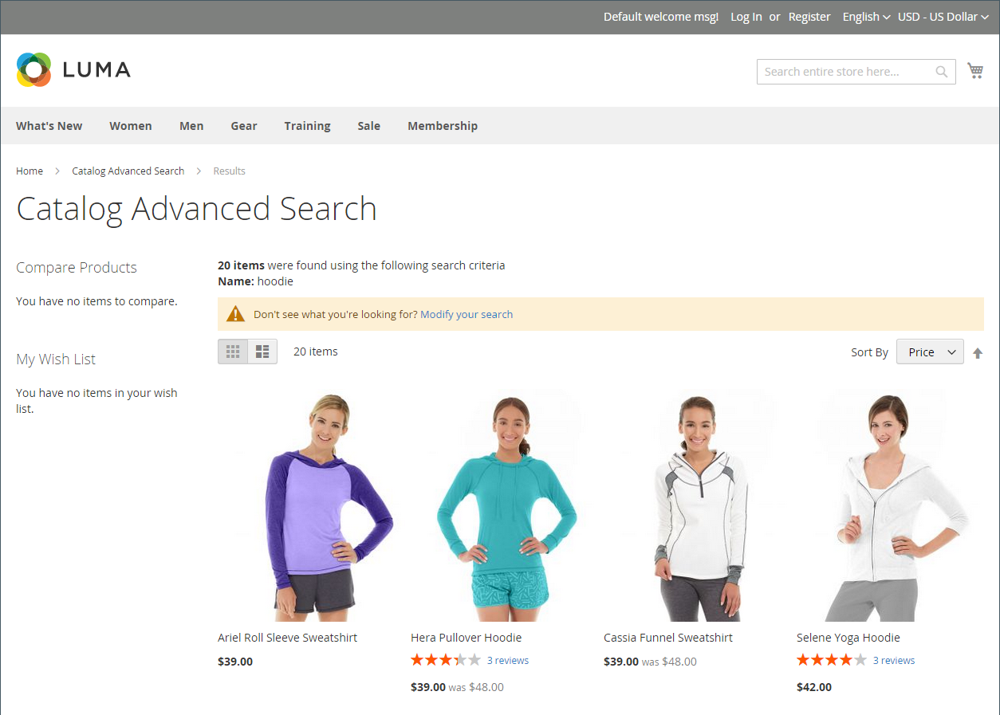

# カタログ検索の概要

>[!TIP]
>
>[[!DNL Live Search]](https://experienceleague.adobe.com/docs/commerce/live-search/overview.html) は、迅速で、非常に関連性が高く、直感的な検索エクスペリエンスを提供し、Adobe Commerceでは追加料金なしで利用できます。 ここでは、[!DNL Live Search] とは異なる可能性のある標準の検索機能について説明します。

調査によると、検索を使用するユーザーは、ナビゲーションだけに依存する顧客よりも購入する可能性が高くなります。 実際、一部の調査によると、検索を使用する人は、購入する可能性がほぼ 2 倍です。

次の節では、基本的なカタログ検索機能について説明します。 ネイティブカタログ検索機能の設定とカスタマイズ方法について詳しくは、以下を参照してください。

- [カタログ検索の設定](search-configuration.md)
- [検索結果](search-results.md)
- [検索語句の管理](search-terms.md)

>[!NOTE]
>
>Commerceのネイティブ検索機能は、完全一致の検索結果を提供します。 [!DNL Live Search] の一方で、Adobe Commerce内でのインストールとイネーブルメントに使用できるオプションモジュールの実装は異なり、結果は正確な検索文字列に限定されません。 例えば、_Omega_ という数値的にラベル付けされた 10 個の製品がある場合：`Omega 1` の結果を検索すると、_Omega 1_ とネイティブの検索機能が 1 回一致します。 ただし、Live Search を利用した同じ検索文字列では、複数の項目（_Omega 1_ と _Omega 10_ が一致します。

## クイック検索

>[!NOTE]
>
>[[!DNL Live Search]](https://experienceleague.adobe.com/en/docs/commerce/live-search/overview) をインストールし、[[!DNL Storefront Popover]](https://experienceleague.adobe.com/en/docs/commerce/live-search/live-search-storefront/storefront-popover) ウィジェットを有効にすると、検索ボックスが「入力中に検索」を返して、ポップアップが表示されます。

ストアのヘッダーにある検索ボックスは、訪問者がカタログ内の製品を見つけるのに役立ちます。 検索テキストには、製品名の全部または一部や、製品を説明するその他の単語やフレーズを使用できます。 製品を検索するためにユーザーが使用する検索用語は、管理者から管理できます。

1. 例え **[!UICONTROL Search]**、顧客が検索したい文字列の最初の数文字を入力するとします。

   カタログ内の一致が以下に表示され、見つかった結果の数が表示されます。

1. 顧客が Enter キーを押すか、一致する製品のリスト内の結果をクリックします。

   {width="700" zoomable="yes"}

## 詳細検索

>[!NOTE]
>
>ここで説明する高度なフォーム検索機能は、[[!DNL Live Search]](https://experienceleague.adobe.com/docs/commerce/live-search/overview.html) には適用されません。

詳細検索を使用すると、買い物客はフォームに入力された値に基づいてカタログを検索できます。 フォームには複数のフィールドが含まれているので、1 回の検索で複数のパラメーターを指定できます。 結果として、条件に一致するカタログ内のすべての製品のリストが表示されます。 詳細検索へのリンクは、ストアのフッターにあります。

{width="700" zoomable="yes"}

フォーム内の各フィールドは、製品カタログの属性に対応しています。 フィールドを追加するには、属性のフロントエンドのプロパティを `Include in Advanced Search` に設定します。 ベストプラクティスとして、顧客が製品を見つけるために使用する可能性が最も高いフィールドのみを含めます。多すぎると検索が遅くなるからです。

1. ストアのフッターで、顧客は「**[!UICONTROL Advanced Search]**」をクリックします。

1. _詳細検索_ フォームで、必要な数のフィールドに値の全部または一部を追加します。

1. **[!UICONTROL Search]** をクリックして結果を表示します。

   {width="700" zoomable="yes"}

1. 検索結果に探しているものが表示されない場合、顧客は **[!UICONTROL Modify your search]** をクリックして、別の条件の組み合わせを試みます。
