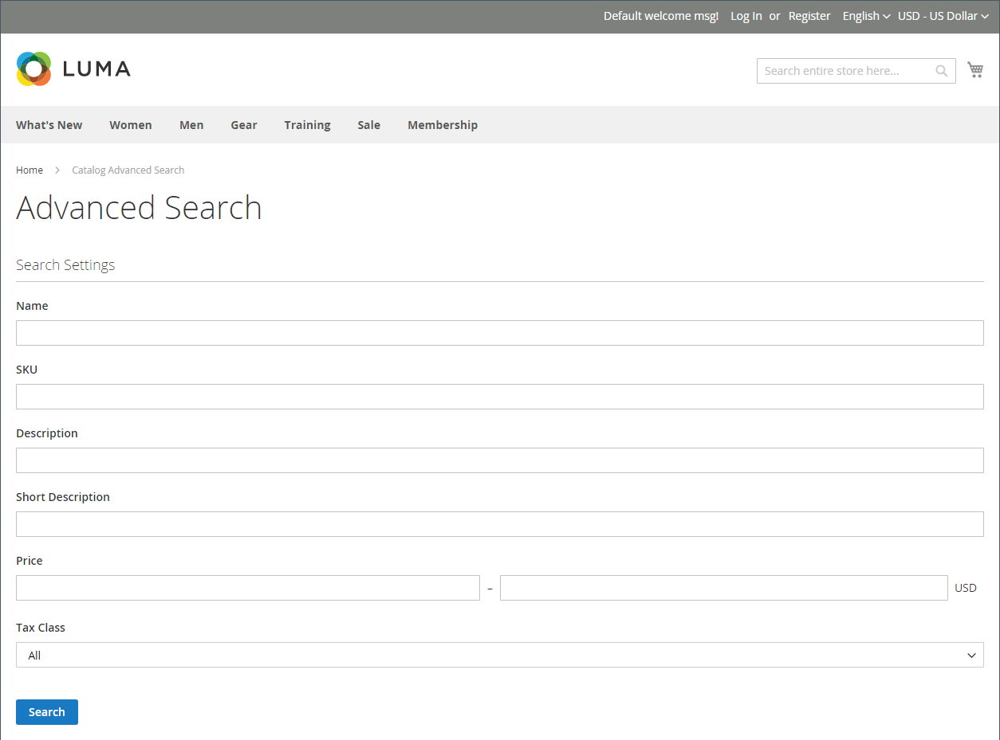

# カタログ検索について

>[!TIP]
>
>[[!DNL Live Search]](https://experienceleague.adobe.com/docs/commerce/live-search/overview.html?lang=ja)は、高速で非常に関連性の高い直感的な検索体験を提供し、Adobe Commerceで追加料金なしで利用できます。 この節では、[!DNL Live Search]とは異なる可能性のある標準検索機能について説明します。

調査によると、検索機能を利用する人々は、ナビゲーションだけを利用する顧客よりも購入する可能性が高いことが明らかになっています。 実際、一部の調査によると、検索連動型広告を利用する人は、購入する可能性がほぼ2倍になります。

次の節では、基本的なカタログ検索機能について説明します。 ネイティブカタログ検索機能を設定およびカスタマイズする方法について詳しくは、次を参照してください。

- [カタログ検索の設定](search-configuration.md)
- [検索結果](search-results.md)
- [検索語を管理](search-terms.md)

>[!NOTE]
>
>Commerceのネイティブ検索機能では、完全一致の検索結果が表示されます。 Adobe Commerce内のインストールとイネーブルメントに使用できるオプションモジュールである[!DNL Live Search]は異なる方法で実装され、その結果は正確な検索文字列に限定されません。 例えば、_Omega_&#x200B;の数値ラベルが付いた10個の製品がある場合、`Omega 1`を検索すると、_Omega 1_&#x200B;とネイティブ検索機能が1つ一致します。 しかし、ライブ検索によって提供される同じ検索文字列が、複数の項目（_オメガ 1_&#x200B;と&#x200B;_オメガ 10_）に一致します。

## クイック検索

>[!NOTE]
>
>[[!DNL Live Search]](https://experienceleague.adobe.com/en/docs/commerce/live-search/overview)がインストールされ、[[!DNL Storefront Popover]](https://experienceleague.adobe.com/en/docs/commerce/live-search/live-search-storefront/storefront-popover) ウィジェットが有効になっている場合、検索ボックスに「入力時に検索」の結果がポップオーバーで表示されます。

ストアのヘッダーにある検索ボックスは、訪問者がカタログ内の商品を見つけるのに役立ちます。 検索テキストには、製品名の全部または一部、または製品を説明するその他の単語またはフレーズを使用できます。 ユーザーが製品を検索するために使用する検索キーワードは、管理者から管理できます。

1. **[!UICONTROL Search]**&#x200B;の場合、顧客は検索する内容の最初の数文字を入力します。

   カタログ内の一致はすべて下に表示され、見つかった結果の数が表示されます。

1. お客様はEnter キーを押すか、一致する製品のリストで結果をクリックします。

   {width="700" zoomable="yes"}

## 高度な検索

>[!NOTE]
>
>ここで説明する高度なフォーム検索機能は、[[!DNL Live Search]](https://experienceleague.adobe.com/docs/commerce/live-search/overview.html?lang=ja)には適用されません。

高度な検索により、買い物客はフォームに入力された値にもとづいてカタログを検索できます。 フォームには複数のフィールドが含まれているため、1回の検索で複数のパラメーターを含めることができます。 この結果は、カタログ内のすべての商品のリストで、条件に一致します。 ストアのフッターに、高度な検索へのリンクがあります。

{width="700" zoomable="yes"}

フォームの各フィールドは、製品カタログの属性に対応します。 フィールドを追加するには、属性のフロントエンドプロパティを`Include in Advanced Search`に設定します。 ベストプラクティスとして、顧客が商品を見つける可能性が最も高いフィールドのみを含めるようにしましょう。フィールドの数が多すぎると、検索が遅くなります。

1. ストアのフッターで、顧客は&#x200B;**[!UICONTROL Advanced Search]**&#x200B;をクリックします。

1. _詳細検索_ フォームで、必要な数のフィールドに完全または部分的な値を追加します。

1. **[!UICONTROL Search]**&#x200B;をクリックして結果を表示します。

   {width="700" zoomable="yes"}

1. 顧客が検索結果で探しているものが表示されない場合、顧客は&#x200B;**[!UICONTROL Modify your search]**&#x200B;をクリックし、別の条件の組み合わせを試みます。
