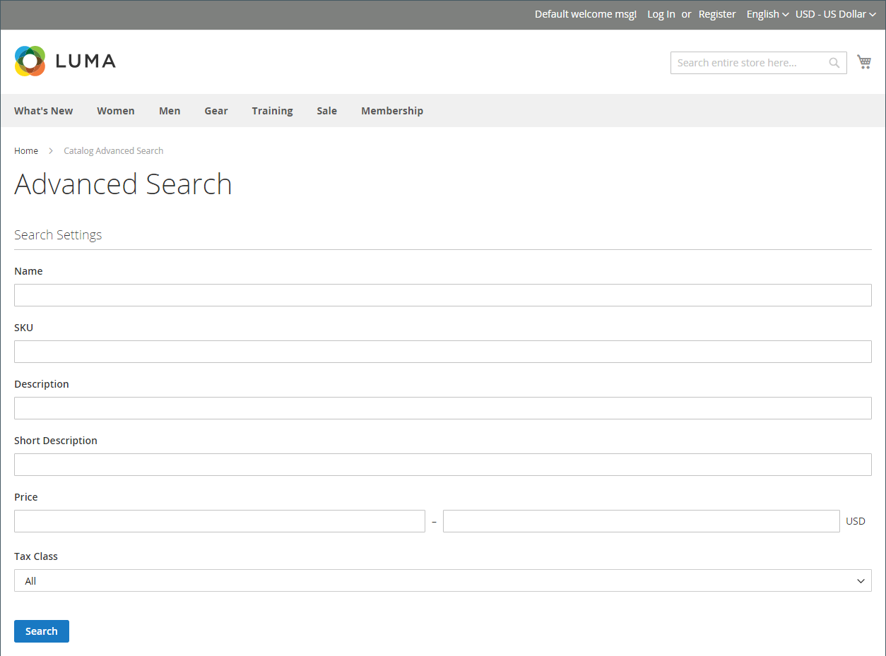

# カタログ検索の概要

>[!TIP]
>
>[[!DNL Live Search]](https://experienceleague.adobe.com/docs/commerce-merchant-services/live-search/overview.html) は、高速で超関連性の高い直感的な検索操作を実現し、Adobe Commerceで追加費用なしで利用できます。 この節では、 [!DNL Live Search].

調査によると、検索を使用する人は、ナビゲーションだけに頼る人よりも購入する可能性が高いと言えます。 実際、一部の研究によれば、検索を使用する人は、購入を行う確率の 2 倍近くになります。

次の節では、基本的なカタログ検索機能について説明します。 ネイティブカタログ検索機能の設定およびカスタマイズ方法について詳しくは、次を参照してください。

- [カタログ検索の設定](search-configuration.md)
- [検索結果](search-results.md)
- [検索語句を管理](search-terms.md)

>[!NOTE]
>
>Commerce のネイティブ検索機能は、完全に一致する検索結果を提供します。 While [!DNL Live Search]: Adobe Commerce内でのインストールと有効化に使用できるオプションのモジュールの実装方法は異なり、結果は正確な検索文字列に限定されません。 例えば、10 個の製品に数値でラベルを付けた場合、 _オメガ_：の検索 `Omega 1` ～に対して 1 回のマッチを行う _オメガ 1_ ネイティブ検索機能を備えています。 しかし、ライブ検索を利用した同じ検索文字列が複数の項目に一致します。 _オメガ 1_ および _オメガ 10_.

## クイック検索

>[!NOTE]
>
>条件 [[!DNL Live Search]](https://experienceleague.adobe.com/docs/commerce-merchant-services/live-search/live-search-storefront/quick-tour.html) がインストールされている場合、検索ボックスは「入力に応じて検索」の結果をポップオーバーで返します。

ストアのヘッダーにある検索ボックスを使用すると、訪問者はカタログ内の商品を見つけるのに役立ちます。 検索テキストには、製品名の全部または一部、または製品を説明するその他の単語やフレーズを指定できます。 ユーザーが製品を見つけるために使用する検索用語は、管理者から管理できます。

1. の場合 **[!UICONTROL Search]**&#x200B;に設定した場合、顧客は検索対象の最初の数文字を入力します。

   カタログ内の一致と、見つかった結果の数が以下に表示されます。

1. 顧客が Enter キーを押すか、一致する製品のリストの結果をクリックします。

   {width="700" zoomable="yes"}

## 詳細検索

>[!NOTE]
>
>ここで説明する高度なフォーム検索機能は、 [[!DNL Live Search]](https://experienceleague.adobe.com/docs/commerce-merchant-services/live-search/overview.html).

詳細検索では、フォームに入力された値に基づいてカタログを検索できます。 フォームには複数のフィールドが含まれているので、1 つの検索に複数のパラメーターを含めることができます。 結果として、条件に一致するカタログ内のすべての製品のリストが表示されます。 ストアのフッターには、詳細検索へのリンクが表示されます。

{width="700" zoomable="yes"}

フォーム内の各フィールドは、商品カタログの属性に対応しています。 フィールドを追加するには、属性のフロントエンドプロパティをに設定します。 `Include in Advanced Search`. ベストプラクティスとして、は、検索時間が長すぎるので、顧客が商品を見つけるのに最も使用する可能性が高いフィールドのみを含めます。

1. ストアのフッターで、顧客がクリックする **[!UICONTROL Advanced Search]**.

1. Adobe Analytics の _詳細検索_ フォームで、必要な数のフィールドに完全な値または一部の値を追加します。

1. クリック数 **[!UICONTROL Search]** をクリックして結果を表示します。

   {width="700" zoomable="yes"}

1. 検索結果に何を探しているかがわからない場合、顧客はクリックします **[!UICONTROL Modify your search]** とは、別の条件の組み合わせを試みます。
