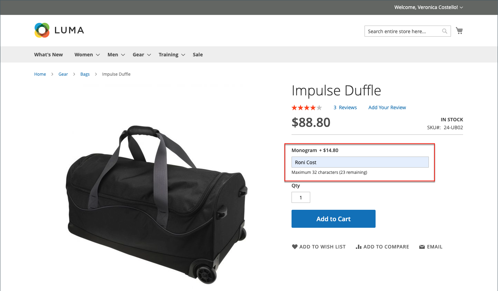
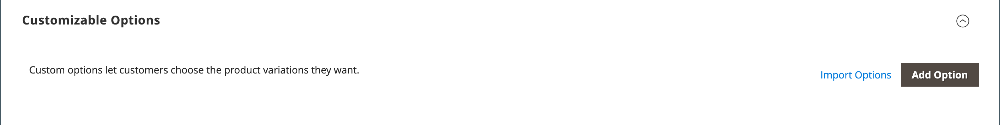

# 製品設定 – [!UICONTROL Customizable Options]

製品にカスタマイズ可能なオプションを追加すると、テキスト、選択、日付の入力タイプを含むオプションを簡単に提供できます。 在庫ニーズがシンプルな場合は、カスタマイズ可能なオプションが優れたソリューションとなります。 ただし、単一のSKUのバリエーションに基づいているため、在庫の管理や価格規則の条件のベースとして使用することはできません。 同じオプションを持つ複数の製品がある場合は、1つの製品を設定し、そのオプションを他の製品にインポートできます。

顧客がカスタマイズ可能なオプション付きの商品を購入すると、選択した各オプションの説明が商品説明の下に表示され、関連するマークアップ（またはマークダウン）が商品の価格に自動的に適用されます。

カスタマイズ可能なオプション {width="700" zoomable="yes"}を使用した製品の詳細

買い物かご価格ルールが購入によってトリガーされた場合、最初の計算は最初に製品価格に適用され、次に該当するカスタマイズ可能なオプションの調整を行う行項目価格に適用されます。 次の例では、顧客はダッフルバッグを74.00 ドルで購入し、さらにモノグラムにカスタマイズ可能なオプションを購入します。 基準商品価格には14.80 ドルのマークアップが適用され、調整後の価格は88.80 ドルと表示されます。 この場合、ダッフルバッグを購入すると、商品のSKUにもとづくカート価格ルールがトリガーされ、購入に割引と送料無料が適用されます。 カート価格ルールは、カスタマイズ可能なオプションによってトリガーされませんが、カスタマイズ可能なオプションのマークアップを含むカート内容に割引が適用されます。

カスタマイズ可能なオプションと価格ルールを含む{width="700" zoomable="yes"}

>[!NOTE]
>
>カタログ価格ルールの割引は、固定価格のカスタマイズ可能なオプションには適用されません。

## カスタマイズ可能なオプションを作成

1. 製品を編集モードで開きます。

1. 下にスクロールして、_[!UICONTROL Customizable Options]_&#x200B;セクションのを展開します。

1. **[!UICONTROL Add Option]**&#x200B;をクリックします。

   {width="600" zoomable="yes"}

1. 新しいオプション設定を完了します。

   - **[!UICONTROL Option Title]**&#x200B;に、オプションの名前を入力します。

   - データ入力の種類の&#x200B;**[!UICONTROL Option Type]**&#x200B;を設定します。

   - 製品の購入にオプションが必要ない場合は、**[!UICONTROL Required]** チェックボックスの選択を解除します。

1. データ入力タイプに応じてフィールドに入力します。

   - **[!UICONTROL Title]**&#x200B;に、このオプションの名前を入力します。

   - （オプション） **[!UICONTROL Price]**&#x200B;の場合、このオプションに適用される基本製品価格からマークアップまたはマークダウンを入力します。

   - **[!UICONTROL Price Type]**&#x200B;を次のいずれかに設定します：

      - `Fixed` - バリエーションの価格は、基本商品の価格と$1などの固定金額で異なります。
      - `Percentage` - バリエーションの価格がベース製品の価格と10%などの割合で異なります。

   - （オプション）オプションに&#x200B;**[!UICONTROL SKU]**&#x200B;を入力します。 オプション SKUは、製品SKUに追加される接尾辞です。

   - _[!UICONTROL Option Type]_&#x200B;が`File`の場合は、ファイルのパラメーターを設定します。**[!UICONTROL Compatible File Extensions]**&#x200B;の場合、有効な拡張子をコンマ区切りの値（`png, jpg, gif`など）として入力します。**[!UICONTROL Maximum Image Size]**&#x200B;の場合、画像の最大サイズをピクセル単位で入力します。 テキストエントリの場合は、**[!UICONTROL Maximum Characters]**&#x200B;の最大値を入力します。

   {width="600" zoomable="yes"}

1. （オプション）別のカスタマイズ可能なオプションを追加する場合は、**[!UICONTROL Add Option]**&#x200B;をクリックします。

   - 以前と同様に設定を完了します。

   - オプションの順序を変更するには、_[!UICONTROL Order]_ アイコンをクリックし、オプションをリスト内の新しい位置にドラッグします。

   追加する各オプションについて、この手順を繰り返します。

1. 完了したら、**[!UICONTROL Save]**&#x200B;をクリックします。

## カスタマイズ可能なオプションのインポート

1. _カスタマイズ可能なオプション_ セクションで、**[!UICONTROL Import Options]**&#x200B;をクリックします。

1. カスタマイズ可能なオプションを持つすべての製品がグリッドに表示されます。

1. リストで、読み込むオプションを含む製品のチェックボックスを選択します。

1. **[!UICONTROL Import]**&#x200B;をクリックします。

1. 完了したら、さらにカスタムオプションを追加するか、**[!UICONTROL Save and Close]**&#x200B;をクリックします。

## 入力タイプ

| タイプ | 説明 |
|---------------------|---------------|
| [!UICONTROL Text] | 顧客が必要な情報を入力できる入力行またはテキストボックス。 オプション： **[!UICONTROL Field]**- テキストの1行入力フィールド。 **[!UICONTROL Area]**  – 複数行の入力フィールド。 この種類は、HTMLのような高度な書式設定をサポートしていません。 入力できるテキストの長さを制限し、管理者に入力されたテキストを正しく表示するには、「最大文字」を使用します。 |
| [!UICONTROL File] | お客様がファイルをアップロードできます。 |
| [!UICONTROL Select] | 使用する入力タイプに応じて、1つのオプションまたは複数のオプションを選択できます。 オプション： **[!UICONTROL Drop-down]**- 1つの選択のみを許可するオプションのドロップダウンリスト。 **[!UICONTROL Radio Buttons]** - 1つの選択のみを許可する一連のオプション。 **[!UICONTROL Checkbox]**- チェックボックスは、yes/no オプションのバリエーションです。 製品に複数のチェックボックスがある場合は、複数の選択を行うことができます。 **[!UICONTROL Multiple Select]**  – 複数の選択を受け入れるオプションのドロップダウンリストボックス。 複数のオプションを選択するには、Ctrl キー（PC）またはCommand キー（Mac）を押しながら各オプションをクリックします。 |
| [!UICONTROL Date] | お客様が日付または時刻を入力するか、カレンダーから値を選択できるようにします。 オプション： **[!UICONTROL Date]**– 日付値の入力フィールド。 日付は、フィールドに直接入力するか、リストまたはカレンダーから選択できます。 入力メソッドと形式は、[日付と時刻のオプション &#x200B;](attributes-input-types.md#date-and-time-options)設定によって決まります。 **[!UICONTROL Date & Time]**  – 日付と時刻の値の入力フィールド。 **[!UICONTROL Time]**– 時間値の入力フィールド。 |

{style="table-layout:auto"}

