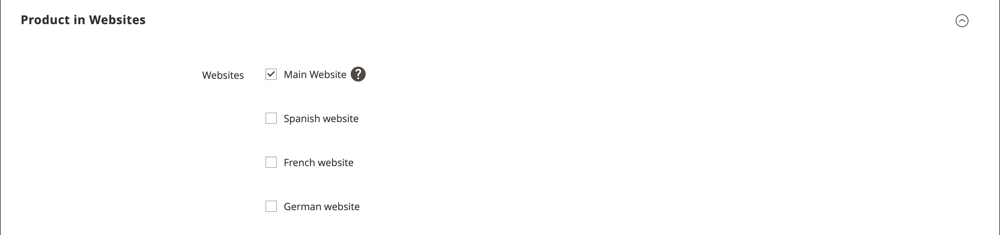

# 製品設定 – [!UICONTROL Product in Websites]

_[!UICONTROL Product in Websites]_&#x200B;セクションでは、[&#x200B; ストア階層](../stores-purchase/stores.md)に従って、製品が使用可能な各web サイトを特定します。

{width="550"}

**_製品を別のweb サイトにコピーするには:_**

1. 製品を編集モードで開きます。

1. 下にスクロールして、_[!UICONTROL Product in Websites]_&#x200B;セクションのを展開します。

   Web サイトの{width="600" zoomable="yes"}

1. コピーした商品を配置するweb サイトのチェックボックスをオンにします。

   単一のweb サイトのインストールの場合、デフォルトでweb サイトのチェックボックスが選択されます。

1. 既存の製品のコピーを作成する&#x200B;**[!UICONTROL Store View]**&#x200B;を選択します。

1. **[!UICONTROL Save]**&#x200B;をクリックし、次の操作を行います。

   - 商品レコードに戻ったら、**[!UICONTROL Store View]**&#x200B;選択機能を、商品がコピーされたストアビューに設定します。 範囲の切り替えを確認するメッセージが表示されたら、**[!UICONTROL OK]**&#x200B;をクリックします。

   - このストアビューの商品の&#x200B;**[!UICONTROL Price]**&#x200B;を入力します。

   基本通貨の範囲は`website`に設定されているため、各web サイトで異なる価格で製品を販売できます。

1. 完了したら、**[!UICONTROL Save]**&#x200B;をクリックします。
