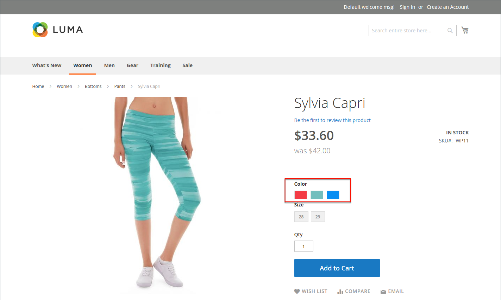
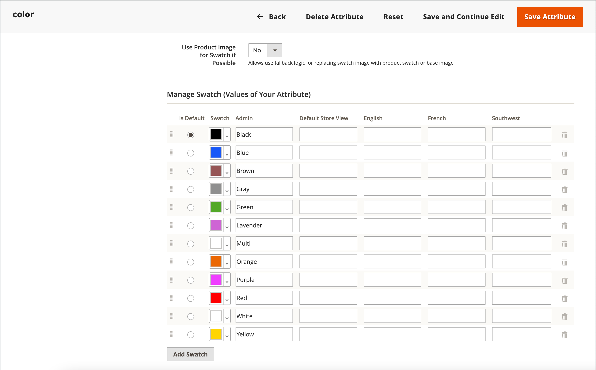
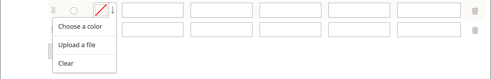
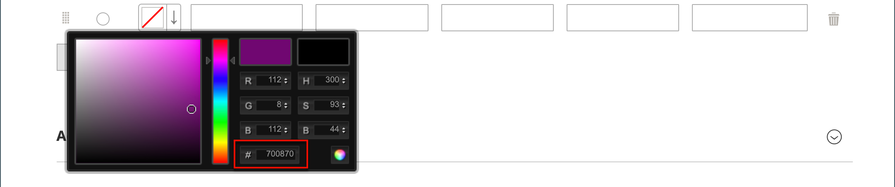
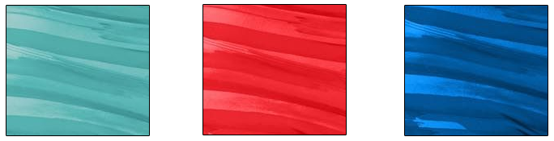

# 製品スウォッチ

顧客は色を選択することに対する期待が高く、利用可能なそれぞれの色、パターン、テクスチャを正確に表した商品説明が重要です。 例えば、次の例のズボンは、赤、緑、青では使用できません。 むしろ、赤、緑、青の特定の色合いでのみ入手可能であり、おそらくこの製品に固有のものです。

{width="700" zoomable="yes"}

[設定可能な製品](product-create-configurable.md)の場合、カラーは視覚的なスウォッチ、テキストスウォッチ、または入力コントロールで示すことができます。 スウォッチは、製品ページ、製品リスト、および[階層化されたナビゲーション &#x200B;](navigation-layered.md)で使用できます。 製品ページでは、スウォッチが同期され、スウォッチが選択されたときに対応する製品画像が表示されます。 お客様がスウォッチを選択すると、対応する値が入力フィールドに表示され、スウォッチが現在の選択範囲として概説されます。

>[!NOTE]
>
>スウォッチ属性は、Adminの[!UICONTROL Attribute Edit] ページで&#x200B;_[!UICONTROL Update Product Preview Image]_&#x200B;オプションの値を`No`に設定することで、スウォッチが選択されたときに、対応する単純な製品画像を表示しないように設定できます。

## テキストベースのスウォッチ

画像がスウォッチに使用できない場合、属性値はテキストとして表示されます。 テキストベースのスウォッチは、テキストラベル付きのボタンのようなもので、画像のスウォッチと同じように動作します。 テキストベースのスウォッチを使用して使用可能なサイズを表示すると、使用できないサイズは除外されます。

{width="700" zoomable="yes"}

## 階層化されたナビゲーションのスウォッチ

color属性の&#x200B;_[!UICONTROL Use in Layered Navigation]_&#x200B;プロパティが`Yes`に設定されている場合、スウォッチはレイヤーナビゲーションでも使用できます。 次の例は、レイヤーナビゲーションのテキストベースとカラー画像の両方のスウォッチを示しています。

レイヤー化されたナビゲーションに表示される{width="700" zoomable="yes"}

## 製品のスウォッチの作成

スウォッチは、`color`属性のコンポーネントとして定義するか、特定の製品に対してローカルに設定し、[製品画像](product-image.md#upload-an-image)としてアップロードできます。

以前の例では、「Sylvia Capri」パンツは、特定の値`red`、`green`、`blue`で使用できます。 スウォッチは製品画像から取り込まれたため、それぞれがカラーの真の表現です。 `color`属性は、すべての製品カラーとスウォッチの情報を管理するために使用されます。

### 手順1：スウォッチの作成

次のいずれかの方法を使用して、製品のスウォッチを作成します。

#### 方法1：カラースウォッチを追加する

1. 商品の真の色をキャプチャするには、フォトエディターで画像を開き、スポイトツールを使用して正確な色を特定し、同等の16進数値に注意します。

   {width="400"}

1. _管理者_ サイドバーで、**[!UICONTROL Stores]** > _[!UICONTROL Attributes]_>**[!UICONTROL Product]**&#x200B;に移動します。

1. グリッドで、編集モードで&#x200B;_color_&#x200B;属性を開きます。

1. **[!UICONTROL Catalog Input Type for Store Owner]**&#x200B;が`Visual Swatch`に設定されていることを確認します。

1. 製品表示ページでスウォッチを選択したときに、対応するシンプルな製品画像を表示しない場合は、**[!UICONTROL Update Product Preview Image]**&#x200B;を`No`に設定します。

1. _[!UICONTROL Manage Swatch (Values of Your Attribute)]_&#x200B;で「**[!UICONTROL Add Swatch]**」をクリックし、次の操作を行います。

   {width="600" zoomable="yes"}

   - _スウォッチ_&#x200B;列で、新しいスウォッチをクリックし、メニューから「**[!UICONTROL Choose a color]**」を選択します。

     {width="500" zoomable="yes"}

   - カラーピッカーで、**#** フィールドにカーソルを置き、現在の値を削除して、新しいカラーの6文字の16進数値を入力します。

     {width="500" zoomable="yes"}

   - スウォッチを保存するには、カラーピッカーの右下隅にある&#x200B;_カラーホイール_ （）アイコンをクリックします。

   - _管理者_&#x200B;列に、ストア管理者に色を説明するラベルを入力します。

     該当する場合は、サポートされている各言語のカラーの翻訳を入力することもできます。 次の例では、色は特定の製品にのみ使用されているため、SKUは&#x200B;_Admin_ ラベルに参照のために含まれています。 ラベルにはスペースやアンダースコアを含めることができますが、ハイフンは含めることはできません。

   - 「_はデフォルトです_」列で、デフォルトオプションにするスウォッチを選択します。

   - カラースウォッチの順序を変更するには、_[!UICONTROL Order]_ アイコンをクリックし、リスト内の新しい位置にアイテムをドラッグします。

     {width="400"}

1. 完了したら、**[!UICONTROL Save Attribute]**&#x200B;をクリックし、プロンプトが表示されたらキャッシュを更新します。

1. 各商品を編集モードで開き、**Color**&#x200B;属性を正しいスウォッチで更新します。

   複数の製品を同時に更新するには、次の手順に従います。

#### 方法2：スウォッチ画像をアップロードする

1. スウォッチの画像をキャプチャするには、商品画像をフォトエディターで開き、カラー、パターン、テクスチャを表す画像の正方形の領域を保存します。

   必要であれば、製品のバリエーションごとに、この操作を繰り返すことができます。

   スウォッチのサイズとサイズは、テーマによって決まります。 一般に、画像を正方形として保存すると、パターンの縦横比を維持するのに役立ちます。

   {width="400"}

1. _管理者_ サイドバーで、**[!UICONTROL Stores]** > _[!UICONTROL Attributes]_>**[!UICONTROL Product]**&#x200B;に移動します。

1. グリッドで、編集モードで&#x200B;**[!UICONTROL color]**&#x200B;属性を開きます。

1. **[!UICONTROL Catalog Input Type for Store Owner]**&#x200B;が`Visual Swatch`に設定されていることを確認します。

1. 製品表示ページでスウォッチを選択したときに、対応するシンプルな製品画像を表示しない場合は、**[!UICONTROL Update Product Preview Image]**&#x200B;を`No`に設定します。

1. _[!UICONTROL Manage Swatch]_（属性の値）で、**[!UICONTROL Add Swatch]**&#x200B;をクリックし、次の操作を行います。

   - _[!UICONTROL Swatch]_&#x200B;列で、新しいスウォッチをクリックしてメニューを表示し、**[!UICONTROL Upload a file]**&#x200B;を選択します。

   - 準備したスウォッチファイルに移動し、アップロードするファイルを選択します。

   - 各スウォッチ画像に対して、これらの手順を繰り返します。

   - 管理者とストアフロントのラベルを入力します。

     この例では、SKUは特定の製品にのみ使用されるため、管理者ラベルに参照のために含まれています。 ラベルにスペースやアンダースコアを含めることはできますが、ハイフンを含めることはできません。

     {width="500" zoomable="yes"}

1. 完了したら、**[!UICONTROL Save Attribute]**&#x200B;をクリックし、プロンプトが表示されたらキャッシュを更新します。

1. 各製品を編集モードで開き、**[!UICONTROL Color]**&#x200B;属性を正しいスウォッチで更新します。

   複数の製品を同時に更新するには、次の手順に従います。

### 手順2：製品の更新

1. _管理者_ サイドバーで、**[!UICONTROL Catalog]** > **[!UICONTROL Products]**&#x200B;に移動します。

1. **[!UICONTROL Filter]**&#x200B;を使用して、名前またはSKUでリストを表示し、該当する製品のみを含めます。

1. グリッドで、スウォッチが適用される各製品のチェックボックスを選択します。

1. **[!UICONTROL Actions]**&#x200B;を`Update Attributes`に設定します。

   この例では、パンツのすべての青い設定が選択されています。

   {width="600" zoomable="yes"}

1. **[!UICONTROL Color]**&#x200B;属性まで下にスクロールし、**[!UICONTROL Change]** チェックボックスを選択します。

   {width="400"}

1. 選択した製品に適用されるスウォッチを選択し、**[!UICONTROL Save]**&#x200B;をクリックします。

1. プロンプトが表示されたら、キャッシュを更新します。

   {width="200"}

## シンプルな商品にスウォッチを追加する

1. _管理者_ サイドバーで、**[!UICONTROL Catalog]** > **[!UICONTROL Products]**&#x200B;に移動します。

1. 製品を編集モードで開き、製品ステータスを確認します（有効にする必要があります）。

1. 「**[!UICONTROL Create Configurations]**」ボタン（`Configurations` タブの下）をクリックします。

1. ポップアップウィンドウで、カラー属性と&#x200B;**[!UICONTROL Next]**&#x200B;を選択します。

1. この製品に含める属性からカラースウォッチを選択します。

1. 進行状況バーで、**[!UICONTROL Next]**&#x200B;をクリックします。

1. [画像、価格、数量を設定](product-create-configurable.md#step-3-configure-the-images-price-and-quantity)。

   このステップでは、各設定の画像、価格、数量を設定します。 使用可能なオプションはそれぞれ同じで、1つだけ選択できます。 すべてのSKUに同じ設定を適用したり、各SKUに一意の設定を適用したり、今は設定をスキップしたりできます。

1. 画像、価格、数量の設定が完了したら、右上隅の「**[!UICONTROL Next]**」をクリックします。

   現在の製品バリエーションは、「設定」セクションの下部に表示されます。 設定に問題がなければ、**[!UICONTROL Generate Products]**&#x200B;をクリックします。
