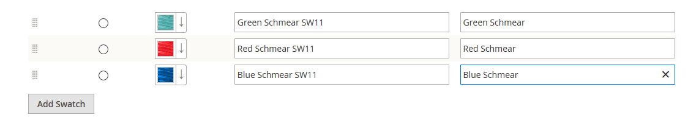

# 製品スウォッチ

お客様は色の選択に対する期待が高く、製品の説明が、使用可能な各色、パターンまたはテクスチャを正確に表すことが重要です。 例えば、次の例のパンツは、赤、緑、青では使用できません。 むしろ、赤、緑、青の特定の色合いでのみ利用できます。これはおそらくこの製品に固有のものです。

{width="700" zoomable="yes"}

の場合 [設定可能な製品](product-create-configurable.md)の場合、色は、ビジュアルスウォッチ、テキストスウォッチまたは入力コントロールで示すことができます。 スウォッチは、製品ページ、製品リスト、および [層状ナビゲーション](navigation-layered.md). 製品ページでは、スウォッチが選択されると、対応する製品画像が表示されるようにスウォッチが同期されます。 顧客がスウォッチを選択すると、対応する値が入力フィールドに表示され、スウォッチが現在の選択範囲としてアウトライン表示されます。

>[!NOTE]
>
>スウォッチを選択するときに、対応するシンプルな製品画像が表示されないように、スウォッチの属性を設定するには、 _[!UICONTROL Update Product Preview Image]_オプション値 `No` の [!UICONTROL Attribute Edit] ページを管理者に表示します。

## テキストベースのスウォッチ

スウォッチに画像が使用できない場合は、属性値がテキストとして表示されます。 テキストベースのスウォッチは、テキストラベルを持つボタンのようなもので、画像を持つスウォッチと同じように動作します。 テキストベースのスウォッチを使用して使用可能なサイズを表示する場合、使用できないサイズはすべて消去されます。

{width="700" zoomable="yes"}

## レイヤーナビゲーション内のスウォッチ

スウォッチは、レイヤーナビゲーションでも使用できます ( _[!UICONTROL Use in Layered Navigation]_color 属性のプロパティが `Yes`. 次の例は、レイヤーナビゲーションでのテキストベースとカラーの両方の画像スウォッチを示しています。

{width="700" zoomable="yes"}

## 製品のスウォッチの作成

スウォッチは、 `color` 特定の製品に対して属性を設定するか、ローカルで設定し、 [製品画像](product-image.md#upload-an-image).

前の例では、「Sylvia Capri」パンツは、 `red`, `green`、および `blue`. スウォッチは製品画像から取得されたので、それぞれが色の真の表現です。 The `color` 属性は、すべての製品のカラーとスウォッチの情報を管理するために使用されます。

### 手順 1：スウォッチを作成する

次のいずれかの方法を使用して、製品のスウォッチを作成します。

#### 方法 1：カラースウォッチを追加する

1. 製品の真の色をキャプチャするには、写真エディターで画像を開き、スポイトツールを使用して正確な色を識別し、同等の 16 進値をメモします。

   {width="400"}

1. 次の日： _管理者_ サイドバー、移動 **[!UICONTROL Stores]** > _[!UICONTROL Attributes]_>**[!UICONTROL Product]**.

1. グリッドで、 _カラー_ 属性を編集モードで使用します。

1. を確認します。 **[!UICONTROL Catalog Input Type for Store Owner]** が `Visual Swatch`.

1. 製品の表示ページでスウォッチを選択したときに、対応するシンプルな製品画像を表示しない場合は、 **[!UICONTROL Update Product Preview Image]** から `No`.

1. の下 _[!UICONTROL Manage Swatch (Values of Your Attribute)]_をクリックし、**[!UICONTROL Add Swatch]**次の操作を実行します。

   {width="600" zoomable="yes"}

   - Adobe Analytics の _スウォッチ_ 列で、新しいスウォッチをクリックし、 **[!UICONTROL Choose a color]** を選択します。

     {width="500" zoomable="yes"}

   - カラーピッカーで、 **#** フィールドで、現在の値を削除し、新しい色の 6 文字の 16 進値を入力します。

     {width="500" zoomable="yes"}

   - スウォッチを保存するには、 _カラーホイール_ (  ) アイコンをクリックします。

   - Adobe Analytics の _管理者_ 列に、ストア管理者に表示する色を示すラベルを入力します。

     該当する場合は、サポートされる各言語の色の翻訳を入力することもできます。 次の例では、SKU が _管理者_ ラベルは、色が特定の製品に対してのみ使用されるためです。 ラベルには、スペースやアンダースコアを含めることができますが、ハイフンは含めることができません。

   - Adobe Analytics の _デフォルト_ 列で、デフォルトのオプションにするスウォッチを選択します。

   - カラースウォッチの順序を変更するには、 _[!UICONTROL Order]_ アイコンをクリックし、項目をリスト内の新しい位置にドラッグします。

     {width="400"}

1. 完了したら、「 **[!UICONTROL Save Attribute]** プロンプトが表示されたら、キャッシュを更新します。

1. 各製品を編集モードで開き、 **カラー** 属性を適切なスウォッチに置き換えます。

   複数の製品を同時に更新するには、次の手順に従います。

#### 方法 2：スウォッチ画像のアップロード

1. スウォッチの画像をキャプチャするには、フォトエディターで製品画像を開き、カラー、パターン、テクスチャを表す画像の四角形の領域を保存します。

   必要に応じて、製品のバリエーションごとにこの操作を繰り返すことができます。

   スウォッチのサイズとサイズは、テーマによって決まります。 通常、画像を四角形として保存すると、パターンの縦横比を保持するのに役立ちます。

   {width="400"}

1. 次の日： _管理者_ サイドバー、移動 **[!UICONTROL Stores]** > _[!UICONTROL Attributes]_>**[!UICONTROL Product]**.

1. グリッドで、 **[!UICONTROL color]** 属性を編集モードで使用します。

1. を確認します。 **[!UICONTROL Catalog Input Type for Store Owner]** が `Visual Swatch`.

1. 製品の表示ページでスウォッチを選択したときに、対応するシンプルな製品画像を表示しない場合は、 **[!UICONTROL Update Product Preview Image]** から `No`.

1. の下 _[!UICONTROL Manage Swatch]_（属性の値）、「**[!UICONTROL Add Swatch]**次の操作を実行します。

   - Adobe Analytics の _[!UICONTROL Swatch]_列で、新しいスウォッチをクリックしてメニューを表示し、**[!UICONTROL Upload a file]**.

   - 準備したスウォッチファイルに移動し、アップロードするファイルを選択します。

   - 各スウォッチ画像に対して、これらの手順を繰り返します。

   - 管理者およびストアフロントのラベルを入力します。

     この例では、SKU が参照用に管理者ラベルに含まれています。これらの色は特定の製品に対してのみ使用されるからです。 ラベルには、スペースやアンダースコアを含めることができますが、ハイフンを含めることはできません。

     {width="500" zoomable="yes"}

1. 完了したら、「 **[!UICONTROL Save Attribute]** プロンプトが表示されたら、キャッシュを更新します。

1. 各製品を編集モードで開き、 **[!UICONTROL Color]** 属性を適切なスウォッチに置き換えます。

   複数の製品を同時に更新するには、次の手順に従います。

### 手順 2：製品の更新

1. 次の日： _管理者_ サイドバー、移動 **[!UICONTROL Catalog]** > **[!UICONTROL Products]**.

1. 以下を使用します。 **[!UICONTROL Filter]** をクリックして、名前または SKU 別にリストを表示し、該当する製品のみを含めます。

1. グリッドで、スウォッチを適用する各製品のチェックボックスを選択します。

1. 設定 **[!UICONTROL Actions]** から `Update Attributes`.

   この例では、パンツのすべての青い設定が選択されています。

   {width="600" zoomable="yes"}

1. 下にスクロールして、 **[!UICONTROL Color]** 属性を選択し、 **[!UICONTROL Change]** チェックボックス。

   {width="400"}

1. 選択した製品に適用するスウォッチを選択し、「 **[!UICONTROL Save]**.

1. プロンプトが表示されたら、キャッシュを更新します。

   {width="200"}

## 単純な製品へのスウォッチの追加

1. 次の日： _管理者_ サイドバー、移動 **[!UICONTROL Catalog]** > **[!UICONTROL Products]**.

1. 製品を編集モードで開き、製品のステータスを確認します（有効にする必要があります）。

1. クリック **[!UICONTROL Create Configurations]** ボタン ( `Configurations` 」タブ ) をクリックします。

1. ポップアップウィンドウで、カラー (Color) 属性を選択し、 **[!UICONTROL Next]**.

1. この製品に含める属性からカラースウォッチを選択します。

1. プログレスバーで、 **[!UICONTROL Next]**.

1. [画像、価格、数量の設定](product-create-configurable.md#step-3-configure-the-images-price-and-quantity).

   この手順では、各設定の画像、価格、数量を設定します。 使用可能なオプションはそれぞれ同じで、1 つだけ選択できます。 すべての SKU に同じ設定を適用したり、各 SKU に固有の設定を適用したり、現時点では設定をスキップしたりできます。

1. 画像、価格、数量の設定が完了したら、 **[!UICONTROL Next]** をクリックします。

   現在の製品バリエーションが「設定」セクションの下部に表示されます。 設定が完了したら、「 **[!UICONTROL Generate Products]**.
