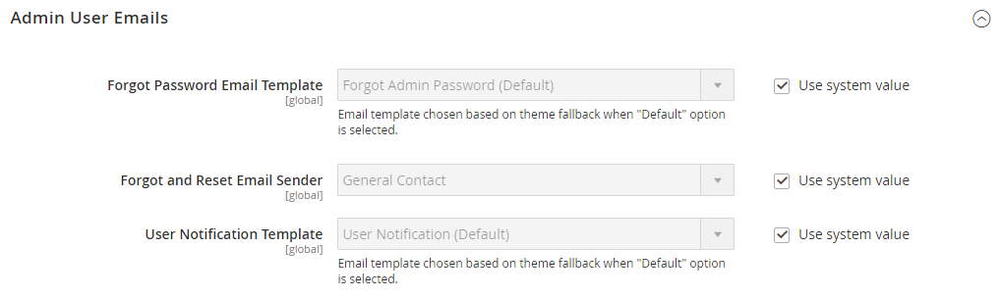
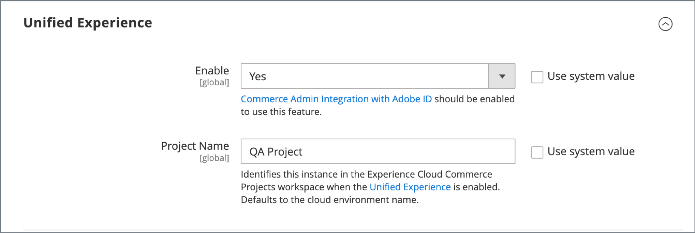
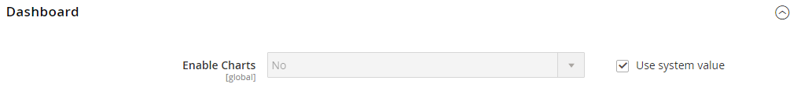
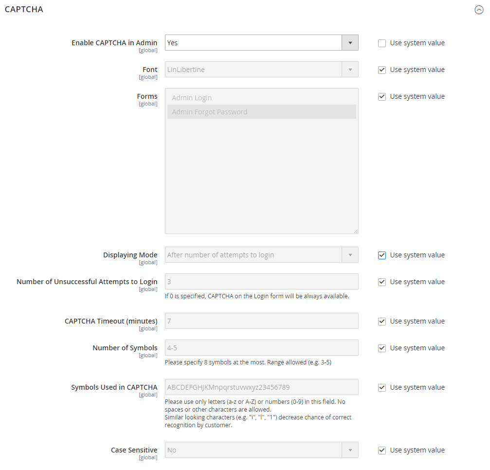
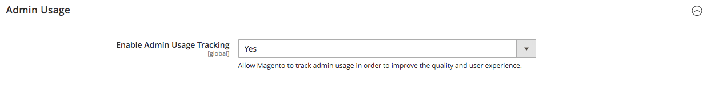

# 詳細設定/管理者

{{config}}

## [!UICONTROL Admin User Emails]

<!-- zoom -->

これらの設定の変更について詳しくは、[&#x200B; パスワードを忘れた場合と電子メールをリセットする](../../systems/permissions-users-all.md#forgotten-password-and-reset-emails)を参照してください。

| フィールド | [範囲](../../getting-started/websites-stores-views.md#scope-settings) | 説明 |
|---------------------------------------------|------------------------------------------------------------------------|----------------------------------------------------------------------------------------------------------------------------------------------------------------------------------------------------------------|
| [!UICONTROL Forgot Password Email Template] | グローバル | 管理者ユーザーがパスワードを忘れたときに送信されるメッセージに使用される電子メールテンプレートを識別します。 既定のテンプレート：`Forgot Admin Password` |
| [!UICONTROL Forgot and Reset Email Sender] | グローバル | _パスワードを忘れた_&#x200B;電子メールの送信者として表示されるストア連絡先を識別します。 既定の送信者：`General Contact` その他の送信者オプション：`Sales Representative`、`Customer Support`、`Custom Email` |
| [!UICONTROL User Notification Template] | グローバル | 管理者通知のデフォルトとして使用される電子メールテンプレートを決定します。 既定のテンプレート：`User Notification` |

{style="table-layout:auto"}

## [!UICONTROL Startup Page]

<!-- zoom -->

これらの設定の変更について詳しくは、_スタートアップガイド_&#x200B;の「[&#x200B; スタートアップページの変更](../../getting-started/admin-dashboard.md#change-the-startup-page)」を参照してください。

| フィールド | [範囲](../../getting-started/websites-stores-views.md#scope-settings) | 説明 |
|---------------------------|------------------------------------------------------------------------|------------------------------------------------------------------|
| [!UICONTROL Startup Page] | グローバル | ログイン後に表示される管理者ランディングページを指定します。 |

{style="table-layout:auto"}

### [!UICONTROL Startup Page]個のオプション

| 面グラフ |                                                                                                                                                                                                                                                                                                                                                                           | オプション |
|---------------------------------------------------------|---------------------------------------------------------------------------------------------------------------------------------------------------------------------------------------------------------------------------------------------------------------------------------------------------------------------------------------------------------------------------|---------------------------------------------------------------------------------------------------------------------------------------------------------------------------------------------------------------------------------------------------------------------------------------------------------------------------------------------------------------------------------------------------------------------------------------------------------------------------------------------------------------------------------------------------------------------------------------------|
| [`Dashboard`](../../getting-started/admin-dashboard.md) |                                                                                                                                                                                                                                                                                                                                                                           |                                                                                                                                                                                                                                                                                                                                                                                                                                                                                                                                                                                             |
| `Sales` | `Operations` | [`Quotes`](../../b2b/quotes.md)   [`Orders`](../../stores-purchase/orders.md) [`Invoices`](../../stores-purchase/invoices.md) [`Shipments`](../../stores-purchase/shipments.md) [`Credit Memos`](../../stores-purchase/credit-memos.md) [`Billing Agreements`](../../stores-purchase/paypal-billing-agreements.md) [`Returns`](../../stores-purchase/returns.md)   [`Transactions`](../../stores-purchase/transactions.md) `Braintree Virtual Terminal` |
| `Catalog` | [`Inventory`](../../inventory-management/introduction.md) | [`Products`](../../catalog/products-list.md) [`Categories`](../../catalog/categories.md) [`Shared Catalog`](../../b2b/catalog-shared-create.md)  |
| `Customers` | [`All Customers`](../../customers/customers-all.md) [`Now Online`](../../customers/now-online.md) [`Customer Groups`](../../customers/customer-groups.md) [`Segments`](../../customers/customer-segments.md)   [`Companies`](../../b2b/account-companies.md) |                                                                                                                                                                                                                                                                                                                                                                                                                                                                                                                                                                                             |
| `Marketing` | `Promotions` | [`Catalog Price Rule`](../../merchandising-promotions/price-rules-catalog.md)  [`Cart Price Rules`](../../merchandising-promotions/price-rules-cart.md)）  [`Related Products Rules`](../../merchandising-promotions/product-related-rules.md)   [`Gift Card Accounts`](../../stores-purchase/product-gift-card-accounts.md)  |
|                                                         | [`Private Sales`](../../merchandising-promotions/events-private-sales.md)  | [`Events`](../../merchandising-promotions/event-configure.md)  [`Invitations`](../../merchandising-promotions/invitations.md) |
|                                                         | `Communications` | [`Email Templates`](../../systems/email-templates.md)  [`Newsletter Template`](../../merchandising-promotions/newsletter-template.md)  [`Newsletter Queue`](../../merchandising-promotions/newsletter-queue.md)  [`Newsletter Subscribers`](../../merchandising-promotions/newsletter-subscribers.md)  [`Email Reminders`](../../merchandising-promotions/email-reminder-rules.md)  |
|                                                         | `SEO & Search` | [`Search Terms`](../../catalog/search-terms.md)  [`Search Synonyms`](../../catalog/search-terms.md#search-synonyms)  [`URL Rewrites`](../../merchandising-promotions/url-rewrite.md)  [`Site Map`](../../merchandising-promotions/sitemap-xml.md) |
|                                                         | [`User Content`](../../catalog/settings-advanced-product-reviews.md) | [`All Reviews`](../../catalog/settings-advanced-product-reviews.md)  [`Pending Reviews`](../../merchandising-promotions/product-reviews-moderate.md)   |
| `Content` | `Elements` | [`Pages`](../../content-design/pages.md) [`Hierarchy`](../../content-design/page-hierarchy.md)  [`Blocks`](../../content-design/blocks.md) [`Dynamic Blocks`](../../content-design/dynamic-blocks.md)  [`Widgets`](../../content-design/widgets.md) [`Media Gallery`](../../content-design/media-storage.md) |
|                                                         | `Design` | [`Configuration`](../../content-design/configuration.md) [`Themes`](../../content-design/themes.md) [`Schedule`](../../content-design/schedule.md) |
|                                                         | `Content Staging`   | [&#x200B; ダッシュボード &#x200B;](../../content-design/content-staging.md) |
| `Reports` | [`Marketing`](../../getting-started/marketing-reports.md) | `Products in Cart` `Search Terms` `Abandoned Carts` `Newsletter Problem Reports` |
|                                                         | [`Reviews`](../../getting-started/review-reports.md) | `By Customer`  `By Products`  |
|                                                         | [`Sales`](../../getting-started/sales-reports.md) | `Orders` `Tax` `Invoiced` `Shipping` `Refunds` `Coupons` `PayPal Settlement` `Braintree Settlement` |
|                                                         | `System Insights` | [`Site-Wide Analysis Tool`](https://experienceleague.adobe.com/docs/commerce-operations/tools/site-wide-analysis-tool/access.html?lang=ja)  |
|                                                         | [`Customers`](../../getting-started/customer-reports.md) | `Order Total` `Order Count` `New` `Wish Lists` `Segments`  |
|                                                         | [`Products`](../../getting-started/product-reports.md) | `Views` `Bestsellers` `Low Stock` `Ordered` `Downloads` |
|                                                         | [`Private Sales`](../../getting-started/private-sales-reports.md)  | `Invitations` `Invited Customers` `Conversions` |
|                                                         | `Statistics` | [`Refresh Statistics`](../../getting-started/sales-reports.md#refresh-statistics) |
|                                                         | [`Business Intelligence`](../../getting-started/business-intelligence.md) | `Advanced Reporting` `BI Essentials`  |
|                                                         | `Customer Engagement` | `Dashboard` `Importer Status` `Automation Enrollment` `Campaign Sends` `SMS Sends` `Cron Tasks` `Log Viewer` `Abandoned Carts` |
| `Stores` | `Settings` | [`All Stores`](../../stores-purchase/stores.md) [`Configuration`](../../configuration-reference/guide-overview.md) [`Terms and Conditions`](../../stores-purchase/terms-and-conditions.md) [`Order Status`](../../stores-purchase/order-status.md) |
|                                                         | [`Inventory`](../../inventory-management/introduction.md) | [`Sources`](../../inventory-management/sources-stocks.md#sources) [`Stocks`](../../inventory-management/sources-stocks.md#stocks) |
|                                                         | [`Taxes`](../../stores-purchase/taxes.md) | [`Tax Rules`](../../stores-purchase/tax-rules.md) [`Tax Zones and Rates`](../../stores-purchase/tax-zones-rates.md) |
|                                                         | [`Currency`](../../stores-purchase/currency.md) | [`Currency Rates`](../../stores-purchase/currency-configuration.md) [`Currency Symbols`](../../stores-purchase/currency-configuration.md#step-5-customize-currency-symbols-optional) |
|                                                         | `Attributes` | [`Customer`](../../systems/data-attributes-customer.md) [`Customer Address`](../../systems/data-attributes-customer.md#customer-addresses) [`Product`](../../systems/data-attributes-product.md) [`Attribute Set`](../../catalog/attribute-sets.md) [`Returns`](../../stores-purchase/attributes-returns.md) [`Ratings`](../../merchandising-promotions/product-reviews.md#create-custom-ratings) |
|                                                         | `Other Settings` | [`Reward Exchange Rates`](../../merchandising-promotions/reward-exchange-rates.md) [`Gift Wrapping`](../../stores-purchase/cart-configuration.md#gift-wrap) [`Gift Registry`](../../merchandising-promotions/gift-registry-create.md) |
| `System` | [`Data Transfer`](../../systems/data-transfer.md) | [`Import`](../../systems/data-import.md) [`Export`](../../systems/data-export.md) [`Import/Export Tax Rates`](../../systems/data-transfer-tax-rates.md) [`Import History`](../../systems/data-import.md#import-history) [`Scheduled Import/Export`](../../systems/data-scheduled-import-export.md) |
|                                                         | `Extensions` | [`Integrations`](../../systems/integrations.md) |
|                                                         | `Tools` | [`Cache Management`](../../systems/cache-management.md) [`Index Management`](../../systems/index-management.md) |
|                                                         | `Support` | [`System Report`](../../systems/support.md#system-reports) |
|                                                         | `Permissions` | [`All Users`](../../systems/permissions-users-all.md) [`Locked Users`](../../systems/permissions-users-all.md#locked-users) [`User Roles`](../../systems/permissions-user-roles.md) |
|                                                         | `Action Log`  | [`Report`](../../systems/action-log.md) [`Archive`](../../systems/action-log-archive.md) [`Bulk Actions`](../../systems/action-log-bulk-actions.md) |
|                                                         | `Other Settings` | [`Notifications`](../../systems/notifications.md) [`Custom Variables`](../../systems/variables-custom.md) [`Manage Encryption Key`](../../systems/encryption-key.md) |
| `Find Partners & Extensions` |                                                                                                                                                                                                                                                                                                                                                                           |                                                                                                                                                                                                                                                                                                                                                                                                                                                                                                                                                                                             |

{style="table-layout:auto"}

<!-- 
Feature still in development 
## [!UICONTROL Unified Experience]

The [!UICONTROL Unified Experience] option is available in Adobe Commerce deployments that have the Commerce Admin Unified Experience extension loaded. This extension enables integration with Experience Cloud to streamline cross-application workflows between Commerce and other Experience Cloud solutions. See [Adobe Experience Cloud Integration for Commerce Admin](../../getting-started/admin-unified-experience-integration-overview.md).

| Field        | [Scope](../../getting-started/websites-stores-views.md#scope-settings) | Description                                                                                                                                                                                                                                                                                                                                                                    |
|--------------|------------------------------------------------------------------------|--------------------------------------------------------------------------------------------------------------------------------------------------------------------------------------------------------------------------------------------------------------------------------------------------------------------------------------------------------------------------------|
| Enable       | Global                                                                 | Determines if the Commerce instance uses the Experience Cloud integration. Before enabling this feature, review the [requirements and configuration instructions](../../getting-started/admin-unified-experience-integration-overview.md). Options: Yes/No.                                                                                                                    |
| Project Name | Global                                                                 | Identifies the instance in the Experience Cloud Commerce Projects workspace when the Unified Experience is enabled. The name can contain only alphanumeric characters and spaces. Defaults to the [cloud environment name](https://experienceleague.adobe.com/docs/commerce-cloud-service/user-guide/architecture/pro-architecture.html?lang=ja#pro-environment-architecture). |

{style="table-layout:auto"}

-->

## [!UICONTROL Admin Base URL]

<!-- zoom -->

これらのオプションの設定について詳しくは、_ストアおよび購入エクスペリエンスガイド_&#x200B;の「[&#x200B; ベース URL](../../stores-purchase/store-urls.md#configure-the-base-url)の設定」を参照してください。

| フィールド | [範囲](../../getting-started/websites-stores-views.md#scope-settings) | 説明 |
|------------------------------------|------------------------------------------------------------------------|-----------------------------------------------------------------------------------------------------------------------------------------------------------------------------------------------------------------------------------|
| [!UICONTROL Use Custom Admin URL] | グローバル | 管理者へのアクセスにカスタム URLを使用するかどうかを指定します。 オプション：`Yes` / `No` |
| [!UICONTROL Custom Admin URL] | グローバル | 管理者にアクセスするためのカスタム URLを指定します。 デフォルトでは、管理者URLはベース URLと同じです。 **重要：**&#x200B;管理者URLは同じCommerce インストールにあり、ストアフロントと同じドキュメントルートを持つ必要があります。 |
| [!UICONTROL Use Custom Admin Path] | グローバル | 管理者へのアクセスにカスタムパスを使用するかどうかを指定します。 既定のパスは`admin`です。 オプション：`Yes` / `No` |
| [!UICONTROL Custom Admin Path] | グローバル | デフォルトの管理者パスの名前を、推測しにくい名前に変更します。 カスタムパス名を小文字で入力します。 例：`aardvark` |

{style="table-layout:auto"}

## [!UICONTROL Security]

<!-- zoom -->

これらのオプションの設定について詳しくは、_管理者システムガイド_&#x200B;の「[管理者セキュリティの設定](../../systems/security-admin.md)」を参照してください。

| フィールド | [範囲](../../getting-started/websites-stores-views.md#scope-settings) | 説明 |
|--------------------------------------------------------|------------------------------------------------------------------------|--------------------------------------------------------------------------------------------------------------------------------------------------------------------------------------------------------------------------------------------------------------------------------------------------------------------------------------------------------------------------------------------------------------------------------------------------------------------------------------------------------------------------------------------------------------------------------------------------------|
| [!UICONTROL Admin Account Sharing] | ストアビュー | 管理者ユーザーが異なるデバイスから同じアカウントに同時にログインできるかどうかを指定します。 オプション： **`Yes`**– 同じ管理者アカウントから複数のアクティブなセッションを許可します。 **`No`** – 管理者アカウントごとに1つのアクティブなセッションのみを許可します。 |
| [!UICONTROL Password Reset Protection Type] | ストアビュー | パスワード リセット要求の管理に使用する方法を指定します。 オプション： **`By IP and Email`**– 通知から応答を受け取った後、パスワードをオンラインでリセットして、管理者アカウントに関連付けられた電子メールアドレスに送信できます。 **`By IP`** - パスワードは、追加確認なしでオンラインでリセットできます。 **`By Email`**- パスワードは、管理者アカウントに関連付けられた電子メールアドレスに送信される通知に電子メールで応答することによってのみリセットできます。 **`None`** - パスワードは、ストア管理者のみがリセットできます。 |
| [!UICONTROL Recovery Link Expiration Period (hours)] | グローバル | パスワード回復リンクが有効な時間数を指定します。 |
| [!UICONTROL Max Number of Password Reset Requests] | ストアビュー | 1時間に送信できるパスワード要求の最大数を指定します。 |
| [!UICONTROL Min Time Between Password Reset Requests] | ストアビュー | パスワードのリセット要求の最小間隔（分）を指定します。 |
| [!UICONTROL Add Secret Key to URLs] | グローバル | 有効にすると、悪用に対する予防策として、管理者URLに秘密鍵が追加されます。 オプション：`Yes` / `No` |
| [!UICONTROL Login Is Case Sensitive] | グローバル | ユーザーが入力したログイン資格情報が、保存されている資格情報の大文字と小文字を一致させる必要があるかどうかを指定します。 オプション：`Yes` / `No` |
| [!UICONTROL Admin Session Lifetime (seconds)] | グローバル | 管理者セッションの長さを秒単位で指定します。 |
| [!UICONTROL Maximum Login Failures to Lockout Account] | グローバル | 管理者ユーザーがアカウントをロックする前にログインを試行できる回数を指定します。 フィールドが空の場合、最小値は設定されません。 デフォルト値：`6` |
| [!UICONTROL Lockout Time (minutes)] | グローバル | ユーザーが再度ログインを試みる前に、管理者アカウントがロックされる分数を指定します。 デフォルト値：`30` |
| [!UICONTROL Minimum Admin Password Length] | グローバル | 管理者パスワードに必要な最小文字数を指定します。 デフォルト値は7で、最小値は7です。 この設定は、管理者パスワードの変更、管理者インターフェイスとCLIの両方からの新しい管理者ユーザーの作成、および管理者からのパスワードリセット操作に影響します。 |
| [!UICONTROL Password Lifetime (days)] | グローバル | 管理者パスワードが期限切れになるまでの日数を指定します。 フィールドが空の場合、有効期間は設定されません。 デフォルト値：`90` |
| [!UICONTROL Password Change] | グローバル | 管理者ユーザーがパスワードを変更する必要があるかどうかを決定します。 オプション： **`Forced`**- アカウントの設定後に管理者ユーザーがパスワードを変更する必要があります。 **`Recommended`** – 管理者ユーザーは、アカウントの設定後にパスワードを変更することをお勧めします。 |

{style="table-layout:auto"}

## [!UICONTROL Dashboard]

<!-- zoom -->

これらのオプションの設定について詳しくは、_はじめにガイド_&#x200B;の[管理者ダッシュボード &#x200B;](../../getting-started/admin-dashboard.md)を参照してください。

| フィールド | [範囲](../../getting-started/websites-stores-views.md#scope-settings) | 説明 |
|----------------------------|------------------------------------------------------------------------|-------------------------------------------------------------------------------------------------------|
| [!UICONTROL Enable Charts] | グローバル | ダッシュボードに現在の売上データから生成されたチャートが含まれているかどうかを判断します。 オプション：`Yes` / `No` |

{style="table-layout:auto"}

## [!UICONTROL Admin Grids]

<!-- zoom -->

これらのオプションの設定について詳しくは、_カタログ管理ガイド_&#x200B;の「[製品表示の制限](../../catalog/products-list.md#limit-product-display)」を参照してください。

>[!NOTE]
>
>大きなカタログのパフォーマンスを向上させるには、グリッドに表示される商品数を制限することをお勧めします。

| フィールド | [範囲](../../getting-started/websites-stores-views.md#scope-settings) | 説明 |
|-----------------------------------------------|------------------------------------------------------------------------|-------------------------------------------------------------------------------------------------------------------------------------|
| [!UICONTROL Limit Number of Products in Grid] | グローバル | グリッドに表示される製品数が&#x200B;_[!UICONTROL Records Limit]_&#x200B;個の値に制限されているかどうかを指定します。 オプション：`Yes` / `No` |
| [!UICONTROL Records Limit] | グローバル | 商品グリッド内の商品の数の制限を設定します。 デフォルトの最小値は`20000`です。 |

## [!UICONTROL CAPTCHA]

<!-- zoom -->

これらのオプションの設定について詳しくは、_管理者システムガイド_&#x200B;の[CAPTCHA](../../systems/security-captcha.md)を参照してください。

| フィールド | [範囲](../../getting-started/websites-stores-views.md#scope-settings) | 説明 |
|-------------------------------------------------------|------------------------------------------------------------------------|-------------------------------------------------------------------------------------------------------------------------------------------------------------------------------------------------------------------------------------------------------------------------------------------------------------------------------------------------------------------------------------------------------------------------------------------------------------------------------------------------------------------------------------------------------------------------------------------------------------------------------------------------------------------------------------------------------------------------------------------------------------------------------------------------|
| [!UICONTROL Enable CAPTCHA in Admin] | グローバル | 管理者ログインのCAPTCHAを有効にします。 オプション：`Yes` / `No` |
| [!UICONTROL Font] | グローバル | CAPTCHAの表示に使用するフォントを指定します。 独自のフォントを追加するには、フォントファイルをCommerce インスタンスと同じディレクトリに置き、宣言を`app/code/Magento/Captcha/etc`のconfig.xml ファイルに追加します。デフォルトのフォント：` LinLibertine` |
| [!UICONTROL Forms] | グローバル | CAPTCHAが使用されるフォームを指定します。 オプション：`Admin Login` / `Admin Forgot Password` |
| [!UICONTROL Displaying Mode] | グローバル | CAPTCHAがいつ表示されるかを指定します。 オプション： **`Always`**- ログインするには常にCAPTCHAが必要です。 **`After number of attempts to login`** - [!UICONTROL Number of Unsuccessful Attempts to Login] フィールドを表示します。 許可されるログイン試行回数を入力します。 0 （ゼロ）の値は、「表示モード」を「常に」に設定することと似ています。 このオプションでは、「パスワードを忘れた」および「ユーザーを作成」フォームはカバーされません。 CAPTCHAが有効になっていて表示されるように設定されている場合、常にフォームに含まれます。 **注**：失敗したログイン試行回数を追跡するには、1つの電子メールアドレスと1つのIP アドレスからログインするたびにカウントされます。 同じIP アドレスから許可されるログイン試行の最大数は1,000です。 この制限は、CAPTCHAが有効になっている場合にのみ適用されます。 |
| [!UICONTROL Number of Unsuccessful Attempts to Login] | グローバル | アカウントがロックされる前に、ユーザーがログインを試行できる回数を指定します。 失敗したログイン試行回数を追跡するには、1つのIP アドレスから1つの電子メールアドレスの試行回数を追跡します。 同じIP アドレスから許可される最大試行回数は1,000回です。 この制限は、CAPTCHAが有効になっている場合にのみ適用されます。 |
| [!UICONTROL CAPTCHA Timeout (minutes)] | グローバル | 現在のCAPTCHAの有効期間を決定します。 CAPTCHAの有効期限が切れると、ユーザーはページをリロードする必要があります。 |
| [!UICONTROL Number of Symbols] | グローバル | CAPTCHAで使用されるシンボルの数を指定します。 許可される最大値は`8`です。 範囲（例：`5-8`）を指定することもできます。 |
| [!UICONTROL Symbols Used in CAPTCHA] | グローバル | CAPTCHAで使用するシンボルを指定します。 文字（a ～ zおよびA ～ Z）と数字（0 ～ 9）のみを使用できます。 フィールドで提案されたデフォルトのシンボルのセットでは、i、l、1などの類似したシンボルは除外されます。 CAPTCHAでこれらのシンボルを表示すると、ユーザーがCAPTCHAを正しく認識する可能性が低くなります。 |
| [!UICONTROL Case Sensitive] | グローバル | CAPTCHAで使用される文字が大文字と小文字を区別するかどうかを指定します。 オプション：`Yes` / `No` |

{style="table-layout:auto"}

## [!UICONTROL Admin Actions Logging]

{{ee-feature}}

<!-- zoom -->

これらのオプションの設定について詳しくは、_管理者システムガイド_&#x200B;の「[&#x200B; アクションログアーカイブ &#x200B;](../../systems/action-log-archive.md)」を参照してください。

| フィールド | [範囲](../../getting-started/websites-stores-views.md#scope-settings) | 説明 |
|-----------------------------|------------------------------------------------------------------------|-----------------------------------------------------------------------------------------------------------------------------------------------------------------------------------------------------------------------------------------------------------------------------------------------------------------------------------------------------------------------------------------------------------------------------------------------------------------------------------------------------------------------------------------------------------------------------------------------------------------------------------------------------------------------------------------------------------------------------------------------------------------------------------------------------------------------------------------------------------------------------------------------------------------------------------------------------------------------------------------------------------------------------------------------------------------------------------------------------------------------------------------------------------------------------------------------------------------------------------------------------------------------------------------------------------------------------------------------------------------------------------------------------------------------------------------------------------------------------------------------------------------------------------------------------------------------------------------------------------------------------------------------------------------------------------------------------------------------------------------------------------------------------------------------|
| [!UICONTROL Enable Actions] | グローバル | 選択した各アクションのアクションログを有効にします： `Admin My Account`  `Admin Permission Roles`  `Admin Permission Users`  `Admin Sign In`  `CMS Blocks`  `CMS Hierarchy`  `CMS Pages`  `Cache Management`  `Cart Price Rules`  `Catalog Attributes`  `Catalog Categories`  `Catalog Events`  `Catalog Price Rules`  `Catalog Product Tax Classes`  `Catalog Product Templates`  `Catalog Products`  `Catalog Ratings`  `Catalog Reviews`  `Catalog Search`  `Checkout Terms and Conditions`  `Companies`  `Custom Variables`  `Customer Groups`  `Customer Tax Classes`  `Customers`  `Gift Card Accounts`  `Gift Registry Entity`  `Company Credit`  `Index Management`  `Login as a Customer`  `Manage Currency Rates`  `Manage Customer Address Attributes`  `Manage Customer Attributes`  `Manage Design`  `Manage Dynamic Blocks`  `Manage Segments`  `Manage Store Views`  `Manage Stores`  `Manage Websites`  `Negotiable Quotes`  `Newsletter Queue`  `Newsletter Subscribers`  `Newsletter Templates`  `PayPal Settlement Reports`  `Reports`   `Customer Invitations` `Design Configuration` `Gift Registry Type` `Reward Points Rates`  `Rule-Based Product Relations`  `Sales Archive`  `Sales Credit Memos`  `Sales Invoices`  `Sales Order Status`  `Sales Orders`  `Sales Shipments`  `Shared Catalog`  `Shopping Cart Management`  `Store Credit`  `System Backups`  `System Configuration`  `Tax Rates`  `Tax Rules`  `Transactional Emails`  `URL Rewrites`  `Widget`  `XML Sitemap` |

{style="table-layout:auto"}

## [!UICONTROL Admin Usage]

<!-- zoom -->

これらのオプションの設定について詳しくは、_はじめにガイド_&#x200B;の[使用データ収集](../../getting-started/admin.md#usage-data-collection)を参照してください。

| フィールド | 範囲 | 説明 |
|------------------------------------------|--------|--------------------------------------------------------------------------------------------------------------------------------------------------------------------------------------------------------------------------------------------------------------------------------------------------------------------------------------------------------------------------------------------------------------------------------------------------------------------------------------------------------------------------------------------------------------------------------------------------------------|
| [!UICONTROL Enable Admin Usage Tracking] | グローバル | 管理者の使用状況データを収集する権限をAdobeに付与して、_管理者_&#x200B;および関連製品やサービスの使用体験を向上させます。 データ収集を許可すると、_製品内ガイダンス_&#x200B;も有効になります。このガイダンスは、_管理者_&#x200B;にヘルプ、ツールヒント、ウォークスルーのガイド、オンボーディング情報、機能のお知らせなどのインタラクティブなコンテンツを提供するように設計されています。 使用状況データでは、個々の管理者は識別されません。 オプション： **`Yes`**- データ収集を許可し、_製品内ガイダンス_. **`No`**&#x200B;を有効にします - データ収集を許可せず、製品内ガイダンス _を有効にしません。_ |

{style="table-layout:auto"}
