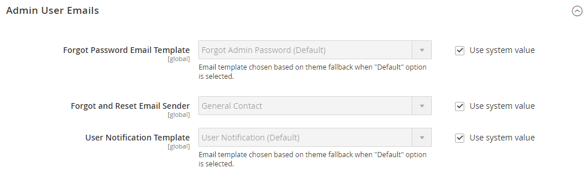

# 詳細/管理者

{{config}}

## [!UICONTROL Admin User Emails]

<!-- zoom -->

これらの設定の変更について詳しくは、 [パスワードを忘れて電子メールをリセット](../../systems/permissions-users-all.md#forgotten-password-and-reset-emails).

| フィールド | [範囲](../../getting-started/websites-stores-views.md#scope-settings) | 説明 |
|---------------------------------------------|------------------------------------------------------------------------|----------------------------------------------------------------------------------------------------------------------------------------------------------------------------------------------------------------|
| [!UICONTROL Forgot Password Email Template] | グローバル | 管理者ユーザーがパスワードを忘れたときに送信されるメッセージに使用される電子メールテンプレートを識別します。 デフォルトのテンプレート： `Forgot Admin Password` |
| [!UICONTROL Forgot and Reset Email Sender] | グローバル | の送信者として表示されるストアの連絡先を識別します _パスワードを忘れた場合_ 電子メール。 デフォルトの送信者： `General Contact` その他の送信者オプション： `Sales Representative`, `Customer Support`, `Custom Email` |
| [!UICONTROL User Notification Template] | グローバル | 管理者通知のデフォルトとして使用する電子メールテンプレートを決定します。 デフォルトのテンプレート： `User Notification` |

{style="table-layout:auto"}

## [!UICONTROL Startup Page]

<!-- zoom -->

これらの設定の変更について詳しくは、 [スタートアップページを変更する](../../getting-started/admin-dashboard.md#change-the-startup-page) （内） _はじめに_.

| フィールド | [範囲](../../getting-started/websites-stores-views.md#scope-settings) | 説明 |
|---------------------------|------------------------------------------------------------------------|------------------------------------------------------------------|
| [!UICONTROL Startup Page] | グローバル | ログイン後に表示される管理者ランディングページを決定します。 |

{style="table-layout:auto"}

### [!UICONTROL Startup Page] options

| 面グラフ |                                                                                                                                                                                                                                                                                                                                                                           | オプション |
|---------------------------------------------------------|---------------------------------------------------------------------------------------------------------------------------------------------------------------------------------------------------------------------------------------------------------------------------------------------------------------------------------------------------------------------------|---------------------------------------------------------------------------------------------------------------------------------------------------------------------------------------------------------------------------------------------------------------------------------------------------------------------------------------------------------------------------------------------------------------------------------------------------------------------------------------------------------------------------------------------------------------------------------------------|
| [`Dashboard`](../../getting-started/admin-dashboard.md) |                                                                                                                                                                                                                                                                                                                                                                           |                                                                                                                                                                                                                                                                                                                                                                                                                                                                                                                                                                                             |
| `Sales` | `Operations` | [`Quotes`](../../b2b/quotes.md)   [`Orders`](../../stores-purchase/orders.md) [`Invoices`](../../stores-purchase/invoices.md) [`Shipments`](../../stores-purchase/shipments.md) [`Credit Memos`](../../stores-purchase/credit-memos.md) [`Billing Agreements`](../../stores-purchase/paypal-billing-agreements.md) [`Returns`](../../stores-purchase/returns.md)   [`Transactions`](../../stores-purchase/transactions.md) `Braintree Virtual Terminal` |
| `Catalog` | [`Inventory`](../../inventory-management/introduction.md) | [`Products`](../../catalog/products-list.md) [`Categories`](../../catalog/categories.md) [`Shared Catalog`](../../b2b/catalog-shared-create.md)  |
| `Customers` | [`All Customers`](../../customers/customers-all.md) [`Now Online`](../../customers/now-online.md) [`Customer Groups`](../../customers/customer-groups.md) [`Segments`](../../customers/customer-segments.md)   [`Companies`](../../b2b/account-companies.md) |                                                                                                                                                                                                                                                                                                                                                                                                                                                                                                                                                                                             |
| `Marketing` | `Promotions` | [`Catalog Price Rule`](../../merchandising-promotions/price-rules-catalog.md)  [`Cart Price Rules`](../../merchandising-promotions/price-rules-cart.md))  [`Related Products Rules`](../../merchandising-promotions/product-related-rules.md)   [`Gift Card Accounts`](../../stores-purchase/product-gift-card-accounts.md)  |
|                                                         | [`Private Sales`](../../merchandising-promotions/events-private-sales.md)  | [`Events`](../../merchandising-promotions/event-configure.md)  [`Invitations`](../../merchandising-promotions/invitations.md) |
|                                                         | `Communications` | [`Email Templates`](../../systems/email-templates.md)  [`Newsletter Template`](../../merchandising-promotions/newsletter-template.md)  [`Newsletter Queue`](../../merchandising-promotions/newsletter-queue.md)  [`Newsletter Subscribers`](../../merchandising-promotions/newsletter-subscribers.md)  [`Email Reminders`](../../merchandising-promotions/email-reminder-rules.md)  |
|                                                         | `SEO & Search` | [`Search Terms`](../../catalog/search-terms.md)  [`Search Synonyms`](../../catalog/search-terms.md#search-synonyms)  [`URL Rewrites`](../../merchandising-promotions/url-rewrite.md)  [`Site Map`](../../merchandising-promotions/sitemap-xml.md) |
|                                                         | [`User Content`](../../catalog/settings-advanced-product-reviews.md) | [`All Reviews`](../../catalog/settings-advanced-product-reviews.md)  [`Pending Reviews`](../../merchandising-promotions/product-reviews-moderate.md)   |
| `Content` | `Elements` | [`Pages`](../../content-design/pages.md) [`Hierarchy`](../../content-design/page-hierarchy.md)  [`Blocks`](../../content-design/blocks.md) [`Dynamic Blocks`](../../content-design/dynamic-blocks.md)  [`Widgets`](../../content-design/widgets.md) [`Media Gallery`](../../content-design/media-storage.md) |
|                                                         | `Design` | [`Configuration`](../../content-design/configuration.md) [`Themes`](../../content-design/themes.md) [`Schedule`](../../content-design/schedule.md) |
|                                                         | `Content Staging`   | [ダッシュボード](../../content-design/content-staging.md) |
| `Reports` | [`Marketing`](../../getting-started/marketing-reports.md) | `Products in Cart` `Search Terms` `Abandoned Carts` `Newsletter Problem Reports` |
|                                                         | [`Reviews`](../../getting-started/review-reports.md) | `By Customer`  `By Products`  |
|                                                         | [`Sales`](../../getting-started/sales-reports.md) | `Orders` `Tax` `Invoiced` `Shipping` `Refunds` `Coupons` `PayPal Settlement` `Braintree Settlement` |
|                                                         | `System Insights` | [`Site-Wide Analysis Tool`](https://experienceleague.adobe.com/docs/commerce-operations/tools/site-wide-analysis-tool/access.html)  |
|                                                         | [`Customers`](../../getting-started/customer-reports.md) | `Order Total` `Order Count` `New` `Wish Lists` `Segments`  |
|                                                         | [`Products`](../../getting-started/product-reports.md) | `Views` `Bestsellers` `Low Stock` `Ordered` `Downloads` |
|                                                         | [`Private Sales`](../../getting-started/private-sales-reports.md)  | `Invitations` `Invited Customers` `Conversions` |
|                                                         | `Statistics` | [`Refresh Statistics`](../../getting-started/sales-reports.md#refresh-statistics) |
|                                                         | [`Business Intelligence`](../../getting-started/business-intelligence.md) | `Advanced Reporting` `BI Essentials`  |
|                                                         | `Customer Engagement` | `Dashboard` `Importer Status` `Automation Enrollment` `Campaign Sends` `SMS Sends` `Cron Tasks` `Log Viewer` `Abandoned Carts` |
| `Stores` | `Settings` | [`All Stores`](../../stores-purchase/stores.md) [`Configuration`](../../configuration-reference/guide-overview.md) [`Terms and Conditions`](../../stores-purchase/terms-and-conditions.md) [`Order Status`](../../stores-purchase/order-status.md) |
|                                                         | [`Inventory`](../../inventory-management/introduction.md) | [`Sources`](../../inventory-management/sources-stocks.md#sources) [`Stocks`](../../inventory-management/sources-stocks.md#stocks) |
|                                                         | [`Taxes`](../../stores-purchase/taxes.md) | [`Tax Rules`](../../stores-purchase/tax-rules.md) [`Tax Zones and Rates`](../../stores-purchase/tax-zones-rates.md) |
|                                                         | [`Currency`](../../stores-purchase/currency.md) | [`Currency Rates`](../../stores-purchase/currency-configuration.md) [`Currency Symbols`](../../stores-purchase/currency-configuration.md#step-5-customize-currency-symbols-optional) |
|                                                         | `Attributes` | [`Customer`](../../systems/data-attributes-customer.md) [`Customer Address`](../../systems/data-attributes-customer.md#customer-addresses) [`Product`](../../systems/data-attributes-product.md) [`Attribute Set`](../../catalog/attribute-sets.md) [`Returns`](../../stores-purchase/attributes-returns.md) [`Ratings`](../../merchandising-promotions/product-reviews.md#create-custom-ratings) |
|                                                         | `Other Settings` | [`Reward Exchange Rates`](../../merchandising-promotions/reward-exchange-rates.md) [`Gift Wrapping`](../../stores-purchase/cart-configuration.md#gift-wrap) [`Gift Registry`](../../merchandising-promotions/gift-registry-create.md) |
| `System` | [`Data Transfer`](../../systems/data-transfer.md) | [`Import`](../../systems/data-import.md) [`Export`](../../systems/data-export.md) [`Import/Export Tax Rates`](../../systems/data-transfer-tax-rates.md) [`Import History`](../../systems/data-import.md#import-history) [`Scheduled Import/Export`](../../systems/data-scheduled-import-export.md) |
|                                                         | `Extensions` | [`Integrations`](../../systems/integrations.md) |
|                                                         | `Tools` | [`Cache Management`](../../systems/cache-management.md) [`Index Management`](../../systems/index-management.md) |
|                                                         | `Support` | [`Data Collector`](../../systems/support.md#data-collector) [`System Report`](../../systems/support.md#system-reports) |
|                                                         | `Permissions` | [`All Users`](../../systems/permissions-users-all.md) [`Locked Users`](../../systems/permissions-users-all.md#locked-users) [`User Roles`](../../systems/permissions-user-roles.md) |
|                                                         | `Action Log`  | [`Report`](../../systems/action-log.md) [`Archive`](../../systems/action-log-archive.md) [`Bulk Actions`](../../systems/action-log-bulk-actions.md) |
|                                                         | `Other Settings` | [`Notifications`](../../systems/notifications.md) [`Custom Variables`](../../systems/variables-custom.md) [`Manage Encryption Key`](../../systems/encryption-key.md) |
| `Find Partners & Extensions` |                                                                                                                                                                                                                                                                                                                                                                           |                                                                                                                                                                                                                                                                                                                                                                                                                                                                                                                                                                                             |

{style="table-layout:auto"}

<!-- Feature still in development 
## [!UICONTROL Unified Experience]

The [!UICONTROL Unified Experience] option is available in Adobe Commerce deployments that have the Commerce Admin Unified Experience extension loaded. This extension enables integration with Experience Cloud to streamline cross-application workflows between Commerce and other Experience Cloud solutions. See [Adobe Experience Cloud Integration for Commerce Admin](../../getting-started/admin-unified-experience-integration-overview.md).

| Field        | [Scope](../../getting-started/websites-stores-views.md#scope-settings) | Description                                                                                                                                                                                                                                                                                                                                                                    |
|--------------|------------------------------------------------------------------------|--------------------------------------------------------------------------------------------------------------------------------------------------------------------------------------------------------------------------------------------------------------------------------------------------------------------------------------------------------------------------------|
| Enable       | Global                                                                 | Determines if the Commerce instance uses the Experience Cloud integration. Before enabling this feature, review the [requirements and configuration instructions](../../getting-started/admin-unified-experience-integration-overview.md). Options: Yes/No.                                                                                                                    |
| Project Name | Global                                                                 | Identifies the instance in the Experience Cloud Commerce Projects workspace when the Unified Experience is enabled. The name can contain only alphanumeric characters and spaces. Defaults to the [cloud environment name](https://experienceleague.adobe.com/docs/commerce-cloud-service/user-guide/architecture/pro-architecture.html?lang=en#pro-environment-architecture). |

{style="table-layout:auto"}

-->

## [!UICONTROL Admin Base URL]

<!-- zoom -->

これらのオプションの設定について詳しくは、 [ベース URL の設定](../../stores-purchase/store-urls.md#configure-the-base-url) （内） _店舗および購入エクスペリエンスガイド_.

| フィールド | [範囲](../../getting-started/websites-stores-views.md#scope-settings) | 説明 |
|------------------------------------|------------------------------------------------------------------------|-----------------------------------------------------------------------------------------------------------------------------------------------------------------------------------------------------------------------------------|
| [!UICONTROL Use Custom Admin URL] | グローバル | カスタム URL を使用して管理者にアクセスするかどうかを決定します。 オプション： `Yes` / `No` |
| [!UICONTROL Custom Admin URL] | グローバル | 管理者にアクセスするためのカスタム URL を指定します。 デフォルトでは、管理 URL はベース URL と同じです。 **重要：** 管理 URL は、同じ Commerce インストールに存在し、ストアフロントと同じドキュメントルートを持つ必要があります。 |
| [!UICONTROL Use Custom Admin Path] | グローバル | 管理者へのアクセスにカスタムパスを使用するかどうかを決定します。 デフォルトのパスは `admin`. オプション： `Yes` / `No` |
| [!UICONTROL Custom Admin Path] | グローバル | デフォルトの管理者パスの名前を推測しにくい名前に変更します。 カスタムパス名を小文字で入力します。 例： `aardvark` |

{style="table-layout:auto"}

## [!UICONTROL Security]

<!-- zoom -->

これらのオプションの設定について詳しくは、 [管理者セキュリティの設定](../../systems/security-admin.md) （内） _管理システムガイド_.

| フィールド | [範囲](../../getting-started/websites-stores-views.md#scope-settings) | 説明 |
|--------------------------------------------------------|------------------------------------------------------------------------|--------------------------------------------------------------------------------------------------------------------------------------------------------------------------------------------------------------------------------------------------------------------------------------------------------------------------------------------------------------------------------------------------------------------------------------------------------------------------------------------------------------------------------------------------------------------------------------------------------|
| [!UICONTROL Admin Account Sharing] | ストア表示 | 異なるデバイスから同じアカウントに同時にログインできる管理者ユーザーかどうかを指定します。 オプション：  **`Yes`**— 同じ管理者アカウントからの複数のアクティブなセッションを許可します。 **`No`**  — 管理者アカウントごとに 1 つのアクティブなセッションのみを許可します。 |
| [!UICONTROL Password Reset Protection Type] | ストア表示 | パスワードのリセット要求の管理に使用するメソッドを決定します。 オプション：  **`By IP and Email`**— パスワードは、通知からの応答を Admin アカウントに関連付けられた電子メールアドレスに送信した後に、オンラインでリセットできます。 **`By IP`**  — パスワードは、追加の確認なしでオンラインでリセットできます。  **`By Email`**— パスワードは、Admin アカウントに関連付けられた電子メールアドレスに送信される通知に電子メールで応答することでのみ、リセットできます。 **`None`**  — パスワードはストア管理者のみがリセットできます。 |
| [!UICONTROL Recovery Link Expiration Period (hours)] | グローバル | パスワード回復リンクが有効である時間数を決定します。 |
| [!UICONTROL Max Number of Password Reset Requests] | ストア表示 | 1 時間に送信できるパスワード要求の最大数を決定します。 |
| [!UICONTROL Min Time Between Password Reset Requests] | ストア表示 | パスワードのリセット要求間隔の最小値を分単位で指定します。 |
| [!UICONTROL Add Secret Key to URLs] | グローバル | 有効にした場合、悪用に対する予防策として、秘密鍵を管理 URL に追加します。 オプション： `Yes` / `No` |
| [!UICONTROL Login Is Case Sensitive] | グローバル | ユーザーが入力したログイン資格情報が、保存されているログイン資格情報と一致する必要があるかどうかを指定します。 オプション： `Yes` / `No` |
| [!UICONTROL Admin Session Lifetime (seconds)] | グローバル | 管理者セッションの長さを秒単位で決定します。 |
| [!UICONTROL Maximum Login Failures to Lockout Account] | グローバル | 管理者ユーザーがログインしてからアカウントがロックされる回数を指定します。 このフィールドが空の場合、最小値は設定されません。 デフォルト値： `6` |
| [!UICONTROL Lockout Time (minutes)] | グローバル | 管理者アカウントがロックされてから、ユーザーが再度ログインを試みるまでの時間（分）を指定します。 デフォルト値： `30` |
| [!UICONTROL Password Lifetime (days)] | グローバル | 管理者パスワードの有効期限が切れるまでの日数を決定します。 このフィールドが空の場合、全期間は設定されません。 デフォルト値： `90` |
| [!UICONTROL Password Change] | グローバル | 管理者ユーザーが自分のパスワードを変更する必要があるかどうかを決定します。 オプション：  **`Forced`**— アカウントの設定後に管理者ユーザーがパスワードを変更する必要があります。 **`Recommended`** ：管理者ユーザーは、アカウントの設定後にパスワードを変更することをお勧めします。 |

{style="table-layout:auto"}

## [!UICONTROL Dashboard]

<!-- zoom -->

これらのオプションの設定について詳しくは、 [管理ダッシュボード](../../getting-started/admin-dashboard.md) （内） _はじめに_.

| フィールド | [範囲](../../getting-started/websites-stores-views.md#scope-settings) | 説明 |
|----------------------------|------------------------------------------------------------------------|-------------------------------------------------------------------------------------------------------|
| [!UICONTROL Enable Charts] | グローバル | 現在の販売データから生成されたグラフがダッシュボードに含まれるかどうかを指定します。 オプション： `Yes` / `No` |

{style="table-layout:auto"}

## [!UICONTROL Admin Grids]

<!-- zoom -->

これらのオプションの設定について詳しくは、 [製品の表示を制限](../../catalog/products-list.md#limit-product-display) （内） _カタログ管理ガイド_.

>[!NOTE]
>
>大きなカタログのパフォーマンスを向上させるには、グリッドに表示する製品の数を制限することをお勧めします。

| フィールド | [範囲](../../getting-started/websites-stores-views.md#scope-settings) | 説明 |
|-----------------------------------------------|------------------------------------------------------------------------|-------------------------------------------------------------------------------------------------------------------------------------|
| [!UICONTROL Limit Number of Products in Grid] | グローバル | グリッドに表示する製品の数を _[!UICONTROL Records Limit]_の値です。 オプション： `Yes` / `No` |
| [!UICONTROL Records Limit] | グローバル | 製品グリッドの製品数の制限を設定します。 デフォルトの最小値は次のとおりです。 `20000`. |

## [!UICONTROL CAPTCHA]

<!-- zoom -->

これらのオプションの設定について詳しくは、 [CAPTCHA](../../systems/security-captcha.md) （内） _管理システムガイド_.

| フィールド | [範囲](../../getting-started/websites-stores-views.md#scope-settings) | 説明 |
|-------------------------------------------------------|------------------------------------------------------------------------|-------------------------------------------------------------------------------------------------------------------------------------------------------------------------------------------------------------------------------------------------------------------------------------------------------------------------------------------------------------------------------------------------------------------------------------------------------------------------------------------------------------------------------------------------------------------------------------------------------------------------------------------------------------------------------------------------------------------------------------------------------------------------------------------------|
| [!UICONTROL Enable CAPTCHA in Admin] | グローバル | 管理者ログイン用に CAPTCHA を有効にします。 オプション： `Yes` / `No` |
| [!UICONTROL Font] | グローバル | CAPTCHA の表示に使用するフォントを決定します。 独自のフォントを追加するには、フォントファイルをコマースインスタンスと同じディレクトリに配置し、次の場所にある config.xml ファイルに宣言を追加します。 `app/code/Magento/Captcha/etc` デフォルトフォント：` LinLibertine` |
| [!UICONTROL Forms] | グローバル | CAPTCHA が使用されるフォームを決定します。 オプション： `Admin Login` / `Admin Forgot Password` |
| [!UICONTROL Displaying Mode] | グローバル | CAPTCHA を表示するタイミングを決定します。 オプション：  **`Always`**— ログインするには、常に CAPTCHA が必要です。 **`After number of attempts to login`** - [!UICONTROL Number of Unsuccessful Attempts to Login] フィールドに入力します。 許可するログイン試行回数を入力します。 0（ゼロ）の値は、[ 表示モード ] を [ 常に ] に設定した場合と同様です。 このオプションでは、「パスワードを忘れた場合」および「ユーザーを作成」の各フォームは対象となりません。 CAPTCHA が有効で、表示するように設定されている場合は、常にフォームに含まれます。 **注意**：ログインの失敗を追跡するには、1 つの電子メールアドレスと 1 つの IP アドレスからログインしようとするたびに、カウントされます。 同じ IP アドレスから許可されるログイン試行の最大回数は 1,000 です。 この制限は、CAPTCHA が有効な場合にのみ適用されます。 |
| [!UICONTROL Number of Unsuccessful Attempts to Login] | グローバル | アカウントがロックされる前にユーザーがログインを試みる回数を指定します。 ログイン試行の失敗回数を追跡するために、1 つの IP アドレスから 1 つの電子メールアドレスからの試行を追跡します。 同じ IP アドレスから許可される最大試行回数は 1,000 です。 この制限は、CAPTCHA が有効な場合にのみ適用されます。 |
| [!UICONTROL CAPTCHA Timeout (minutes)] | グローバル | 現在の CAPTCHA の有効期間を決定します。 CAPTCHA の有効期限が切れたら、ユーザーはページを再読み込みする必要があります。 |
| [!UICONTROL Number of Symbols] | グローバル | CAPTCHA で使用されるシンボルの数を決定します。 最大値は次のとおりです。 `8`. また、範囲を指定することもできます。例： `5-8`. |
| [!UICONTROL Symbols Used in CAPTCHA] | グローバル | CAPTCHA で使用するシンボルを決定します。 文字（a ～ z および A ～ Z）と数字 (0 ～ 9) のみを使用できます。 フィールドに表示される既定の記号セットでは、i、l、1 などの類似した記号は除外されます。 CAPTCHA でこれらの記号を表示すると、ユーザーが CAPTCHA を正しく認識する可能性が低くなります。 |
| [!UICONTROL Case Sensitive] | グローバル | CAPTCHA で使用される文字が大文字と小文字を区別するかどうかを指定します。 オプション： `Yes` / `No` |

{style="table-layout:auto"}

## [!UICONTROL Admin Actions Logging]

{{ee-feature}}

<!-- zoom -->

これらのオプションの設定について詳しくは、 [アクションログのアーカイブ](../../systems/action-log-archive.md) （内） _管理システムガイド_.

| フィールド | [範囲](../../getting-started/websites-stores-views.md#scope-settings) | 説明 |
|-----------------------------|------------------------------------------------------------------------|-----------------------------------------------------------------------------------------------------------------------------------------------------------------------------------------------------------------------------------------------------------------------------------------------------------------------------------------------------------------------------------------------------------------------------------------------------------------------------------------------------------------------------------------------------------------------------------------------------------------------------------------------------------------------------------------------------------------------------------------------------------------------------------------------------------------------------------------------------------------------------------------------------------------------------------------------------------------------------------------------------------------------------------------------------------------------------------------------------------------------------------------------------------------------------------------------------------------------------------------------------------------------------------------------------------------------------------------------------------------------------------------------------------------------------------------------------------------------------------------------------------------------------------------------------------------------------------------------------------------------------------------------------------------------------------------------------------------------------------------------------------------------------------------------|
| [!UICONTROL Enable Actions] | グローバル | 選択した各アクションのアクションログを有効にします。  `Admin My Account`  `Admin Permission Roles`  `Admin Permission Users`  `Admin Sign In`  `CMS Blocks`  `CMS Hierarchy`  `CMS Pages`  `Cache Management`  `Cart Price Rules`  `Catalog Attributes`  `Catalog Categories`  `Catalog Events`  `Catalog Price Rules`  `Catalog Product Tax Classes`  `Catalog Product Templates`  `Catalog Products`  `Catalog Ratings`  `Catalog Reviews`  `Catalog Search`  `Checkout Terms and Conditions`  `Companies`  `Company Credit`  `Custom Variables`  `Customer Groups`  `Customer Invitations`  `Customer Tax Classes`  `Customers`  `Design Configuration`  `Gift Card Accounts`  `Gift Registry Entity`  `Gift Registry Type`  `Index Management`  `Login as a Customer`  `Manage Currency Rates`  `Manage Customer Address Attributes`  `Manage Customer Attributes`  `Manage Design`  `Manage Dynamic Blocks`  `Manage Segments`  `Manage Store Views`  `Manage Stores`  `Manage Websites`  `Negotiable Quotes`  `Newsletter Queue`  `Newsletter Subscribers`  `Newsletter Templates`  `PayPal Settlement Reports`  `Reports`   `Reward Points Rates`  `Rule-Based Product Relations`  `Sales Archive`  `Sales Credit Memos`  `Sales Invoices`  `Sales Order Status`  `Sales Orders`  `Sales Shipments`  `Shared Catalog`  `Shopping Cart Management`  `Store Credit`  `System Backups`  `System Configuration`  `Tax Rates`  `Tax Rules`  `Transactional Emails`  `URL Rewrites`  `Widget`  `XML Sitemap` |

{style="table-layout:auto"}

## [!UICONTROL Admin Usage]

<!-- zoom -->

これらのオプションの設定について詳しくは、 [使用状況データの収集](../../getting-started/admin.md#usage-data-collection) （内） _はじめに_.

| フィールド | 範囲 | 説明 |
|------------------------------------------|--------|--------------------------------------------------------------------------------------------------------------------------------------------------------------------------------------------------------------------------------------------------------------------------------------------------------------------------------------------------------------------------------------------------------------------------------------------------------------------------------------------------------------------------------------------------------------------------------------------------------------|
| [!UICONTROL Enable Admin Usage Tracking] | グローバル | 管理者の使用状況データを収集するAdobeに対して、 _管理者_、および関連する製品とサービス。 データ収集も有効にする _製品内ガイダンス_ ヘルプ、ツールヒント、ウォークスルーガイド、オンボーディング情報、機能のお知らせなどのインタラクティブなコンテンツを _管理者_. 個々の管理者は、使用状況データでは識別されません。 オプション： **`Yes`**— データ収集を許可し、を有効にします。 _製品内ガイダンス_. **`No`**  — データ収集も有効化も許可されていません _製品内ガイダンス_. |

{style="table-layout:auto"}
