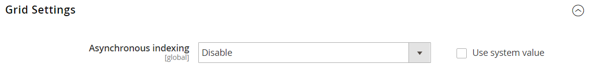

# [!UICONTROL Advanced] > [!UICONTROL Developer]

{{config}}

>[!NOTE]
>
>これらの設定は、[ 開発者モード ](../../systems/developer-tools.md#operation-modes) でのみ使用できます。

## [!UICONTROL Frontend Development Workflow]

<!-- zoom -->

これらの設定の変更について詳しくは、『 [ 管理システムガイド ](../../systems/developer-tools.md#frontend-development-workflow) の _フロントエンド開発ワークフロー_ を参照してください。

| フィールド | [ 範囲 ](../../getting-started/websites-stores-views.md#scope-settings) | 説明 |
|--- |--- |--- |
| [!UICONTROL Workflow Type] | グローバル | 開発中にクライアント側またはサーバー側で LESS コンパイルが行われるかどうかを決定します。 オプション： **`Client side less compilation`**- コンパイルは、ネイティブの less.js ライブラリを使用してブラウザーで行われます。 **`Server side less compilation`** - Less PHP ライブラリを使用して、サーバー上でコンパイルが行われます。 これは、実稼動用のデフォルトのモードです。 |

{style="table-layout:auto"}

## [!UICONTROL Developer Client Restrictions]

<!-- zoom -->

この設定の変更方法については、『 [ 管理システムガイド ](../../systems/developer-tools.md#client-restrictions) の _クライアントの制限_ を参照してください。

| フィールド | [ 範囲 ](../../getting-started/websites-stores-views.md#scope-settings) | 説明 |
|--- |--- |--- |
| [!UICONTROL Allow IPs (comma separated)] | ストア表示 | ストア内の顧客に干渉することなく、ライブサイトで開発者ツールを使用できる IP アドレスの許可リストを作成します。 _インライン翻訳_ などのデベロッパーツールを使用している場合、サイトに加えられた変更は、許可リストの IP アドレスからのみ表示されます。 |

{style="table-layout:auto"}

## [!UICONTROL Template Settings]

<!-- zoom -->

これらの設定の変更方法については、『 [ 管理システムガイド ](../../systems/developer-tools.md#optimizing-resource-files) の _リソースファイルの最適化_ を参照してください。

| フィールド | [ 範囲 ](../../getting-started/websites-stores-views.md#scope-settings) | 説明 |
|--- |--- |--- |
| [!UICONTROL Allow Symlinks] | ストア表示 | [ シンボリックリンク ](https://en.wikipedia.org/wiki/Symbolic_link) を有効にすると、サイトがセキュリティリスクにさらされる可能性があるので、実稼動ストアには推奨されません。 |
| [!UICONTROL Minify Html] | ストア表示 | ストアテンプレートのHTMLを最小化するかどうかを指定します。 オプション：`Yes` / `No` |

{style="table-layout:auto"}

## [!UICONTROL Debug]

<!-- zoom -->

これらの設定の変更について詳しくは、『 [ 管理システムガイド ](../../systems/developer-tools.md#template-path-hints) の _テンプレートパスのヒント_ を参照してください。

| フィールド | [ 範囲 ](../../getting-started/websites-stores-views.md#scope-settings) | 説明 |
|--- |--- |--- |
| [!UICONTROL Enable Template Path Hints for Storefront] | ストア表示 | ページで使用される各テンプレートへのパスを示す表記法をストアフロントに追加します。 オプション：`Yes` / `No` |
| [!UICONTROL Enable Template Path Hints for Admin] | グローバル | ページで使用される各テンプレートへのパスを示す表記を管理者に追加します。 オプション：`Yes` / `No` |
| [!UICONTROL Add Block Class Type to Hints] | ストア表示 | テンプレートパスのヒントにブロックの名前を含めます。 オプション：`Yes` / `No` |

{style="table-layout:auto"}

## [!UICONTROL Translate Inline]

<!-- zoom -->

これらの設定の変更について詳しくは、『 [ 管理システムガイド ](../../systems/developer-tools.md#translate-inline) の _インライン翻訳_ を参照してください。

| フィールド | [ 範囲 ](../../getting-started/websites-stores-views.md#scope-settings) | 説明 |
|--- |--- |--- |
| [!UICONTROL Enable for Storefront] | ストア表示 | ストアフロントのインライン トランスレータをアクティブにします。 インターフェイスのテキストは、ストア表示ごとに編集できます。 許可リストに加える ライブストアに干渉せずに Inline Translator を使用するには、IP アドレスを Developer Client Restrictions に追加します。 |
| [!UICONTROL Enable for Admin] | グローバル | 管理者用のインライン翻訳をアクティブにします。 ストアフロントとは異なり、管理者を複数の言語に翻訳することはできません。 ただし、インターフェイスのフィールドラベルやその他のテキストは変更できます。 |

{style="table-layout:auto"}

## [!UICONTROL JavaScript Settings]

<!-- zoom -->

これらの設定の変更方法については、『 [ 管理システムガイド ](../../systems/developer-tools.md#optimizing-resource-files) の _リソースファイルの最適化_ を参照してください。

| フィールド | [ 範囲 ](../../getting-started/websites-stores-views.md#scope-settings) | 説明 |
|--- |--- |--- |
| [!UICONTROL Merge JavaScript Files] | ストア表示 | 複数のJavaScript ファイルを 1 つのファイルに結合して、ページの読み込み時間を短縮します。 |
| [!UICONTROL Enable JavaScript Bundling] | ストア表示 | 複数のJavaScript ファイルを 1 つのファイルにバンドルできるかどうかを判断します。 オプション：`Yes` / `No` |
| [!UICONTROL Minify JavaScript Files] | ストア表示 | 不要な文字、スペース、インデントを削除して、コードのサイズを小さくします。 |
| [!UICONTROL Move JS code to the bottom of the page] | グローバル | 有効にすると、JS コードがページの下部に移動します。 オプション：`Yes` / `No` |
| [!UICONTROL Translation Strategy] | グローバル | システムで使用される翻訳方法を決定します。 オプション： **`Dictionary`**- ストアフロント側での翻訳。 **`Embedded`** – 管理者側での翻訳。 |
| [!UICONTROL Log JS Errors to Session Storage] | グローバル | 有効にすると、機能テストでレポートに使用できます。 オプション：`Yes` / `No` |
| [!UICONTROL Log JS Errors to Session Storage Key] | グローバル | 収集された js エラーを取得するために使用されるキーを識別します。 |

{style="table-layout:auto"}

## [!UICONTROL CSS Settings]

<!-- zoom -->

これらの設定の変更方法については、『 [ 管理システムガイド ](../../systems/developer-tools.md#optimizing-resource-files) の _リソースファイルの最適化_ を参照してください。

| フィールド | [ 範囲 ](../../getting-started/websites-stores-views.md#scope-settings) | 説明 |
|--- |--- |--- |
| [!UICONTROL Merge CSS Files] | ストア表示 | 複数の CSS ファイルを 1 つのファイルに結合して、ページの読み込み時間を短縮します。 オプション：`Yes` / `No` |
| [!UICONTROL Minify CSS Files] | ストア表示 | 不要な文字、スペース、インデントを削除して、コードのサイズを小さくします。 オプション：`Yes` / `No` |
| [!UICONTROL Use CSS critical path] | グローバル | _CSS 重要パス_ は、縮小された重要な CSS を `<head>` でインライン配信し、非同期で読み込まれる重要でないすべてのスタイルを延期します。 オプション：`Yes` / `No` |

{style="table-layout:auto"}

## [!UICONTROL Image Processing Settings]

<!-- zoom -->

| フィールド | [ 範囲 ](../../getting-started/websites-stores-views.md#scope-settings) | 説明 |
|--- |--- |--- |
| [!UICONTROL Image Adapter] | グローバル | イメージのレンダリングに使用するアダプタを指定します。 アダプターの設定を変更した後、カタログ画像のキャッシュをフラッシュします。 Options: `PHP GD2` / `ImageMagick`   **_Note:_** ICO ファイルタイプは ImageMagik アダプタでのみサポートされています。 |

{style="table-layout:auto"}

## [!UICONTROL Caching Settings]

<!-- zoom -->

| フィールド | [ 範囲 ](../../getting-started/websites-stores-views.md#scope-settings) | 説明 |
|--- |--- |--- |
| [!UICONTROL Cache User Defined Attributes] | グローバル | 有効な場合、はユーザー定義の属性およびシステムエンティティ属性値（EAV）属性をキャッシュします。 このオプションを使用するとパフォーマンスが向上する可能性がありますが、キャッシュ用に追加のスペースが必要になることもあります。 オプション：`Yes` / `No` |

{style="table-layout:auto"}

## [!UICONTROL Static Files Settings]

<!-- zoom -->

| フィールド | [ 範囲 ](../../getting-started/websites-stores-views.md#scope-settings) | 説明 |
|--- |--- |--- |
| [!UICONTROL Sign Static Files] | グローバル | 有効にすると、静的ファイルの URL にデジタル署名が追加され、ブラウザーでファイルの新しいバージョンが使用可能かどうかを検出できるようになります。 ファイルの署名がブラウザーのキャッシュに格納されている署名と異なる場合は、ファイルの新しいバージョンが使用されます。 署名可能な静的ファイルには、JavaScript、CSS、画像、フォントなどがあります。 オプション：`Yes` / `No` |

{style="table-layout:auto"}

## [!UICONTROL Grid Settings]

<!-- zoom -->

| フィールド | [ 範囲 ](../../getting-started/websites-stores-views.md#scope-settings) | 説明 |
|--- |--- |--- |
| [!UICONTROL Asynchronous Indexing|Global] | 注文、請求書、出荷、クレジット メモなどの注文処理システム エンティティをグリッドに追加し、インデックスを再作成するタイミングを決定します。 非同期インデックス作成を使用すると、保存操作中のデータのロックを回避し、処理時間を短縮できます。 オプション： **`Disable`**- （デフォルト）順序に関連するエンティティは、様々なタイミングでグリッドに追加されます。 保存されたとおりに。 **`Enable`** – 注文関連のエンティティは、スケジュールされた cron ジョブの実行中にのみグリッドに追加されます。 Cron は 1 分ごとに 1 回実行されるように設定する必要があります。 |

{style="table-layout:auto"}
