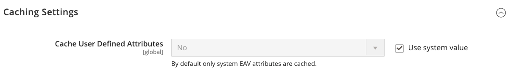
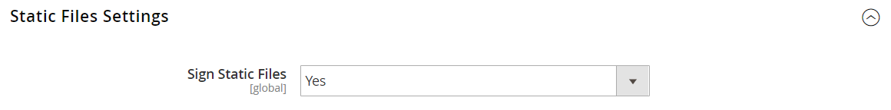

# [!UICONTROL Advanced] > [!UICONTROL Developer]

{{config}}

>[!NOTE]
>
>これらの設定設定は、[開発者モード ](../../systems/developer-tools.md#operation-modes)でのみ使用できます。

## [!UICONTROL Frontend Development Workflow]

<!-- zoom -->

これらの設定の変更について詳しくは、_管理者システムガイド_&#x200B;の[ フロントエンド開発ワークフロー](../../systems/developer-tools.md#frontend-development-workflow)を参照してください。

| フィールド | [範囲](../../getting-started/websites-stores-views.md#scope-settings) | 説明 |
|--- |--- |--- |
| [!UICONTROL Workflow Type] | グローバル | 開発中にクライアントサイドまたはサーバーサイドでコンパイルが少なくなるかどうかを決定します。 オプション： **`Client side less compilation`**- コンパイルは、ネイティブ less.js ライブラリを使用してブラウザーで行われます。 **`Server side less compilation`** - コンパイルは、Less PHP ライブラリを使用してサーバー上で実行されます。 これは実稼動のデフォルトモードです。 |

{style="table-layout:auto"}

## [!UICONTROL Developer Client Restrictions]

<!-- zoom -->

この設定の変更について詳しくは、_管理者システムガイド_&#x200B;の「[ クライアントの制限](../../systems/developer-tools.md#client-restrictions)」を参照してください。

| フィールド | [範囲](../../getting-started/websites-stores-views.md#scope-settings) | 説明 |
|--- |--- |--- |
| [!UICONTROL Allow IPs (comma separated)] | ストアビュー | ストア内のお客様に影響を与えることなく、ライブサイトでデベロッパーツールを使用できるIP アドレスの許可リストを作成します。 _インライン翻訳_&#x200B;などの開発者用ツールを使用する際にサイトに加えられた変更は、Web ページのIP アドレスからのみ表示されます。 インライン翻訳などの開発者用ツールを使用する場合、サイトに加えられた変更は、Web 許可リスト上のIP アドレスからのみ表示されます。 |

{style="table-layout:auto"}

## [!UICONTROL Template Settings]

<!-- zoom -->

これらの設定の変更について詳しくは、_管理者システムガイド_&#x200B;の「[ リソースファイルの最適化](../../systems/developer-tools.md#optimizing-resource-files)」を参照してください。

| フィールド | [範囲](../../getting-started/websites-stores-views.md#scope-settings) | 説明 |
|--- |--- |--- |
| [!UICONTROL Allow Symlinks] | ストアビュー | [ シンボリックリンク ](https://en.wikipedia.org/wiki/Symbolic_link)を有効にすると、サイトがセキュリティリスクにさらされる可能性があるため、実稼動ストアには推奨されません。 |
| [!UICONTROL Minify Html] | ストアビュー | ストアテンプレートのHTMLを最小化するかどうかを指定します。 オプション：`Yes` / `No` |

{style="table-layout:auto"}

## [!UICONTROL Debug]

<!-- zoom -->

これらの設定の変更について詳しくは、_管理者システムガイド_&#x200B;の「[ テンプレートのパスヒント ](../../systems/developer-tools.md#template-path-hints)」を参照してください。

| フィールド | [範囲](../../getting-started/websites-stores-views.md#scope-settings) | 説明 |
|--- |--- |--- |
| [!UICONTROL Enable Template Path Hints for Storefront] | ストアビュー | ページで使用される各テンプレートへのパスを示す表記をストアフロントに追加します。 オプション：`Yes` / `No` |
| [!UICONTROL Enable Template Path Hints for Admin] | グローバル | ページで使用されている各テンプレートへのパスを示す注釈を管理者に追加します。 オプション：`Yes` / `No` |
| [!UICONTROL Add Block Class Type to Hints] | ストアビュー | テンプレートパスのヒントにブロックの名前を含めます。 オプション：`Yes` / `No` |

{style="table-layout:auto"}

## [!UICONTROL Translate Inline]

<!-- zoom -->

これらの設定の変更について詳しくは、_管理者システムガイド_&#x200B;の「[ インライン翻訳](../../systems/developer-tools.md#translate-inline)」を参照してください。

| フィールド | [範囲](../../getting-started/websites-stores-views.md#scope-settings) | 説明 |
|--- |--- |--- |
| [!UICONTROL Enable for Storefront] | ストアビュー | ストアフロントのインライン翻訳機能を有効にします。 インターフェイスのテキストは、ストアビューごとに編集できます。 ライブストアを妨げずにインライントランスレーターを使用するには、Developer Client Restrictionsの許可リストにIP アドレスを追加します。 |
| [!UICONTROL Enable for Admin] | グローバル | 管理者のインライン翻訳者をアクティブにします。 ストアフロントとは異なり、管理者は複数の言語に翻訳できません。 ただし、インターフェイス内のフィールドラベルやその他のテキストは変更できます。 |

{style="table-layout:auto"}

## [!UICONTROL JavaScript Settings]

<!-- zoom -->

これらの設定の変更について詳しくは、_管理者システムガイド_&#x200B;の「[ リソースファイルの最適化](../../systems/developer-tools.md#optimizing-resource-files)」を参照してください。

| フィールド | [範囲](../../getting-started/websites-stores-views.md#scope-settings) | 説明 |
|--- |--- |--- |
| [!UICONTROL Merge JavaScript Files] | ストアビュー | 複数のJavaScriptファイルを1つのファイルに結合し、ページの読み込み時間を短縮します。 |
| [!UICONTROL Enable JavaScript Bundling] | ストアビュー | 複数のJavaScript ファイルを1つのファイルにバンドルできるかどうかを指定します。 オプション：`Yes` / `No` |
| [!UICONTROL Minify JavaScript Files] | ストアビュー | 不要な文字、スペース、インデントを削除して、コードのサイズを縮小します。 |
| [!UICONTROL Move JS code to the bottom of the page] | グローバル | 有効にすると、JS コードがページの下部に移動します。 オプション：`Yes` / `No` |
| [!UICONTROL Translation Strategy] | グローバル | システムで使用される翻訳方法を決定します。 オプション： **`Dictionary`**- ストアフロント側の翻訳。 **`Embedded`** – 管理者側の翻訳。 |
| [!UICONTROL Log JS Errors to Session Storage] | グローバル | 有効にすると、はレポート用の機能テストで使用できます。 オプション：`Yes` / `No` |
| [!UICONTROL Log JS Errors to Session Storage Key] | グローバル | 収集されたjs エラーの取得に使用されるキーを識別します。 |

{style="table-layout:auto"}

## [!UICONTROL CSS Settings]

<!-- zoom -->

これらの設定の変更について詳しくは、_管理者システムガイド_&#x200B;の「[ リソースファイルの最適化](../../systems/developer-tools.md#optimizing-resource-files)」を参照してください。

| フィールド | [範囲](../../getting-started/websites-stores-views.md#scope-settings) | 説明 |
|--- |--- |--- |
| [!UICONTROL Merge CSS Files] | ストアビュー | 複数のCSS ファイルを1つのファイルに結合して、ページの読み込み時間を短縮します。 オプション：`Yes` / `No` |
| [!UICONTROL Minify CSS Files] | ストアビュー | 不要な文字、スペース、インデントを削除して、コードのサイズを縮小します。 オプション：`Yes` / `No` |
| [!UICONTROL Use CSS critical path] | グローバル | _CSS クリティカルパス_&#x200B;は、`<head>`に縮小されたクリティカル CSS インラインを提供し、非同期的に読み込まれるすべての非クリティカル スタイルを延期します。 オプション：`Yes` / `No` |

{style="table-layout:auto"}

## [!UICONTROL Image Processing Settings]

<!-- zoom -->

| フィールド | [範囲](../../getting-started/websites-stores-views.md#scope-settings) | 説明 |
|--- |--- |--- |
| [!UICONTROL Image Adapter] | グローバル | 画像のレンダリングに使用するアダプタを指定します。 アダプター設定を変更した後、カタログ画像キャッシュをフラッシュします。 オプション：`PHP GD2` / `ImageMagick`   **_Note:_** ICO ファイルタイプは、ImageMagik アダプタでのみサポートされています。 |

{style="table-layout:auto"}

## [!UICONTROL Caching Settings]

<!-- zoom -->

| フィールド | [範囲](../../getting-started/websites-stores-views.md#scope-settings) | 説明 |
|--- |--- |--- |
| [!UICONTROL Cache User Defined Attributes] | グローバル | 有効にすると、ユーザー定義およびシステム エンティティ属性値（EAV）属性がキャッシュされます。 このオプションを選択すると、パフォーマンスが向上する可能性がありますが、キャッシュに追加の容量が必要になります。 オプション：`Yes` / `No` |

{style="table-layout:auto"}

## [!UICONTROL Static Files Settings]

<!-- zoom -->

| フィールド | [範囲](../../getting-started/websites-stores-views.md#scope-settings) | 説明 |
|--- |--- |--- |
| [!UICONTROL Sign Static Files] | グローバル | 有効にすると、静的ファイルのURLにデジタル署名が追加され、ブラウザーで新しいバージョンのファイルが使用可能な場合に検出できるようになります。 ファイルの署名がブラウザーのキャッシュに保存されているものと異なる場合は、新しいバージョンのファイルが使用されます。 署名できる静的ファイルには、JavaScript、CSS、画像、フォントなどがあります。 オプション：`Yes` / `No` |

{style="table-layout:auto"}

## [!UICONTROL Grid Settings]

<!-- zoom -->

| フィールド | [範囲](../../getting-started/websites-stores-views.md#scope-settings) | 説明 |
|--- |--- |--- |
| [!UICONTROL Asynchronous Indexing|Global] | 注文、請求書、出荷、クレジットメモなどの注文処理システムのエンティティをグリッドに追加し、インデックスを再作成するタイミングを指定します。 非同期インデックス作成を使用すると、保存操作中のデータのロックを回避し、処理時間を短縮できます。 オプション： **`Disable`**- （デフォルト）注文関連のエンティティは、様々なタイミングでグリッドに追加されます。 自動的にラベル付けされます。 **`Enable`** – 順序関連のエンティティは、スケジュールされたcron ジョブ中にのみグリッドに追加されます。 Cronは、毎分1回実行するように設定する必要があります。 |

{style="table-layout:auto"}
