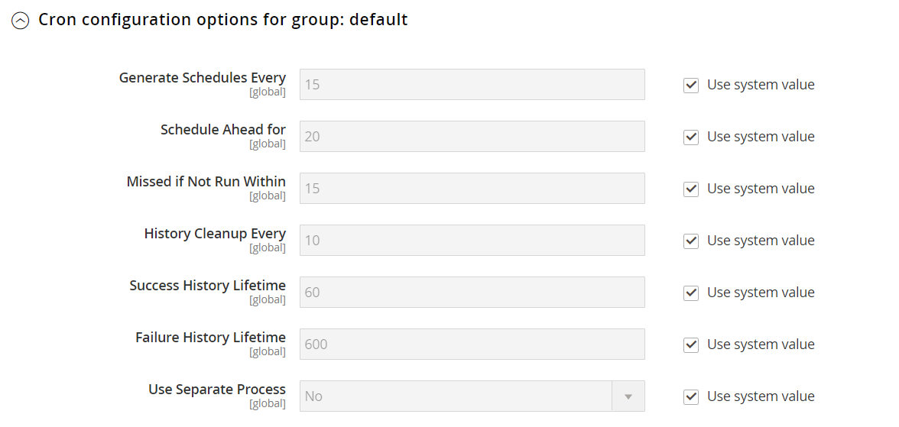
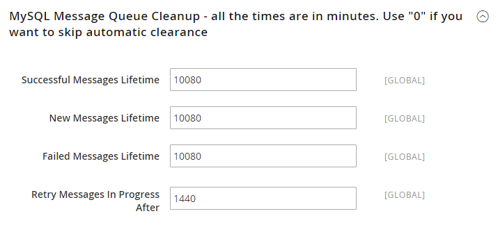
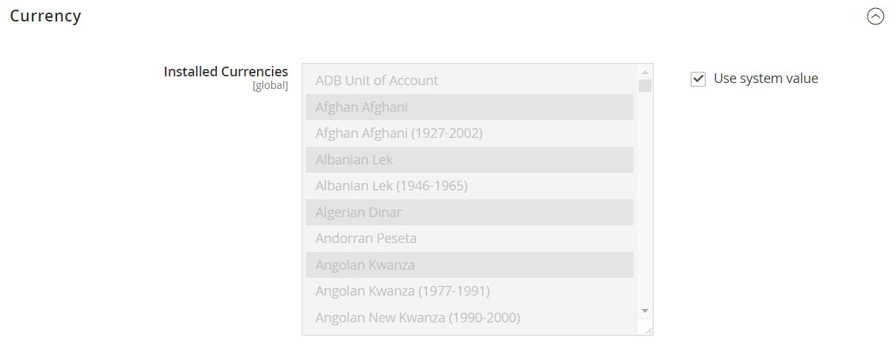
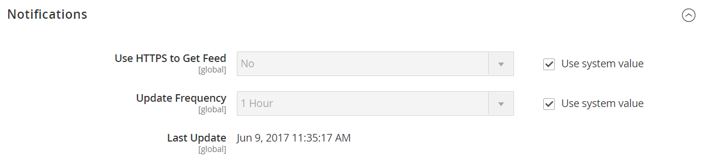
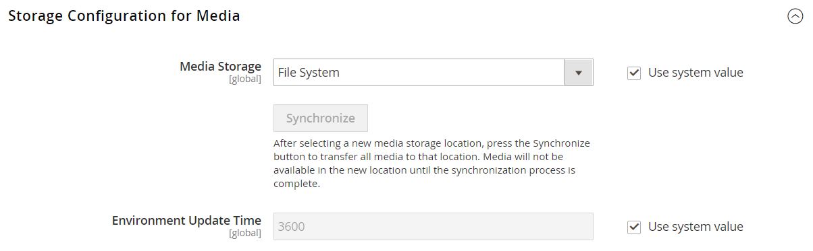
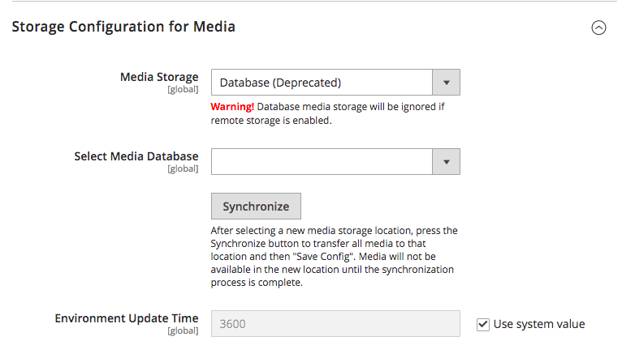
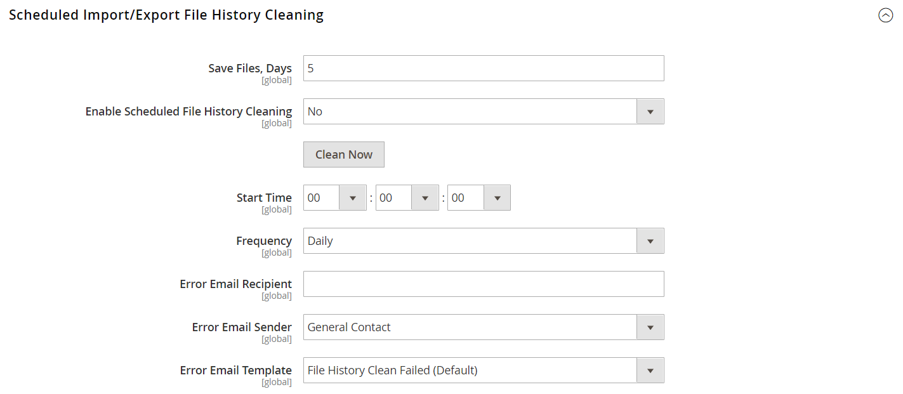
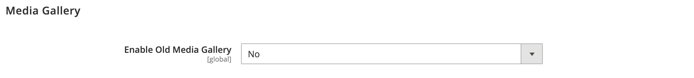
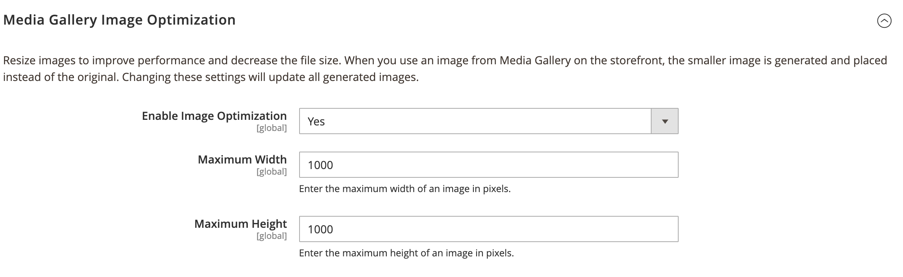
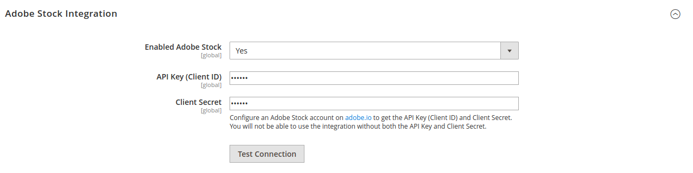

# [!UICONTROL Advanced] > [!UICONTROL System]

{{config}}

## [!UICONTROL Cron (Scheduled Tasks)]

<!-- zoom -->

これらの設定設定の変更について詳しくは、[Cron （スケジュールされたタスク） &#x200B;](../../systems/cron.md)を参照してください。

### [!UICONTROL index]

<!-- zoom -->

| フィールド | [範囲](../../getting-started/websites-stores-views.md#scope-settings) | 説明 |
|--- |--- |--- |
| [!UICONTROL Generate Schedules Every] | グローバル | スケジュールが生成される頻度を分単位で指定します。 |
| [!UICONTROL Schedule Ahead for] | グローバル | スケジュールが生成される分数を事前に決定します。 |
| [!UICONTROL Missed if Not Run Within] | グローバル | まだ実行されていないcron ジョブが見逃されたとマークされるまでの分数を指定します。 |
| [!UICONTROL History Cleanup Every] | グローバル | cron履歴がクリーニングされるまでの時間を分単位で指定します。 |
| [!UICONTROL Success History Lifetime] | グローバル | 正常に完了したcron ジョブのレコードがデータベースに保持される分数を指定します。 |
| [!UICONTROL Failure History Lifetime] | グローバル | 失敗したcron ジョブのレコードがデータベースに保持される分数を指定します。 |
| [!UICONTROL Use Separate Process] | グローバル | cron ジョブが別々のプロセスとして並行して実行されるかどうかを決定します。 オプション：`Yes` / `No` |

{style="table-layout:auto"}

### [!UICONTROL default]

<!-- zoom -->

| フィールド | [範囲](../../getting-started/websites-stores-views.md#scope-settings) | 説明 |
|--- |--- |--- |
| [!UICONTROL Generate Schedules Every] | グローバル | スケジュールが生成される頻度を分単位で指定します。 |
| [!UICONTROL Schedule Ahead for] | グローバル | スケジュールが生成される分数を事前に決定します。 |
| [!UICONTROL Missed if Not Run Within] | グローバル | まだ実行されていないcron ジョブが見逃されたとマークされるまでの分数を指定します。 |
| [!UICONTROL History Cleanup Every] | グローバル | cron履歴がクリーニングされるまでの時間を分単位で指定します。 |
| [!UICONTROL Success History Lifetime] | グローバル | 正常に完了したcron ジョブのレコードがデータベースに保持される分数を指定します。 |
| [!UICONTROL Failure History Lifetime] | グローバル | 失敗したcron ジョブのレコードがデータベースに保持される分数を指定します。 |
| [!UICONTROL Use Separate Process] | グローバル | cron ジョブが別々のプロセスとして並行して実行されるかどうかを決定します。 オプション：`Yes` / `No` |

{style="table-layout:auto"}

## [!UICONTROL MySQL Message Queue Cleanup]

{{ee-feature}}

<!-- zoom -->

| フィールド | [範囲](../../getting-started/websites-stores-views.md#scope-settings) | 説明 |
|--- |--- |--- |
| [!UICONTROL Successful Messages Lifetime] | グローバル | 成功したメッセージの有効期間を数分で決定します。 クリーンアップをスキップするには、0と入力します。 既定：`10080` （7日間） |
| [!UICONTROL New Messages Lifetime] | グローバル | 新しいメッセージの有効期間を数分で決定します。 クリーンアップをスキップするには、0と入力します。 既定：`10080` （7日間） |
| [!UICONTROL Failed Messages Lifetime] | グローバル | 失敗したメッセージの有効期間を分単位で決定します。 クリーンアップをスキップするには、0と入力します。 既定：`10080` （7日間） |
| [!UICONTROL Retry Messages in Progress After] | グローバル | システムが処理中のメッセージを待ってから再試行するまでの時間を指定します。 既定：`1440` （24時間） |

{style="table-layout:auto"}

## [!UICONTROL Mail Sending Settings]

<!-- zoom -->

これらの設定の変更について詳しくは、_管理者システムガイド_&#x200B;の[電子メール通信の設定](../../systems/email-communications.md)を参照してください。

>[!IMPORTANT]
>
>**セキュリティ通知**&#x200B;すべての販売者は、最近特定された潜在的なリモート コード実行の悪用から保護するために、メール送信設定を直ちに設定することをお勧めします。 この問題が解決されるまで、メール通信に[!DNL Sendmail]を使用することを避けることを強くお勧めします。 [!UICONTROL Mail Sending Settings]で、[!UICONTROL Set Return Path]が`No`に設定されていることを確認してください。

| フィールド | [範囲](../../getting-started/websites-stores-views.md#scope-settings) | 説明 |
|--- |--- |--- |
| [!UICONTROL Disable Email Communications] | ストアビュー | メール通信がストアに対してアクティブ化されているかどうかを指定します。 オプション：`Yes` / `No` |
| [!UICONTROL Transport] | ストアビュー | 店舗からのメール通信の転送タイプを決定します。 オプション：`Sendmail` / `SMTP` |
| [!UICONTROL Host] | ストアビュー | （SMTP サーバーとWindows サーバーの場合のみ）ホストを参照するために使用される名前を決定します。 デフォルト値：`localhost` |
| [!UICONTROL Port (25)] | ストアビュー | （SMTPおよびWindows サーバーの場合のみ）電子メール通信に使用されるポートを識別します。 デフォルト値：`25` |
| [!UICONTROL Set Return-Path] | ストアビュー | 返される電子メールにルーティングアドレスを使用するかどうかを指定します。 オプション：`No` / `Yes` / `Specified` |

{style="table-layout:auto"}

### SMTP オプション

トランスポートタイプで「SMTP」を選択すると、SMTP サーバー接続を設定するための追加のオプションが使用できます。

<!-- zoom -->を使用したメール送信設定

| フィールド | [範囲](../../getting-started/websites-stores-views.md#scope-settings) | 説明 |
|--- |--- |--- |
| [!UICONTROL Username] | ストアビュー | SMTP サーバーのログイン ユーザー名。 |
| [!UICONTROL Password] | ストアビュー | SMTP サーバーログインのパスワード。 |
| [!UICONTROL Auth] | ストアビュー | SMTP サーバー接続の認証タイプを指定します。 オプション：`NONE` / `PLAIN` / `LOGIN` |
| [!UICONTROL SSL] | ストアビュー | ホストのセキュリティ証明書の検証タイプを決定します。 オプション：`SSL` / `TLS` |

{style="table-layout:auto"}

## [!UICONTROL Currency]

<!-- zoom -->

この設定の変更について詳しくは、_ストアと購入エクスペリエンスガイド_&#x200B;の[通貨設定](../../stores-purchase/currency-configuration.md)を参照してください。

| フィールド | [範囲](../../getting-started/websites-stores-views.md#scope-settings) | 説明 |
|--- |--- |--- |
| [!UICONTROL Installed Currencies] | グローバル | 現在Commerceのインストールで使用できる通貨を示します。 オプションには、利用可能なすべての通貨が含まれ、インストールされている通貨が選択されています。 |

{style="table-layout:auto"}

## [!UICONTROL Security]

<!-- zoom -->

これらの設定の変更について詳しくは、_管理者システムガイド_&#x200B;の「[&#x200B; セッション管理](../../systems/security-session-management.md)」を参照してください。

| フィールド | [範囲](../../getting-started/websites-stores-views.md#scope-settings) | 説明 |
|--- |--- |--- |
| [!UICONTROL Max Session Size in Admin] | グローバル | セッションの最大サイズをバイト単位で制限します。 `0`を使用して無効にします。 |
| [!UICONTROL Max Session Size in Storefront] | グローバル | セッションの最大サイズをバイト単位で制限します。 `0`を使用して無効にします。 |

{style="table-layout:auto"}

## [!UICONTROL Notifications]

<!-- zoom -->

これらの設定の変更について詳しくは、_管理者システムガイド_&#x200B;の「[&#x200B; システム通知](../../systems/notifications.md)」を参照してください。

| フィールド | [範囲](../../getting-started/websites-stores-views.md#scope-settings) | 説明 |
|--- |--- |--- |
| [!UICONTROL Use HTTPS to Get Feed] | グローバル | 管理者通知が安全なチャネルを介して配信されるかどうかを指定します。 オプション：`Yes` / `No` |
| 更新頻度 | グローバル | 管理者メッセージの更新頻度を決定します。 オプション：`1 Hour` / `2 Hours` / `6 Hours` / `12 Hours` / `24 Hours` |
| [!UICONTROL Last Update] | グローバル | 最後のメッセージ更新の日時を示します。 |

{style="table-layout:auto"}

## [!UICONTROL Backup Settings]

<!-- zoom -->

{{$include /help/_includes/backups-note.md}}

これらの設定の変更について詳しくは、_管理者システムガイド_&#x200B;の「[&#x200B; システムバックアップ &#x200B;](../../systems/backups.md)」を参照してください。

| フィールド | [範囲](../../getting-started/websites-stores-views.md#scope-settings) | 説明 |
|--- |--- |--- |
| [!UICONTROL Enable Backup] | グローバル | Commerce インスタンスでバックアップが許可されているかどうかを判断します。 オプション：`Yes` / `No` |
| [!UICONTROL Enable Scheduled Backup] | グローバル | （_[!UICONTROL Enable Backup]_&#x200B;が`Yes`に設定されている場合に表示されます）。 Commerce インスタンスが定期的なスケジュールで自動的にバックアップされるかどうかを指定します。 オプション：`Yes` / `No` |
| [!UICONTROL Scheduled Backup Type] | グローバル | （_[!UICONTROL Enable Scheduled Backup]_&#x200B;が`Yes`に設定されている場合に表示されます）。 バックアップに含まれるCommerce インスタンスのエレメントを指定します。 オプション：`Database` / `Database and Media` / `System` / `System (excluding Media)` |
| [!UICONTROL Start Time] | グローバル | （[!UICONTROL Enable Scheduled Backup]が`Yes`に設定されている場合に表示されます）。 スケジュールされたバックアップが開始される時間、分、秒を指定します。 |
| [!UICONTROL Frequency] | グローバル | （[!UICONTROL Enable Scheduled Backup]が`Yes`に設定されている場合に表示されます）。 スケジュールされたバックアップを実行する頻度を指定します。 オプション：`Daily` / `Weekly` / `Monthly` |
| [!UICONTROL Maintenance Mode] | グローバル | （[!UICONTROL Enable Scheduled Backup]が`Yes`に設定されている場合に表示されます）。 スケジュールされたバックアップ中にストアをメンテナンスモードにするかどうかを決定します。 オプション：`Yes` / `No` |

{style="table-layout:auto"}

## [!UICONTROL Admin Actions Log Archiving]

{{ee-feature}}

<!-- zoom -->

これらの設定の変更について詳しくは、_管理者システムガイド_&#x200B;の「[&#x200B; アクションログアーカイブ &#x200B;](../../systems/action-log-archive.md)」を参照してください。

| フィールド | [範囲](../../getting-started/websites-stores-views.md#scope-settings) | 説明 |
|--- |--- |--- |
| [!UICONTROL Log Entry Lifetime, Days] | ストアビュー | 管理者アクションが管理者アクションアーカイブに保持される日数を指定します。 既定：`60` |
| [!UICONTROL Log Archiving Frequency] | ストアビュー | 管理者アクションのログをアーカイブする頻度を指定します。 オプション：`Daily` / `Weekly` / `Monthly` |

{style="table-layout:auto"}

## [!UICONTROL Full Page Cache]

<!-- zoom -->

これらの設定の変更について詳しくは、_管理者システムガイド_&#x200B;の[&#x200B; フルページキャッシュ &#x200B;](../../systems/cache-management.md#full-page-caching)を参照してください。

<!-- zoom -->

| フィールド | [範囲](../../getting-started/websites-stores-views.md#scope-settings) | 説明 |
|--- |--- |--- |
| [!UICONTROL Caching Application] | グローバル | ページ全体のキャッシュの管理に使用するアプリケーションを指定します。 オプション： **`Built-in Application`**– 実稼動環境では推奨されません。 **`Varnish Caching`** – 実稼動環境で推奨されます。 |
| [!UICONTROL TTL for public content] | グローバル | 公開コンテンツキャッシュの有効期間を秒単位で指定します。 デフォルト値：`120` |
| [!UICONTROL Handles param size] | グローバル | [`{BASE-URL}/page_cache/block/esi`](https://experienceleague.adobe.com/docs/commerce-operations/configuration-guide/cache/use-varnish-esi.html) HTTP エンドポイントで処理する[&#x200B; レイアウトハンドル &#x200B;](https://developer.adobe.com/commerce/frontend-core/guide/layouts/#layout-handles)の最大数を指定します。 サイズを制限すると、セキュリティとパフォーマンスが向上します。 デフォルト値：`100` |
| **[!UICONTROL Varnish Configuration]** |  |  |
| [!UICONTROL Access list] | グローバル | Varnish設定をパージして設定ファイルを生成できるIP アドレスを指定します。 複数のエントリをコンマで区切ります。 デフォルト値：`localhost` |
| [!UICONTROL Backend host] | グローバル | 設定ファイルを生成するバックエンドホストを指定します。 デフォルト値：`localhost` |
| [!UICONTROL Backend port] | グローバル | 設定ファイルの生成に使用するバックエンドポートを指定します。 デフォルト値：`8080` |
| [!UICONTROL Grace period] | グローバル | バックエンドがレスポンシブでない場合に、Varnishが古いコンテンツを提供する時間を決定します。 デフォルト値：`300` |
| **[!UICONTROL Export Configuration]** |  |  |
| [!UICONTROL Export VCL for Varnish 4] | グローバル | バージョン 4の`varnish.vcl` ファイルを書き出します。 |
| [!UICONTROL Export VCL for Varnish 5] | グローバル | バージョン 5の`varnish.vcl` ファイルを書き出します。 |
| [!UICONTROL Export VCL for Varnish 6] | グローバル | バージョン 6の`varnish.vcl` ファイルを書き出します。 |

{style="table-layout:auto"}

## [!UICONTROL Storage Configuration for Media]

<!-- zoom -->

これらの設定の変更について詳しくは、_コンテンツとデザインガイド_&#x200B;の「[&#x200B; メディアデータベースの使用](../../content-design/media-storage-database.md)」を参照してください。

| フィールド | [範囲](../../getting-started/websites-stores-views.md#scope-settings) | 説明 |
|--- |--- |--- |
| [!UICONTROL Media Storage] | グローバル | メディアファイルの保存方法を指定します。 既定の設定：`File System` |
| [!UICONTROL Environment Update Time] | グローバル | メディアファイル環境の更新頻度を秒単位で指定します。 デフォルト値：`3600` |

{style="table-layout:auto"}

<!-- zoom -->

>[!IMPORTANT]
>
>Adobe CommerceおよびMagento Open Source 2.4.3の時点で、データベース・メディア・ストレージ・メソッドは廃止されています。

| フィールド | [範囲](../../getting-started/websites-stores-views.md#scope-settings) | 説明 |
|--- |--- |--- |
| [!UICONTROL Media Storage] | グローバル | メディアファイルの保存に使用するメソッドとしてデータベースを指定します。 |
| [!UICONTROL Select Media Database] | グローバル | メディアストレージに使用されるデータベースの名前を識別します。 既定の設定：`default_setup` |
| [!UICONTROL Synchronize] |  | すべてのメディアの転送を、指定したデータベースの場所に同期します。 |
| 環境の更新時間 | グローバル | メディアファイル環境の更新頻度を秒単位で指定します。 デフォルト値：`3600` |

{style="table-layout:auto"}

## [!UICONTROL Bulk Actions]

{{ee-feature}}

<!-- zoom -->

これらの設定の変更について詳しくは、_管理者システムガイド_&#x200B;の[一括アクション &#x200B;](../../systems/action-log-bulk-actions.md)を参照してください。

| フィールド | [範囲](../../getting-started/websites-stores-views.md#scope-settings) | 説明 |
|--- |--- |--- |
| [!UICONTROL Days Saved in Log] | グローバル | 一括アクションが&#x200B;_一括アクションログ_ アーカイブに保持される日数を指定します。 既定：`60` |

{style="table-layout:auto"}

## [!UICONTROL Scheduled Import/Export File History Cleaning]

{{ee-feature}}

<!-- zoom -->

これらの設定の変更について詳しくは、_管理者システムガイド_&#x200B;の「[&#x200B; スケジュールされた読み込みと書き出し](../../systems/data-scheduled-import-export.md)」を参照してください。

| フィールド | [範囲](../../getting-started/websites-stores-views.md#scope-settings) | 説明 |
|--- |--- |--- |
| [!UICONTROL Save File, Days] | グローバル | 履歴ファイルの読み込み/書き出しが保存される日数を指定します。 |
| [!UICONTROL Enable Scheduled File History Cleaning] | グローバル | ファイルの読み込み/書き出しのスケジュール済みファイルのクリーンアップを有効にします。 オプション：`Yes` / `No` |
| [!UICONTROL Clean Now] |  | スケジュールされたクリーンアップを上書きし、インポート/エクスポート履歴ファイルを即座にクリーンアップします。 |
| [!UICONTROL Start Time] | グローバル | 読み込み/書き出し履歴ファイルのクリーンアップの時間、分、秒を指定します。 |
| [!UICONTROL Frequency] | グローバル | インポート/エクスポート履歴ファイルをクリーニングする頻度を指定します。 オプション：`Daily` / `Weekly` / `Monthly` |
| [!UICONTROL Error Email Recipient] | グローバル | ファイルの読み込み/書き出し履歴のクリーンアップ中にエラーが発生した場合に通知を受け取るユーザーのメールアドレス。 複数のアドレスをコンマで区切ります。 |
| [!UICONTROL Error Email Sender] | グローバル | 通知の送信者として表示されるストア連絡先を識別します。 既定の送信者：`General Contact` |
| [!UICONTROL Error Email Template] | グローバル | ファイルの読み込み/書き出しのクリーニングエラー通知に使用されるメールテンプレートを識別します。 既定のテンプレート：`File History Clean Failed` |

{style="table-layout:auto"}

## [!UICONTROL Image Upload Configuration]

<!-- zoom -->

<!-- [Image Upload Configuration](https://experienceleague.adobe.com/ja/docs/commerce-admin/systems/action-logs/action-log-bulk-actions) -->

| フィールド | [範囲](../../getting-started/websites-stores-views.md#scope-settings) | 説明 |
|--- |--- |--- |
| [!UICONTROL Quality] | グローバル | サイズ変更された画像のJPG画質を指定します。 画質を下げると、ファイルサイズが小さくなります。 80～90%を使用して、高品質でファイルサイズを縮小します。 既定：`80` |
| [!UICONTROL Enable Frontend Resize] | グローバル | この設定を有効にすると、_商品詳細_ ページ用にアップロードできる、大きくて大きすぎる画像のサイズをCommerceで変更できます。 Commerceでは、ファイルをアップロードする前に、JavaScriptを使用して画像ファイルのサイズを変更します。 画像のサイズを変更すると、最大幅または最大高さに対して最大サイズを超えない正確な比率が維持されます。 既定：`Yes` |
| [!UICONTROL Maximum Width] | グローバル | 画像の最大ピクセル幅を指定します。 画像のサイズを変更しても、この幅を超えることはありません。 既定：`1920` |
| [!UICONTROL Maximum Height] | グローバル | 画像の最大ピクセル高さを指定します。 画像のサイズを変更しても、この高さを超えることはありません。 既定：`1200` |

{style="table-layout:auto"}

## [!UICONTROL Media Gallery]

<!-- zoom -->

| フィールド | [範囲](../../getting-started/websites-stores-views.md#scope-settings) | 説明 |
|--- |--- |--- |
| [!UICONTROL Enable Old Media Gallery] | グローバル | 古いメディアギャラリーを有効または無効にします。 |

{style="table-layout:auto"}

## [!UICONTROL Media Gallery Image Optimization]

<!-- zoom -->

| フィールド | [範囲](../../getting-started/websites-stores-views.md#scope-settings) | 説明 |
|--- |--- |--- |
| [!UICONTROL Enable Image Optimization] | グローバル | コンテンツに挿入される画像のファイルサイズを小さくするために、画像のサイズを変更するかどうかを指定します。 元の画像はメディアギャラリーに保存されます。 |
| [!UICONTROL Maximum Width] | グローバル | メディアギャラリーからコンテンツに挿入される画像の最大幅（ピクセル単位）。 |
| [!UICONTROL Maximum Height] | グローバル | メディアギャラリーからコンテンツに挿入される画像の最大高さ（ピクセル単位）。 |

{style="table-layout:auto"}

## [!UICONTROL Adobe Stock Integration]

<!-- zoom -->

これらの設定について詳しくは、_コンテンツとデザインガイド_&#x200B;の[Adobe Stock Integration](../../content-design/adobe-stock.md)を参照してください。

| フィールド | [範囲](../../getting-started/websites-stores-views.md#scope-settings) | 説明 |
|--- |--- |--- |
| [!UICONTROL Enabled Adobe Stock] | グローバル | Adobe Stock統合を有効または無効にします。 |
| [!UICONTROL API Key (Client ID)] | グローバル | ストアをAdobe Stock サービスに接続するには、API キーが必要です。 |
| [!UICONTROL Client Secret] | グローバル | Adobe Stock統合用のクライアントシークレットが必要です。 |
| [!UICONTROL Test Connection] |  | テストを実行して、API キーがAdobe Stock サービスでの使用に対して有効であることを確認します。 |

{style="table-layout:auto"}

<!-- Last updated from includes: 2023-02-22 09:59:54 -->
