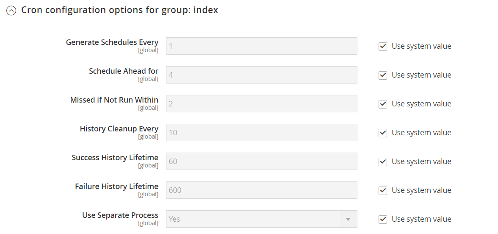
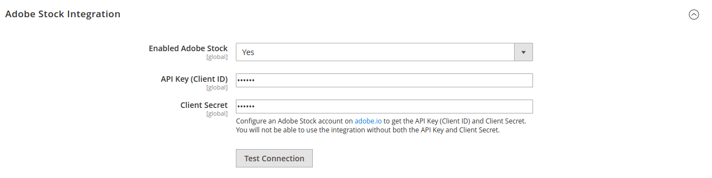

# [!UICONTROL Advanced] > [!UICONTROL System]

{{config}}

## [!UICONTROL Cron (Scheduled Tasks)]

<!-- zoom -->

これらの設定の変更について詳しくは、[Cron （スケジュールされたタスク） &#x200B;](../../systems/cron.md)」を参照してください。

### [!UICONTROL index]

<!-- zoom -->

| フィールド | [&#x200B; 範囲 &#x200B;](../../getting-started/websites-stores-views.md#scope-settings) | 説明 |
|--- |--- |--- |
| [!UICONTROL Generate Schedules Every] | グローバル | スケジュールが生成される頻度を分単位で指定します。 |
| [!UICONTROL Schedule Ahead for] | グローバル | スケジュールが生成される前の分数を決定します。 |
| [!UICONTROL Missed if Not Run Within] | グローバル | まだ実行されていない cron ジョブが失敗とマークされるまでの時間（分）を指定します。 |
| [!UICONTROL History Cleanup Every] | グローバル | Cron 履歴が消去されるまでの時間（分）を指定します。 |
| [!UICONTROL Success History Lifetime] | グローバル | 正常に完了した cron ジョブの記録をデータベースに保持する時間（分）を指定します。 |
| [!UICONTROL Failure History Lifetime] | グローバル | 失敗した cron ジョブのレコードをデータベースに保持する時間（分）を指定します。 |
| [!UICONTROL Use Separate Process] | グローバル | Cron ジョブを別々のプロセスとして並行して実行するかどうかを指定します。 オプション：`Yes` / `No` |

{style="table-layout:auto"}

### [!UICONTROL default]

<!-- zoom -->

| フィールド | [&#x200B; 範囲 &#x200B;](../../getting-started/websites-stores-views.md#scope-settings) | 説明 |
|--- |--- |--- |
| [!UICONTROL Generate Schedules Every] | グローバル | スケジュールが生成される頻度を分単位で指定します。 |
| [!UICONTROL Schedule Ahead for] | グローバル | スケジュールが生成される前の分数を決定します。 |
| [!UICONTROL Missed if Not Run Within] | グローバル | まだ実行されていない cron ジョブが失敗とマークされるまでの時間（分）を指定します。 |
| [!UICONTROL History Cleanup Every] | グローバル | Cron 履歴が消去されるまでの時間（分）を指定します。 |
| [!UICONTROL Success History Lifetime] | グローバル | 正常に完了した cron ジョブの記録をデータベースに保持する時間（分）を指定します。 |
| [!UICONTROL Failure History Lifetime] | グローバル | 失敗した cron ジョブのレコードをデータベースに保持する時間（分）を指定します。 |
| [!UICONTROL Use Separate Process] | グローバル | Cron ジョブを別々のプロセスとして並行して実行するかどうかを指定します。 オプション：`Yes` / `No` |

{style="table-layout:auto"}

## [!UICONTROL MySQL Message Queue Cleanup]

{{ee-feature}}

<!-- zoom -->

| フィールド | [&#x200B; 範囲 &#x200B;](../../getting-started/websites-stores-views.md#scope-settings) | 説明 |
|--- |--- |--- |
| [!UICONTROL Successful Messages Lifetime] | グローバル | 成功したメッセージの有効期間を分単位で決定します。 クリーンアップをスキップするには、ゼロを入力します。 デフォルト：`10080` （7 日） |
| [!UICONTROL New Messages Lifetime] | グローバル | 新しいメッセージの有効期間を分単位で指定します。 クリーンアップをスキップするには、ゼロを入力します。 デフォルト：`10080` （7 日） |
| [!UICONTROL Failed Messages Lifetime] | グローバル | 失敗したメッセージの有効期間を分単位で決定します。 クリーンアップをスキップするには、ゼロを入力します。 デフォルト：`10080` （7 日） |
| [!UICONTROL Retry Messages in Progress After] | グローバル | メッセージが進行中になるまで、再試行するまでのシステムの待ち時間を決定します。 デフォルト：`1440` （24 時間） |

{style="table-layout:auto"}

## [!UICONTROL Mail Sending Settings]

<!-- zoom -->

これらの設定の変更について詳しくは、『 [&#x200B; 管理システムガイド &#x200B;](../../systems/email-communications.md) の _メール通信の設定_ を参照してください。

>[!IMPORTANT]
>
>**セキュリティに関する通知** すべてのマーチャントは、最近特定された潜在的なリモートコード実行の不正利用から保護するために、直ちにメール送信設定を設定することをお勧めします。 この問題が解決されるまで、メール通信に [!DNL Sendmail] を使用しないことを強くお勧めします。 [!UICONTROL Mail Sending Settings] で、[!UICONTROL Set Return Path] が `No` に設定されていることを確認します。

| フィールド | [&#x200B; 範囲 &#x200B;](../../getting-started/websites-stores-views.md#scope-settings) | 説明 |
|--- |--- |--- |
| [!UICONTROL Disable Email Communications] | ストア表示 | ストアに対して電子メール通信をアクティブ化するかどうかを決定します。 オプション：`Yes` / `No` |
| [!UICONTROL Transport] | ストア表示 | ストアからの電子メール通信のトランスポートの種類を決定します。 オプション：`Sendmail` / `SMTP` |
| [!UICONTROL Host] | ストア表示 | （SMTP および Windows サーバーのみ）ホストを参照するために使用する名前を決定します。 デフォルト値：`localhost` |
| [!UICONTROL Port (25)] | ストア表示 | （SMTP および Windows サーバーのみ）メール通信に使用するポートを識別します。 デフォルト値：`25` |
| [!UICONTROL Set Return-Path] | ストア表示 | 返されるメールにルーティングアドレスを使用するかどうかを決定します。 オプション：`No`/`Yes`/`Specified` |

{style="table-layout:auto"}

### SMTP オプション

トランスポートタイプで SMTP を選択した場合は、SMTP サーバー接続を設定するための追加オプションを使用できます。

<!-- zoom -->

| フィールド | [&#x200B; 範囲 &#x200B;](../../getting-started/websites-stores-views.md#scope-settings) | 説明 |
|--- |--- |--- |
| [!UICONTROL Username] | ストア表示 | SMTP サーバーのログインユーザー名。 |
| [!UICONTROL Password] | ストア表示 | SMTP サーバーログインのパスワード。 |
| [!UICONTROL Auth] | ストア表示 | SMTP サーバー接続の認証の種類を決定します。 オプション：`NONE`/`PLAIN`/`LOGIN` |
| [!UICONTROL SSL] | ストア表示 | ホスト セキュリティ証明書の検証の種類を決定します。 オプション：`SSL` / `TLS` |

{style="table-layout:auto"}

## [!UICONTROL Currency]

<!-- zoom -->

この設定の変更について詳しくは、[&#x200B; ストアと購入エクスペリエンスガイド &#x200B;](../../stores-purchase/currency-configuration.md) の _通貨の設定_ を参照してください。

| フィールド | [&#x200B; 範囲 &#x200B;](../../getting-started/websites-stores-views.md#scope-settings) | 説明 |
|--- |--- |--- |
| [!UICONTROL Installed Currencies] | グローバル | Commerceのインストールで現在使用可能な通貨を示します。 オプションには、インストールされている通貨が選択された、使用可能なすべての通貨が含まれます。 |

{style="table-layout:auto"}

## [!UICONTROL Security]

<!-- zoom -->

これらの設定の変更について詳しくは、『 [&#x200B; 管理システムガイド &#x200B;](../../systems/security-session-management.md) の _セッション管理_ を参照してください。

| フィールド | [&#x200B; 範囲 &#x200B;](../../getting-started/websites-stores-views.md#scope-settings) | 説明 |
|--- |--- |--- |
| [!UICONTROL Max Session Size in Admin] | グローバル | セッションの最大サイズをバイト単位で制限します。 `0` を使用して無効にします。 |
| [!UICONTROL Max Session Size in Storefront] | グローバル | セッションの最大サイズをバイト単位で制限します。 `0` を使用して無効にします。 |

{style="table-layout:auto"}

## [!UICONTROL Notifications]

<!-- zoom -->

これらの設定の変更方法については、『 [&#x200B; 管理システムガイド &#x200B;](../../systems/notifications.md) の _システム通知_ を参照してください。

| フィールド | [&#x200B; 範囲 &#x200B;](../../getting-started/websites-stores-views.md#scope-settings) | 説明 |
|--- |--- |--- |
| [!UICONTROL Use HTTPS to Get Feed] | グローバル | 管理者通知をセキュリティで保護されたチャネルで配信するかどうかを決定します。 オプション：`Yes` / `No` |
| 更新頻度 | グローバル | 管理者メッセージの更新頻度を決定します。 オプション：`1 Hour` / `2 Hours` / `6 Hours` / `12 Hours` / `24 Hours` |
| [!UICONTROL Last Update] | グローバル | メッセージの最終更新日時を示します。 |

{style="table-layout:auto"}

## [!UICONTROL Backup Settings]

<!-- zoom -->

{{$include /help/_includes/backups-note.md}}

これらの設定の変更の詳細については、『 [&#x200B; 管理システム ガイド &#x200B;](../../systems/backups.md) の _システム バックアップ_ を参照してください。

| フィールド | [&#x200B; 範囲 &#x200B;](../../getting-started/websites-stores-views.md#scope-settings) | 説明 |
|--- |--- |--- |
| [!UICONTROL Enable Backup] | グローバル | Commerce インスタンスでバックアップを許可するかどうかを指定します。 オプション：`Yes` / `No` |
| [!UICONTROL Enable Scheduled Backup] | グローバル | （_[!UICONTROL Enable Backup]_&#x200B;を `Yes` に設定した場合に表示されます） Commerce インスタンスが通常のスケジュールで自動的にバックアップされるかどうかを指定します。 オプション：`Yes` / `No` |
| [!UICONTROL Scheduled Backup Type] | グローバル | （_[!UICONTROL Enable Scheduled Backup]_&#x200B;が `Yes` に設定されている場合に表示されます）。バックアップに含まれるCommerce インスタンスの要素を指定します。 オプション：`Database`/`Database and Media`/`System`/`System (excluding Media)` |
| [!UICONTROL Start Time] | グローバル | （[!UICONTROL Enable Scheduled Backup] が `Yes` に設定されている場合に表示されます）。スケジュールされたバックアップを開始する時間、分、および秒を指定します。 |
| [!UICONTROL Frequency] | グローバル | （[!UICONTROL Enable Scheduled Backup] が `Yes` に設定されている場合に表示されます）。スケジュールされたバックアップの実行頻度を指定します。 オプション：`Daily`/`Weekly`/`Monthly` |
| [!UICONTROL Maintenance Mode] | グローバル | （[!UICONTROL Enable Scheduled Backup] が `Yes` に設定されている場合に表示されます）。スケジュールされたバックアップ中にストアがメンテナンスモードにされるかどうかを指定します。 オプション：`Yes` / `No` |

{style="table-layout:auto"}

## [!UICONTROL Admin Actions Log Archiving]

{{ee-feature}}

<!-- zoom -->

これらの設定の変更の詳細については、『 [&#x200B; 管理システムガイド &#x200B;](../../systems/action-log-archive.md) の _アクションログアーカイブ_ を参照してください。

| フィールド | [&#x200B; 範囲 &#x200B;](../../getting-started/websites-stores-views.md#scope-settings) | 説明 |
|--- |--- |--- |
| [!UICONTROL Log Entry Lifetime, Days] | ストア表示 | 管理者アクションが管理アクション アーカイブに保持される日数を決定します。 デフォルト：`60` |
| [!UICONTROL Log Archiving Frequency] | ストア表示 | 管理アクション ログがアーカイブされる頻度を決定します。 オプション：`Daily`/`Weekly`/`Monthly` |

{style="table-layout:auto"}

## [!UICONTROL Full Page Cache]

<!-- zoom -->

これらの設定の変更について詳しくは、『 [&#x200B; 管理システムガイド &#x200B;](../../systems/cache-management.md#full-page-caching) の _フルページキャッシュ_ を参照してください。

<!-- zoom -->

| フィールド | [&#x200B; 範囲 &#x200B;](../../getting-started/websites-stores-views.md#scope-settings) | 説明 |
|--- |--- |--- |
| [!UICONTROL Caching Application] | グローバル | フルページキャッシュの管理に使用するアプリケーションを決定します。 オプション： **`Built-in Application`**– 実稼動環境には推奨されません。 **`Varnish Caching`** – 実稼動環境に推奨されます。 |
| [!UICONTROL TTL for public content] | グローバル | 公開コンテンツキャッシュの有効期間を秒単位で指定します。 デフォルト値：`120` |
| [!UICONTROL Handles param size] | global | [&#128279;](https://developer.adobe.com/commerce/frontend-core/guide/layouts/#layout-handles) HTTP エンドポイントで処理する [`{BASE-URL}/page_cache/block/esi` レイアウト ハンドル &#x200B;](https://experienceleague.adobe.com/docs/commerce-operations/configuration-guide/cache/use-varnish-esi.html?lang=ja) の最大数を指定します。 サイズを制限すると、セキュリティとパフォーマンスが向上する可能性があります。 デフォルト値：`100` |
| **[!UICONTROL Varnish Configuration]** |  |  |
| [!UICONTROL Access list] | グローバル | Varnish 設定をパージして設定ファイルを生成できる IP アドレスを指定します。 複数のエントリはコンマで区切ります。 デフォルト値：`localhost` |
| [!UICONTROL Backend host] | グローバル | 設定ファイルを生成するバックエンドホストを指定します。 デフォルト値：`localhost` |
| [!UICONTROL Backend port] | グローバル | 設定ファイルの生成に使用するバックエンドポートを指定します。 デフォルト値：`8080` |
| [!UICONTROL Grace period] | グローバル | バックエンドが応答しない場合に、ワニスが古いコンテンツを提供する期間を決定します。 デフォルト値：`300` |
| **[!UICONTROL Export Configuration]** |  |  |
| [!UICONTROL Export VCL for Varnish 4] | グローバル | バージョン 4 の `varnish.vcl` ファイルをエクスポートします。 |
| [!UICONTROL Export VCL for Varnish 5] | グローバル | バージョン 5 の `varnish.vcl` ファイルをエクスポートします。 |
| [!UICONTROL Export VCL for Varnish 6] | グローバル | バージョン 6 の `varnish.vcl` ファイルを書き出します。 |

{style="table-layout:auto"}

## [!UICONTROL Storage Configuration for Media]

<!-- zoom -->

これらの設定の変更の詳細については、『 [&#x200B; コンテンツおよびデザイン ガイド &#x200B;](../../content-design/media-storage-database.md) の _メディア データベースの使用_ を参照してください。

| フィールド | [&#x200B; 範囲 &#x200B;](../../getting-started/websites-stores-views.md#scope-settings) | 説明 |
|--- |--- |--- |
| [!UICONTROL Media Storage] | グローバル | メディアファイルの保存に使用する方法を決定します。 デフォルト設定：`File System` |
| [!UICONTROL Environment Update Time] | グローバル | メディアファイル環境の更新頻度を秒単位で指定します。 デフォルト値：`3600` |

{style="table-layout:auto"}

<!-- zoom -->

>[!IMPORTANT]
>
>データベースメディアのストレージ方式は、Adobe CommerceおよびMagento Open Source 2.4.3 で非推奨（廃止予定）となりました。

| フィールド | [&#x200B; 範囲 &#x200B;](../../getting-started/websites-stores-views.md#scope-settings) | 説明 |
|--- |--- |--- |
| [!UICONTROL Media Storage] | グローバル | メディア ファイルの保存方法としてデータベースを指定します。 |
| [!UICONTROL Select Media Database] | グローバル | メディアストレージに使用されるデータベースの名前を識別します。 デフォルト設定：`default_setup` |
| [!UICONTROL Synchronize] |  | 指定したデータベースの場所へのすべてのメディアの転送を同期します。 |
| 環境の更新時間 | グローバル | メディアファイル環境の更新頻度を秒単位で指定します。 デフォルト値：`3600` |

{style="table-layout:auto"}

## [!UICONTROL Bulk Actions]

{{ee-feature}}

<!-- zoom -->

これらの設定の変更方法については、『 [&#x200B; 管理システムガイド &#x200B;](../../systems/action-log-bulk-actions.md) の _一括アクション_ を参照してください。

| フィールド | [&#x200B; 範囲 &#x200B;](../../getting-started/websites-stores-views.md#scope-settings) | 説明 |
|--- |--- |--- |
| [!UICONTROL Days Saved in Log] | グローバル | 一括アクションを _一括アクションログ_ アーカイブに保持する日数を指定します。 デフォルト：`60` |

{style="table-layout:auto"}

## [!UICONTROL Scheduled Import/Export File History Cleaning]

{{ee-feature}}

<!-- zoom -->

これらの設定の変更について詳しくは、『 [&#x200B; 管理システムガイド &#x200B;](../../systems/data-scheduled-import-export.md) の _スケジュールされた読み込みと書き出し_ を参照してください。

| フィールド | [&#x200B; 範囲 &#x200B;](../../getting-started/websites-stores-views.md#scope-settings) | 説明 |
|--- |--- |--- |
| [!UICONTROL Save File, Days] | グローバル | インポート/エクスポートの履歴ファイルを保存する日数を決定します。 |
| [!UICONTROL Enable Scheduled File History Cleaning] | グローバル | インポート/エクスポート ファイルのスケジュールされたファイル クリーンアップを有効にします。 オプション：`Yes` / `No` |
| [!UICONTROL Clean Now] |  | スケジュールされたクリーンアップを上書きし、インポート/エクスポート履歴ファイルを直ちにクリーンアップします。 |
| [!UICONTROL Start Time] | グローバル | インポート/エクスポート履歴ファイルのクリーンアップの時間、分、および秒を指定します。 |
| [!UICONTROL Frequency] | グローバル | インポート/エクスポートの履歴ファイルを削除する頻度を指定します。 オプション：`Daily`/`Weekly`/`Monthly` |
| [!UICONTROL Error Email Recipient] | グローバル | インポート/エクスポート ファイルの履歴のクリーンアップ中にエラーが発生した場合に通知を受け取るユーザーの電子メール アドレスです。 複数のアドレスはコンマで区切ります。 |
| [!UICONTROL Error Email Sender] | グローバル | 通知の送信者として表示される店舗連絡先を識別します。 既定の送信者：`General Contact` |
| [!UICONTROL Error Email Template] | グローバル | インポート/エクスポート ファイルのクリーニング エラー通知に使用する電子メール テンプレートを識別します。 既定のテンプレート：`File History Clean Failed` |

{style="table-layout:auto"}

## [!UICONTROL Image Upload Configuration]

<!-- zoom -->

<!-- [Image Upload Configuration](https://experienceleague.adobe.com/ja/docs/commerce-admin/systems/action-logs/action-log-bulk-actions) -->

| フィールド | [&#x200B; 範囲 &#x200B;](../../getting-started/websites-stores-views.md#scope-settings) | 説明 |
|--- |--- |--- |
| [!UICONTROL Quality] | グローバル | サイズ変更された画像のJPGの画質を指定します。 画質が低いとファイルサイズは小さくなります。 80～90% を使用して、高品質でファイルサイズを縮小します。 デフォルト：`80` |
| [!UICONTROL Enable Frontend Resize] | グローバル | この設定を有効にすると、Commerceが _商品の詳細_ ページにアップロードできる大きいサイズを超える画像のサイズを変更できます。 Commerceは、ファイルをアップロードする前に、JavaScriptを使用して画像ファイルのサイズを変更します。 画像のサイズを変更すると、正確な比率が維持され、「最大幅」または「最大高さ」の最大サイズを超えることはありません。 デフォルト：`Yes` |
| [!UICONTROL Maximum Width] | グローバル | 画像の最大ピクセル幅を決定します。 画像のサイズを変更しても、この幅を超えることはありません。 デフォルト：`1920` |
| [!UICONTROL Maximum Height] | グローバル | 画像の最大ピクセル高さを決定します。 画像のサイズを変更しても、この高さを超えることはありません。 デフォルト：`1200` |

{style="table-layout:auto"}

## [!UICONTROL Media Gallery]

<!-- zoom -->

| フィールド | [&#x200B; 範囲 &#x200B;](../../getting-started/websites-stores-views.md#scope-settings) | 説明 |
|--- |--- |--- |
| [!UICONTROL Enable Old Media Gallery] | グローバル | 古いメディアギャラリーを有効または無効にします。 |

{style="table-layout:auto"}

## [!UICONTROL Media Gallery Image Optimization]

<!-- zoom -->

| フィールド | [&#x200B; 範囲 &#x200B;](../../getting-started/websites-stores-views.md#scope-settings) | 説明 |
|--- |--- |--- |
| [!UICONTROL Enable Image Optimization] | グローバル | コンテンツに挿入された画像のファイルサイズを減らすために画像のサイズを変更するかどうかを決定します。 元の画像はメディアギャラリーに保存されます。 |
| [!UICONTROL Maximum Width] | グローバル | Media Gallery からコンテンツに挿入する画像の最大幅（ピクセル単位）。 |
| [!UICONTROL Maximum Height] | グローバル | メディアギャラリーからコンテンツに挿入する画像の最大の高さ（ピクセル単位）。 |

{style="table-layout:auto"}

## [!UICONTROL Adobe Stock Integration]

<!-- zoom -->

これらの設定について詳しくは、『 [&#x200B; コンテンツとデザインガイド &#x200B;](../../content-design/adobe-stock.md) の _Adobe Stockの統合_ を参照してください。

| フィールド | [&#x200B; 範囲 &#x200B;](../../getting-started/websites-stores-views.md#scope-settings) | 説明 |
|--- |--- |--- |
| [!UICONTROL Enabled Adobe Stock] | グローバル | Adobe Stock統合を有効または無効にします。 |
| [!UICONTROL API Key (Client ID)] | グローバル | ストアをAdobe Stock サービスに接続するには、API キーが必要です。 |
| [!UICONTROL Client Secret] | グローバル | Adobe Stock統合のクライアント秘密鍵が必要です。 |
| [!UICONTROL Test Connection] |  | API キーがAdobe Stock サービスで使用できることを確認するためのテストを実行します。 |

{style="table-layout:auto"}

<!-- Last updated from includes: 2023-02-22 09:59:54 -->
