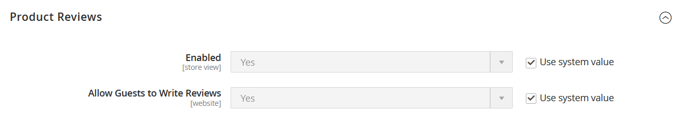
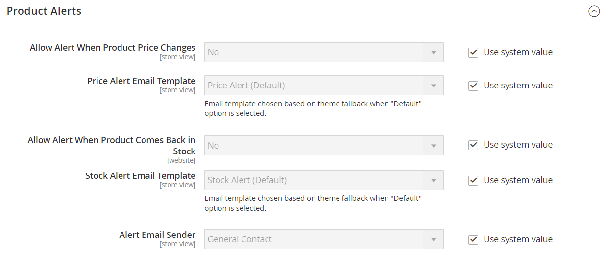
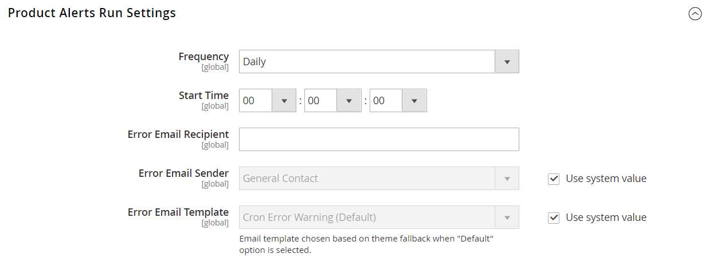
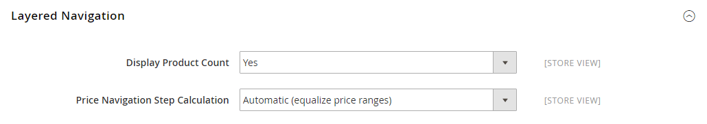
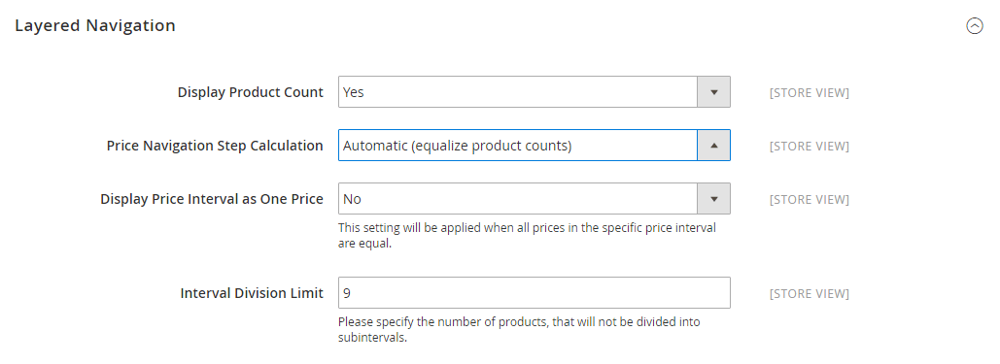
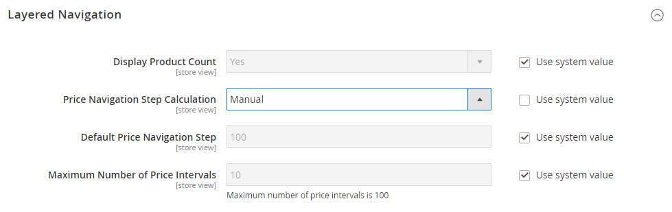
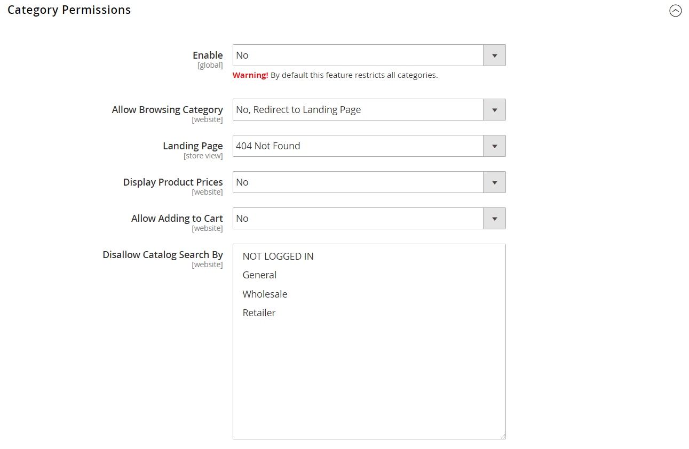
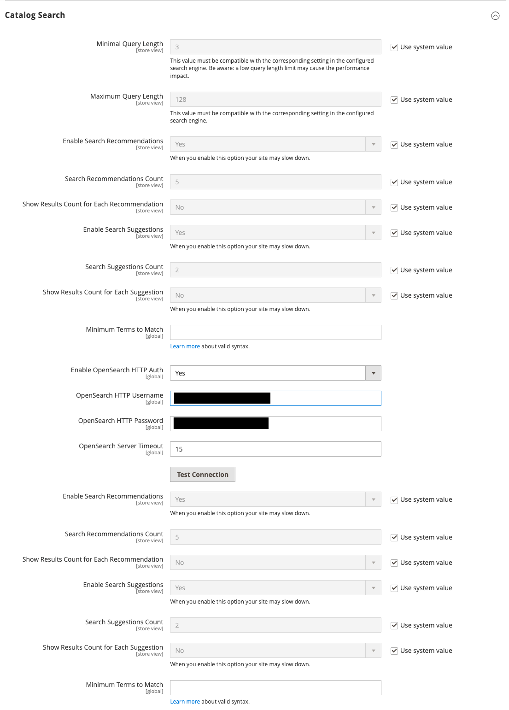
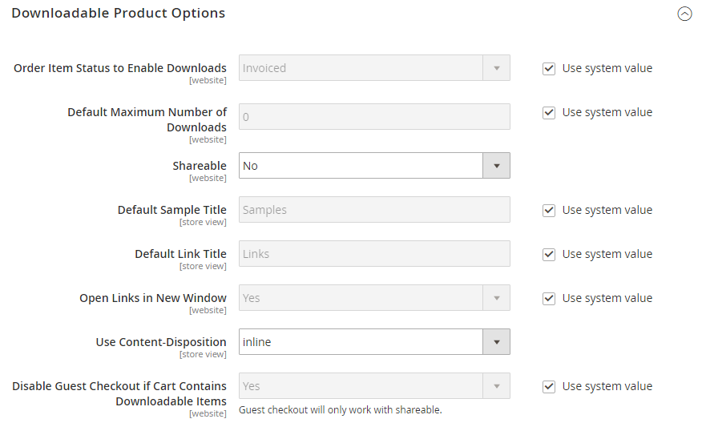
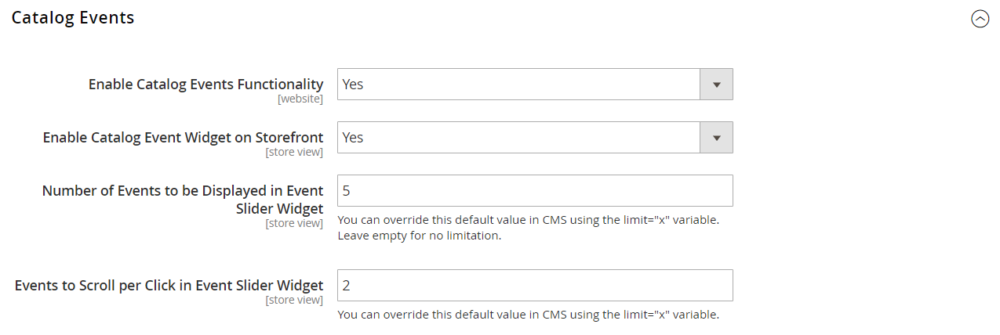

# [!UICONTROL Catalog] > [!UICONTROL Catalog]

{{config}}

## [!UICONTROL Product Fields Auto-Generation]

<!-- zoom -->

<!-- [Product Fields Auto-Generation](https://experienceleague.adobe.com/en/docs/commerce-admin/catalog/products/product-workspace#default-field-values) -->

| フィールド | [範囲](../../getting-started/websites-stores-views.md#scope-settings) | 説明 |
|--- |--- |--- |
| [!UICONTROL Mask for SKU] | グローバル | 他のフィールドのプレースホルダー値と、入力された追加テキストに基づいて、SKU フィールドのデフォルト値を決定します。 既定のプレースホルダー： 製品名 – `{{name}}` |
| [!UICONTROL Mask for Meta Title] | グローバル | 他のフィールドのプレースホルダー値と、入力された追加テキストに基づいて、Meta タイトルフィールドのデフォルト値を指定します。 既定のプレースホルダー： 製品名 – `{{name}}` |
| [!UICONTROL Mask for Meta Keywords] | グローバル | 他のフィールドのプレースホルダー値と入力された追加テキストに基づいて、_Meta キーワード_ フィールドのデフォルト値を指定します。 既定のプレースホルダー： 製品名 – `{{name}}` |
| [!UICONTROL Mask for Meta Description] | グローバル | 他のフィールドのプレースホルダー値と、入力された追加テキストに基づいて、Metaの説明フィールドのデフォルト値を指定します。 既定のプレースホルダー： 製品名 – `{{name}}`  説明 – `{{description}}` |

{style="table-layout:auto"}

## [!UICONTROL Product Reviews]

<!-- zoom -->

<!-- [Product Reviews](https://experienceleague.adobe.com/en/docs/commerce-admin/marketing/merchandising/product-reviews/product-reviews) -->

| フィールド | [範囲](../../getting-started/websites-stores-views.md#scope-settings) | 説明 |
|--- |--- |--- |
| [!UICONTROL Enabled] | ストアビュー | 製品レビューを有効にします。 オプション：`Yes` / `No` |
| [!UICONTROL Allow Guests to Write Reviews] | web サイト | 商品レビューを作成するために、顧客がストアのアカウントを開く必要があるかどうかを判断します。 |

{style="table-layout:auto"}

## [!UICONTROL Storefront]

<!-- zoom -->

<!-- [Storefront](https://experienceleague.adobe.com/en/docs/commerce-admin/catalog/catalog/navigation/navigation-product-listings) -->

| フィールド | [範囲](../../getting-started/websites-stores-views.md#scope-settings) | 説明 |
|--- |--- |--- |
| [!UICONTROL List Mode] | ストアビュー | 検索結果リストの形式を指定します。 オプション： **`Grid Only`**- リストを行と列のグリッドとして書式設定します。 各商品は、グリッドの1つのセルに表示されます。 **`List Only`** – 各製品を別の行に配置してリストを書式設定します。  **`Grid (default / List)`**- デフォルトでは、商品はグリッド表示に表示され、リスト表示に切り替えることができます。 **`List (default / Grid)`** - デフォルトでは、商品はリスト表示に表示され、グリッド表示に切り替えることができます。 |
| [!UICONTROL Products per Page on Grid Allowed Values] | ストアビュー | グリッドビューに表示される製品数を指定します。 オプションを選択するには、複数の値をコンマで区切って入力します。 |
| [!UICONTROL Products per Page on Grid Default Value] | ストアビュー | グリッドビューで、ページごとに表示される製品数をデフォルトで指定します。 |
| [!UICONTROL Products per Page on List Allowed Values] | ストアビュー | リスト表示に表示される製品数を指定します。 オプションを選択するには、複数の値をコンマで区切って入力します。 |
| [!UICONTROL Products per Page on List Default Value] | ストアビュー | リストビューで、ページごとに表示される製品数をデフォルトで指定します。 |
| 製品リストの並べ替え基準 | ストアビュー | 検索結果リストの並べ替え順序を指定します。 オプションの選択は、カテゴリの表示設定と`Used for Sorting in Product Listing`に設定されている使用可能な属性によって決まります。 デフォルトは`Use All Available Attributes`に設定され、通常はBest Value、Name、Priceが含まれます。 この設定は、[!DNL Live Search] [製品リストページ ウィジェット &#x200B;](https://experienceleague.adobe.com/en/docs/commerce/live-search/live-search-storefront/plp-styling)には適用されません。 |
| [!UICONTROL Allow All Products per Page] | ストアビュー | `Yes`に設定すると、「ページごとに表示」コントロールに`ALL` オプションが含まれます。 |
| [!UICONTROL Remember Category Pagination] | グローバル | `Yes`に設定すると、現在のカテゴリのページネーション値は、顧客が[製品リスト &#x200B;](../../catalog/navigation-product-listings.md)で1つのカテゴリから別のカテゴリを参照する際に保存されます。 値を保存すると、より多くのキャッシュストレージが使用され、検索エンジンによるページのインデックス作成方法に影響を与える可能性があります。 オプション：`Yes` / `No` （デフォルト） |
| [!UICONTROL Use Flat Catalog Category] | グローバル | [&#x200B; フラットカテゴリ構造](../../catalog/catalog-flat.md)を有効にします（推奨されません）。 オプション：`Yes` / `No` |
| [!UICONTROL Use Flat Catalog Product] | グローバル | フラットなプロダクト構造を有効にします。 （推奨されない）オプション：`Yes` / `No` |
| [!UICONTROL Swatches per Product] | ストアビュー | 各製品で使用可能なスウォッチの数を指定します。 既定：`16` |
| [!UICONTROL Show Swatches in Product List] | ストアビュー | スウォッチが製品リストに表示されるかどうかを指定します。 オプション：`Yes` / `No` |
| [!UICONTROL Show Swatch Tooltip] | ストアビュー | スウォッチのツールチップが表示されるかどうかを指定します。 オプション：`Yes` / `No` |

{style="table-layout:auto"}

## [!UICONTROL Product Alerts]

<!-- zoom -->

<!-- [Product Alerts](https://experienceleague.adobe.com/en/docs/commerce-admin/inventory/configuration/product-alerts/alert-setup) -->

| フィールド | [範囲](../../getting-started/websites-stores-views.md#scope-settings) | 説明 |
|--- |--- |--- |
| [!UICONTROL Allow Alerts When Product Price Changes] | ストアビュー | 商品の価格変更に関する電子メールアラートを利用できるかどうかを判断します。 オプション：`Yes` / `No` |
| [!UICONTROL Price Alert Email Template] | ストアビュー | 製品価格変更メール アラートに使用されるテンプレートを識別します。 既定のテンプレート：`Product price alert` |
| [!UICONTROL Allow Alert When Product Comes Back in Stock] | web サイト | 商品の在庫が戻ったときに、顧客がアラートを受け取ることができるかどうかを決定します。 オプション：`Yes` / `No` |
| [!UICONTROL Stock Alert Email Template] | ストアビュー | 在庫アラートのメール通知に使用されるテンプレートを識別します。 既定のテンプレート：`Product stock alert` |
| [!UICONTROL Alert Email Sender] | ストアビュー | 商品アラートの電子メールメッセージの送信者として表示されるストア連絡先を指定します。 オプション：`General Contact` / `Sales Representative` / `Customer Support` / `Custom Email` |

{style="table-layout:auto"}

## [!UICONTROL Product Alerts Run Settings]

<!-- zoom -->

<!-- [Product Alerts Run Settings](https://experienceleague.adobe.com/en/docs/commerce-admin/inventory/configuration/product-alerts/alert-setup) -->

| フィールド | [範囲](../../getting-started/websites-stores-views.md#scope-settings) | 説明 |
|--- |--- |--- |
| [!UICONTROL Frequency] | グローバル | 商品アラートが送信される頻度を選択します。 オプション：`Daily` / `Weekly` / `Monthly` |
| [!UICONTROL Start Time] | グローバル | 商品アラートプロセスが開始される時間帯を選択します。 この時間は、価格または在庫の更新が実行された後である必要があります。 |
| [!UICONTROL Error Email Recipient] | グローバル | 製品アラートプロセスでエラーが発生した場合にメール通知を受け取るユーザー（通常はストア管理者）のメールアドレスを特定します。 |
| [!UICONTROL Error Email Sender] | グローバル | 電子メールが`from`である役割を選択してください。 |
| [!UICONTROL Error Email Template] | グローバル | 製品アラートエラー通知に使用するメールテンプレートを選択します。 |

{style="table-layout:auto"}

## [!UICONTROL Product Image Placeholders]

<!-- zoom -->

<!-- [Product Image Placeholders](https://experienceleague.adobe.com/en/docs/commerce-admin/catalog/products/digital-assets/product-image-config#image-placeholders) -->

| フィールド | [範囲](../../getting-started/websites-stores-views.md#scope-settings) | 説明 |
|--- |--- |--- |
| [!UICONTROL Base Image] | ストアビュー | ベース画像に対して選択されたプレースホルダーファイルを識別します。 |
| [!UICONTROL Small Image] | ストアビュー | 小さい画像に対して選択されたプレースホルダーファイルを識別します。 |
| [!UICONTROL Swatch] | ストアビュー | スウォッチ用に選択したプレースホルダーファイルを指定します。 |
| [!UICONTROL Thumbnail] | ストアビュー | サムネール用に選択したプレースホルダーファイルを特定します。 |
| [!UICONTROL Choose File] |  | ファイルに移動し、タイプのプレースホルダー画像としてアップロードします。 |

{style="table-layout:auto"}

## [!UICONTROL Recently Viewed/Compared Products]

[!BADGE PaaSのみ]{type=Informative url="https://experienceleague.adobe.com/en/docs/commerce/user-guides/product-solutions" tooltip="Adobe Commerce on Cloud プロジェクト（Adobeで管理されるPaaS インフラストラクチャ）とオンプレミス プロジェクトにのみ適用されます。"}

<!-- zoom -->

<!-- Recently Viewed/Compared Products](https://experienceleague.adobe.com/en/docs/commerce-admin/stores-sales/shopper-tools/products-viewed-compared) -->

| フィールド | [範囲](../../getting-started/websites-stores-views.md#scope-settings) | 説明 |
|--- |--- |--- |
| [!UICONTROL Synchronize widget products with backend storage] | グローバル | 製品IDなどの製品ウィジェット情報とデータベースの同期を決定します。 これにより、他のデバイスでの情報の再利用が可能になります。 |
| [!UICONTROL Show for Current] | web サイト | 現在のweb サイトに表示される製品を制限します。 オプション：`Website` / `Store` / `Store View` |
| [!UICONTROL Default Recently Viewed Products Count] | ストアビュー | リストに表示される最近閲覧した商品の最大数を指定します。 |
| [!UICONTROL Default Recently Compared Products Count] | ストアビュー | リストに表示される最近比較された製品の最大数を指定します。 |
| [!UICONTROL Lifetime of products in Recently Viewed Widget] | グローバル | 最近閲覧した商品が最近閲覧したリストに表示される時間を秒単位で指定します。 |
| [!UICONTROL Lifetime of products in Recently Compared Widget] | グローバル | 最近比較した商品が最近比較したリストに表示される時間を秒単位で指定します。 |

{style="table-layout:auto"}

## [!UICONTROL Product Video]

<!-- zoom -->

<!-- [Product Videos](https://experienceleague.adobe.com/en/docs/commerce-admin/catalog/products/digital-assets/product-video) -->

| フィールド | [範囲](../../getting-started/websites-stores-views.md#scope-settings) | 説明 |
|--- |--- |--- |
| [!UICONTROL YouTube API key] | ストアビュー | YouTube サーバーへの接続に必要なAPI キーを指定します。 |
| [!UICONTROL Autostart base video] | ストアビュー | ページの読み込み後にビデオを自動開始するには、`Yes`に設定します。 |
| [!UICONTROL Show related video] | ストアビュー | 関連するビデオを表示するには、`Yes`に設定します。 |
| [!UICONTROL Auto restart video] | ストアビュー | ビデオの自動再生を有効にするには、`Yes`に設定します。 |

{style="table-layout:auto"}

## [!UICONTROL Price]

<!-- zoom -->

<!--Price](https://experienceleague.adobe.com/en/docs/commerce-admin/catalog/products/pricing/catalog-price-scope) -->

| フィールド | [範囲](../../getting-started/websites-stores-views.md#scope-settings) | 説明 |
|--- |--- |--- |
| [!UICONTROL Catalog Price Scope] | グローバル | 基本通貨の範囲を指定します。 オプション：`Global` / `Website` |
| [!UICONTROL Default Product Price] | グローバル |  （Adobe Commerceのみ）該当する場合は、デフォルトの商品価格を定義します。 |

{style="table-layout:auto"}

## [!UICONTROL Layered Navigation]

>[!NOTE]
>
>この節で説明する標準的な検索設定は、[&#x200B; ライブサーチ &#x200B;](https://experienceleague.adobe.com/docs/commerce/live-search/overview.html)で異なります。

<!-- [Layered Navigation - Automatic (equalize price ranges)](https://experienceleague.adobe.com/en/docs/commerce-admin/catalog/catalog/navigation/navigation-layered#configure-layered-navigation) -->

<!-- zoom -->

<!-- zoom -->

<!-- zoom -->

| フィールド | [範囲](../../getting-started/websites-stores-views.md#scope-settings) | 説明 |
|--- |--- |--- |
| [!UICONTROL Display Product Count] | ストアビュー | 各属性、価格帯、およびカテゴリの後に製品数が表示されるかどうかを指定します。 オプション：`Yes` / `No` |
| [!UICONTROL Price Navigation Step Calculation] | ストアビュー | [価格ナビゲーション手順](../../catalog/navigation-layered.md#configure-price-navigation)）の決定に使用する方法を決定します。 オプション： `Automatic (equalize price ranges)` - グループ内の製品の価格帯に基づいて計算します。  `Automatic (equalize product counts)` - グループ内の製品数に基づいて計算します。 グループ内の最小製品数のしきい値を設定して、製品がより小さなグループに分割されるのを防ぎます。  `Manual` – 価格間隔に入力する除算制限を使用します。 |
| [!UICONTROL Default Price Navigation Step] | ストアビュー | 各ステップに含まれる製品数を決定します。 |
| [!UICONTROL Maximum Number of Price Intervals] | ストアビュー | 階層化されたナビゲーションに表示される価格間隔の数に制限を設定します。 |

{style="table-layout:auto"}

## [!UICONTROL Category Permissions]

{{ee-feature}}

<!-- zoom -->

<!-- [Category Permissions](https://experienceleague.adobe.com/en/docs/commerce-admin/catalog/categories/category-permissions) -->

| フィールド | [範囲](../../getting-started/websites-stores-views.md#scope-settings) | 説明 |
|--- |--- |--- |
| [!UICONTROL Enable] | グローバル | カテゴリ制限を有効にします。 デフォルトでは、この機能を使用すると、すべてのカテゴリが制限されます。 オプション：`Yes` / `No` |
| [!UICONTROL Allow Browsing Category] | web サイト | カテゴリを参照できるユーザーを指定します。 オプション： `Yes, for Everyone` – すべての訪問者と顧客がカテゴリを参照できるようにします。  `Yes, for Specified Customer Groups` – 選択した顧客グループのメンバーのみがカテゴリを参照できます。  `No, Redirect to Landing Page` - カテゴリへのアクセスを拒否し、選択したページにリダイレクトします。 |
| [!UICONTROL Display Product Prices] | web サイト | カテゴリの製品価格の表示を制御します。 オプション： `Yes, for Everyone` – すべてのユーザーがカテゴリ内の製品の価格を確認できます。  `Yes, for Specified Customer Groups` – 選択した顧客グループのメンバーのみが、カテゴリ内の製品の価格を表示できます。  `No` - カテゴリの製品価格の表示をオフにします。 |
| [!UICONTROL Allow Adding to Cart] | web サイト | カテゴリから製品を購入できるユーザーを決定します。 オプション： `Yes, for Everyone` - カテゴリの商品を全員が買い物かごに入れることができます。  `Yes, for Specified Customer Groups` – 選択した顧客グループのメンバーのみが、カテゴリの商品をショッピングカートに入れることができます。  `No` - カテゴリの商品を買い物かごに入れることを許可していません。 |
| [!UICONTROL Disallow Catalog Search by] | web サイト | カテゴリ内の製品の検索が許可されていない顧客グループを識別します。 |

{style="table-layout:auto"}

## [!UICONTROL Search Engine Optimization]

<!-- zoom -->

<!-- [Search Engine Optimization](https://experienceleague.adobe.com/en/docs/commerce-admin/catalog/products/settings/product-search-engine-optimization) -->

| フィールド | [範囲](../../getting-started/websites-stores-views.md#scope-settings) | 説明 |
|--- |--- |----------------------------------------------------------------------------------------------------------------------------------------------------------------------------------------------------------------------------------------------------------------------------------------------------------------------------------------------------------------------------------------------------------|
| [!UICONTROL Popular Search Terms] | ストアビュー | _Popular Search Terms_&#x200B;がストアに実装されているかどうかを判断します。 この設定は、[&#x200B; ライブサーチ &#x200B;](https://experienceleague.adobe.com/docs/commerce/live-search/overview.html)を使用するストアには適用されません。 オプション：`Enable` / `Disable` |
| [!UICONTROL Product URL Suffix] | ストアビュー | htmlやhtmなどの接尾辞を製品URLに適用するかどうかを指定します。 使用する場合は、自動的に適用されるので、接尾辞の前に期間を含めないでください。 |
| [!UICONTROL Category URL Suffix] | ストアビュー | htmlやhtmなどのサフィックスをカテゴリ URLに適用するかどうかを指定します。 使用する場合は、自動的に適用されるので、接尾辞の前に期間を含めないでください。 |
| [!UICONTROL Use Categories Path for Product URLs] | ストアビュー | ストアフロントの製品URLにカテゴリーパスが含まれているかどうかを指定します。 これにより、複数のURLが同じページを指すようになり、検索順位に影響を与える可能性があります。 詳しくは、[正規メタタグ &#x200B;](../../merchandising-promotions/meta-data.md#canonical-meta-tag)を参照してください。 |
| [!UICONTROL Create Permanent Redirect for URLs if URL Key Changed] | ストアビュー | URL キーが変更されるたびに、永続的なリダイレクトが自動的に作成されるかどうかを指定します。 実装すると、「製品URL キー」フィールドの下にある「古いURL用にカスタムリダイレクトを作成」チェックボックスがデフォルトで選択されます。 オプション：`Yes` / `No` |
| [!UICONTROL Generate "category/product" URL Rewrites] | グローバル | 多くの割り当て済み商品を含むカテゴリをユーザーが保存したときに、Adobe Commerceがデータを生成し、それを書き換えテーブルに保存するかどうかを指定します。    このオプションを変更しても、この設定に関係なく商品URLが自動的に解決されるため、Adobe Commerceでの商品URLの解決方法には影響しません。    オプション：`Yes` / `No`   **_Important:_**&#x200B;生成されたデータをURL書き換えテーブルに保存すると、パフォーマンスが低下する可能性があります。 詳しくは、[製品の自動リダイレクト &#x200B;](../../merchandising-promotions/url-redirect-product-automatic.md)を参照してください。 |
| [!UICONTROL Apply transliteration for product URL] | ストアビュー | 製品URLを作成または更新する際に文字変換が適用されるかどうかを指定します。 オプション：`Yes` / `No`。 デフォルトは`Yes`に設定されています。   特定の使用例では、文字変換を無効にする必要があります。 例えば、中国語でオンラインストアを運営する場合、SEOのベストプラクティスでは、商品URLが商品名と一致することが推奨されます。 このオプションを`No`に設定すると、ASCIIに相当する文字の代わりに、製品URLで中国語の文字を使用できるようになります。 |
| [!UICONTROL Page Title Separator] | ストアビュー | ブラウザーのタイトルバーで、カテゴリ名とサブカテゴリを区切る文字を識別します。 |
| [!UICONTROL Use Canonical Link Meta Tag for Categories] | ストアビュー | 同じカテゴリーページを指すURLが複数ある場合、このオプションは正規メタタグを使用して、検索エンジンがインデックスを作成する必要があるカテゴリ URLを識別します。 URLには、メタタグを使用したカテゴリへのフルネームが含まれます。 これにより、重複コンテンツを減らし、SEOを向上させることができます。 オプション：`Yes` / `No` |
| [!UICONTROL Use Canonical Link Meta Tag for Products] | ストアビュー | 同じ製品ページを指すURLが複数ある場合、このオプションは正規メタタグを使用して、検索エンジンがインデックスを作成する製品URLを識別します。 URLには、メタタグを使用した製品のフルネームが含まれます。 これにより、重複コンテンツを減らし、SEOを向上させることができます。 オプション：`Yes` / `No` |

{style="table-layout:auto"}

## [!UICONTROL Category Top Navigation]

<!-- zoom -->

<!-- Category Top Navigation](https://experienceleague.adobe.com/en/docs/commerce-admin/catalog/catalog/navigation/navigation-top) -->

| フィールド | [範囲](../../getting-started/websites-stores-views.md#scope-settings) | 説明 |
|--- |--- |--- |
| [!UICONTROL Maximal Depth] | グローバル | 上部ナビゲーションのサブカテゴリーレベルの数を指定します。 デフォルト値の`0`は、レベル数に制限はありません。 |

{style="table-layout:auto"}

## [!UICONTROL Catalog Search]

カタログ検索は、[[!DNL Live Search]](https://experienceleague.adobe.com/docs/commerce/live-search/overview.html)またはAdobe Commerceがサポートするサードパーティの検索エンジンサービスを使用して設定できます。 インストールの手順に従います。

### Adobe Commerceと[!DNL Live Search]

ライブサーチがインストールされている場合、カタログ検索には次の設定設定が含まれます。

<!-- zoom -->

<!-- [Catalog Search for Live Search](https://experienceleague.adobe.com/en/docs/commerce-admin/catalog/catalog/search/search-configuration) -->

| フィールド | [範囲](../../getting-started/websites-stores-views.md#scope-settings) | 説明 |
|--- |--- |--- |
| [!UICONTROL Minimal Query Length] | ストアビュー | カタログ検索で許可される最小文字数。 このオプションに設定された値は、Elasticsearchの検索エンジン設定で設定された対応する範囲と互換性がある必要があります。 例えば、Adobe Commerceでこの値を`2`に設定した場合は、検索エンジンの値を更新します。 |
| [!UICONTROL Maximum Query Length] | ストアビュー | カタログ検索で許可される最大文字数。 このオプションに設定された値は、Elasticsearchの検索エンジン設定で設定された対応する範囲と互換性がある必要があります。 例えば、Adobe Commerceでこの値を300に設定した場合は、検索エンジンの値を更新します。 |
| [!UICONTROL Number of top search results to cache] | ストアビュー | 高速なレスポンスのためにキャッシュする一般的な検索語句と結果の数。 `0`の値を入力すると、2回目の入力時にすべての検索語と結果がキャッシュされます。 デフォルト値：`100` |
| [!UICONTROL Autocomplete Limit] | ストアビュー | [ ストアフロントポップオーバー] ページで使用できる最大行数を指定します。 ライブサーチがインストールされている場合はデフォルト値を変更し、この設定設定を変更することで後で更新できます。 デフォルト値：`8` |

{style="table-layout:auto"}

### サードパーティの検索エンジン

Adobe Commerceは、OpenSearchとElasticsearchをサポートしています。 Adobe Commerce バージョン 2.3.7-p3、2.4.3-p2、および2.4.4以降では、OpenSearch サービスがサポートされています。 Elasticsearch 7.11以降は、クラウドインフラストラクチャプロジェクト上のAdobe Commerceではサポートされていません。 Elasticsearchは、引き続きオンプレミスインストールでサポートされます。

>[!IMPORTANT]
>
>- 2023年8月のElasticsearch 7のサポート終了のお知らせにより、Adobeでは、すべてのAdobe Commerceのお客様がOpenSearch 2.x検索エンジンに移行することをお勧めします。 アップグレード中に検索エンジンを移行する方法について詳しくは、[&#x200B; アップグレードガイド &#x200B;](https://experienceleague.adobe.com/docs/commerce-operations/upgrade-guide/prepare/opensearch-migration.html)の「_OpenSearchへの移行_」を参照してください。
>- バージョン 2.4.4および2.4.3-p2では、「Elasticsearch」というラベルが付けられたすべてのフィールドがOpenSearchにも適用されます。 Elasticsearch 8.xのサポートがバージョン 2.4.6で導入されたときには、ElasticsearchとOpenSearchの設定を区別するために新しいラベルが作成されました。 ただし、両方の設定オプションは同じです。

{zoomable="yes"}

| フィールド | [範囲](../../getting-started/websites-stores-views.md#scope-settings) | 説明 |
|--- |--- |--- |
| [!UICONTROL Minimal Query Length] | ストアビュー | カタログ検索で許可される最小文字数。 このオプションに設定された値は、OpenSearchまたはElasticsearch設定で設定された対応する範囲と互換性がある必要があります。 例えば、Adobe Commerceでこの値を`2`に設定した場合は、検索エンジン設定の値も更新する必要があります。 デフォルト値：`3` |
| [!UICONTROL Maximum Query Length] | ストアビュー | カタログ検索で許可される最大文字数。 このオプションに設定された値は、OpenSearchまたはElasticsearch設定で設定された対応する範囲と互換性がある必要があります。 例えば、Adobe Commerceでこの値を`300`に設定した場合、検索エンジン設定の値を更新する必要があります。 デフォルト値：`128` |
| [!UICONTROL Number of top search results to cache] | ストアビュー | 高速なレスポンスのためにキャッシュする一般的な検索語句と結果の数。 `0`の値を入力すると、2回目の入力時にすべての検索語と結果がキャッシュされます。 デフォルト値：`100` |
| [!UICONTROL Enable EAV Indexer] | グローバル | Product EAV インデクサーを有効にするか無効にするかを決定します。 この機能により、インデックス作成の速度が向上し、サードパーティの拡張機能によるインデクサーの使用が制限されます。 既定のオプション：`Yes` （有効） |
| [!UICONTROL Autocomplete Limit] | ストアビュー | 検索オートコンプリートの検索フィールドの下に表示する検索クエリの最大数。 この量を制限すると、検索のパフォーマンスが向上し、表示されるリストサイズが小さくなります。 デフォルト値：`8` |
| 検索エンジン | グローバル | カタログデータの要求を処理するために必要な検索エンジンを識別します。 検索エンジンの設定オプションは、OpenSearchとElasticsearchの両方で同じです。 オプション：`OpenSearch`または`Elasticsearch` |
| [!UICONTROL OpenSearch Server Hostname] | グローバル | OpenSearchまたはElasticsearch ホストサーバーの名前を指定します。 |
| [!UICONTROL OpenSearch Server Port] | グローバル | OpenSearchまたはElasticsearchで使用されるサーバーポートの番号を指定します。 デフォルト値：`9200` |
| [!UICONTROL OpenSearch Index Prefix] | グローバル | OpenSearchまたはElasticsearch インデックスを識別するプレフィックスを割り当てます。 デフォルト値：`magento2` |
| [!UICONTROL Enable OpenSearch HTTP Auth] | グローバル | 有効にすると、OpenSearchまたはElasticsearch サーバーにアクセスする前に、HTTP認証を使用してユーザー名とパスワードの入力を求めます。 オプション：`Yes` / `No` |
| [!UICONTROL OpenSearch HTTP Username] | グローバル | _Enable Elasticsearch HTTP Auth_&#x200B;が`Yes`に設定されている場合、OpenSearchまたはElasticsearch HTTP認証のユーザー名を指定します。 |
| [!UICONTROL OpenSearch HTTP Password] | グローバル | _Elasticsearch HTTP認証を有効にする_&#x200B;が`Yes`に設定されている場合、OpenSearchまたはElasticsearch HTTP認証のパスワードを指定します。 |
| [!UICONTROL OpenSearch Server Timeout] | グローバル | OpenSearchまたはElasticsearch サーバーへのリクエストがタイムアウトするまでの秒数を指定します。 デフォルト値：`15` |
| [!UICONTROL Test Connection] |  | OpenSearchまたはElasticsearch接続を検証します。 |
| [!UICONTROL Enable Search Recommendations] | ストアビュー | 検索結果が返されず、検索結果ページの「`Related search terms`」セクションに表示されるときに検索レコメンデーションが提供されるかどうかを指定します。 オプション：`Yes` / `No`  Yesに設定すると、_[!UICONTROL Search Recommendations Count]_&#x200B;と_[!UICONTROL Shows Results Count for Each Recommendation]_&#x200B;の追加オプションが表示されます。 |
| [!UICONTROL Search Recommendations Count] | ストアビュー | レコメンデーションとして提供される検索語句の数を指定します。 デフォルトでは、5つしか表示されません。 |
| [!UICONTROL Show Results Count for Each Recommendation] | ストアビュー | `Yes`に設定すると、提案された検索レコメンデーションで見つかった製品数が角括弧で囲まれて表示されます。 オプション：`Yes` / `No` |
| [!UICONTROL Enable Search Suggestions] | ストアビュー | 検索候補が一般的なスペル ミスに対して表示されるかどうかを指定します。 有効にすると、検索結果を返さず、`Did you mean`検索結果&#x200B;**ページの** セクションに表示されるリクエストに対して検索候補が表示されます。 検索候補は、検索のパフォーマンスに影響を与える可能性があります。 `Yes`に設定すると、「検索レコメンデーションと関連するフィールドを有効にする」の追加オプションが表示されます。 オプション：`Yes` / `No` |
| [!UICONTROL Search Suggestions Count] | ストアビュー | 提供される検索候補の数を指定します。 例：`2` |
| [!UICONTROL Show Results Count for Each Suggestion] | ストアビュー | 各候補に対して検索結果の数を表示するかどうかを指定します。 テーマに応じて、番号は通常、提案の後ろに括弧内に表示されます。 オプション：`Yes` / `No` |
| [!UICONTROL Minimum Terms to Match] | ストアビュー | 検索結果が一致する必要があるクエリの語句の数に対応する値を指定して返します。 これにより、買い物客にとって最適な検索結果の関連性が確保されます。 パーセント値は数値に関連付けられ、必要に応じて切り捨てられ、クエリで一致する用語の最小数として使用されます。 値は、負または正の整数、負または正のパーセント、2つの組み合わせ、または複数の組み合わせにすることができます。 詳しくは、OpenSearch ドキュメントの[minimum_should_match パラメーター](https://opensearch.org/docs/latest/query-dsl/minimum-should-match/)を参照してください。 |

## [!UICONTROL Downloadable Product Options]

<!-- zoom -->

<!-- [Downloadable Product Options](https://experienceleague.adobe.com/en/docs/commerce-admin/catalog/products/types/product-create-downloadable#configure-the-download-options) -->

| フィールド | [範囲](../../getting-started/websites-stores-views.md#scope-settings) | 説明 |
|--- |--- |--- |
| [!UICONTROL Order Item Status to Enable Downloads] | web サイト | ダウンロードが利用可能になるまでに注文が必要なステータスを決定します。 オプション：`Pending` / `Invoiced` |
| [!UICONTROL Default Maximum Number of Downloads] | web サイト | 顧客が利用できるデフォルトのダウンロード数を指定します。 |
| [!UICONTROL Shareable] | web サイト | 顧客がダウンロードリンクにアクセスするためにアカウントにログインする必要があるかどうかを判断します。 オプション： **はい** - リンクを電子メールで送信し、他のユーザーと共有できるようにします。  **No** – お客様がダウンロードリンクにアクセスするには、アカウントにログインする必要があります。 |
| [!UICONTROL Default Sample Title] | ストアビュー | すべてのサンプルファイルのデフォルトのタイトル。 |
| [!UICONTROL Default Link Title] | ストアビュー | ダウンロード可能なすべてのタイトルのデフォルトリンク。 |
| [!UICONTROL Opens Links in New Window] | web サイト | ダウンロードリンクが新しいブラウザーウィンドウで開くかどうかを指定します。 オプション：`Yes` / `No` |
| [!UICONTROL Use Content Disposition] | ストアビュー | ダウンロード可能なコンテンツへのリンクを、電子メールの添付ファイルとして、またはブラウザーウィンドウのインラインリンクとして配信する方法を指定します。 オプション： **`Attachment`**- ダウンロードリンクは電子メールの添付ファイルとして配信されます。 **`Inline`** - ダウンロードリンクは、web ページのインラインリンクとして配信されます。 |
| [!UICONTROL Disable Guest Checkout if Cart Contains Downloadable Items] | web サイト | ダウンロード可能な製品を購入するゲストがアカウントに登録し、チェックアウトプロセスを完了するためにログインする必要があるかどうかを判断します。 オプション： **`Yes`**- カートにダウンロード可能な製品が含まれている場合、ゲストはアカウントに登録するか、既存のアカウントにログインして購入を完了する必要があります。 **`No`** - ダウンロードリンクは、電子メールメッセージの本文にインラインリンクとして配信されます。   _&#x200B;**注：**&#x200B;_ ゲストチェックアウトは、共有可能が`Yes`に設定されている場合にのみ、ダウンロード製品で利用できます。 |

{style="table-layout:auto"}

## [!UICONTROL Date & Time Custom Options]

<!-- zoom -->

<!-- Date & Time Custom Options](https://experienceleague.adobe.com/en/docs/commerce-admin/catalog/product-attributes/attributes-input-types#date-and-time-options) -->

| フィールド | [範囲](../../getting-started/websites-stores-views.md#scope-settings) | 説明 |
|--- |--- |--- |
| [!UICONTROL Use JavaScript Calendar] | ストアビュー | JavaScript カレンダーを日付フィールドの入力コントロールとして使用するかどうかを指定します。 オプション：`Yes` / `No`  を`No`に設定すると、日付フィールドの各部分に個別のドロップダウンが表示されます。 |
| [!UICONTROL Date Fields Order] | ストアビュー | 3つの日付フィールドの順序を設定します。 オプション：`Day` / `Month` / `Year` |
| [!UICONTROL Time Format] | ストアビュー | 時刻の形式を12時間または24時間の時刻に設定します。 オプション：`12h AM/PM` / `24h` |
| [!UICONTROL Year Range] | ストアビュー | _年_ フィールドに表示される年の開始範囲と終了範囲を定義します。 値はYYYY形式で入力する必要があります。 |

{style="table-layout:auto"}

## [!UICONTROL Catalog Events]

{{ee-feature}}

<!-- zoom -->

<!-- [Catalog Events](https://experienceleague.adobe.com/en/docs/commerce-admin/marketing/promotions/events/events-private-sales) -->

| フィールド | [範囲](../../getting-started/websites-stores-views.md#scope-settings) | 説明 |
|--- |--- |--- |
| [!UICONTROL Enable Catalog Events Functionality] | web サイト | イベント モジュールが有効かどうかを指定します。 |
| [!UICONTROL Enable Catalog Event Widget on Frontend] | ストアビュー | イベントウィジェットがストアフロントで使用可能かどうかを指定します。 これは、サイト内のイベントに関する情報を含む静的ブロックです。 |
| [!UICONTROL Number of Events to be Displayed in the Event Slider Widget] | ストアビュー | カテゴリーページのイベントスライダーウィジェットに表示されるイベントの数を指定します。 上書きするには、`limit="x"`変数を使用します。 |
| [!UICONTROL Events to Scroll per Click in Event Slider Widget] | ストアビュー | CMS ページ（ホームページなど）のイベントスライダーウィジェットに表示されるイベントの数を指定します。 上書きするには、`scroll="x"`変数を使用します。 |

{style="table-layout:auto"}

## [!UICONTROL Rule-Based Product Relations]

{{ee-feature}}

<!-- zoom -->

<!-- [Rule-Based Product Relations](https://experienceleague.adobe.com/en/docs/commerce-admin/marketing/promotions/product-relationships/product-related-rules) -->

| フィールド | [範囲](../../getting-started/websites-stores-views.md#scope-settings) | 説明 |
|--- |--- |--- |
| [!UICONTROL Maximum Number of Products in Related Products List] | グローバル | _関連製品_ リストに表示できる製品の最大数を指定します。 |
| [!UICONTROL Show Related Products] | グローバル | ストアに表示される関連商品のリストを指定します。 これは、製品情報で手動で選択されたリスト、製品関係ルールに応じて生成されたリスト、またはそれらの組み合わせのいずれかです。 オプション：`Both Selected and Rule-Based` / `Selected Only` / `Rule-Based Only` |
| [!UICONTROL Rotation Mode for Products in Related Products List] | グローバル | _関連製品_ リスト内の製品が表示される順序を決定します。 オプション：`Do not rotate` / `Shuffle` |
| [!UICONTROL Maximum Number of Products in Cross-Sell Product List] | グローバル | クロスセルリストに表示できる商品の最大数を指定します。 |
| [!UICONTROL Show Cross-Sell Products] | グローバル | ストアに表示されるクロスセル商品のリストを指定します。 これは、製品情報で手動で選択されたリスト、製品関係ルールに応じて生成されたリスト、またはそれらの組み合わせのいずれかです。 オプション：`Both Selected and Rule-Based` / `Selected Only` / `Rule-Based Only` |
| [!UICONTROL Rotation Mode for Products in Cross-Sell Products List] | グローバル | クロスセル製品リスト内の製品が表示される順序を決定します。 オプション：回転しない/シャッフルしない |
| [!UICONTROL Maximum Number of Products in Upsell Product List] | グローバル | _アップセル製品_ リストに表示できる製品の最大数を指定します。 |
| [!UICONTROL Show Upsell Products] | グローバル | ストアに表示されるアップセル製品のリストを指定します。 これは、製品情報で手動で選択されたリスト、製品関係ルールに応じて生成されたリスト、またはそれらの組み合わせのいずれかです。 オプション：`Both Selected and Rule-Based` / `Selected Only` / `Rule-Based Only` |
| [!UICONTROL Rotation Mode for Products in Upsell Product List] | グローバル | アップセル製品リスト内の製品が表示される順序を決定します。 オプション：`Do not rotate` / `Shuffle` |

{style="table-layout:auto"}
