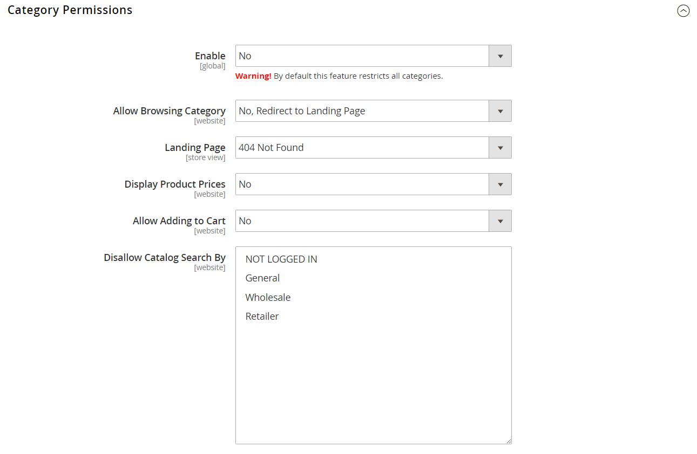

# [!UICONTROL Catalog] > [!UICONTROL Catalog]

{{config}}

## [!UICONTROL Product Fields Auto-Generation]

<!-- zoom -->

<!-- [Product Fields Auto-Generation](https://docs.magento.com/user-guide/catalog/product-fields-autogenerated.html) -->

| フィールド | [範囲](../../getting-started/websites-stores-views.md#scope-settings) | 説明 |
|--- |--- |--- |
| [!UICONTROL Mask for SKU] | グローバル | 他のフィールドのプレースホルダー値と入力された追加のテキストに基づいて、SKU フィールドのデフォルト値を決定します。 既定のプレースホルダ：  製品名 –  `{{name}}` |
| [!UICONTROL Mask for Meta Title] | グローバル | 他のフィールドのプレースホルダー値と入力された追加のテキストに基づいて、メタタイトルフィールドのデフォルト値を決定します。 既定のプレースホルダ：  製品名 –  `{{name}}` |
| [!UICONTROL Mask for Meta Keywords] | グローバル | のデフォルト値を決定します _メタキーワード_ 他のフィールドのプレースホルダー値と、入力された追加のテキストに基づくフィールド。 既定のプレースホルダ：  製品名 –  `{{name}}` |
| [!UICONTROL Mask for Meta Description] | グローバル | 他のフィールドのプレースホルダー値と入力された追加のテキストに基づいて、メタ説明フィールドのデフォルト値を決定します。 既定のプレースホルダ：  製品名 –  `{{name}}`  説明 –  `{{description}}` |

{style="table-layout:auto"}

## [!UICONTROL Product Reviews]

<!-- zoom -->

<!-- [Product Reviews](https://docs.magento.com/user-guide/marketing/product-reviews.html) -->

| フィールド | [範囲](../../getting-started/websites-stores-views.md#scope-settings) | 説明 |
|--- |--- |--- |
| [!UICONTROL Enabled] | ストア表示 | 製品レビューを有効にします。 オプション： `Yes` / `No` |
| [!UICONTROL Allow Guests to Write Reviews] | Web サイト | 製品レビューを書くことができるように、顧客がストアのアカウントを開設する必要があるかどうかを決定します。 |

{style="table-layout:auto"}

## [!UICONTROL Storefront]

<!-- zoom -->

<!-- [Storefront](https://docs.magento.com/user-guide/catalog/navigation-product-listings.html) -->

| フィールド | [範囲](../../getting-started/websites-stores-views.md#scope-settings) | 説明 |
|--- |--- |--- |
| [!UICONTROL List Mode] | ストア表示 | 検索結果リストの形式を決定します。 オプション：  **`Grid Only`**- リストを行と列のグリッドとして書式設定します。 各製品は、グリッドの 1 つのセルに表示されます。 **`List Only`** - リストの各製品を別々の行に書式設定します。  **`Grid (default / List)`**- デフォルトでは、製品はグリッド表示に表示され、リスト表示に切り替えることができます。 **`List (default / Grid)`** - デフォルトでは、製品はリスト表示に表示され、グリッド表示に切り替えることができます。 |
| [!UICONTROL Products per Page on Grid Allowed Values] | ストア表示 | グリッド表示に表示される製品の数を指定します。 オプションを選択するには、複数の値をコンマで区切って入力します。 |
| [!UICONTROL Products per Page on Grid Default Value] | ストア表示 | グリッド表示でデフォルトでページごとに表示される製品の数を決定します。 |
| [!UICONTROL Products per Page on List Allowed Values] | ストア表示 | リスト表示に表示される製品の数を決定します。 オプションを選択するには、複数の値をコンマで区切って入力します。 |
| [!UICONTROL Products per Page on List Default Value] | ストア表示 | リスト表示で、デフォルトで 1 ページに表示される製品数を決定します。 |
| 商品リストの並べ替え基準 | ストア表示 | 検索結果リストの並べ替え順を決定します。 オプションの選択は、カテゴリの表示設定と、に設定されている使用可能な属性によって決まります `Used for Sorting in Product Listing`. デフォルトはに設定されています。 `Use All Available Attributes` また、通常は最適な値、名前、価格が含まれます。 この設定は、 [!DNL Live Search] [製品一覧ページウィジェット](https://experienceleague.adobe.com/en/docs/commerce-merchant-services/live-search/live-search-storefront/plp-styling). |
| [!UICONTROL Allow All Products per Page] | ストア表示 | に設定されている場合 `Yes`。には次が含まれます `ALL` 「ページごとに表示」コントロールのオプション。 |
| [!UICONTROL Remember Category Pagination] | グローバル | に設定されている場合 `Yes`では、現在のカテゴリのページネーションの値は、顧客がでカテゴリ間を参照すると保存されます [製品リスト](../../catalog/navigation-product-listings.md). 値を保存すると、より多くのキャッシュストレージを使用するようになり、検索エンジンによるページのインデックス作成方法に影響を与える可能性があります。 オプション： `Yes` / `No` （デフォルト） |
| [!UICONTROL Use Flat Catalog Category] | グローバル | を有効にします [フラット カテゴリ構造](../../catalog/catalog-flat.md) （推奨しません）。 オプション： `Yes` / `No` |
| [!UICONTROL Use Flat Catalog Product] | グローバル | フラットな製品構造を有効にします。 （非推奨）オプション： `Yes` / `No` |
| [!UICONTROL Swatches per Product] | ストア表示 | 各製品で使用できるスウォッチの数を決定します。 デフォルト： `16` |
| [!UICONTROL Show Swatches in Product List] | ストア表示 | スウォッチを製品リストに表示するかどうかを指定します。 オプション： `Yes` / `No` |
| [!UICONTROL Show Swatch Tooltip] | ストア表示 | スウォッチツールチップを表示するかどうかを決定します。 オプション： `Yes` / `No` |

{style="table-layout:auto"}

## [!UICONTROL Product Alerts]

<!-- zoom -->

<!-- [Product Alerts](https://docs.magento.com/user-guide/catalog/inventory-product-alerts.html) -->

| フィールド | [範囲](../../getting-started/websites-stores-views.md#scope-settings) | 説明 |
|--- |--- |--- |
| [!UICONTROL Allow Alerts When Product Price Changes] | ストア表示 | 製品価格の変更にメールアラートを使用できるかどうかを決定します。 オプション： `Yes` / `No` |
| [!UICONTROL Price Alert Email Template] | ストア表示 | 製品価格変更の電子メール アラートに使用されるテンプレートを識別します。 デフォルトのテンプレート： `Product price alert` |
| [!UICONTROL Allow Alert When Product Comes Back in Stock] | Web サイト | 商品が再入荷したときに顧客がアラートを受け取ることを選択できるかどうかを決定します。 オプション： `Yes` / `No` |
| [!UICONTROL Stock Alert Email Template] | ストア表示 | Stock アラートメール通知に使用されるテンプレートを識別します。 デフォルトのテンプレート： `Product stock alert` |
| [!UICONTROL Alert Email Sender] | ストア表示 | 商品のアラートメールメッセージの送信者として表示される店舗連絡先を決定します。 オプション： `General Contact` / `Sales Representative` / `Customer Support` / `Custom Email` |

{style="table-layout:auto"}

## [!UICONTROL Product Alerts Run Settings]

<!-- zoom -->

<!-- [Product Alerts Run Settings](https://docs.magento.com/user-guide/catalog/inventory-product-alert-run-settings.html) -->

| フィールド | [範囲](../../getting-started/websites-stores-views.md#scope-settings) | 説明 |
|--- |--- |--- |
| [!UICONTROL Frequency] | グローバル | 製品アラートの送信頻度を選択します。 オプション： `Daily` / `Weekly` / `Monthly` |
| [!UICONTROL Start Time] | グローバル | 製品のアラートプロセスを開始する時刻を選択します。 この時間は、価格または在庫の更新が実行された後にする必要があります。 |
| [!UICONTROL Error Email Recipient] | グローバル | 製品のアラートプロセスでエラーが発生した場合にメール通知を受け取るユーザー（通常はストア管理者）のメールアドレスを識別します。 |
| [!UICONTROL Error Email Sender] | グローバル | メールの役割を選択 `from`. |
| [!UICONTROL Error Email Template] | グローバル | 製品アラートエラー通知に使用するメールテンプレートを選択します。 |

{style="table-layout:auto"}

## [!UICONTROL Product Image Placeholders]

<!-- zoom -->

<!-- [Product Image Placeholders](https://docs.magento.com/user-guide/catalog/product-image-placeholders.html) -->

| フィールド | [範囲](../../getting-started/websites-stores-views.md#scope-settings) | 説明 |
|--- |--- |--- |
| [!UICONTROL Base Image] | ストア表示 | ベース画像用に選択されたプレースホルダーファイルを識別します。 |
| [!UICONTROL Small Image] | ストア表示 | 小さい画像用に選択したプレースホルダーファイルを識別します。 |
| [!UICONTROL Swatch] | ストア表示 | スウォッチ用に選択されたプレースホルダーファイルを識別します。 |
| [!UICONTROL Thumbnail] | ストア表示 | サムネール用に選択したプレースホルダーファイルを識別します。 |
| [!UICONTROL Choose File] |  | ファイルに移動し、そのタイプのプレースホルダー画像としてアップロードします。 |

{style="table-layout:auto"}

## [!UICONTROL Recently Viewed/Compared Products]

<!-- zoom -->

<!-- Recently Viewed/Compared Products](https://docs.magento.com/user-guide/marketing/products-viewed-compared.html) -->

| フィールド | [範囲](../../getting-started/websites-stores-views.md#scope-settings) | 説明 |
|--- |--- |--- |
| [!UICONTROL Synchronize widget products with backend storage] | グローバル | 製品ウィジェット情報（製品 ID など）とデータベースの同期を決定します。 これにより、他のデバイスの情報を再利用できます。 |
| [!UICONTROL Show for Current] | Web サイト | 表示される製品を現在の web サイトに制限します。 オプション： `Website` / `Store` / `Store View` |
| [!UICONTROL Default Recently Viewed Products Count] | ストア表示 | リストに表示される最近表示された製品の最大数を決定します。 |
| [!UICONTROL Default Recently Compared Products Count] | ストア表示 | 最近比較した商品のうち、リストに表示される商品の最大数を決定します。 |
| [!UICONTROL Lifetime of products in Recently Viewed Widget] | グローバル | 最近表示された項目の一覧に表示する表示時間を秒単位で指定します。 |
| [!UICONTROL Lifetime of products in Recently Compared Widget] | グローバル | 比較した商品を最近比較したリストに表示する時間を秒単位で指定します。 |

{style="table-layout:auto"}

## [!UICONTROL Product Video]

<!-- zoom -->

<!-- [Product Videos](https://docs.magento.com/user-guide/catalog/product-video.html) -->

| フィールド | [範囲](../../getting-started/websites-stores-views.md#scope-settings) | 説明 |
|--- |--- |--- |
| [!UICONTROL YouTube API key] | ストア表示 | YouTube サーバーへの接続に必要な API キーを指定します。 |
| [!UICONTROL Autostart base video] | ストア表示 | ページの読み込み後にビデオを自動開始するには、をに設定します `Yes`. |
| [!UICONTROL Show related video] | ストア表示 | 関連ビデオを表示するには、をに設定します `Yes`. |
| [!UICONTROL Auto restart video] | ストア表示 | ビデオの自動再生を有効にするには、をに設定します `Yes`. |

{style="table-layout:auto"}

## [!UICONTROL Price]

<!-- zoom -->

<!--Price](https://docs.magento.com/user-guide/catalog/catalog-price-scope.html) -->

| フィールド | [範囲](../../getting-started/websites-stores-views.md#scope-settings) | 説明 |
|--- |--- |--- |
| [!UICONTROL Catalog Price Scope] | グローバル | 基本通貨の範囲を決定します。 オプション： `Global` / `Website` |
| [!UICONTROL Default Product Price] | グローバル |  （Adobe Commerceのみ）デフォルトの製品価格を定義します（該当する場合）。 |

{style="table-layout:auto"}

## [!UICONTROL Layered Navigation]

>[!NOTE]
>
>この節で説明する標準的な検索設定は、次の点で異なります [Live Search](https://experienceleague.adobe.com/docs/commerce-merchant-services/live-search/overview.html).

<!-- [Layered Navigation - Automatic (equalize price ranges)](https://docs.magento.com/user-guide/catalog/navigation-layered-configuration.html) -->

<!-- zoom -->

<!-- zoom -->

<!-- zoom -->

| フィールド | [範囲](../../getting-started/websites-stores-views.md#scope-settings) | 説明 |
|--- |--- |--- |
| [!UICONTROL Display Product Count] | ストア表示 | 各属性、価格範囲およびカテゴリの後に製品数が表示されるかどうかを決定します。 オプション： `Yes` / `No` |
| [!UICONTROL Price Navigation Step Calculation] | ストア表示 | を決定するために使用される方法を決定します [価格ナビゲーションステップ](../../catalog/navigation-layered.md#configure-price-navigation)）に設定します。 オプション：  `Automatic (equalize price ranges)` - グループ内の商品の価格範囲に基づいて計算します。  `Automatic (equalize product counts)` - グループ内の製品数に基づいて計算します。 グループ内の製品の最小数のしきい値を設定して、製品が小さなグループに分割されないようにします。  `Manual`  – 価格間隔に入力した分割限度を使用します。 |
| [!UICONTROL Default Price Navigation Step] | ストア表示 | 各ステップに含まれる製品の数を決定します。 |
| [!UICONTROL Maximum Number of Price Intervals] | ストア表示 | 階層化されたナビゲーションに表示される価格間隔の数の制限を設定します。 |

{style="table-layout:auto"}

## [!UICONTROL Category Permissions]

{{ee-feature}}

<!-- zoom -->

<!-- [Category Permissions](https://docs.magento.com/user-guide/catalog/category-permissions.html) -->

| フィールド | [範囲](../../getting-started/websites-stores-views.md#scope-settings) | 説明 |
|--- |--- |--- |
| [!UICONTROL Enable] | グローバル | カテゴリ制限を有効化します。 デフォルトでは、この機能を使用すると、すべてのカテゴリが制限されます。 オプション： `Yes` / `No` |
| [!UICONTROL Allow Browsing Category] | Web サイト | カテゴリを参照できるユーザーを決定します。 オプション：  `Yes, for Everyone`  – すべての訪問者および顧客がカテゴリを参照できるようにします。  `Yes, for Specified Customer Groups`  – 選択した顧客グループのメンバーのみがカテゴリを参照できます。  `No, Redirect to Landing Page` - カテゴリへのアクセスを拒否し、選択したページにリダイレクトします。 |
| [!UICONTROL Display Product Prices] | Web サイト | カテゴリの商品価格の表示を制御します。 オプション：  `Yes, for Everyone`  – すべてのユーザーがカテゴリ内の製品の価格を表示できます。  `Yes, for Specified Customer Groups`  – 選択した顧客グループのメンバーに対してのみ、カテゴリ内の製品の価格の表示を許可します。  `No` - カテゴリの製品価格の表示をオフにします。 |
| [!UICONTROL Allow Adding to Cart] | Web サイト | カテゴリから商品を購入できるユーザーを決定します。 オプション：  `Yes, for Everyone`  – すべてのユーザーが、カテゴリの製品を買い物かごに配置できます。  `Yes, for Specified Customer Groups`  – 選択した顧客グループのメンバーのみが、カテゴリの製品を買い物かごに配置できるようにします。  `No`  – 誰でもカテゴリの製品を買い物かごに入れることはできません。 |
| [!UICONTROL Disallow Catalog Search by] | Web サイト | カテゴリ内の製品を検索できない顧客グループを識別します。 |

{style="table-layout:auto"}

## [!UICONTROL Search Engine Optimization]

<!-- zoom -->

<!-- [Search Engine Optimization](https://docs.magento.com/user-guide/catalog/product-search-engine-optimization.html) -->

| フィールド | [範囲](../../getting-started/websites-stores-views.md#scope-settings) | 説明 |
|--- |--- |----------------------------------------------------------------------------------------------------------------------------------------------------------------------------------------------------------------------------------------------------------------------------------------------------------------------------------------------------------------------------------------------------------|
| [!UICONTROL Popular Search Terms] | ストア表示 | 次のかどうかを判断します _よく使用される検索用語_ はストアに実装されます。 この設定は、を使用するストアには適用されません [Live Search](https://experienceleague.adobe.com/docs/commerce-merchant-services/live-search/overview.html). オプション： `Enable` / `Disable` |
| [!UICONTROL Product URL Suffix] | ストア表示 | 製品の URL に html や htm などのサフィックスを適用するかどうかを決定します。 サフィックスは自動的に適用されるので、これを使用する場合はサフィックスの前にピリオドを含めないでください。 |
| [!UICONTROL Category URL Suffix] | ストア表示 | カテゴリの URL に html や htm などのサフィックスを適用するかどうかを決定します。 サフィックスは自動的に適用されるので、これを使用する場合はサフィックスの前にピリオドを含めないでください。 |
| [!UICONTROL Use Categories Path for Product URLs] | ストア表示 | カテゴリパスを製品 URL に含めるかどうかを決定します。 これにより、複数の URL が同じページを指す可能性があり、検索ランクに影響を与える可能性があります。 詳しくは、 [正規メタタグ](../../merchandising-promotions/meta-data.md#canonical-meta-tag). |
| [!UICONTROL Create Permanent Redirect for URLs if URL Key Changed] | ストア表示 | URL キーが変更されるたびに永続的なリダイレクトを自動的に作成するかどうかを指定します。 実装すると、製品 URL キーフィールドの下にある「古い URL のカスタムリダイレクトを作成」チェックボックスがデフォルトで選択されます。 オプション： `Yes` / `No` |
| [!UICONTROL Generate "category/product" URL Rewrites] | グローバル | Adobe Commerceが割り当てられた商品を多く含むカテゴリを保存した場合に、データを生成して書き換えテーブルに保存するかどうかを決定します。 オプション： `Yes` / `No`   **_重要：_**この生成データを URL 書き換えテーブルに保存すると、パフォーマンスが低下する可能性があります。 参照： [製品の自動リダイレクト](../../merchandising-promotions/url-redirect-product-automatic.md) を参照してください。 |
| [!UICONTROL Apply transliteration for product URL] | ストア表示 | 製品 URL を作成または更新する際に、表記変換を適用するかどうかを決定します。 オプション： `Yes` / `No`. デフォルトはに設定されています。 `Yes`.   特定のユースケースでは、表記変換を無効にする必要があります。 例えば、中国語でオンラインストアを運営する場合、SEO のベストプラクティスでは、製品 URL が製品名と一致することをお勧めします。 オプションをに設定 `No` 製品 URL で ASCII 相当の文字ではなく漢字を使用できるようにします。 |
| [!UICONTROL Page Title Separator] | ストア表示 | ブラウザのタイトル バーでカテゴリ名とサブカテゴリを区切る文字を指定します。 |
| [!UICONTROL Use Canonical Link Meta Tag for Categories] | ストア表示 | 同じカテゴリページを指す URL が複数ある場合、このオプションでは、正規のメタタグを使用して、検索エンジンでインデックスを作成するカテゴリ URL を識別します。 URL は、メタタグを使用したカテゴリへのフルネームを含みます。 これにより、重複コンテンツが減り、SEO が向上します。 オプション： `Yes` / `No` |
| [!UICONTROL Use Canonical Link Meta Tag for Products] | ストア表示 | 同じ製品ページを指す URL が複数ある場合、このオプションでは、正規の meta タグを使用して、検索エンジンでインデックスを作成する製品 URL を識別します。 URL には、meta タグを使用した製品のフルネームが含まれます。 これにより、重複コンテンツが減り、SEO が向上します。 オプション： `Yes` / `No` |

{style="table-layout:auto"}

## [!UICONTROL Category Top Navigation]

<!-- zoom -->

<!-- Category Top Navigation](https://docs.magento.com/user-guide/catalog/navigation-top.html) -->

| フィールド | [範囲](../../getting-started/websites-stores-views.md#scope-settings) | 説明 |
|--- |--- |--- |
| [!UICONTROL Maximal Depth] | グローバル | 上部ナビゲーションのサブカテゴリレベルの数を決定します。 のデフォルト値 `0` レベル数に制限はありません。 |

{style="table-layout:auto"}

## [!UICONTROL Catalog Search]

カタログ検索設定には、次の 2 つのバリエーションがあります。設定は、次の場合に使用できます [[!DNL Live Search]](https://experienceleague.adobe.com/docs/commerce-merchant-services/live-search/overview.html) がインストールされ、ネイティブのAdobe Commerceで使用できる。 インストールの手順に従います。

### とのAdobe Commerce [!DNL Live Search]

Live Search をインストールすると、カタログ検索に以下の設定が含まれます。

<!-- zoom -->

<!-- [Catalog Search for Live Search](https://docs.magento.com/user-guide/catalog/search-configuration.html) -->

| フィールド | [範囲](../../getting-started/websites-stores-views.md#scope-settings) | 説明 |
|--- |--- |--- |
| [!UICONTROL Minimal Query Length] | ストア表示 | カタログ検索で許可される最小文字数。 このオプションに設定する値は、Elasticsearch検索エンジンの設定で設定した対応する範囲と互換性がある必要があります。 例えば、この値をに設定すると、 `2` Adobe Commerceで、検索エンジンの値を更新します。 |
| [!UICONTROL Maximum Query Length] | ストア表示 | カタログ検索で許可される最大文字数。 このオプションに設定する値は、Elasticsearch検索エンジンの設定で設定した対応する範囲と互換性がある必要があります。 例えば、Adobe Commerceでこの値を 300 に設定した場合、検索エンジンで値を更新します。 |
| [!UICONTROL Number of top search results to cache] | ストア表示 | 応答を高速化するためにキャッシュする、一般的な検索用語と結果の数。 値の入力 `0` 2 回目の入力時にすべての検索語句と検索結果をキャッシュします。 デフォルト値 `100` |
| [!UICONTROL Autocomplete Limit] | ストア表示 | で使用できるラインの最大数を決定します。 [ストアフロントポップオーバー] ページ。 デフォルト値は Live Search のインストール時に変更でき、この設定を変更することで後で更新できます。 デフォルト値 `8` |

{style="table-layout:auto"}

### ElasticsearchのAdobe Commerce

Elasticsearchのネイティブ Adobe Commerceには、次の設定があります。

<!-- zoom -->

<!-- [Catalog Search](https://docs.magento.com/user-guide/catalog/search-configuration.html) -->

>[!IMPORTANT]
>
>2023 年 8 月のElasticsearch 7 のサポート終了のお知らせに伴い、Adobe Commerceのお客様はすべて OpenSearch 2.x 検索エンジンに移行することをお勧めします。 製品のアップグレード中に検索エンジンを移行する方法については、を参照してください。 [OpenSearch への移行](https://experienceleague.adobe.com/docs/commerce-operations/upgrade-guide/prepare/opensearch-migration.html) が含まれる _アップグレードガイド_.

| フィールド | [範囲](../../getting-started/websites-stores-views.md#scope-settings) | 説明 |
|--- |--- |--- |
| [!UICONTROL Minimal Query Length] | ストア表示 | カタログ検索で許可される最小文字数。 このオプションに設定する値は、Elasticsearch検索エンジンの設定で設定した対応する範囲と互換性がある必要があります。 例えば、この値をに設定すると、 `2` Adobe Commerceで、検索エンジンの値を更新します。 |
| [!UICONTROL Maximum Query Length] | ストア表示 | カタログ検索で許可される最大文字数。 このオプションに設定する値は、Elasticsearch検索エンジンの設定で設定した対応する範囲と互換性がある必要があります。 例えば、Adobe Commerceでこの値を 300 に設定した場合、検索エンジンで値を更新します。 |
| [!UICONTROL Number of top search results to cache] | ストア表示 | 応答を高速化するためにキャッシュする、一般的な検索用語と結果の数。 値の入力 `0` 2 回目の入力時にすべての検索語句と検索結果をキャッシュします。 デフォルト値 `100` |
| [!UICONTROL Enable EAV Indexer] | グローバル | 製品 EAV インデクサーを有効または無効にするかどうかを決定します。 この機能により、インデックス化速度が向上し、サードパーティの拡張機能によるインデクサーの使用が制限されます。 このオプションは、ElasticsearchまたはElasticsearch 5.0 以降の検索エンジンでのみ表示されます。 デフォルトのオプション： `Yes` 有効の場合 |
| [!UICONTROL Autocomplete Limit] | ストア表示 | 検索オートコンプリートの検索フィールドの下に表示する検索クエリの最大数。 この量を制限すると、検索のパフォーマンスが向上し、表示されるリストのサイズが小さくなります。 デフォルト値 `8` |
| 検索エンジン | グローバル | カタログデータのリクエストを処理するために必要な検索エンジンを識別します。 すべてのAdobe Commerce インストールにElasticsearch 7.6.x が必要です。 オプション： `Elasticsearch 7` |
| [!UICONTROL Elasticsearch Server Hostname] | グローバル | Elasticsearchサーバーの名前を指定します。 デフォルト値 `elasticsearch.internal` |
| [!UICONTROL Elasticsearch Server Port] | グローバル | Elasticsearchが使用するサーバーポートの番号を指定します。 デフォルト値 `9200` |
| [!UICONTROL Elasticsearch Index Prefix] | グローバル | Elasticsearchインデックスを識別するプレフィックスを割り当てます。 デフォルト値 `magento2` |
| [!UICONTROL Enable Elasticsearch HTTP Auth] | グローバル | 有効にした場合、Elasticsearchサーバにアクセスする前に、HTTP 認証を使用してユーザ名とパスワードの入力を求めます。 オプション： `Yes` / `No` |
| [!UICONTROL Elasticsearch HTTP Username] | グローバル | 条件 _Elasticsearch HTTP 認証を有効にする_ はに設定されています。 `Yes`:ElasticsearchHTTP 認証のユーザー名を指定します。 |
| [!UICONTROL Elasticsearch HTTP Password] | グローバル | 条件 _Elasticsearch HTTP 認証を有効にする_ はに設定されています。 `Yes`:Elasticsearchの HTTP 認証用のパスワードを指定します。 |
| [!UICONTROL Elasticsearch Server Timeout] | グローバル | サーバーがタイムアウトするまでの秒数を指定します。 デフォルト値 `15` |
| [!UICONTROL Test Connection] |  | Elasticsearch接続を検証します。 |
| [!UICONTROL Enable Search Recommendations] | ストア表示 | 検索で結果が返されず、の下に表示される場合に、検索レコメンデーションを提供するかどうかを決定します `Related search terms` このセクションは検索結果ページにあります。 オプション： `Yes` / `No`  「はい」を選択すると、次の追加オプションが表示されます _[!UICONTROL Search Recommendations Count]_および_[!UICONTROL Shows Results Count for Each Recommendation]_. |
| [!UICONTROL Search Recommendations Count] | ストア表示 | お勧めとして提供される検索用語の数を指定します。 デフォルトでは、5 個以下が表示されます。 |
| [!UICONTROL Show Results Count for Each Recommendation] | ストア表示 | に設定されている場合 `Yes`、提案された検索レコメンデーションで見つかった製品の数が角括弧で囲まれて表示されます。 オプション： `Yes` / `No` |
| [!UICONTROL Enable Search Suggestions] | ストア表示 | 一般的なスペルミスに対して検索候補が表示されるかどうかを決定します。 有効にすると、結果を返さず、の下に表示されるリクエストに対して検索候補が提供されます `Did you mean` に関する節 **検索結果** ページ。 検索候補は、検索のパフォーマンスに影響を与える可能性があります。 に設定されている場合 `Yes`の場合、「検索Recommendationsを有効にする」および関連フィールドの追加オプションが表示されます。 オプション： `Yes` / `No` |
| [!UICONTROL Search Suggestions Count] | ストア表示 | 提供される検索候補の数を決定します。 例： `2` |
| [!UICONTROL Show Results Count for Each Suggestion] | ストア表示 | 提案ごとに検索結果の数を表示するかどうかを決定します。 テーマによっては、数値は通常、提案の後に角括弧で囲まれて表示されます。 オプション： `Yes` / `No` |
| [!UICONTROL Minimum Terms to Match] | ストア表示 | 検索結果が返されるために一致する必要がある、クエリの用語の数に対応する値を指定します。 これにより、買い物客に最適な結果の関連性が保証されます。 パーセント値は、数値と、必要に応じて、切り捨てられ、クエリで一致する用語の最小数として使用されます。 値には、負または正の整数、負または正のパーセント、2 つの組み合わせ、または複数の組み合わせを指定できます。 詳しくは、 [minimum_should_match パラメーター](https://www.elastic.co/guide/en/elasticsearch/reference/current/query-dsl-minimum-should-match.html) Elasticsearchドキュメント |

{style="table-layout:auto"}

## [!UICONTROL Downloadable Product Options]

<!-- zoom -->

<!-- [Downloadable Product Options](https://docs.magento.com/user-guide/catalog/product-download-options.html) -->

| フィールド | [範囲](../../getting-started/websites-stores-views.md#scope-settings) | 説明 |
|--- |--- |--- |
| [!UICONTROL Order Item Status to Enable Downloads] | Web サイト | ダウンロードが使用可能になる前に、注文に含める必要があるステータスを決定します。 オプション： `Pending` / `Invoiced` |
| [!UICONTROL Default Maximum Number of Downloads] | Web サイト | 顧客が使用できるデフォルトのダウンロード数を決定します。 |
| [!UICONTROL Shareable] | Web サイト | 顧客がダウンロードリンクにアクセスするために、アカウントにログインする必要があるかどうかを決定します。 オプション：  **はい** - リンクをメールで送信し、他のユーザーと共有できるようにします。  **不可**  – 顧客がダウンロードリンクにアクセスするには、アカウントにログインする必要があります。 |
| [!UICONTROL Default Sample Title] | ストア表示 | すべてのサンプル ファイルの既定のタイトル。 |
| [!UICONTROL Default Link Title] | ストア表示 | すべてのダウンロード可能なタイトルの既定のリンクです。 |
| [!UICONTROL Opens Links in New Window] | Web サイト | ダウンロードリンクを新しいブラウザーウィンドウで開くかどうかを決定します。 オプション： `Yes` / `No` |
| [!UICONTROL Use Content Disposition] | ストア表示 | ダウンロード可能なコンテンツへのリンクを、電子メールの添付ファイルまたはブラウザーウィンドウのインラインリンクとして配信する方法を決定します。 オプション：  **`Attachment`**- ダウンロードリンクは、メールの添付ファイルとして配信されます。 **`Inline`** - ダウンロードリンクは、web ページ上のインラインリンクとして配信されます。 |
| [!UICONTROL Disable Guest Checkout if Cart Contains Downloadable Items] | Web サイト | ダウンロード可能な製品を購入するゲストが、アカウントに登録してログインしてチェックアウトプロセスを完了する必要があるかどうかを決定します。 オプション：  **`Yes`**- カートにダウンロード可能な製品が含まれている場合、ゲストはアカウントを登録するか、既存のアカウントにログインして購入を完了する必要があります。 **`No`** - ダウンロードリンクは、メールメッセージの本文にインラインリンクとして配信されます。    _**注意：**_ ゲストのチェックアウトは、共有可能がに設定されている場合にのみ、ダウンロード製品で使用できます `Yes`. |

{style="table-layout:auto"}

## [!UICONTROL Date & Time Custom Options]

<!-- zoom -->

<!-- Date & Time Custom Options](https://docs.magento.com/user-guide/stores/attribute-date-time-options.html) -->

| フィールド | [範囲](../../getting-started/websites-stores-views.md#scope-settings) | 説明 |
|--- |--- |--- |
| [!UICONTROL Use JavaScript Calendar] | ストア表示 | JavaScript カレンダーを日付フィールドの入力コントロールとして使用するかどうかを決定します。 オプション： `Yes` / `No`  に設定されている場合 `No`に設定すると、日付フィールドの各部分に対して個別のドロップダウンが表示されます。 |
| [!UICONTROL Date Fields Order] | ストア表示 | 3 つの日付フィールドの順序を設定します。 オプション： `Day` / `Month` / `Year` |
| [!UICONTROL Time Format] | ストア表示 | 時刻の形式を 12 時間制または 24 時間制に設定します。 オプション： `12h AM/PM` / `24h` |
| [!UICONTROL Year Range] | ストア表示 | 年の始まりと終わりの範囲を定義します。 _年_ フィールド。 値は YYYY 形式で入力する必要があります。 |

{style="table-layout:auto"}

## [!UICONTROL Catalog Events]

{{ee-feature}}

<!-- zoom -->

<!-- [Catalog Events](https://docs.magento.com/user-guide/marketing/events-private-sales.html) -->

| フィールド | [範囲](../../getting-started/websites-stores-views.md#scope-settings) | 説明 |
|--- |--- |--- |
| [!UICONTROL Enable Catalog Events Functionality] | Web サイト | イベントモジュールを有効にするかどうかを決定します。 |
| [!UICONTROL Enable Catalog Event Widget on Frontend] | ストア表示 | イベント ウィジェットがストアフロントで使用できるかどうかを決定します。 これは、サイト内のイベントに関する情報を含む静的ブロックです。 |
| [!UICONTROL Number of Events to be Displayed in the Event Slider Widget] | ストア表示 | カテゴリページのイベントスライダーウィジェットに表示されるイベントの数を決定します。 上書きするには、を使用します `limit="x"` 変数。 |
| [!UICONTROL Events to Scroll per Click in Event Slider Widget] | ストア表示 | CMS ページのイベントスライダーウィジェットに表示されるイベントの数を決定します（ホームページなど）。 上書きするには、を使用します `scroll="x"` 変数。 |

{style="table-layout:auto"}

## [!UICONTROL Rule-Based Product Relations]

{{ee-feature}}

<!-- zoom -->

<!-- [Rule-Based Product Relations](https://docs.magento.com/user-guide/marketing/product-related-rules.html) -->

| フィールド | [範囲](../../getting-started/websites-stores-views.md#scope-settings) | 説明 |
|--- |--- |--- |
| [!UICONTROL Maximum Number of Products in Related Products List] | グローバル | に表示できる製品の最大数を決定します _関連製品_ リスト。 |
| [!UICONTROL Show Related Products] | グローバル | ストアに表示する関連商品のリストを決定します。 製品情報で手動で選択したリスト、製品関係ルールに応じて生成されたリスト、またはこれら 2 つの組み合わせのいずれかです。 オプション： `Both Selected and Rule-Based` / `Selected Only` / `Rule-Based Only` |
| [!UICONTROL Rotation Mode for Products in Related Products List] | グローバル | で商品が並ぶ順序を決定します _関連製品_ リストが表示されます。 オプション： `Do not rotate` / `Shuffle` |
| [!UICONTROL Maximum Number of Products in Cross-Sell Product List] | グローバル | クロスセルリストに表示できる製品の最大数を決定します。 |
| [!UICONTROL Show Cross-Sell Products] | グローバル | ストアに表示するクロスセル製品のリストを決定します。 製品情報で手動で選択したリスト、製品関係ルールに応じて生成されたリスト、またはこれら 2 つの組み合わせのいずれかです。 オプション： `Both Selected and Rule-Based` / `Selected Only` / `Rule-Based Only` |
| [!UICONTROL Rotation Mode for Products in Cross-Sell Products List] | グローバル | クロスセル製品リスト内の製品の表示順序を決定します。 オプション：回転/シャッフルしない |
| [!UICONTROL Maximum Number of Products in Upsell Product List] | グローバル | に表示できる製品の最大数を決定します _アップセル製品_ リスト。 |
| [!UICONTROL Show Upsell Products] | グローバル | 店舗に表示されるアップセル商品のリストを決定します。 製品情報で手動で選択したリスト、製品関係ルールに応じて生成されたリスト、またはこれら 2 つの組み合わせのいずれかです。 オプション： `Both Selected and Rule-Based` / `Selected Only` / `Rule-Based Only` |
| [!UICONTROL Rotation Mode for Products in Upsell Product List] | グローバル | アップセル製品リスト内の製品の表示順序を決定します。 オプション： `Do not rotate` / `Shuffle` |

{style="table-layout:auto"}
