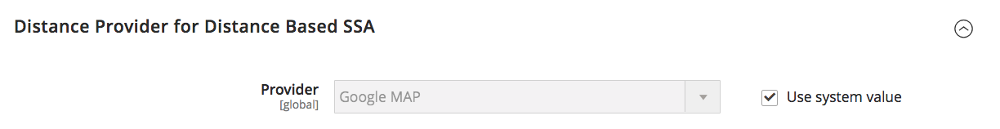

# [!UICONTROL Catalog] > [!UICONTROL Inventory]

{{config}}

>[!NOTE]
>
>Adobe CommerceとMagento Open Sourceの[!DNL Inventory Management]には、商品の在庫を管理するためのツールが用意されています。 単一の店舗を複数の倉庫、店舗、受け取り場所、ドロップシッパーなどに持つマーチャントは、これらの機能を利用して販売の数量を維持し、出荷を処理して注文を完了することができます。 これらの機能と、複数の場所で在庫を管理する方法について詳しくは、[_[!DNL Inventory Management] ユーザーガイド _](https://experienceleague.adobe.com/docs/commerce-admin/inventory/introduction.html)を参照してください。

## [!UICONTROL Stock Options]

<!-- zoom -->

<!-- [Stock Options](https://experienceleague.adobe.com/ja/docs/commerce-admin/inventory/configuration/global-options) -->

| フィールド | [範囲](../../getting-started/websites-stores-views.md#scope-settings) | 説明 |
|--- |--- |--- |
| [!UICONTROL Decrease Stock When Order is Placed] | グローバル | `Yes`に設定すると、注文が行われたときに在庫量が減少します。 _在庫の管理_&#x200B;が有効になっている場合、注文した商品と数量の予約が入力されます。 オプション：`Yes` / `No` |
| [!UICONTROL Set Items' Status to be in Stock When Order is Cancelled] | ストアビュー | `Yes`に設定すると、注文がキャンセルされたときに在庫に商品を返します。 _在庫の管理_&#x200B;が有効になっている場合、キャンセルされた商品と数量の予約はクリアされます。 オプション：`Yes` / `No` |
| [!UICONTROL Display Out of Stock Products] | グローバル | `Yes`に設定すると、在庫切れの商品が表示されます。 製品アラートも有効になっている場合は、製品が利用可能になったときに通知を受け取るように登録できます。 オプション：`Yes` / `No` |
| [!UICONTROL Only X left Threshold] | web サイト | `Only x left` メッセージのしきい値を設定します。 例えば、3に設定すると、在庫のある商品が3個以下の場合にメッセージが表示されます。 値が`0`に設定されている場合、メッセージは表示されません。 |
| [!UICONTROL Display products availability in Stock on Storefront] | ストアビュー | `Yes`に設定すると、製品ページに`In Stock`または`Out of Stock`のメッセージが表示されます。 オプション：`Yes` / `No` |
| [!UICONTROL Enable Inventory Check On Cart Load] | グローバル | 商品をカートに読み込む際に在庫チェックを実行するかどうかを指定します。 この在庫チェックを無効にすると、特にカートに多くの商品がある場合、チェックアウト手順のパフォーマンスが向上する可能性があります。 ただし、事前検証をスキップすると、チェックアウトプロセスの後半で&#x200B;_在庫切れ_ エラーが表示される可能性があります。 オプション：`Yes` / `No` |
| [!UICONTROL Synchronize with Catalog] | グローバル | `Yes`に設定すると、在庫データはカタログの変更（製品の削除、製品SKUの変更、製品タイプの変更など）に応じて調整され、在庫とカタログの一貫性を維持します。 オプション：`Yes` / `No` |

{style="table-layout:auto"}

## [!UICONTROL Product Stock Options]

<!-- zoom -->

<!-- [Product Stock Options](https://experienceleague.adobe.com/ja/docs/commerce-admin/inventory/configuration/global-options) -->

| フィールド | [範囲](../../getting-started/websites-stores-views.md#scope-settings) | 説明 |
|--- |--- |----------------------------------------------------------------------------------------------------------------------------------------------------------------------------------------------------------------------------------------------------------------------------------------------------------------------------------------------------------------------------------------------------------------------------------------------------------------------------------------------------------------------------------------------------------------------------------------------------------------------------------------------------------------------------------------------------------------------------------------------------------------------------------|
| [!UICONTROL Manage Stock] | グローバル | 完全な在庫管理を使用して、カタログ内の品目を管理するかどうかを決定します。 オプション： **はい** – 現在在庫がある品目の数を追跡するために、完全な在庫管理を有効にします。  **No** – 現在在庫のある品目の数を追跡しません。 |
| [!UICONTROL Backorders] | グローバル | バックオーダーの管理方法を決定します。 バックオーダーでは、オーダーの処理ステータスは変更されません。 商品が在庫があるかどうかにかかわらず、注文が行われた時点で、資金は引き続き承認されるか、すぐに獲得されます。 商品が入手可能になると、発送されます。 オプション： **取り寄せ注文なし** – 商品が在庫切れの場合、取り寄せ注文を受け付けません。  **0**&#x200B;未満の数量を許可 – 数量がゼロを下回った場合に取り寄せ注文を受け付けます。  **0未満の数量を許可し、お客様に通知** – 数量が0未満の場合は取り寄せ注文を受け付けますが、注文を引き続き行うことができることを顧客に通知します。 |
| [!UICONTROL Use deferred Stock update] | グローバル |  （Adobe Commerceのみ）取り寄せ注文が許可されている場合に在庫更新を延期するかどうかを指定します（_取り寄せ注文_ オプションは、`No backorders`のデフォルト値以外の値に設定されています）。 単一の製品またはweb サイト全体で機能し、_ジョブキュー_ メカニズムを使用して、注文が行われた後に在庫数量指標を非同期で更新できるようにします。 このオプションは、[Inventory management](../../inventory-management/introduction.md)と組み合わせて[非同期注文処理](https://experienceleague.adobe.com/docs/commerce-operations/performance-best-practices/high-throughput-order-processing.html#asynchronous-order-placement)でも使用できます。 |
| 買い物かごで許可される最大数量 | グローバル | 1回の注文で購入できる製品の最大数を指定します。 デフォルトでは、最大数量は10,000に設定されています。 |
| [!UICONTROL Out-of-Stock Threshold] | グローバル | 商品が在庫切れと見なされる在庫レベルを指定します。 オプション： **正の金額** - _バックオーダー_&#x200B;が無効になっている場合は、正の金額を入力します。 バックオーダーを有効にすると、この金額は無視されます。  **Zero** - _Backorders_&#x200B;が有効になっている場合、`0`と入力すると、バックオーダーを無限にできます。  **マイナス金額** - _バックオーダー_&#x200B;が有効になっている場合は、マイナス金額を入力することをお勧めします。 金額が販売可能数量に追加されます。 例えば、-50と入力して、この金額までの注文を許可します。 |
| [!UICONTROL Minimum Qty Allowed in Shopping Cart] | グローバル | 顧客グループに応じて、購入可能な商品の最小金額を決定します。 デフォルトでは、最小数量は1に設定されています。 **[!UICONTROL Add Minimum Qty]**&#x200B;をクリックして、特定の顧客グループに別の値を入力します。 |
| [!UICONTROL Notify for Quantity Below] | グローバル | 在庫がしきい値を下回ったことを示す通知の送信時の在庫レベルを指定します。 |
| [!UICONTROL Enable Qty Increments] | グローバル | 商品を数量インクリメントで販売できるかどうかを決定します。 オプション：`Yes` / `No` |
| [!UICONTROL Qty Increments] | グローバル | 数量インクリメントを構成する製品数を設定します。 |
| [!UICONTROL Automatically Return Credit Memo Item to Stock] | グローバル | クレジットメモに含まれている品目を自動的に在庫に戻すかどうかを決定します。 オプション：`Yes` / `No` |

{style="table-layout:auto"}

## [!UICONTROL Admin Bulk Operations]

<!-- zoom -->

<!-- [Admin Bulk Operations](https://experienceleague.adobe.com/ja/docs/commerce-admin/inventory/configuration/global-options) -->

>[!NOTE]
>
>**非同期キューマネージャー**&#x200B;を設定およびサポートするには、コマンドラインを使用する必要があります。 これには開発者のサポートが必要になる場合があります。 _設定ガイド_&#x200B;の「[開始メッセージキューコンシューマー](https://experienceleague.adobe.com/docs/commerce-operations/configuration-guide/cli/start-message-queues.html)」を参照してください。

| フィールド | [範囲](../../getting-started/websites-stores-views.md#scope-settings) | 説明 |
|--- |--- |--- |
| [!UICONTROL Run asynchronously] | グローバル | ソースの割り当て、ソースの割り当て解除、および在庫のソースへの転送[&#128279;](../../inventory-management/inventory-transfer.md)など、一括製品アクションに対して一括操作を非同期で実行するかどうかを決定します[bulk](../../inventory-management/bulk-assignment.md)。 &#x200B;_[!UICONTROL Asynchronous batch size]_&#x200B;までの一括アクションを収集し、それらのアクションを実行します。 この機能はデフォルトで無効になっています。 有効にする前に、一括アクションでパフォーマンスを確認することをお勧めします。 オプション： **`Yes`**- [!DNL Inventory Management]のすべての一括操作を非同期で実行します。 有効にするには、非同期キューマネージャーを設定する必要があります。 **`No`**- デフォルト。 一括操作を非同期で実行しません。 |
| [!UICONTROL Asynchronous batch size] | グローバル | **[!UICONTROL Run asynchronously]**&#x200B;を`Yes`に設定して、_[!UICONTROL Asynchronous batch size]_&#x200B;フィールドの値を入力します。   デフォルトのバッチサイズは100です。 一括プロセスがこの量に達すると、実行されます。 |

{style="table-layout:auto"}

## [!UICONTROL Inventory Indexer Settings]

| フィールド | [範囲](../../getting-started/websites-stores-views.md#scope-settings) | 説明 |
|--- |--- |--- |
| [!UICONTROL Stock/Source reindex strategy] | グローバル | 在庫/ソースのインデックス再作成に使用する戦略を決定します。 オプション：`Synchronous` / `Asynchronous` （非同期キューマネージャーは非同期モード用に設定する必要があります） |

{style="table-layout:auto"}

>[!NOTE]
>
> 注文関連アクティビティの在庫更新の依存関係により、`Synchronous`または`Asynchronous`の設定に関係なく、商品の保存時にも在庫インデクサーがトリガーされます。

## [!UICONTROL Distance Provider for Distance Based SSA]

<!-- zoom -->

<!-- [Distance Providers for Distance Based SSA](https://experienceleague.adobe.com/en/docs/commerce-admin/inventory/configuration/distance-priority-algorithm) -->

| フィールド | [範囲](../../getting-started/websites-stores-views.md#scope-settings) | 説明 |
|--- |--- |--- |
| [!UICONTROL Provider] | グローバル | Distance Priority Source Selection Algorithmに使用するプロバイダーを指定します。 この機能はデフォルトで有効になっています。 オプション： **`Google MAP`**- Google サービスを使用して、配送先住所と発信元の場所（住所とGPS座標）の間の距離と時間を計算します。 このオプションを使用するには、Google API キーが必要です。Googleを通じて料金が発生する場合があります。 **`Offline Calculation`** – 埋め込みデータベースを使用して距離を計算し、配送先住所に最も近いソースを決定します。 このオプションを使用するには、コマンドラインを使用して発送するすべての国のデータベースの場所コンテンツを最初にダウンロードするために、開発者支援が必要になる場合があります。 |

{style="table-layout:auto"}

## [!UICONTROL Google Distance Provider]

<!-- zoom -->

<!-- [Google Distance Provider](https://experienceleague.adobe.com/en/docs/commerce-admin/inventory/configuration/distance-priority-algorithm) -->

| フィールド | [範囲](../../getting-started/websites-stores-views.md#scope-settings) | 説明 |
|--- |--- |--- |
| [!UICONTROL Google API key] | グローバル | Google MAP プロバイダーのGoogle API キーを入力します。 キーは[!DNL Google Maps Platform]からのもので、[!DNL Geocoding API]と[!DNL Distance Matrix API]を有効にする必要があります。 詳しくは、_Inventory management ガイド_&#x200B;の「[Distance Priority Algorithm](../../inventory-management/distance-priority-algorithm.md#configure-the-distance-priority-algorithm)」を参照してください。 |
| [!UICONTROL Computation mode] | グローバル | 配送先住所と在庫に割り当てられたすべてのソースからの距離を計算する方向とパスを決定します。 デフォルトでは、計算は駆動モードを使用します。 オプション： **`Driving`**- デフォルト設定、道路ネットワークを使用して標準的な方向を要求します。 **`Walking`** – 歩行者用パスと歩道（利用可能な場合）を使用して歩行方向を要求します。 **`Bicycling`**– 自転車のパスと優先ルートを使用して自転車の道案内をリクエストします（現在は米国および一部のカナダの都市でのみ利用可能）。 |
| [!UICONTROL Value] | グローバル | 発送先住所への発送元の場所の距離と時間について、計算および返す値を示します。 距離優先アルゴリズムは、配送先の住所までの距離または時間が最も短いソースを推奨します。これにより、より迅速かつ低コストで配送できます。 オプション： **`Distance`**– 指標（キロメートルとメートル）またはインペリアル（マイルとフィート）のポイント間の距離を返します。 **`Time to Destination`** - ソースの場所から配送先住所への移動に必要な時間を時間と分で返します。 |

{style="table-layout:auto"}
