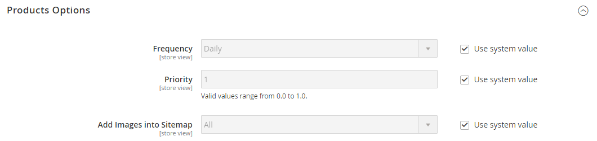

# [!UICONTROL Catalog] > [!UICONTROL XML Sitemap]

{{config}}

## [!UICONTROL Categories Options]

<!-- zoom -->

<!-- [Categories Options](https://experienceleague.adobe.com/en/docs/commerce-admin/marketing/seo/sitemap-xml) -->

| フィールド | [ 範囲 ](../../getting-started/websites-stores-views.md#scope-settings) | 説明 |
|--- |--- |--- |
| [!UICONTROL Frequency] | ストア表示 | サイトマップカテゴリの更新頻度を決定します。 オプション：`Always` / `Hourly` / `Daily` / `Weekly` / `Monthly` / `Yearly` / `Never` |
| [!UICONTROL Priority] | ストア表示 | カテゴリサイトマップの更新の優先度を他のコンテンツとの関連で決定する `0.0` ～ `1.0` の値です。 優先順位が最も低いのはゼロ（`0.0`）です。 |

{style="table-layout:auto"}

## [!UICONTROL Products Options]

<!-- zoom -->

<!-- [Products Options](https://experienceleague.adobe.com/en/docs/commerce-admin/marketing/seo/sitemap-xml) -->

| フィールド | [ 範囲 ](../../getting-started/websites-stores-views.md#scope-settings) | 説明 |
|--- |--- |--- |
| [!UICONTROL Frequency] | ストア表示 | サイトマップ製品の更新頻度を決定します。 オプション：`Always` / `Hourly` / `Daily` / `Weekly` / `Monthly` / `Yearly` / `Never` |
| [!UICONTROL Priority] | ストア表示 | 他のコンテンツと関連して製品サイトマップの更新の優先度を決定する `0.0` ～ `1.0` の値です。 優先順位が最も低いのはゼロ（`0.0`）です。 |
| [!UICONTROL Add Images into Sitemap] | ストア表示 | 画像をサイトマップに含める範囲を決定します。 オプション：`None`/`Base Only`/`All` |

{style="table-layout:auto"}

## [!UICONTROL CMS Pages Options]

<!-- zoom -->

<!-- [CMS Pages Options](https://experienceleague.adobe.com/en/docs/commerce-admin/marketing/seo/sitemap-xml) -->

| フィールド | [ 範囲 ](../../getting-started/websites-stores-views.md#scope-settings) | 説明 |
|--- |--- |--- |
| [!UICONTROL Frequency] | ストア表示 | サイトマップのCMSページを更新する頻度を指定します。 オプション：`Always` / `Hourly` / `Daily` / `Weekly` / `Monthly` / `Yearly` / `Never` |
| [!UICONTROL Priority] | ストア表示 | CMS ページサイトマップの更新の優先度を他のコンテンツと関連付けて決定する、`0.0` ～ `1.0` の値です。 優先順位が最も低いのはゼロ（`0.0`）です。 |

{style="table-layout:auto"}

## [!UICONTROL Store Url Options]

| フィールド | [ 範囲 ](../../getting-started/websites-stores-views.md#scope-settings) | 説明 |
|--- |--- |--- |
| [!UICONTROL Frequency] | ストア表示 | ストア URL の更新頻度を決定します。 オプション：`Always` / `Hourly` / `Daily` / `Weekly` / `Monthly` / `Yearly` / `Never` |
| [!UICONTROL Priority] | ストア表示 | ストア URL の更新の優先度を他のコンテンツとの関連で決定する `0.0` ～ `1.0` の値です。 優先順位が最も低いのはゼロ（`0.0`）です。 |

{style="table-layout:auto"}

## [!UICONTROL Generation Settings]

<!-- zoom -->

<!-- [Generation Settings](https://experienceleague.adobe.com/en/docs/commerce-admin/marketing/seo/sitemap-xml) -->

| フィールド | [ 範囲 ](../../getting-started/websites-stores-views.md#scope-settings) | 説明 |
|--- |--- |--- |
| [!UICONTROL Enabled] | ストア表示 | ストアで XML サイトマップを使用できるかどうかを決定します。 オプション：`Yes` / `No` |
| [!UICONTROL Start Time] | ストア表示 | サイトマップを更新する時刻（時、分、秒）を指定します。 |
| [!UICONTROL Frequency] | ストア表示 | サイトマップの更新頻度を決定します。 オプション：`Daily`/`Weekly`/`Monthly` |
| [!UICONTROL Error Email Recipient] | ストア表示 | サイトマップの更新プロセス中にエラーが発生した場合に通知を受け取る人物のメールアドレス。 複数のアドレスの場合は、それぞれをコンマで区切ります。 |
| [!UICONTROL Error Email Sender] | Web サイト | エラー通知の送信者として表示される店舗連絡先を識別します。 オプション：`General Contact` / `Sales Representative` / `Customer Support` / `Custom Email 1` / `Custom Email 2` |
| [!UICONTROL Error Email Template] | Web サイト | エラー通知に使用するメールテンプレートを識別します。 既定のテンプレート：`Sitemap generate Warnings` |

{style="table-layout:auto"}

## [!UICONTROL Sitemap File Limits]

<!-- zoom -->

<!-- [Sitemap File Limits](https://experienceleague.adobe.com/en/docs/commerce-admin/marketing/seo/sitemap-xml) -->

| フィールド | [ 範囲 ](../../getting-started/websites-stores-views.md#scope-settings) | 説明 |
|--- |--- |--- |
| [!UICONTROL Maximum No of URLs Per File] | ストア表示 | 単一のサイトマップに含めることができる URL の最大数を決定します。 |
| [!UICONTROL Maximum File Size] | ストア表示 | 生成されたサイトマップの最大サイズをバイト単位で決定します。 |

{style="table-layout:auto"}

## [!UICONTROL Search Engine Submission Settings]

<!-- zoom -->

<!-- [Search Engine Submission Settings](https://experienceleague.adobe.com/en/docs/commerce-admin/marketing/seo/sitemap-xml) -->

| フィールド | [ 範囲 ](../../getting-started/websites-stores-views.md#scope-settings) | 説明 |
|--- |--- |--- |
| [!UICONTROL Enable Submission to Robots.txt] | ストア表示 | robots.txt ファイルに対してディレクティブを送信できるようにします。 オプション：`Yes` / `No` |

{style="table-layout:auto"}
