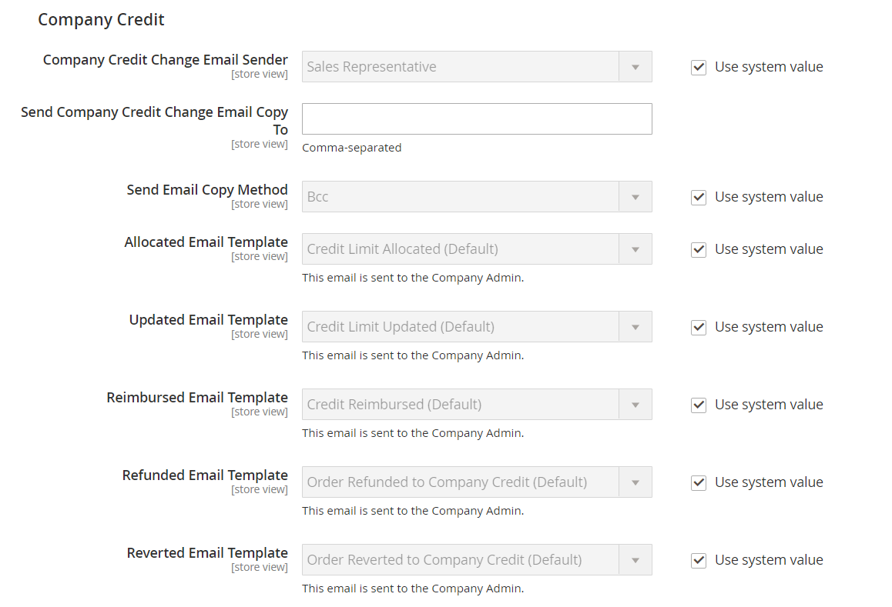

# [!UICONTROL Customers] > [!UICONTROL Company Configuration]

{{b2b-feature}}

{{config}}

>[!TIP]
>
>Adobe Commerce B2B をインストールして有効化すると、会社固有の機能を使用して購入体験をパーソナライズできます。 Adobe Commerce B2B は、B2B モデルと B2C モデルの両方をサポートする統合ソリューションです。 B2B 機能について詳しくは、[Adobe Commerce B2B ユーザーガイド ](https://experienceleague.adobe.com/docs/commerce-admin/b2b/introduction.html?lang=ja) を参照してください。

>[!NOTE]
>
>B2B 機能に対するこれらの設定オプションへのアクセスは、[ 役割リソース ](../../systems/permissions-user-roles.md#role-resources) によって制御されます。 これらのロールリソースは、管理者ユーザーに割り当てられたユーザーロール用に設定される必要があります。

これらの設定について詳しくは、_Adobe Commerce B2B ユーザーガイドの [ 基本的な B2B 機能の有効化 ](../../b2b/enable-basic-features.md) を参照してください_。

## [!UICONTROL General]

<!-- zoom -->

| フィールド | [ 範囲 ](../../getting-started/websites-stores-views.md#scope-settings) | 説明 |
|--- |--- |--- |
| [!UICONTROL Allow Company Registration from the Storefront] | Web サイト | ストアの訪問者が、会社アカウントまたは個人アカウントについて [ 登録 ](../../customers/customer-sign-in.md) するかを決定します。 オプション：`Yes` / `No` |

{style="table-layout:auto"}

## [!UICONTROL Email Options - Company Registration]

<!-- zoom -->

| フィールド | [ 範囲 ](../../getting-started/websites-stores-views.md#scope-settings) | 説明 |
|--- |--- |--- |
| [!UICONTROL Company Registration Email Recipient] | ストア表示 | 会社の登録要求がストアフロントから送信されたときに通知される店舗連絡先。 オプション：`General Contact` / `Sales Representative` / `Customer Support` / `Custom Email 1` / `Custom Email 2` |
| [!UICONTROL Send Company Registration Email Copy To] | ストア表示 | 登録通知のコピーを受け取る各担当者の電子メールアドレス。 複数のメールアドレスを指定する場合はコンマで区切ります。 |
| [!UICONTROL Send Email Copy Method] | ストア表示 | 登録 E メールのコピーを送信するために使用される E メール メソッド。 オプション：`Bcc` / `Separate Email` |
| [!UICONTROL Default Company Registration Email] | ストア表示 | 会社登録通知にデフォルトで使用されるメールテンプレート。 既定のテンプレート：`Company Registration Request` |

{style="table-layout:auto"}

## [!UICONTROL Customer-Related Emails]

<!-- zoom -->

| フィールド | [ 範囲 ](../../getting-started/websites-stores-views.md#scope-settings) | 説明 |
|--- |--- |--- |
| [!UICONTROL Default 'Sales Rep Assigned' Email] | ストア表示 | 営業担当者が会社アカウントに割り当てられたときに既定で使用される E メール テンプレート。 このメールは、営業担当者と会社の管理者に送信されます。 既定のテンプレート：`Sales Representative Assigned to Company` |
| [!UICONTROL Default 'Assign Company to Customer' Email] | ストア表示 | 個々の顧客アカウントが会社アカウントに割り当てられている場合にデフォルトで使用されるメールテンプレート。 このメールは、顧客にのみ送信されます。 既定のテンプレート：`Assign Company to Customer` |
| [!UICONTROL Default 'Assign Company Admin' Email] | ストア表示 | 会社管理者が会社に割り当てられたときに使用される E メール テンプレートです。 このメールは、営業担当者と会社の管理者に送信されます。 既定のテンプレート：`Assign Company Admin` |
| [!UICONTROL Default 'Company Admin Inactive' Email] | ストア表示 | 会社管理者の役割を果たすユーザーのステータスが「非アクティブ」に変更された場合にデフォルトで使用されるメールテンプレート。 システムは、新規管理者と元会社管理者に変更のメール通知を送信します。 既定のテンプレート：`Company Admin Set Inactive` |
| [!UICONTROL Default 'Company Admin Changed to Member' Email] | ストア表示 | 元の会社管理者が会社メンバーになった際にデフォルトで使用されるメールテンプレート。 メールは会社メンバーにのみ送信されます。 既定のテンプレート：`Company Admin Changed to Member` |
| [!UICONTROL Default 'Customer Status Active' Email] | ストア表示 | 顧客のステータスがアクティブになる際にデフォルトで使用されるメールテンプレート。 このメールは、顧客にのみ送信されます。 既定のテンプレート：`Customer Status Active` |
| [!UICONTROL Default 'Customer Status Inactive' Email] | ストア表示 | 顧客のステータスが非アクティブになった場合にデフォルトで使用されるメールテンプレート。 このメールは、顧客にのみ送信されます。 既定のテンプレート：`Customer Status Inactive` |

{style="table-layout:auto"}

## [!UICONTROL Company Status Change]

<!-- zoom -->

| フィールド | [ 範囲 ](../../getting-started/websites-stores-views.md#scope-settings) | 説明 |
|--- |--- |--- |
| [!UICONTROL Company Status Change Email Recipient] | ストア表示 | 会社のステータスが変更されるたびに通知される店舗連絡先。 オプション：`General Contact` / `Sales Representative` / `Customer Support` / `Custom Email 1` / `Custom Email 2` |
| [!UICONTROL Send Company Status Change Email Copy To] | ストア表示 | 会社の状態変更通知のコピーを受信する各担当者の電子メール アドレス。 複数のメールアドレスを指定する場合はコンマで区切ります。 |
| [!UICONTROL Send Email Copy Method] | ストア表示 | 状態変更通知のコピーを送信するために使用される電子メール メソッド。 オプション：`Bcc` / `Separate Email` |
| [!UICONTROL Default "Company Status Change to Active 1' Email] | ストア表示 | 会社の状態が _承認保留中_ から _アクティブ_ に変更されるときに使用される E メール テンプレートです。 既定のテンプレート：`Company Status Active 1` |
| [!UICONTROL Default 'Company Status Change to Active 2' Email] | ストア表示 | 会社のステータスが _却下_ または _ブロック_ から _アクティブ_ に変更された場合にデフォルトで使用されるメールテンプレートです。 既定のテンプレート：`Company Status Active 2` |
| [!UICONTROL Default 'Company Status Change to Rejected' Email] | ストア表示 | 会社のステータスが _却下_ に変わる場合にデフォルトで使用されるメールテンプレートです。 既定のテンプレート：`Company Status Rejected` |
| [!UICONTROL Default 'Company Status Change to Blocked' Email] | ストア表示 | 会社のステータスが _ブロック_ に変わった場合にデフォルトで使用されるメールテンプレートです。 既定のテンプレート：`Company Status Blocked` |
| [!UICONTROL Default 'Company Status Change to Pending Approval' Email] | ストア表示 | 会社のステータスが _承認待ち_ に変更された場合にデフォルトで使用されるメールテンプレート。 既定のテンプレート：`Company Status Pending Approval` |

{style="table-layout:auto"}

## [!UICONTROL Company Credit]

<!-- zoom -->

| フィールド | [ 範囲 ](../../getting-started/websites-stores-views.md#scope-settings) | 説明 |
|--- |--- |--- |
| [!UICONTROL Company Credit Change Email Sender] | ストア表示 | 会社のクレジットが変更されるたびに通知される店舗担当者。 オプション：`General Contact` / `Sales Representative` / `Customer Support` / `Custom Email 1` / `Custom Email 2` |
| [!UICONTROL Send Company Credit Change Email Copy To] | ストア表示 | 会社の信用変更通知のコピーを受信する各担当者の電子メール アドレス。 複数のメールアドレスを指定する場合はコンマで区切ります。 |
| [!UICONTROL Send Email Copy Method] | ストア表示 | 与信変更通知のコピーを送信するために使用される電子メール メソッド。 オプション：`Bcc` / `Separate Email` |
| [!UICONTROL Allocated Email Template] | ストア表示 | 会社のクレジットが割り当てられる際にデフォルトで使用される E メール テンプレート。 このメールは、会社管理者に送信されます。 既定のテンプレート：`Credit Limit Allocated` |
| [!UICONTROL Updated Email Template] | ストア表示 | 会社の与信限度額が更新された際にデフォルトで使用される E メール テンプレート。 このメールは、会社管理者に送信されます。 既定のテンプレート：`Credit Limit Updated` |
| [!UICONTROL Reimbursed Email Template] | ストア表示 | 会社のクレジットに対して [ 償還 ](../../b2b/credit-company.md#apply-a-payment-to-a-company-account) が行われる際にデフォルトで使用されるメールテンプレート。 このメールは、会社管理者に送信されます。 既定のテンプレート：`Credit Reimbursed` |
| [!UICONTROL Refunded Email Template] | ストア表示 | 注文の金額が会社クレジットに払い戻される際にデフォルトで使用されるメールテンプレート。 このメールは、会社管理者に送信されます。 既定のテンプレート：`Order Refunded to Company Credit` |
| [!UICONTROL Reverted Email Template] | ストア表示 | 注文が会社クレジットに戻された際にデフォルトで使用されるメールテンプレート。 このメールは、会社管理者に送信されます。 既定のテンプレート：`Order Reverted to Company Credit` |

{style="table-layout:auto"}
