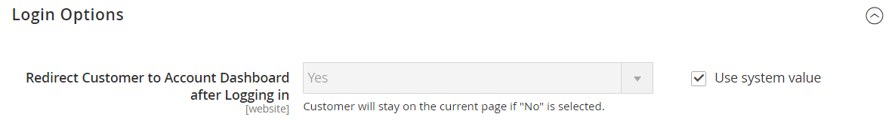

# [!UICONTROL Customers] > [!UICONTROL Customer Configuration]

{{config}}

## [!UICONTROL Account Sharing Options]

<!-- zoom -->

<!-- [Account Sharing Options](https://docs.magento.com/user-guide/customers/account-scope.html) -->

| フィールド | [ 範囲 ](../../getting-started/websites-stores-views.md#scope-settings) | 説明 |
|--- |--- |--- |
| [!UICONTROL Share Customer Accounts] | グローバル | ストア階層内の顧客アカウントの範囲を決定します。 オプション： **`Global`**- カスタマーアカウント情報は、Commerce インストール内のすべての web サイトおよびストアで共有されます。 **`Per Website`** – 顧客アカウント情報は、アカウントが作成された web サイトに限定されます。 |

{style="table-layout:auto"}

## [!UICONTROL Online Customers Options]

<!-- zoom -->

<!-- [Online Customers Options](https://docs.magento.com/user-guide/customers/now-online.html) -->

| フィールド | [ 範囲 ](../../getting-started/websites-stores-views.md#scope-settings) | 説明 |
|--- |--- |--- |
| [!UICONTROL Online Minutes Interval] | グローバル | 顧客のオンラインアクティビティに管理者からアクセスできる期間を決定します。 デフォルトの 15 分間隔の場合は、空のままにします。 |
| [!UICONTROL Customer Data Lifetime] | グローバル | 顧客が入力した未保存のデータが期限切れになるまでの時間（分）を指定します。 デフォルトでは、未保存のデータの有効期限は 60 分後に切れます。 |

{style="table-layout:auto"}

## [!UICONTROL Create New Account Options]

<!-- zoom -->

<!-- zoom -->

<!-- [Create New Account Options (VAT Fields)](https://docs.magento.com/user-guide/customers/customer-account-configuration.html) -->

| フィールド | [ 範囲 ](../../getting-started/websites-stores-views.md#scope-settings) | 説明 |
|--- |--- |--- |
| [!UICONTROL Enable Automatic Assignment to Customer Group] | ストア表示 | 顧客をデフォルトの顧客グループに自動的に割り当てるかどうかを決定します。 店舗に VAT 番号を表示するには、ストアフロントで [VAT 番号を表示 ] を設定し、[`Yes`] を選択します。 オプション： **`Yes`**– 顧客 VAT ID は自動的には検証されず、顧客グループも変更されません。 **`No`** - システムの動作は通常どおりであり、デフォルトの顧客グループは「デフォルトグループ」フィールドで設定できます。 |
| [!UICONTROL Default Group] | ストア表示 | アカウントの作成時に割り当てられる最初の顧客グループを識別します。 |
| [!UICONTROL Default Value for Disable Automatic Group Changes Based on VAT ID] | グローバル | （現在の構成スコープが `Default Group` に設定されている場合にのみ使用できます。） VAT ID に基づく顧客グループの自動変更を既定で有効にするか無効にするかを選択します。 設定は、製品レベルで上書きできます。 この設定は、次の状況でのシステム動作に影響を与えます。  – 顧客のデフォルト住所またはデフォルト住所全体の VAT ID が変更されます。   - チェックアウト中に、以前に住所を保存しなかった登録済みのお客様、またはチェックアウト中に登録したお客様のグループ変更がエミュレートされました。   グループの自動変更が有効になっている場合、最初のケースでは顧客グループが自動的に変更され、2 番目のケースでは一時的にエミュレートされた顧客グループが顧客に割り当てられます。 グループの自動変更が無効になっている場合、管理者が手動で変更しない限り、割り当てられている顧客グループは変更されません。 |
| [!UICONTROL Show VAT Number on Storefront] | Web サイト | 店舗の顧客に VAT 番号を表示するかどうかを決定します。 オプション：`Yes` / `No`   通常の B2B 以外の顧客アカウントにのみ影響します。 会社アカウントには、個別の VAT 番号フィールドがあります。 |
| [!UICONTROL Default Email Domain] | ストア表示 | ストアのデフォルトのメールドメインを識別します。 例：`mystore.com` |
| [!UICONTROL Default Welcome Email] | ストア表示 | デフォルトの _ようこそ_ メールに使用するメールテンプレートを識別します。 |
| [!UICONTROL Default Welcome Email Without Password] | ストア表示 | 管理者によって作成され、パスワードが割り当てられていない新しい顧客アカウントに使用される、代替のようこそ E メール テンプレート。 |
| [!UICONTROL Email Sender] | ストア表示 | ようこそメールの送信者として表示される店舗連絡先を識別します。 |
| [!UICONTROL Require Emails Confirmation] | Web サイト | アカウントの作成要求に顧客の確認が必要かどうかを判断します。 オプション：`Yes` / `No`.    _**注意：**_ バージョン 2.4.7 以降、ブラウザーに関係なく、メールによる確認後にアカウントにログインするには、メールとパスワードを再入力する必要があります。 |
| [!UICONTROL Confirmation Link Email] | ストア表示 | 確認 E メールに使用する E メールテンプレートを識別します。 既定のテンプレート：`New account confirmation key` |
| [!UICONTROL Welcome Email] | ストア表示 | アカウントの確認後に送信されるようこそメッセージに使用するメールテンプレートを識別します。 |
| [!UICONTROL Generate Human-Friendly Customer ID] | グローバル | VAT ID 番号の入力と保存に使用されるフィールドがストアフロントから表示されるかどうかを決定します。 オプション：`Yes` / `No` |

{style="table-layout:auto"}

## [!UICONTROL Password Options]

<!-- zoom -->

<!-- [Password Options](https://docs.magento.com/user-guide/customers/password-options.html) -->

| フィールド | [ 範囲 ](../../getting-started/websites-stores-views.md#scope-settings) | 説明 |
|--- |--- |--- |
| [!UICONTROL Password Reset Protection Type] | ストア表示 | 顧客アカウントのパスワードをリセットするために使用する方法を決定します。 オプション： **`By IP and Email`**- パスワードは、管理者アカウントに関連付けられたメールアドレスに送信されるリセット通知から応答を受信した後に、オンラインでリセットできます。 **`By IP`** - パスワードはオンラインでリセットできます。  **`By Email`**- パスワードは、管理者アカウントに関連付けられたメールアドレスに送信されるメール通知に応答することでリセットできます。 **`None`** - パスワードは、ストア管理者のみがリセットできます。 |
| [!UICONTROL Max Number of Password Reset Requests] | ストア表示 | 1 時間あたりのパスワードリセット要求の数を制限します。 無制限の要求の場合は、ゼロ（0）を入力します。 |
| [!UICONTROL Min Time Between Password Reset Requests] | ストア表示 | パスワードリセット要求の間隔を分単位で指定します。 リクエスト間に遅延を発生させない場合は、ゼロ（0）を入力します。 |
| [!UICONTROL Forgot Email Template] | ストア表示 | 顧客がパスワードを忘れた場合に使用するメールテンプレートを識別します。 既定のテンプレート：`Forgot Password` |
| [!UICONTROL Remind Email Template] | ストア表示 | 顧客がパスワードのリマインダーまたはヒントを受け取る際に使用するメールテンプレートを識別します。 既定のテンプレート：`Remind Password` |
| [!UICONTROL Reset Password Template] | ストア表示 | 顧客がパスワードをリセットする際に使用する E メール テンプレートを決定します。 |
| [!UICONTROL Password Template Email Sender] | ストア表示 | パスワード関連のメールの送信者として表示される店舗連絡先を決定します。 |
| [!UICONTROL Recovery Link Expiration Period (hours)] | グローバル | パスワード回復リンクの有効期限が切れるまでの時間を指定します。 |
| [!UICONTROL Enable Autocomplete on login/forgot password forms] | Web サイト | ログイン/パスワードを忘れた場合のフォームでオートコンプリートを有効にするかどうかを指定します。 オプション：`Yes` / `No` |
| [!UICONTROL Number of Required Character Classes] | グローバル | パスワードに含める必要がある様々な文字クラス（小文字、大文字、数字、特殊文字）の数を決定します。 |
| [!UICONTROL Maximum Login Failures to Lockout Account] | グローバル | カスタマーアカウントがロックされるまでログインが失敗した回数を決定します。 試行回数に制限のない場合は、ゼロ（`0`）を入力します。 |
| [!UICONTROL Minimum Password Length] | グローバル | パスワードで許可される最小文字数を決定します。 数値は 0 より大きい値（`0`）にする必要があります。 |
| [!UICONTROL Lockout Time (minutes)] | グローバル | ログインの試行に失敗した回数が多すぎた場合に顧客アカウントがロックされる時間（分）を指定します。 |

{style="table-layout:auto"}

## [!UICONTROL Account Information Options]

<!-- zoom -->

| フィールド | [ 範囲 ](../../getting-started/websites-stores-views.md#scope-settings) | 説明 |
|--- |--- |--- |
| [!UICONTROL Change Email Template] | ストア表示 | 顧客が電子メール アドレスを変更するときに使用される既定の電子メール テンプレートを識別します。 |
| [!UICONTROL Change Email and Password Template] | ストア表示 | 顧客が電子メール アドレスおよびパスワードを変更するときに使用される既定の電子メール テンプレートを識別します。 |

{style="table-layout:auto"}

## [!UICONTROL Name and Address Options]

### Magento Open Sourceオプション

{{ce-feature}}

<!-- zoom -->

<!-- [Name and Address Options - Open Source](https://docs.magento.com/user-guide/customers/name-address-options.html) -->

| フィールド | [ 範囲 ](../../getting-started/websites-stores-views.md#scope-settings) | 説明 |
|--- |--- |--- |
| [!UICONTROL Number of Lines in a Street Address] | Web サイト | 番地の行数を指定します。 住所は `1` から `4` 行で構成されています。 フィールドが空白の場合、デフォルトの住所である 3 行（`3`）が使用されます。 |
| [!UICONTROL Show Prefix] | Web サイト | お客様の名前の先頭にプレフィックスが含まれているかどうかを決定します（例：Mr.および Ms. オプション : `No` / `Optional` / `Required`） |
| [!UICONTROL Prefix Dropdown Options] | Web サイト | プリフィックスオプションのリストを定義します。 値はセミコロンで区切ります。 最初の値の前にセミコロンを入れると、リストの先頭に空の値が表示されます。 |
| [!UICONTROL Show Middle Name (initial)] | Web サイト | ミドルネームのイニシャルを顧客名の一部として含めるかどうかを決定します。 使用する場合、中央の最初のフィールドはオプションです。 オプション：`Yes` / `No` |
| [!UICONTROL Show Suffix] | Web サイト | 顧客名の末尾にサフィックスが含まれるかどうかを決定します（Jr.、Sr.、III など）。 オプション：`No`/`Optional`/`Required` |
| [!UICONTROL Suffix Dropdown Options] | Web サイト | サフィックスオプションのリストを定義します。 値はセミコロンで区切ります。 最初の値の前にセミコロンを入れると、リストの先頭に空の値が表示されます。 |
| [!UICONTROL Show Date of Birth] | Web サイト | 顧客の生年月日が氏名および住所フォームに含まれるかどうかを決定します。 オプション：`No` / `Optional` / `Required`   **_重要：_**現在のセキュリティとプライバシーのベストプラクティスに従って、顧客の完全な生年月日（月、日、年）を他の個人識別子と一緒に保存することに関連する潜在的な法的およびセキュリティリスクに注意してください。 顧客の完全な生年月日の保存を制限し、代替として顧客の生年月日の使用を提案することをお勧めします。 |
| [!UICONTROL Show Tax/VAT Number] | Web サイト | 名前と住所のフォームに税または [VAT 番号 ](../../stores-purchase/vat.md) が含まれるかどうかを決定します。 オプション：`No`/`Optional`/`Required` |
| [!UICONTROL Show Gender] | Web サイト | 名前と住所のフォームに性別が含まれているかどうかを決定します。 オプション：`No`/`Optional`/`Required` |
| [!UICONTROL Show Telephone] | Web サイト | 顧客の電話番号が名前と住所のフォームに含まれているかどうかを決定します。 オプション：`No`/`Optional`/`Required` |
| [!UICONTROL Show Company] | Web サイト | 顧客の会社が名前と住所のフォームに含まれているかどうかを判断します。 オプション：`No`/`Optional`/`Required` |
| [!UICONTROL Show Fax] | Web サイト | 顧客の FAX 番号を住所と名前のフォームに含めるかどうかを決定します。 オプション：`No`/`Optional`/`Required` |

{style="table-layout:auto"}

### Adobe Commerceオプション

{{ee-feature}}

<!-- zoom -->

<!-- [Name and Address Options - Commerce](https://docs.magento.com/user-guide/customers/name-address-options.html) -->

| フィールド | [ 範囲 ](../../getting-started/websites-stores-views.md#scope-settings) | 説明 |
|--- |--- |--- |
| [!UICONTROL Prefix Dropdown Options] | Web サイト | プリフィックスオプションのリストを定義します。 値はセミコロンで区切ります。 最初の値の前にセミコロンを入れると、リストの先頭に空の値が表示されます。 |
| [!UICONTROL Suffix Dropdown Options] | Web サイト | サフィックスオプションのリストを定義します。 値はセミコロンで区切ります。 最初の値の前にセミコロンを入れると、リストの先頭に空の値が表示されます。 |
| [!UICONTROL Show Telephone] | Web サイト | 顧客の電話番号が名前と住所のフォームに含まれているかどうかを決定します。 オプション：`No`/`Optional`/`Required` |
| [!UICONTROL Show Company] | Web サイト | 顧客の会社が名前と住所のフォームに含まれているかどうかを判断します。 オプション：`No`/`Optional`/`Required` |
| [!UICONTROL Show Fax] | Web サイト | 顧客の FAX 番号を住所と名前のフォームに含めるかどうかを決定します。 オプション：`No`/`Optional`/`Required` |

{style="table-layout:auto"}

## [!UICONTROL Store Credit Options]

{{ee-feature}}

<!-- zoom -->

<!-- [Store Credit Options](https://docs.magento.com/user-guide/customers/credit-configure.html) -->

| フィールド | [ 範囲 ](../../getting-started/websites-stores-views.md#scope-settings) | 説明 |
|--- |--- |--- |
| [!UICONTROL Enable Store Credit Functionality] | グローバル | ストアクレジットが有効かどうかを判断します。 無効にすると、顧客アカウントおよび管理者の顧客の管理ページからストアクレジットが削除されます。 オプション：`Yes`/`No`。 |
| [!UICONTROL Show Store Credit History to Customers] | Web サイト | 残高履歴を顧客勘定に表示するかどうかを決定します。 オプション：`Yes`/`No`。 |
| [!UICONTROL Refund Store Credit Automatically] | グローバル | 店舗払い戻しが自動的に発行されるかどうかを決定します。 オプション：`Yes` / `No` |
| [!UICONTROL Store Credit Update Email Sender] | ストア表示 | 顧客に送信されるクレジット更新通知の送信者として表示されるストア ID を決定します。 |
| [!UICONTROL Store Credit Update Email Template] | ストア表示 | 与信更新に使用する E メール テンプレートを決定します。 |

{style="table-layout:auto"}

## [!UICONTROL Login Options]

<!-- zoom -->

<!-- [Login Options](https://docs.magento.com/user-guide/customers/login-landing-page.html) -->

| フィールド | [ 範囲 ](../../getting-started/websites-stores-views.md#scope-settings) | 説明 |
|--- |--- |--- |
| [!UICONTROL Redirect Customer to Account Dashboard after Logging in] | Web サイト | 顧客がアカウントにログインした後の処理を指定します。 顧客を自分のアカウントダッシュボードにリダイレクトするには、「`Yes`」を選択します。 オプション： **`Yes`**– 顧客が自分のアカウントにログインすると、アカウントダッシュボードが表示されます。 **`No`** – 顧客はアカウントにログインした後も買い物を続けることができます。 |

{style="table-layout:auto"}

## [!UICONTROL Address Templates]

<!-- zoom -->

<!-- [Address Templates](https://docs.magento.com/user-guide/customers/address-templates.html) -->

| Template | [ 範囲 ](../../getting-started/websites-stores-views.md#scope-settings) | 説明 |
|--- |--- |--- |
| [!UICONTROL Text] | ストア表示 | テンプレートは、印刷されるすべてのアドレスに使用されます。 |
| [!UICONTROL Text One Line] | ストア表示 | このテンプレートは、顧客の買い物かごアドレス帳リスト内の住所エンティティの順序を定義します。 チェックアウト中の進行状況。 |
| [!UICONTROL HTML] | ストア表示 | このテンプレートは、管理パネル（[!UICONTROL Customers]/[!UICONTROL Manage Customers]）の _顧客アドレス_ 領域にあるアドレスフィールドの順序を定義します。 これは、顧客がアカウントページで請求先または配送先住所を作成する際に _新しい住所を追加_ ページで行う操作にも影響します。 |
| [!UICONTROL PDF] | ストア表示 | テンプレートは、印刷された請求書、出荷およびクレジット・メモの請求先住所および出荷先住所の表示を定義します。 |

{style="table-layout:auto"}

## [!UICONTROL Customer Segments]

{{ee-feature}}

<!-- zoom -->

<!-- [Customer Segments](https://docs.magento.com/user-guide/marketing/customer-segments.html) -->

| Template | [ 範囲 ](../../getting-started/websites-stores-views.md#scope-settings) | 説明 |
|--- |--- |--- |
| [!UICONTROL Enable Customer Segment Functionality] | グローバル | 顧客セグメントを使用してターゲットを絞ったプロモーションを作成できるかどうかを決定します。 オプション：`Yes` / `No` |
| [!UICONTROL Real-time Check if Customer is Matched by Segment] | グローバル | 顧客セグメントをリアルタイムで検証するかどうかを決定します。 オプション： **[!UICONTROL Yes]**– 顧客セグメントはリアルタイムで検証されます（デフォルト値）。 **[!UICONTROL No]** – 顧客セグメントは、単一の結合条件 SQL クエリによって検証されます。 これにより、システム内に多数の顧客セグメントがある場合の、セグメント検証のパフォーマンスが向上します。 ただし、分割データベースを使用している場合や、登録済みの顧客が存在しない場合は、検証は機能しません。 |

{style="table-layout:auto"}

## [!UICONTROL CAPTCHA]

<!-- zoom -->

<!-- [CAPTCHA](https://docs.magento.com/user-guide/stores/security-captcha.html) -->

| フィールド | [ 範囲 ](../../getting-started/websites-stores-views.md#scope-settings) | 説明 |
|--- |--- |--- |
| [!UICONTROL Enable CAPTCHA on Storefront] | Web サイト | Commerce web サイトに関連付けられているストアで CAPTCHA を有効にします。 オプション：`Yes` / `No` |
| [!UICONTROL Font] | Web サイト | CAPTCHA を表示するために使用するフォントを決定します。 独自のフォントを追加するには、フォントファイルをCommerceのインストール先と同じディレクトリに置き、宣言を `config.xml` ファイルの `app/code/Magento/Captcha/etc` に追加します。 |
| [!UICONTROL Forms] | Web サイト | CAPTCHA が使用されるフォームを決定します。 オプション： `Applying Coupon Code`  `Checkout/Placing Order` `Create user`  `Login`  `Forgot password`  `Contact Us`  `Change password`  `Share Wishlist Form`  `Send to Friend Form`  `Payflow Pro` （[ セキュリティパッチ ](https://experienceleague.adobe.com/docs/commerce-knowledge-base/kb/troubleshooting/payments/paypal-payflow-pro-active-carding-activity.html) を参照）  `Add Gift Card Code`   `Create company`    _**注意：**_ ユーザー作成、パスワードを忘れた場合、Payflow Pro フォームは、選択した場合は常に有効になります。 |
| [!UICONTROL Displaying Mode] | Web サイト | CAPTCHA が表示されるタイミングを決定します。 オプション： **`Always`**- ログインには常に CAPTCHA が必要です。 **`After number of attempts to login`** – このオプションは、管理者のログインフォームにのみ適用されます。 選択すると、_[!UICONTROL Number of Unsuccessful Attempts to Login]_フィールドが表示されます。 許可するログイン試行回数を入力します。 値 `0` （ゼロ）は、[!UICONTROL Displaying Mode] を `Always` に設定する場合と似ています。 _**注意：**_失敗したログインの試行回数を追跡するために、1 つのメールアドレスおよび 1 つの IP アドレスからのログインがカウントされます。 同じ IP アドレスから許可されるログイン試行回数の上限は 1,000 です。 この制限は、CAPTCHA が有効な場合にのみ適用されます。 |
| [!UICONTROL Number of Unsuccessful Attempts to Login] | Web サイト | アカウントがロックされるまで顧客がログインできる回数を指定します。 |
| [!UICONTROL CAPTCHA Timeout (minutes)] | Web サイト | 現在の CAPTCHA の有効期間を決定します。 CAPTCHA の有効期限が切れたら、ユーザーはページをリロードする必要があります。 |
| [!UICONTROL Number of Symbols] | Web サイト | CAPTCHA に表示されるシンボルの数を指定します（最大 8 個）。 また、範囲を指定することもできます（例：5～8）。 |
| [!UICONTROL Symbols Used in CAPTCHA] | Web サイト | CAPTCHA に表示される文字（a ～ z および A ～ Z）と数字（0 ～ 9）を決定します。 `i`、`l`、`1` などの他のシンボルと区別しにくいシンボルは、CAPTCHA シンボルのデフォルトセットには含まれません。 |
| [!UICONTROL Case Sensitive] | Web サイト | CAPTCHA 文字で大文字と小文字を区別するかどうかを決定します。 オプション：`Yes` / `No` |

{style="table-layout:auto"}
