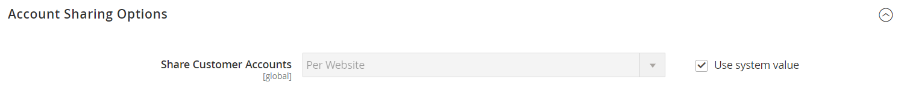
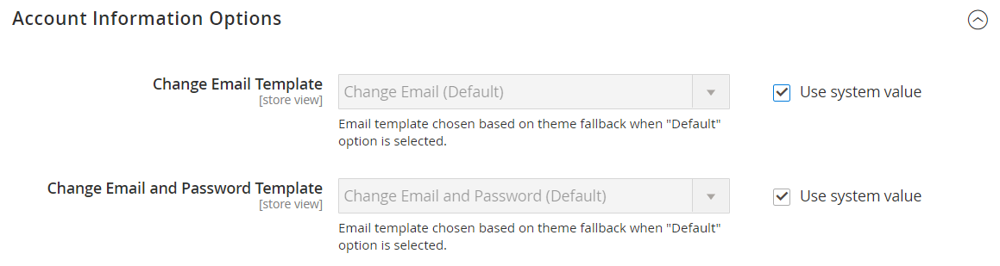
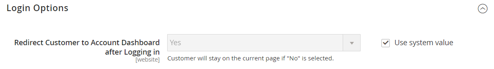
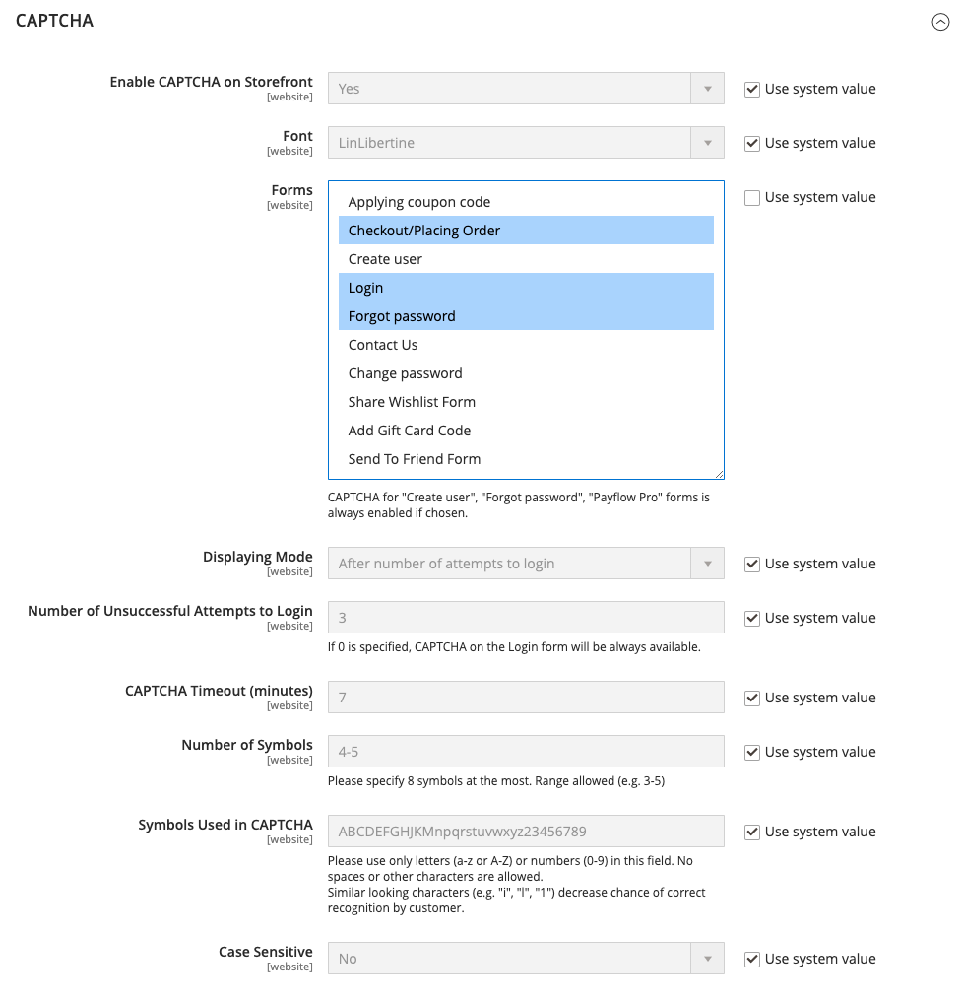

# [!UICONTROL Customers]  > [!UICONTROL Customer Configuration]

{{config}}

## [!UICONTROL Account Sharing Options]

<!-- zoom -->

<!-- [Account Sharing Options](https://experienceleague.adobe.com/ja/docs/commerce-admin/customers/customer-accounts/customer-account-scope) -->

| フィールド | [範囲](../../getting-started/websites-stores-views.md#scope-settings) | 説明 |
|--- |--- |--- |
| [!UICONTROL Share Customer Accounts] | グローバル | ストア階層内の顧客アカウントの範囲を決定します。 オプション： **`Global`**– お客様のアカウント情報は、Commerce インストールのすべてのweb サイトおよびストアと共有されます。 **`Per Website`** – 顧客アカウント情報は、アカウントが作成されたweb サイトに限定されます。 |

{style="table-layout:auto"}

## [!UICONTROL Online Customers Options]

<!-- zoom -->

<!-- [Online Customers Options](https://experienceleague.adobe.com/ja/docs/commerce-admin/customers/customers-menu/now-online) -->

| フィールド | [範囲](../../getting-started/websites-stores-views.md#scope-settings) | 説明 |
|--- |--- |--- |
| [!UICONTROL Online Minutes Interval] | グローバル | 顧客のオンラインアクティビティが管理者からアクセスできる時間を指定します。 デフォルトの間隔（15分）は空のままにします。 |
| [!UICONTROL Customer Data Lifetime] | グローバル | 顧客が入力した未保存データの有効期限が切れるまでの分数を指定します。 デフォルトでは、未保存のデータは60分後に期限切れになります。 |

{style="table-layout:auto"}

## [!UICONTROL Create New Account Options]

<!-- zoom -->

<!-- zoom -->

<!-- [Create New Account Options (VAT Fields)](https://experienceleague.adobe.com/ja/docs/commerce-admin/customers/customer-accounts/configure/login-landing-page) -->

| フィールド | [範囲](../../getting-started/websites-stores-views.md#scope-settings) | 説明 |
|--- |--- |--- |
| [!UICONTROL Enable Automatic Assignment to Customer Group] | ストアビュー | 顧客がデフォルトの顧客グループに自動的に割り当てられるかどうかを指定します。 ストアにVAT番号を表示するには、ストアフロントに「VAT番号を表示」を設定し、`Yes`を選択します。 オプション： **`Yes`**- システムは顧客VAT IDを自動的に検証せず、顧客グループも変更しません。 **`No`** - システムの動作は通常どおり、デフォルトの顧客グループは「デフォルトのグループ」フィールドで設定できます。 |
| [!UICONTROL Default Group] | ストアビュー | アカウントの作成時に割り当てられた最初の顧客グループを識別します。 |
| [!UICONTROL Default Value for Disable Automatic Group Changes Based on VAT ID] | グローバル | （現在の設定スコープが`Default Group`に設定されている場合にのみ使用できます）。 VAT IDに基づく顧客グループの自動変更をデフォルトで有効にするか無効にするかを選択します。 設定は製品レベルで上書きできます。 設定は、次の状況におけるシステムの動作に影響します。  – 顧客のデフォルト アドレスまたはデフォルト アドレス全体のVAT IDが変更されます。  – 以前にアドレスを保存していない登録済み顧客またはチェックアウト中に登録した顧客に対して、チェックアウト中に顧客グループの変更がエミュレートされました。  自動グループ変更が有効になっている場合、最初のケースでは顧客グループが自動的に変更され、2番目のケースでは一時的にエミュレートされた顧客グループが顧客に割り当てられます。 グループの自動変更が無効になっている場合、割り当てられた顧客グループは、管理者が手動で変更しない限り、変更されません。 |
| [!UICONTROL Show VAT Number on Storefront] | web サイト | ストア内のお客様にVAT番号が表示されているかどうかを判断します。 オプション：`Yes` / `No`  通常のB2B以外の顧客アカウントのみに影響します。 会社アカウントには、独自のVAT番号フィールドがあります。 |
| [!UICONTROL Default Email Domain] | ストアビュー | ストアのデフォルトの電子メールドメインを識別します。 例：`mystore.com` |
| [!UICONTROL Default Welcome Email] | ストアビュー | 既定の&#x200B;_ようこそ_&#x200B;電子メールに使用される電子メールテンプレートを識別します。 |
| [!UICONTROL Default Welcome Email Without Password] | ストアビュー | パスワードがまだ割り当てられていない管理者が作成した新しい顧客アカウントに使用される代替ウェルカムメールテンプレート。 |
| [!UICONTROL Email Sender] | ストアビュー | ウェルカムメールの送信者として表示されるストア連絡先を識別します。 |
| [!UICONTROL Require Emails Confirmation] | web サイト | アカウントを作成するリクエストに顧客からの確認が必要かどうかを判断します。 オプション：`Yes` / `No`。   _&#x200B;**メモ：**&#x200B;_ バージョン 2.4.7以降、お客様は、ブラウザーに関係なく、メール確認後にアカウントにログインするために、メールとパスワードを再入力する必要があります。 |
| [!UICONTROL Confirmation Link Email] | ストアビュー | 確認メールに使用される電子メールテンプレートを識別します。 既定のテンプレート：`New account confirmation key` |
| [!UICONTROL Welcome Email] | ストアビュー | アカウントの確認後に送信されるようこそメッセージに使用される電子メールテンプレートを識別します。 |
| [!UICONTROL Generate Human-Friendly Customer ID] | グローバル | VAT ID番号の入力と保存に使用されるフィールドがストアフロントから表示されるかどうかを指定します。 オプション：`Yes` / `No` |

{style="table-layout:auto"}

## [!UICONTROL Password Options]

<!-- zoom -->

<!-- [Password Options](https://experienceleague.adobe.com/ja/docs/commerce-admin/customers/customer-accounts/configure/password-options) -->

| フィールド | [範囲](../../getting-started/websites-stores-views.md#scope-settings) | 説明 |
|--- |--- |--- |
| [!UICONTROL Password Reset Protection Type] | ストアビュー | 顧客アカウントのパスワードをリセットする方法を指定します。 オプション： **`By IP and Email`**– 管理者アカウントに関連付けられた電子メールアドレスに送信されたリセット通知から応答を受信した後、パスワードをオンラインでリセットできます。 **`By IP`** - パスワードはオンラインでリセットできます。 **`By Email`**– 管理者アカウントに関連付けられている電子メールアドレスに送信される電子メール通知に応答して、パスワードをリセットできます。 **`None`** - パスワードは、ストア管理者のみがリセットできます。 |
| [!UICONTROL Max Number of Password Reset Requests] | ストアビュー | 1時間あたりのパスワードリセット要求の数を制限します。 無制限のリクエストの場合は、ゼロ（0）を入力します。 |
| [!UICONTROL Min Time Between Password Reset Requests] | ストアビュー | パスワードのリセット要求の間隔（分）を指定します。 リクエスト間に遅延がない場合は、ゼロ（0）を入力します。 |
| [!UICONTROL Forgot Email Template] | ストアビュー | 顧客がパスワードを忘れたときに使用されるメールテンプレートを識別します。 既定のテンプレート：`Forgot Password` |
| [!UICONTROL Remind Email Template] | ストアビュー | 顧客がパスワードのリマインダーまたはヒントを受け取ったときに使用されるメールテンプレートを識別します。 既定のテンプレート：`Remind Password` |
| [!UICONTROL Reset Password Template] | ストアビュー | 顧客がパスワードをリセットするときに使用する電子メールテンプレートを決定します。 |
| [!UICONTROL Password Template Email Sender] | ストアビュー | パスワード関連の電子メールの送信者として表示されるストアの連絡先を指定します。 |
| [!UICONTROL Recovery Link Expiration Period (hours)] | グローバル | パスワード回復リンクの有効期限が切れるまでの時間数を指定します。 |
| [!UICONTROL Enable Autocomplete on login/forgot password forms] | web サイト | ログイン/パスワードを忘れたフォームでオートコンプリートが有効になっているかどうかを確認します。 オプション：`Yes` / `No` |
| [!UICONTROL Number of Required Character Classes] | グローバル | パスワードに含める必要がある様々な文字クラス（小文字、大文字、数字、特殊文字）の数を指定します。 |
| [!UICONTROL Maximum Login Failures to Lockout Account] | グローバル | 顧客アカウントがロックされるまで失敗したログイン試行回数を指定します。 無制限の試行の場合は、ゼロ （`0`）を入力します。 |
| [!UICONTROL Minimum Password Length] | グローバル | パスワードで許可される最小文字数を指定します。 数値は0より大きくなければなりません（`0`）。 |
| [!UICONTROL Lockout Time (minutes)] | グローバル | ログインに失敗した回数が多すぎる場合に顧客アカウントがロックされる分数を指定します。 |

{style="table-layout:auto"}

## [!UICONTROL Account Information Options]

<!-- zoom -->

| フィールド | [範囲](../../getting-started/websites-stores-views.md#scope-settings) | 説明 |
|--- |--- |--- |
| [!UICONTROL Change Email Template] | ストアビュー | 顧客が電子メールアドレスを変更したときに使用されるデフォルトの電子メールテンプレートを識別します。 |
| [!UICONTROL Change Email and Password Template] | ストアビュー | 顧客が電子メールアドレスとパスワードを変更したときに使用されるデフォルトの電子メールテンプレートを識別します。 |

{style="table-layout:auto"}

## [!UICONTROL Name and Address Options]

### Magento Open Sourceオプション

{{ce-feature}}

<!-- zoom -->

<!-- [Name and Address Options - Open Source](https://experienceleague.adobe.com/ja/docs/commerce-admin/customers/customer-accounts/configure/name-address-options) -->

| フィールド | [範囲](../../getting-started/websites-stores-views.md#scope-settings) | 説明 |
|--- |--- |--- |
| [!UICONTROL Number of Lines in a Street Address] | web サイト | 住所の行数を指定します。 住所は`1`から`4`行までです。 フィールドが空白の場合、デフォルトの住所である3行（`3`）が使用されます。 |
| [!UICONTROL Show Prefix] | web サイト | お客様の名前に最初にプレフィックスが含まれているかどうかを判断します。例えば、Mr. and Ms. オプション：`No` / `Optional` / `Required` |
| [!UICONTROL Prefix Dropdown Options] | web サイト | 接頭辞オプションのリストを定義します。 値はセミコロンで区切ります。 最初の値の前にセミコロンを配置すると、空の値がリストの上部に表示されます。 |
| [!UICONTROL Show Middle Name (initial)] | web サイト | 中間のイニシャルが顧客名の一部として含まれるかどうかを指定します。 使用する場合、中間の頭文字はオプションのフィールドです。 オプション：`Yes` / `No` |
| [!UICONTROL Show Suffix] | web サイト | 顧客名の末尾に接尾辞（Jr.、Sr.、IIIなど）が含まれているかどうかを判断します。 オプション：`No` / `Optional` / `Required` |
| [!UICONTROL Suffix Dropdown Options] | web サイト | 接尾辞オプションのリストを定義します。 値はセミコロンで区切ります。 最初の値の前にセミコロンを配置すると、空の値がリストの上部に表示されます。 |
| [!UICONTROL Show Date of Birth] | web サイト | お客様の生年月日が名前と住所のフォームに含まれているかどうかを指定します。 オプション：`No` / `Optional` / `Required`   **_Important:_**&#x200B;現在のセキュリティおよびプライバシーのベストプラクティスに従って、お客様の生年月日（月、日、年）を他の個人IDと共に保存することに関連する潜在的な法的およびセキュリティ上のリスクを認識してください。 お客様の生年月日の保存を制限し、お客様の生年月日を代替手段として使用することをお勧めします。 |
| [!UICONTROL Show Tax/VAT Number] | web サイト | 名前と住所のフォームに税金または[VAT番号](../../stores-purchase/vat.md)が含まれているかどうかを判断します。 オプション：`No` / `Optional` / `Required` |
| [!UICONTROL Show Gender] | web サイト | 名前と住所フォームに性別が含まれているかどうかを指定します。 オプション：`No` / `Optional` / `Required` |
| [!UICONTROL Show Telephone] | web サイト | お客様の電話番号が名前と住所のフォームに含まれているかどうかを判断します。 オプション：`No` / `Optional` / `Required` |
| [!UICONTROL Show Company] | web サイト | お客様の会社が名前と住所のフォームに含まれているかどうかを判断します。 オプション：`No` / `Optional` / `Required` |
| [!UICONTROL Show Fax] | web サイト | お客様のFAX番号が名前と住所のフォームに含まれているかどうかを確認します。 オプション：`No` / `Optional` / `Required` |

{style="table-layout:auto"}

### Adobe Commerceオプション

{{ee-feature}}

<!-- zoom -->

<!-- [Name and Address Options - Commerce](https://experienceleague.adobe.com/ja/docs/commerce-admin/customers/customer-accounts/configure/name-address-options) -->

| フィールド | [範囲](../../getting-started/websites-stores-views.md#scope-settings) | 説明 |
|--- |--- |--- |
| [!UICONTROL Prefix Dropdown Options] | web サイト | 接頭辞オプションのリストを定義します。 値はセミコロンで区切ります。 最初の値の前にセミコロンを配置すると、空の値がリストの上部に表示されます。 |
| [!UICONTROL Suffix Dropdown Options] | web サイト | 接尾辞オプションのリストを定義します。 値はセミコロンで区切ります。 最初の値の前にセミコロンを配置すると、空の値がリストの上部に表示されます。 |
| [!UICONTROL Show Telephone] | web サイト | お客様の電話番号が名前と住所のフォームに含まれているかどうかを判断します。 オプション：`No` / `Optional` / `Required` |
| [!UICONTROL Show Company] | web サイト | お客様の会社が名前と住所のフォームに含まれているかどうかを判断します。 オプション：`No` / `Optional` / `Required` |
| [!UICONTROL Show Fax] | web サイト | お客様のFAX番号が名前と住所のフォームに含まれているかどうかを確認します。 オプション：`No` / `Optional` / `Required` |

{style="table-layout:auto"}

## [!UICONTROL Store Credit Options]

{{ee-feature}}

<!-- zoom -->

<!-- [Store Credit Options](https://experienceleague.adobe.com/ja/docs/commerce-admin/customers/customer-accounts/store-credit/credit-configure) -->

| フィールド | [範囲](../../getting-started/websites-stores-views.md#scope-settings) | 説明 |
|--- |--- |--- |
| [!UICONTROL Enable Store Credit Functionality] | グローバル | ストアクレジットが有効かどうかを指定します。 無効にすると、ストアクレジットは顧客アカウントおよび管理者管理の顧客ページから削除されます。 オプション：`Yes` / `No`。 |
| [!UICONTROL Show Store Credit History to Customers] | web サイト | 残高履歴が顧客アカウントに表示されるかどうかを指定します。 オプション：`Yes` / `No`。 |
| [!UICONTROL Refund Store Credit Automatically] | グローバル | ストアの払い戻しが自動的に発行されるかどうかを指定します。 オプション：`Yes` / `No` |
| [!UICONTROL Store Credit Update Email Sender] | ストアビュー | 顧客に送信されるクレジット更新通知の送信者として表示されるストア IDを決定します。 |
| [!UICONTROL Store Credit Update Email Template] | ストアビュー | クレジットの更新に使用する電子メールテンプレートを決定します。 |

{style="table-layout:auto"}

## [!UICONTROL Login Options]

<!-- zoom -->

<!-- [Login Options](https://experienceleague.adobe.com/ja/docs/commerce-admin/customers/customer-accounts/configure/login-landing-page) -->

| フィールド | [範囲](../../getting-started/websites-stores-views.md#scope-settings) | 説明 |
|--- |--- |--- |
| [!UICONTROL Redirect Customer to Account Dashboard after Logging in] | web サイト | 顧客がアカウントにログインした後に何が起こるかを決定します。 顧客をアカウントダッシュボードにリダイレクトするには、`Yes`を選択します。 オプション： **`Yes`**– 顧客がアカウントにログインすると、アカウントダッシュボードが表示されます。 **`No`** – 顧客は、アカウントにログインした後もショッピングを続けることができます。 |

{style="table-layout:auto"}

## [!UICONTROL Address Templates]

<!-- zoom -->

<!-- [Address Templates](https://experienceleague.adobe.com/ja/docs/commerce-admin/customers/customer-accounts/attributes/address-templates) -->

| テンプレート | [範囲](../../getting-started/websites-stores-views.md#scope-settings) | 説明 |
|--- |--- |--- |
| [!UICONTROL Text] | ストアビュー | テンプレートは、印刷されるすべてのアドレスに使用されます。 |
| [!UICONTROL Text One Line] | ストアビュー | このテンプレートは、顧客のショッピングカートのアドレス帳リスト内のアドレスエンティティの順序を定義します。 チェックアウト中に進行： |
| [!UICONTROL HTML] | ストアビュー | このテンプレートは、管理パネルの&#x200B;_顧客アドレス_&#x200B;領域（[!UICONTROL Customers] > [!UICONTROL Manage Customers]）にあるアドレスフィールドの順序を定義します。 これは、お客様がアカウントページで請求先住所または配送先住所を作成する際に、_新しい住所を追加_ ページに表示されるユーザーにも影響します。 |
| [!UICONTROL PDF] | ストアビュー | このテンプレートは、印刷された請求書、出荷、およびクレジットメモの請求先住所と配送先住所の表示を定義します。 |

{style="table-layout:auto"}

## [!UICONTROL Customer Segments]

{{ee-feature}}

<!-- zoom -->

<!-- [Customer Segments](https://experienceleague.adobe.com/ja/docs/commerce-admin/customers/segments/customer-segments) -->

| テンプレート | [範囲](../../getting-started/websites-stores-views.md#scope-settings) | 説明 |
|--- |--- |--- |
| [!UICONTROL Enable Customer Segment Functionality] | グローバル | 顧客セグメントを使用して、ターゲットを絞ったプロモーションを作成できるかどうかを決定します。 オプション：`Yes` / `No` |
| [!UICONTROL Real-time Check if Customer is Matched by Segment] | グローバル | 顧客セグメントがリアルタイムで検証されているかどうかを判断します。 オプション： **[!UICONTROL Yes]**– 顧客セグメントはリアルタイムで検証されます（デフォルト値）。 **[!UICONTROL No]** – 顧客セグメントは、単一の複合条件SQL クエリによって検証されます。 これにより、システム内に顧客セグメントが多い場合に、セグメント検証のパフォーマンスが向上します。 ただし、検証は、分割データベースや登録済みの顧客がない場合には機能しません。 |

{style="table-layout:auto"}

## [!UICONTROL CAPTCHA]

<!-- zoom -->

<!-- [CAPTCHA](https://experienceleague.adobe.com/ja/docs/commerce-admin/systems/security/captcha/security-captcha) -->

| フィールド | [範囲](../../getting-started/websites-stores-views.md#scope-settings) | 説明 |
|--- |--- |--- |
| [!UICONTROL Enable CAPTCHA on Storefront] | web サイト | Commerce web サイトに関連付けられているストアでCAPTCHAを有効にします。 オプション：`Yes` / `No` |
| [!UICONTROL Font] | web サイト | CAPTCHAの表示に使用するフォントを指定します。 独自のフォントを追加するには、フォントファイルをCommerceのインストールと同じディレクトリに置き、宣言を`app/code/Magento/Captcha/etc`の`config.xml` ファイルに追加します。 |
| [!UICONTROL Forms] | web サイト | CAPTCHAが使用されるフォームを指定します。 オプション： `Applying Coupon Code`  `Checkout/Placing Order` `Create user`  `Login`  `Forgot password`  `Contact Us`  `Change password`  `Share Wishlist Form`  `Send to Friend Form`  `Payflow Pro` （[&#x200B; セキュリティパッチ &#x200B;](https://experienceleague.adobe.com/docs/commerce-knowledge-base/kb/troubleshooting/payments/paypal-payflow-pro-active-carding-activity.html)を参照）  `Add Gift Card Code`   `Create company`    _&#x200B;**注：**&#x200B;_ Create User、Forgot Password、Payflow Pro フォームは、選択時に常に有効になります。 |
| [!UICONTROL Displaying Mode] | web サイト | CAPTCHAがいつ表示されるかを指定します。 オプション： **`Always`**- ログインするには常にCAPTCHAが必要です。 **`After number of attempts to login`** – このオプションは、Admin Sign In フォームにのみ適用されます。 選択すると、_[!UICONTROL Number of Unsuccessful Attempts to Login]_&#x200B;フィールドが表示されます。 許可するログイン試行回数を入力します。 `0` （ゼロ）の値は、[!UICONTROL Displaying Mode]を`Always`に設定することと似ています。 _&#x200B;**注意：**&#x200B;_ログインの失敗回数を追跡するには、1つの電子メールアドレスと1つのIP アドレスからログインするたびにカウントされます。 同じIP アドレスから許可されるログイン試行の最大数は1,000です。 この制限は、CAPTCHAが有効になっている場合にのみ適用されます。 |
| [!UICONTROL Number of Unsuccessful Attempts to Login] | web サイト | 顧客がアカウントをロックする前にログインを試行できる回数を指定します。 |
| [!UICONTROL CAPTCHA Timeout (minutes)] | web サイト | 現在のCAPTCHAの有効期間を決定します。 CAPTCHAの有効期限が切れると、ユーザーはページをリロードする必要があります。 |
| [!UICONTROL Number of Symbols] | web サイト | CAPTCHAに表示されるシンボルの数を指定します（最大8）。 範囲（5 ～ 8など）を指定することもできます。 |
| [!UICONTROL Symbols Used in CAPTCHA] | web サイト | CAPTCHAに表示される文字（a ～ zおよびA ～ Z）と数字（0 ～ 9）を指定します。 `i`、`l`、`1`など、他のシンボルと区別しにくいシンボルは、CAPTCHA シンボルのデフォルトセットには含まれません。 |
| [!UICONTROL Case Sensitive] | web サイト | CAPTCHA文字が大文字と小文字を区別するかどうかを指定します。 オプション：`Yes` / `No` |

{style="table-layout:auto"}
