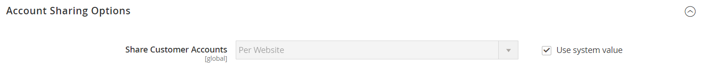

# [!UICONTROL Customers]  > [!UICONTROL Customer Configuration]

{{config}}

## [!UICONTROL Account Sharing Options]

<!-- zoom -->

<!-- [Account Sharing Options](https://docs.magento.com/user-guide/customers/account-scope.html) -->

| フィールド | [範囲](../../getting-started/websites-stores-views.md#scope-settings) | 説明 |
|--- |--- |--- |
| [!UICONTROL Share Customer Accounts] | グローバル | ストア階層の顧客アカウントの範囲を決定します。 オプション：  **`Global`**— 顧客アカウント情報は、すべての Web サイトと共有され、コマースインストールに保存されます。 **`Per Website`**  — 顧客アカウント情報は、アカウントが作成された Web サイトに限定されます。 |

{style="table-layout:auto"}

## [!UICONTROL Online Customers Options]

<!-- zoom -->

<!-- [Online Customers Options](https://docs.magento.com/user-guide/customers/now-online.html) -->

| フィールド | [範囲](../../getting-started/websites-stores-views.md#scope-settings) | 説明 |
|--- |--- |--- |
| [!UICONTROL Online Minutes Interval] | グローバル | 顧客のオンラインアクティビティが管理者からアクセス可能になる期間を決定します。 デフォルトの間隔を 15 分にする場合は空のままにします。 |
| [!UICONTROL Customer Data Lifetime] | グローバル | 顧客が入力した未保存のデータの有効期限が切れるまでの時間を分単位で指定します。 デフォルトでは、未保存のデータは 60 分後に期限切れになります。 |

{style="table-layout:auto"}

## [!UICONTROL Create New Account Options]

{{beta-updates}}

<!-- zoom -->

<!-- zoom -->

<!-- [Create New Account Options (VAT Fields)](https://docs.magento.com/user-guide/customers/customer-account-configuration.html) -->

| フィールド | [範囲](../../getting-started/websites-stores-views.md#scope-settings) | 説明 |
|--- |--- |--- |
| [!UICONTROL Enable Automatic Assignment to Customer Group] | ストア表示 | 顧客をデフォルトの顧客グループに自動的に割り当てるかどうかを指定します。 ストアに VAT 番号を表示するには、ストアフロントで「VAT 番号を表示」を設定し、 `Yes`. オプション：  **`Yes`**— システムは顧客 VAT ID を自動的に検証せず、顧客グループも変更しません。 **`No`**  — システムの動作は通常どおりで、デフォルトの顧客グループは「デフォルトグループ」フィールドで設定できます。 |
| [!UICONTROL Default Group] | ストア表示 | アカウントの作成時に割り当てられた最初の顧客グループを識別します。 |
| [!UICONTROL Default Value for Disable Automatic Group Changes Based on VAT ID] | グローバル | ( 現在の設定範囲が `Default Group`.) VAT ID に基づく顧客グループの自動変更をデフォルトで有効にするか無効にするかを選択します。 設定は、製品レベルで上書きできます。 この設定は、次の状況でのシステムの動作に影響します。    — 顧客のデフォルトの住所の VAT ID またはデフォルトの住所全体が変更されます。    — 以前に住所を保存していない登録済み顧客、またはチェックアウト時に登録した顧客のチェックアウト時に、顧客グループの変更がエミュレートされました。  グループの自動変更が有効な場合、最初の場合は顧客グループが自動的に変更され、2 番目の場合は一時的にエミュレートされた顧客グループが顧客に割り当てられます。 自動グループ変更が無効になっている場合、割り当てられた顧客グループは、管理者が手動で変更しない限り変更されません。 |
| [!UICONTROL Show VAT Number on Storefront] | Web サイト | 店舗の顧客に VAT 番号を表示するかどうかを指定します。 オプション： `Yes` / `No`   B2B 以外の通常の顧客アカウントにのみ影響します。 会社アカウントには、独自の「VAT 番号」フィールドがあります。 |
| [!UICONTROL Default Email Domain] | ストア表示 | ストアのデフォルトの E メールドメインを識別します。 例： `mystore.com` |
| [!UICONTROL Default Welcome Email] | ストア表示 | デフォルトで使用される電子メールテンプレートを識別します。 _ようこそ_ 電子メール。 |
| [!UICONTROL Default Welcome Email Without Password] | ストア表示 | パスワードが割り当てられていない管理者が作成した新しい顧客アカウントに使用する、お知らせメールの代替テンプレート。 |
| [!UICONTROL Email Sender] | ストア表示 | お知らせメールの送信者として表示されるストアの連絡先を識別します。 |
| [!UICONTROL Require Emails Confirmation] | Web サイト | アカウントを作成するリクエストが顧客からの確認を必要とするかどうかを決定します。 オプション： `Yes` / `No` |
| [!UICONTROL Confirmation Link Email] | ストア表示 | 確認 E メールに使用される E メールテンプレートを識別します。 デフォルトのテンプレート： `New account confirmation key` |
| [!UICONTROL Welcome Email] | ストア表示 | アカウントの確認後に送信されるお知らせメッセージに使用される電子メールテンプレートを識別します。 |
| [!UICONTROL Generate Human-Friendly Customer ID] | グローバル | VAT ID 番号の入力と保存に使用されるフィールドをストアフロントで表示するかどうかを指定します。 オプション： `Yes` / `No` |

{style="table-layout:auto"}

## [!UICONTROL Password Options]

<!-- zoom -->

<!-- [Password Options](https://docs.magento.com/user-guide/customers/password-options.html) -->

| フィールド | [範囲](../../getting-started/websites-stores-views.md#scope-settings) | 説明 |
|--- |--- |--- |
| [!UICONTROL Password Reset Protection Type] | ストア表示 | 顧客アカウントのパスワードをリセットする方法を決定します。 オプション：  **`By IP and Email`**— パスワードは、Admin アカウントに関連付けられた電子メールアドレスに送信されるリセット通知から応答を受け取った後、オンラインでリセットできます。 **`By IP`**  — パスワードはオンラインでリセットできます。  **`By Email`**— パスワードは、Admin アカウントに関連付けられた電子メールアドレスに送信される電子メール通知に応答することでリセットできます。 **`None`**  — パスワードはストア管理者のみがリセットできます。 |
| [!UICONTROL Max Number of Password Reset Requests] | ストア表示 | 1 時間あたりのパスワードリセット要求の数を制限します。 無制限のリクエストに対しては、0（ゼロ）を入力します。 |
| [!UICONTROL Min Time Between Password Reset Requests] | ストア表示 | パスワードのリセット要求間隔を分単位で指定します。 リクエスト間の遅延がない場合は、ゼロ (0) を入力します。 |
| [!UICONTROL Forgot Email Template] | ストア表示 | 顧客がパスワードを忘れた場合に使用する電子メールテンプレートを識別します。 デフォルトのテンプレート： `Forgot Password` |
| [!UICONTROL Remind Email Template] | ストア表示 | 顧客がパスワードリマインダーまたはヒントを受け取る際に使用する電子メールテンプレートを識別します。 デフォルトのテンプレート： `Remind Password` |
| [!UICONTROL Reset Password Template] | ストア表示 | 顧客がパスワードをリセットしたときに使用する電子メールテンプレートを決定します。 |
| [!UICONTROL Password Template Email Sender] | ストア表示 | パスワード関連の電子メールの送信者として表示されるストアの連絡先を決定します。 |
| [!UICONTROL Recovery Link Expiration Period (hours)] | グローバル | パスワード回復リンクが期限切れになるまでの時間数を指定します。 |
| [!UICONTROL Enable Autocomplete on login/forgot password forms] | Web サイト | ログイン/忘れたパスワードフォームでオートコンプリートが有効かどうかを指定します。 オプション： `Yes` / `No` |
| [!UICONTROL Number of Required Character Classes] | グローバル | パスワードに含める必要がある異なる文字クラス（小文字、大文字、数字、特殊文字）の数を決定します。 |
| [!UICONTROL Maximum Login Failures to Lockout Account] | グローバル | 顧客アカウントがロックされるまでのログイン失敗回数を決定します。 試行回数を制限しない場合は、ゼロ (`0`) をクリックします。 |
| [!UICONTROL Minimum Password Length] | グローバル | 1 つのパスワードで使用できる最小文字数を指定します。 0 より大きい数値 (`0`) をクリックします。 |
| [!UICONTROL Lockout Time (minutes)] | グローバル | ログインに失敗した回数が多すぎた後に、顧客アカウントがロックされる時間（分）を指定します。 |

{style="table-layout:auto"}

## [!UICONTROL Account Information Options]

<!-- zoom -->

| フィールド | [範囲](../../getting-started/websites-stores-views.md#scope-settings) | 説明 |
|--- |--- |--- |
| [!UICONTROL Change Email Template] | ストア表示 | 顧客が電子メールアドレスを変更する際に使用されるデフォルトの電子メールテンプレートを識別します。 |
| [!UICONTROL Change Email and Password Template] | ストア表示 | 顧客が電子メールアドレスとパスワードを変更する際に使用されるデフォルトの電子メールテンプレートを識別します。 |

{style="table-layout:auto"}

## [!UICONTROL Name and Address Options]

### Magento Open Sourceオプション

{{ce-feature}}

<!-- zoom -->

<!-- [Name and Address Options - Open Source](https://docs.magento.com/user-guide/customers/name-address-options.html) -->

| フィールド | [範囲](../../getting-started/websites-stores-views.md#scope-settings) | 説明 |
|--- |--- |--- |
| [!UICONTROL Number of Lines in a Street Address] | Web サイト | 住所の行数を決定します。 通りの住所は、次の場所から構成されます： `1` から `4` 行。 このフィールドが空白の場合、デフォルトの住所は 3(`3`) 行が使用されます。 |
| [!UICONTROL Show Prefix] | Web サイト | 顧客名の先頭にプレフィックスを含めるかどうかを指定します（Mr.や Ms. Options など）。 `No` / `Optional` / `Required` |
| [!UICONTROL Prefix Dropdown Options] | Web サイト | プレフィックスオプションのリストを定義します。 値はセミコロンで区切ります。 最初の値の前にセミコロンを配置して、リストの先頭に空の値を表示します。 |
| [!UICONTROL Show Middle Name (initial)] | Web サイト | 顧客名の一部に中間の初期値を含めるかどうかを指定します。 使用する場合、中間の初期文字はオプションのフィールドです。 オプション： `Yes` / `No` |
| [!UICONTROL Show Suffix] | Web サイト | 顧客名の末尾に Jr.、Sr.、III などのサフィックスが含まれているかどうかを指定します。 オプション： `No` / `Optional` / `Required` |
| [!UICONTROL Suffix Dropdown Options] | Web サイト | サフィックスオプションのリストを定義します。 値はセミコロンで区切ります。 最初の値の前にセミコロンを配置して、リストの先頭に空の値を表示します。 |
| [!UICONTROL Show Date of Birth] | Web サイト | お客様の生年月日を名前と住所のフォームに含めるかどうかを指定します。 オプション： `No` / `Optional` / `Required`    **_重要：_**現在のセキュリティおよびプライバシーのベストプラクティスに従って、顧客の生年月日（月、日、年）と他の個人識別子を含むストレージに関連する、法的リスクおよびセキュリティリスクの可能性を認識しておきます。 顧客の完全な生年月日の保存を制限し、顧客の生年月日を代替として使用することをお勧めします。 |
| [!UICONTROL Show Tax/VAT Number] | Web サイト | 税金か [VAT 番号](../../stores-purchase/vat.md) は、「名前と住所」フォームに含まれます。 オプション： `No` / `Optional` / `Required` |
| [!UICONTROL Show Gender] | Web サイト | 名前と住所のフォームに性別を含めるかどうかを指定します。 オプション： `No` / `Optional` / `Required` |
| [!UICONTROL Show Telephone] | Web サイト | お客様の電話番号を名前と住所のフォームに含めるかどうかを指定します。 オプション： `No` / `Optional` / `Required` |
| [!UICONTROL Show Company] | Web サイト | 顧客の会社を名前および住所フォームに含めるかどうかを指定します。 オプション： `No` / `Optional` / `Required` |
| [!UICONTROL Show Fax] | Web サイト | お客様の FAX 番号を名前と住所のフォームに含めるかどうかを指定します。 オプション： `No` / `Optional` / `Required` |

{style="table-layout:auto"}

### Adobe Commerce Options

{{ee-feature}}

<!-- zoom -->

<!-- [Name and Address Options - Commerce](https://docs.magento.com/user-guide/customers/name-address-options.html) -->

| フィールド | [範囲](../../getting-started/websites-stores-views.md#scope-settings) | 説明 |
|--- |--- |--- |
| [!UICONTROL Prefix Dropdown Options] | Web サイト | プレフィックスオプションのリストを定義します。 値はセミコロンで区切ります。 最初の値の前にセミコロンを配置して、リストの先頭に空の値を表示します。 |
| [!UICONTROL Suffix Dropdown Options] | Web サイト | サフィックスオプションのリストを定義します。 値はセミコロンで区切ります。 最初の値の前にセミコロンを配置して、リストの先頭に空の値を表示します。 |
| [!UICONTROL Show Telephone] | Web サイト | お客様の電話番号を名前と住所のフォームに含めるかどうかを指定します。 オプション： `No` / `Optional` / `Required` |
| [!UICONTROL Show Company] | Web サイト | 顧客の会社を名前および住所フォームに含めるかどうかを指定します。 オプション： `No` / `Optional` / `Required` |
| [!UICONTROL Show Fax] | Web サイト | お客様の FAX 番号を名前と住所のフォームに含めるかどうかを指定します。 オプション： `No` / `Optional` / `Required` |

{style="table-layout:auto"}

## [!UICONTROL Store Credit Options]

{{ee-feature}}

<!-- zoom -->

<!-- [Store Credit Options](https://docs.magento.com/user-guide/customers/credit-configure.html) -->

| フィールド | [範囲](../../getting-started/websites-stores-views.md#scope-settings) | 説明 |
|--- |--- |--- |
| [!UICONTROL Enable Store Credit Functionality] | グローバル | 店舗クレジットが有効かどうかを指定します。 これを無効にすると、顧客アカウントと、「管理者顧客の管理」ページから「クレジットを保存」が削除されます。 オプション： `Yes` / `No`. |
| [!UICONTROL Show Store Credit History to Customers] | Web サイト | 顧客アカウントに残高履歴を表示するかどうかを指定します。 オプション： `Yes` / `No`. |
| [!UICONTROL Refund Store Credit Automatically] | グローバル | 店舗の返金が自動的に発行されるかどうかを指定します。 オプション： `Yes` / `No` |
| [!UICONTROL Store Credit Update Email Sender] | ストア表示 | 顧客に送信されるクレジット更新通知の送信者として表示されるストア ID を決定します。 |
| [!UICONTROL Store Credit Update Email Template] | ストア表示 | クレジットの更新に使用する電子メールテンプレートを決定します。 |

{style="table-layout:auto"}

## [!UICONTROL Login Options]

<!-- zoom -->

<!-- [Login Options](https://docs.magento.com/user-guide/customers/login-landing-page.html) -->

| フィールド | [範囲](../../getting-started/websites-stores-views.md#scope-settings) | 説明 |
|--- |--- |--- |
| [!UICONTROL Redirect Customer to Account Dashboard after Logging in] | Web サイト | 顧客が自分のアカウントにログインした後の処理を決定します。 顧客をアカウントダッシュボードにリダイレクトするには、「 `Yes`. オプション：  **`Yes`**— 顧客がアカウントにログインすると、アカウントダッシュボードが表示されます。 **`No`** ：顧客は、アカウントにログインした後も買い物を続行できます。 |

{style="table-layout:auto"}

## [!UICONTROL Address Templates]

<!-- zoom -->

<!-- [Address Templates](https://docs.magento.com/user-guide/customers/address-templates.html) -->

| テンプレート | [範囲](../../getting-started/websites-stores-views.md#scope-settings) | 説明 |
|--- |--- |--- |
| [!UICONTROL Text] | ストア表示 | このテンプレートは、印刷されるすべてのアドレスに使用されます。 |
| [!UICONTROL Text One Line] | ストア表示 | このテンプレートは、顧客の買い物かごのアドレス帳リスト内の住所エンティティの順序を定義します。 チェックアウト中の進行状況。 |
| [!UICONTROL HTML] | ストア表示 | このテンプレートは、 _顧客アドレス_ 領域 ([!UICONTROL Customers] > [!UICONTROL Manage Customers]) をクリックします。 これは、 _新しいアドレスを追加_ ページに表示されます。 |
| [!UICONTROL PDF] | ストア表示 | テンプレートは、印刷された請求書、出荷およびクレジット・メモに含まれる請求先住所と出荷先住所の表示を定義します。 |

{style="table-layout:auto"}

## [!UICONTROL Customer Segments]

{{ee-feature}}

<!-- zoom -->

<!-- [Customer Segments](https://docs.magento.com/user-guide/marketing/customer-segments.html) -->

| テンプレート | [範囲](../../getting-started/websites-stores-views.md#scope-settings) | 説明 |
|--- |--- |--- |
| [!UICONTROL Enable Customer Segment Functionality] | グローバル | 顧客セグメントを使用してターゲットを絞ったプロモーションを作成できるかどうかを指定します。 オプション： `Yes` / `No` |
| [!UICONTROL Real-time Check if Customer is Matched by Segment] | グローバル | 顧客セグメントをリアルタイムで検証するかどうかを決定します。 オプション：  **[!UICONTROL Yes]**：顧客セグメントは、リアルタイムで検証されます（デフォルト値）。 **[!UICONTROL No]** ：顧客セグメントは、単一の結合条件 SQL クエリで検証されます。 これにより、システムに多数の顧客セグメントがある場合の、セグメント検証のパフォーマンスが向上します。 ただし、分割データベースの場合や、登録されている顧客がいない場合は、検証は機能しません。 |

{style="table-layout:auto"}

## [!UICONTROL CAPTCHA]

<!-- zoom -->

<!-- [CAPTCHA](https://docs.magento.com/user-guide/stores/security-captcha.html) -->

| フィールド | [範囲](../../getting-started/websites-stores-views.md#scope-settings) | 説明 |
|--- |--- |--- |
| [!UICONTROL Enable CAPTCHA on Storefront] | Web サイト | コマース Web サイトに関連付けられたストアで CAPTCHA を有効にします。 オプション： `Yes` / `No` |
| [!UICONTROL Font] | Web サイト | CAPTCHA の表示に使用するフォントを決定します。 独自のフォントを追加するには、Commerce インストールと同じディレクトリにフォントファイルを配置し、 `config.xml` ～にファイルを送る `app/code/Magento/Captcha/etc`. |
| [!UICONTROL Forms] | Web サイト | CAPTCHA が使用されるフォームを決定します。 オプション：  `Applying Coupon Code`  `Checkout/Placing Order` `Create user`  `Login`  `Forgot password`  `Contact Us`  `Change password`  `Share Wishlist Form`  `Send to Friend Form`  `Payflow Pro` ( [セキュリティパッチ](https://experienceleague.adobe.com/docs/commerce-knowledge-base/kb/troubleshooting/payments/paypal-payflow-pro-active-carding-activity.html))  `Add Gift Card Code`    `Create company`     _**注意：**_ 「ユーザーを作成」、「パスワードを忘れた場合」、「Payflow Pro」の各フォームは、選択すると常に有効になります。 |
| [!UICONTROL Displaying Mode] | Web サイト | CAPTCHA を表示するタイミングを決定します。 オプション：  **`Always`**— ログインするには、常に CAPTCHA が必要です。 **`After number of attempts to login`**  — このオプションは、管理者のログインフォームにのみ適用されます。 選択すると、 _[!UICONTROL Number of Unsuccessful Attempts to Login]_フィールドが表示されます。 許可するログイン試行回数を入力します。 値： `0` （ゼロ）は、 [!UICONTROL Displaying Mode] から `Always`. _**注意：**_ログインの失敗回数を追跡するには、1 つの E メールアドレスと 1 つの IP アドレスからログインを試みるたびに、その回数がカウントされます。 同じ IP アドレスから許可されるログイン試行の最大回数は 1,000 です。 この制限は、CAPTCHA が有効な場合にのみ適用されます。 |
| [!UICONTROL Number of Unsuccessful Attempts to Login] | Web サイト | アカウントがロックされる前に、顧客がログインを試みる回数を指定します。 |
| [!UICONTROL CAPTCHA Timeout (minutes)] | Web サイト | 現在の CAPTCHA の有効期間を決定します。 CAPTCHA の有効期限が切れたら、ユーザーはページを再読み込みする必要があります。 |
| [!UICONTROL Number of Symbols] | Web サイト | CAPTCHA に表示されるシンボルの数を決定します（最大 8）。 また、範囲（例：5-8）を指定することもできます。 |
| [!UICONTROL Symbols Used in CAPTCHA] | Web サイト | CAPTCHA に表示される文字（a ～ z および A ～ Z）と数字 (0 ～ 9) を決定します。 他のシンボルと区別しにくいシンボル（例： ） `i`, `l`または `1`のデフォルトの CAPTCHA 記号セットには含まれていません。 |
| [!UICONTROL Case Sensitive] | Web サイト | CAPTCHA 文字で大文字と小文字が区別されるかどうかを指定します。 オプション： `Yes` / `No` |

{style="table-layout:auto"}
