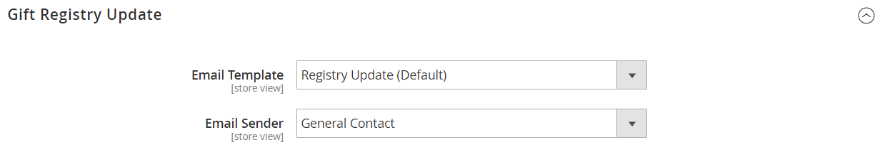

# [!UICONTROL Customers] > [!UICONTROL Gift Registry]

{{ee-feature}}

{{config}}

これらの設定を使用してストア顧客のギフトレジストリを有効にする方法については、[ ギフトレジストリの設定 ](../../merchandising-promotions/gift-registry-configure.md) を参照してください。 ストアフロントにギフトレジストリ検索を含める方法については、[ ギフトレジストリ検索の追加 ](../../merchandising-promotions/gift-registry-search.md) を参照してください。

## [!UICONTROL General Options]

<!-- zoom -->

<!-- [General Options](https://experienceleague.adobe.com/en/docs/commerce-admin/marketing/merchandising/gift-registry/gift-registry-configure) -->

| フィールド | [ 範囲 ](../../getting-started/websites-stores-views.md#scope-settings) | 説明 |
|--- |--- |--- |
| [!UICONTROL Enable Gift Registry] | ストア表示 | ギフト レジストリが使用可能かどうかを決定します。 オプション： **`Yes`**– 選択したストア表示のギフト レジストリを有効にします。 登録済み顧客のアカウントダッシュボードに、「ギフトレジストリ」タブが表示されます。 **`No`** - ギフトレジストリは、ストア表示では使用できません。 |
| [!UICONTROL Maximum Registrants] | ストア表示 | 顧客がギフト レジストリに追加できる人数を設定します。 顧客は、ギフト登録者ごとにギフト登録情報を共有します。 ストアフロントでは、最大数に達するまで「_登録者を追加_ ボタンを使用できます。 |

{style="table-layout:auto"}

## [!UICONTROL Owner Notification]

<!-- zoom -->

<!-- [Owner Notification](https://experienceleague.adobe.com/en/docs/commerce-admin/marketing/merchandising/gift-registry/gift-registry-configure) -->

| フィールド | [ 範囲 ](../../getting-started/websites-stores-views.md#scope-settings) | 説明 |
|--- |--- |--- |
| [!UICONTROL Email Template] | ストア表示 | ギフト レジストリの作成時に送信される所有者通知 E メールに使用するテンプレートを決定します。 既定のテンプレート：ギフト レジストリ所有者通知 |
| [!UICONTROL Email Sender] | ストア表示 | ギフト レジストリ所有者通知メールの送信者として表示される [ 店舗連絡先 ](../../getting-started/store-details.md#store-email-addresses) を識別します。 デフォルト値：`General Contact` |

{style="table-layout:auto"}

## ギフト レジストリの共有

<!-- zoom -->

<!-- Gift Registry Sharing](https://experienceleague.adobe.com/en/docs/commerce-admin/marketing/merchandising/gift-registry/gift-registry-configure) -->

| フィールド | [ 範囲 ](../../getting-started/websites-stores-views.md#scope-settings) | 説明 |
|--- |--- |--- |
| [!UICONTROL Email Template] | ストア表示 | ギフト レジストリの作成時に送信されるギフト レジストリ共有 E メールに使用するテンプレートを決定します。 所有者が _ギフト登録を共有_ をクリックすると、メールが各受信者に送信されます。 既定のテンプレート：`Gift Registry Sharing` |
| [!UICONTROL Email Sender] | ストア表示 | ギフト レジストリ共有メールの送信者として表示される [ 店舗連絡先 ](../../getting-started/store-details.md#store-email-addresses) を識別します。 デフォルト値：`General Contact` |
| [!UICONTROL Maximum Sent Emails Threshold] | ストア表示 | 一度に送信できるギフト レジストリ共有メール通知メッセージの最大数です。 |

{style="table-layout:auto"}

## [!UICONTROL Gift Registry Update]

<!-- zoom -->

<!-- [Gift Registry Update](https://experienceleague.adobe.com/en/docs/commerce-admin/marketing/merchandising/gift-registry/gift-registry-configure) -->

| フィールド | [ 範囲 ](../../getting-started/websites-stores-views.md#scope-settings) | 説明 |
|--- |--- |--- |
| [!UICONTROL Email Template] | ストア表示 | ギフト レジストリから購入されたときにギフト レジストリ所有者に送信されるギフト レジストリ更新メールに使用するテンプレートを決定します。 更新には、品目と購入数量に関する情報が含まれますが、注文した人物の名前は含まれません。 既定のテンプレート：`Gift Registry Update` |
| [!UICONTROL Email Sender] | ストア表示 | ギフト レジストリ更新メールの送信者として表示される [ 店舗連絡先 ](../../getting-started/store-details.md#store-email-addresses) を識別します。 デフォルト値：`General Contact` |

{style="table-layout:auto"}
