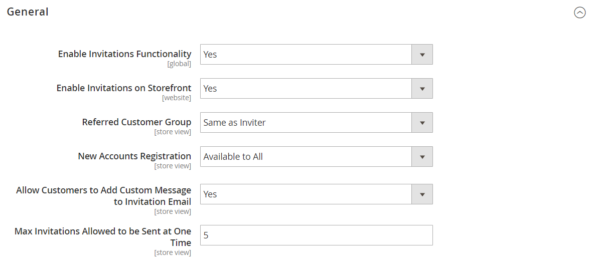

# [!UICONTROL Customers] > [!UICONTROL Invitations]

{{ee-feature}}

{{config}}

## [!UICONTROL General]

<!-- zoom -->

<!-- [General](https://experienceleague.adobe.com/ja/docs/commerce-admin/marketing/promotions/events/invitations#enable-invitations-for-your-store) -->

| フィールド | [&#x200B; 範囲 &#x200B;](../../getting-started/websites-stores-views.md#scope-settings) | 説明 |
|--- |--- |--- |
| [!UICONTROL Enable Invitations Functionality] | グローバル | 招待モジュールが有効かどうかを判断します。 オプション：`Yes` / `No` |
| [!UICONTROL Enable Invitations on Frontend] | Web サイト | ストアフロントから招待状を管理できるかどうかを決定します。 オプション：`Yes` / `No` |
| [!UICONTROL Referred Customer Group] | ストア表示 | 招待者の顧客グループを決定します。 オプション： **`Same as Inviter`**– 招待者は、招待した顧客と同じ顧客グループに自動的に割り当てられます。 **`Default Customer Group from Configuration`** – 招待者には自動的にデフォルトの [&#x200B; 顧客グループ &#x200B;](../../customers/customer-groups.md) が設定されます。 |
| [!UICONTROL New Accounts Registration] | ストア表示 | 招待者がアカウントを作成する方法を決定します。 オプション： **`By Invitation Only`**– 招待メールのリンクをたどって、アカウントを作成する必要があります。 **`Available to All`** – 招待者は、ストアで利用可能なアカウント登録フォームを使用できます。 |
| [!UICONTROL Allow Customers to Add Custom Message to Invitation Email] | ストア表示 | 招待者が電子メールで招待者に送信されるカスタムメッセージを追加できるフィールドが招待フォームにあるかどうかを決定します。 これは、管理者が招待状にメッセージを追加する機能には影響しません。 オプション：`Yes`/`No`。 |
| [!UICONTROL Max Invitations Allowed to be Sent at One Time] | ストア表示 | 招待者が一度に送信できる招待の最大数を決定します。 招待者がフォームに含むメールアドレスごとに異なる招待状が送信されます。 これにより、大量の招待状が一度に送信されるのを防ぐことでサーバーリソースが保護され、招待状がスパムとして送信される可能性が低くなります。 |

{style="table-layout:auto"}

## [!UICONTROL Email]

<!-- zoom -->

<!-- [Email](https://experienceleague.adobe.com/ja/docs/commerce-admin/marketing/promotions/events/invitations#enable-invitations-for-your-store) -->

| フィールド | [&#x200B; 範囲 &#x200B;](../../getting-started/websites-stores-views.md#scope-settings) | 説明 |
|--- |--- |--- |
| [!UICONTROL Customer Invitation Email Sender] | ストア表示 | 招待メールが送信されたときに招待メールが受信される送信者を決定します。 デフォルト値：`General Contact` |
| [!UICONTROL Customer Invitation Email Template] | ストア表示 | 招待メールが送信されたときに招待メールが受信されるテンプレートを決定します。 既定のテンプレート：`Customer Invitation` |

{style="table-layout:auto"}
